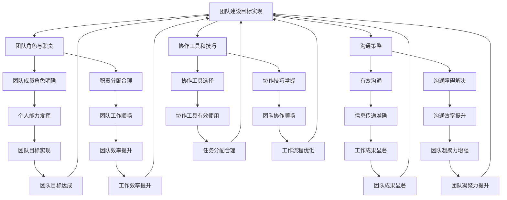

                 


### 文章标题：团队建设：打造高效协作的团队

**关键词：团队建设，高效协作，沟通策略，团队角色，领导力**

**摘要：本文将深入探讨团队建设的关键要素，包括核心概念、团队角色与职责、沟通策略、协作工具和技巧、激励与领导力，并通过实际案例展示团队建设的实践与应用。**

### 引言

在当今快速发展的信息技术时代，团队协作已成为企业成功的关键因素。一个高效的团队不仅能够提高工作效率，还能促进创新和持续发展。本文旨在通过逻辑清晰的分析和实例讲解，帮助读者了解团队建设的重要性，掌握团队协作的技巧，并打造出高效协作的团队。

### 核心概念与联系

在团队建设过程中，有几个核心概念是必须了解和把握的。首先，团队建设的目标是创建一个协同工作的环境，使团队成员能够充分发挥各自的优势，共同实现目标。团队角色与职责的明确分配是团队建设的基石，每个成员都应该清楚自己的职责和角色。此外，有效的沟通策略和协作工具也是团队成功的关键。

为了更好地理解这些核心概念之间的关系，我们可以使用Mermaid流程图来展示它们之间的联系。



通过这张图，我们可以清晰地看到各个核心概念之间的相互影响和依赖关系。团队建设的目标是最终实现团队的高效协作和共同进步，而每个核心概念的实现都对团队目标的达成起到关键作用。

### 核心算法原理讲解

在团队建设过程中，有一些核心算法原理和数学模型可以帮助我们更好地理解和应用团队协作技巧。以下是一个简要的讲解：

#### 沟通障碍解决算法

沟通障碍是团队协作中的常见问题。为了解决这些问题，我们可以采用以下算法：

```pseudo
Function SolveCommunicationBarriers(communication_issues):
    For each issue in communication_issues:
        If issue is related to information gap:
            Use clear and concise communication techniques to bridge the gap.
        If issue is related to misunderstanding:
            Schedule a meeting to discuss and clarify misunderstandings.
        If issue is related to lack of feedback:
            Implement a feedback loop to encourage regular communication and feedback.
    End Function
```

#### 激励函数模型

激励是团队建设中非常重要的一环。一个合理的激励函数模型可以帮助我们更好地激发团队成员的积极性。以下是一个简单的激励函数模型：

$$
f(\text{performance}, \text{contribution}, \text{motivation}) = \alpha \cdot \text{performance} + \beta \cdot \text{contribution} + \gamma \cdot \text{motivation}
$$

其中，$\alpha$、$\beta$ 和 $\gamma$ 是权重系数，可以根据团队的具体情况调整。这个模型表明，团队成员的绩效、贡献和动机是影响激励水平的关键因素。

### 数学公式与举例说明

为了更好地理解上述算法原理，我们可以通过具体的例子来说明。

#### 沟通障碍解决算法实例

假设一个团队在项目中遇到了以下三个沟通障碍：

1. 信息不畅通
2. 理解偏差
3. 缺乏反馈

我们可以按照以下步骤解决这些问题：

```pseudo
SolveCommunicationBarriers([
    "Information gap",
    "Misunderstanding",
    "Lack of feedback"
])
```

#### 激励函数模型实例

假设一个团队成员的绩效得分为90分，贡献得分为80分，动机得分为75分。根据激励函数模型，我们可以计算出该成员的激励水平：

$$
f(90, 80, 75) = \alpha \cdot 90 + \beta \cdot 80 + \gamma \cdot 75
$$

如果假设 $\alpha = 0.5$，$\beta = 0.3$，$\gamma = 0.2$，则该成员的激励水平为：

$$
f(90, 80, 75) = 0.5 \cdot 90 + 0.3 \cdot 80 + 0.2 \cdot 75 = 45 + 24 + 15 = 84
$$

这意味着该成员的激励水平为84分，这个分数可以用来评估该成员的积极性。

### 项目实战

为了更好地展示团队建设的实际应用，我们来看一个具体的团队协作项目。

#### 项目背景

某科技公司需要开发一个大型软件项目，项目周期为6个月，涉及多个技术模块，团队成员包括开发人员、测试人员、项目经理和产品经理。

#### 开发环境搭建

为了确保项目顺利进行，团队首先搭建了以下开发环境：

- 持续集成（CI）工具：Jenkins
- 版本控制：Git
- 代码质量管理：SonarQube
- 项目管理工具：Jira

#### 源代码详细实现和代码解读

在项目开发过程中，团队遵循以下原则：

- 编码规范：团队成员必须遵循统一的编码规范，确保代码的可读性和可维护性。
- 分工合作：根据团队成员的技能和兴趣，将项目分为多个模块，每个模块由特定的团队成员负责开发。
- 持续集成：每次提交代码都会通过CI工具自动构建和测试，确保代码的质量。

以下是一个模块的伪代码示例：

```pseudo
Function ModuleA():
    // 模块A的功能实现
    // ...

Function ModuleB():
    // 模块B的功能实现
    // ...

Function Main():
    // 主程序
    ModuleA()
    ModuleB()
    // ...
End Function
```

#### 代码应用解读与分析

在这个项目中，每个模块都有明确的职责，模块A负责处理数据输入，模块B负责数据输出。主程序通过调用这两个模块实现整体功能。

为了确保代码质量，团队采用了以下分析方法：

- 单元测试：每个模块都编写了详细的单元测试，确保模块的功能正确。
- 集成测试：将所有模块集成在一起进行测试，确保整体功能正确。
- 性能测试：对系统进行性能测试，确保系统在高并发情况下仍然稳定运行。

#### 实际案例分析和详细讲解剖析

在一个实际项目中，团队遇到了以下问题：

1. 某个模块的性能不佳，导致整个系统响应时间变长。
2. 某个模块的代码质量不高，存在大量bug。

针对这些问题，团队采取了以下措施：

1. 性能优化：对性能不佳的模块进行性能分析，找出瓶颈并进行优化。
2. 代码重构：对代码质量不高的模块进行重构，提高代码的可读性和可维护性。

通过这些措施，团队成功地解决了问题，并确保了项目的顺利进行。

#### 项目小结

通过这个项目，团队深刻认识到团队建设的重要性。团队成员之间的高效协作和良好的沟通是项目成功的关键。在未来的工作中，团队将继续加强团队建设，提高协作效率，为企业的发展贡献力量。

### 最佳实践 tips、小结、注意事项、拓展阅读等内容

**最佳实践 tips：**

- 定期组织团队建设活动，增强团队成员之间的凝聚力。
- 建立良好的沟通机制，确保信息传递的准确性和及时性。
- 提供合理的激励措施，激发团队成员的积极性。
- 鼓励团队成员参与决策，提高团队的自主性和创新性。

**小结：**

本文从核心概念、团队角色、沟通策略、协作工具和技巧、激励与领导力等多个角度深入探讨了团队建设的重要性。通过实际案例的应用，展示了团队建设在实际项目中的实践与应用。

**注意事项：**

- 团队建设是一个长期过程，需要持续投入时间和精力。
- 团队建设要结合具体项目的特点和需求，灵活调整策略。
- 团队建设要注重团队成员的参与和反馈，确保团队的目标一致。

**拓展阅读：**

- 《精益创业》作者Eric Ries的《Team Topologies》一书，详细介绍了团队架构的构建和优化。
- 《敏捷开发实践指南》作者Craig Larman和Bas Vodde的《Scaling Lean & Agile Development》一书，提供了敏捷开发在大型团队中的应用策略。
- 《激发创造力：团队创新实战指南》作者Todd Kelsey的书籍，探讨了如何激发团队的创新能力和创造力。

### 作者信息

作者：AI天才研究院/AI Genius Institute & 禅与计算机程序设计艺术 /Zen And The Art of Computer Programming

通过这篇文章，我们希望读者能够对团队建设有更深入的理解，掌握打造高效协作团队的方法和技巧，为企业的成功贡献力量。让我们一起努力，构建更加高效、协作的团队！

