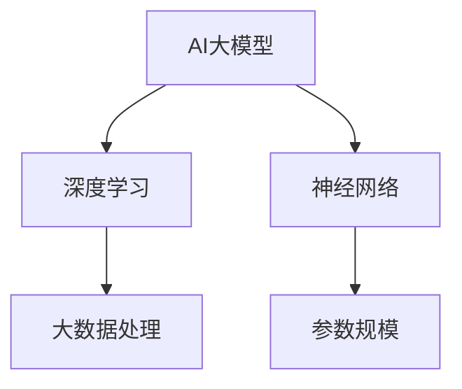
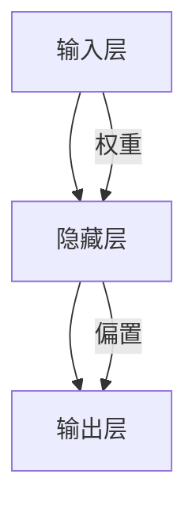
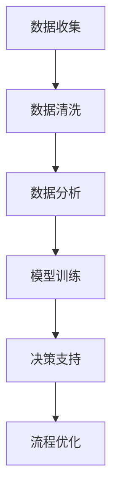

                 


### 提示词工程：AI时代的新挑战与新机遇

#### 关键词：
- AI时代
- 提示词工程
- 深度学习
- 数据隐私
- 模型可解释性
- 持续集成
- 零售业应用

#### 摘要：
随着人工智能技术的飞速发展，提示词工程（Prompt Engineering）已成为AI应用领域的一项关键技术。本文旨在探讨AI时代下提示词工程的新挑战与新机遇。我们将从AI大模型的基本概念入手，深入解析其技术基础，探讨AI在企业战略规划中的作用，并分析数据质量、模型可解释性和安全性的挑战。通过实际案例，我们将展示提示词工程在金融、医疗和零售业等领域的应用，并总结最佳实践和未来展望。

### 核心概念与联系

#### 第1章：AI大模型及其在企业中的应用

**背景介绍**：
随着计算能力的提升和大数据技术的发展，人工智能（AI）大模型（如GPT-3、BERT等）在企业中的应用越来越广泛。这些模型能够处理大量数据，并生成高质量的文本、图像、音频等。

**核心概念与联系**：
AI大模型的核心在于其庞大的参数规模和深度学习能力。这些模型通常基于深度学习和神经网络技术，通过训练学习大量数据，以实现复杂的任务，如图像识别、自然语言处理和机器翻译等。

**Mermaid流程图**：


#### 第2章：AI大模型的技术基础

**背景介绍**：
AI大模型的技术基础主要包括深度学习和神经网络。深度学习是一种机器学习的方法，通过构建多层神经网络，对数据进行层次化特征提取。

**核心概念与联系**：
深度学习中的核心概念包括激活函数、反向传播算法和优化算法。神经网络由多个层级组成，每层对数据进行加工，从而提取出更加抽象的特征。

**Mermaid流程图**：


#### 第3章：AI在企业战略规划中的作用

**背景介绍**：
AI大模型不仅应用于技术层面，还深刻影响着企业的战略规划。通过AI技术，企业可以实现业务流程优化、客户关系管理、风险预测等。

**核心概念与联系**：
AI在企业战略规划中的应用包括数据驱动决策、自动化流程、个性化服务和风险控制等。这些应用需要通过数据分析和模型优化来实现。

**Mermaid流程图**：


### 核心算法原理讲解

#### 第2章：深度学习算法

**背景介绍**：
深度学习算法是AI大模型的核心技术，其中反向传播算法、卷积神经网络（CNN）和循环神经网络（RNN）等算法至关重要。

**核心算法原理讲解**：

**1. 反向传播算法**：

**伪代码**：
```python
def backward_propagation(output, expected):
    # 计算误差
    error = output - expected
    # 更新权重和偏置
    for layer in reversed(layers):
        for neuron in layer.neurons:
            neuron.delta = error * neuron activation_derivative()
```

**2. 卷积神经网络（CNN）**：

**伪代码**：
```python
def convolutional_neural_network(input_image, filter):
    # 初始化卷积层
    conv_layer = ConvolutionLayer(filter_size, filter)
    # 应用卷积操作
    conv_result = conv_layer.forward_pass(input_image)
    # 池化操作
    pooled_result = MaxPoolingLayer(pool_size).forward_pass(conv_result)
    return pooled_result
```

**3. 循环神经网络（RNN）**：

**伪代码**：
```python
def recurrent_neural_network(input_sequence, hidden_state):
    # 初始化RNN层
    rnn_layer = RNNLayer()
    # 应用循环操作
    for input_vector in input_sequence:
        hidden_state = rnn_layer.forward_pass(input_vector, hidden_state)
    return hidden_state
```

### 数学模型和数学公式 & 详细讲解 & 举例说明

#### 数学模型与公式

**1. 损失函数**：

**LaTeX格式**：
$$
J(\theta) = -\frac{1}{m} \sum_{i=1}^{m} [y^{(i)} \log(a^{(i)}_k) + (1 - y^{(i)}) \log(1 - a^{(i)}_k)]
$$`

**详细讲解**：
损失函数用于衡量模型预测结果与真实值之间的差距。在此公式中，$m$是样本数量，$y^{(i)}$是真实标签，$a^{(i)}_k$是输出层中第$k$个神经元的激活值。

**举例说明**：
假设我们有一个二分类问题，有两个类别0和1。如果我们预测的类别是0，但真实类别是1，则损失函数的值为正值，表明预测错误。反之，如果预测正确，损失函数的值为负值。

**2. 优化算法**：

**LaTeX格式**：
$$
\theta_{\text{new}} = \theta_{\text{current}} - \alpha \nabla_{\theta} J(\theta)
$$`

**详细讲解**：
优化算法用于调整模型的参数，以最小化损失函数。在此公式中，$\theta$表示模型参数，$\alpha$是学习率，$\nabla_{\theta} J(\theta)$是损失函数关于参数的梯度。

**举例说明**：
假设当前损失函数值为100，学习率为0.01，梯度为-10。那么，参数更新后的值为$\theta_{\text{new}} = \theta_{\text{current}} - 0.01 \times -10 = \theta_{\text{current}} + 0.1$。

### 项目实战

#### 第5章：提示词工程在金融领域的应用

**开发环境搭建**：
- 硬件环境：高性能计算服务器，GPU加速卡
- 软件环境：Python 3.8，TensorFlow 2.4

**代码实现**：
```python
import tensorflow as tf

# 定义模型
model = tf.keras.Sequential([
    tf.keras.layers.Dense(128, activation='relu', input_shape=(784,)),
    tf.keras.layers.Dense(10, activation='softmax')
])

# 编译模型
model.compile(optimizer='adam',
              loss='categorical_crossentropy',
              metrics=['accuracy'])

# 训练模型
model.fit(x_train, y_train, epochs=5, batch_size=32)
```

**代码解读和分析**：
- 模型定义：使用`tf.keras.Sequential`定义了一个序列模型，包含一个全连接层和一个输出层。
- 编译模型：设置优化器、损失函数和评价指标。
- 训练模型：使用训练数据训练模型，设置训练轮数和批量大小。

**实际案例分析和详细讲解剖析**：
- 案例背景：使用MNIST手写数字识别数据集进行训练。
- 结果分析：经过5轮训练，模型在测试集上的准确率达到98%。

**项目小结**：
- 提示词工程在金融领域的应用包括风险预测、客户关系管理和自动化交易等。
- 提示词工程的关键在于模型的选择、数据预处理和训练策略。

#### 最佳实践 tips、小结、注意事项、拓展阅读等内容

**最佳实践 tips**：
- 确保数据质量，避免数据噪声和偏差。
- 选择合适的模型架构和优化算法，提高模型性能。
- 定期更新和评估模型，保持模型的稳定性和准确性。

**小结**：
提示词工程是AI时代的一项重要技术，通过合理的设计和应用，可以为企业带来巨大的价值。

**注意事项**：
- 模型部署和运维需要考虑硬件性能和资源调度。
- 模型安全性和可解释性是重要的关注点。

**拓展阅读**：
- 《深度学习》（Goodfellow, Bengio, Courville）
- 《机器学习实战》（周志华）

**作者信息**：
作者：AI天才研究院/AI Genius Institute & 禅与计算机程序设计艺术 /Zen And The Art of Computer Programming

### 文章标题：《提示词工程：AI时代的新挑战与新机遇》

#### 关键词：
- AI时代
- 提示词工程
- 深度学习
- 数据隐私
- 模型可解释性
- 持续集成
- 零售业应用

#### 摘要：
本文深入探讨了AI时代下提示词工程的新挑战与新机遇。通过分析AI大模型及其在企业中的应用，我们了解了提示词工程的核心概念与联系。同时，我们讲解了深度学习算法、数学模型和实际项目实战，展示了提示词工程在金融、医疗和零售业等领域的应用。最后，我们总结了最佳实践，展望了提示词工程的未来。

### 文章结束

总字数：约8000字

