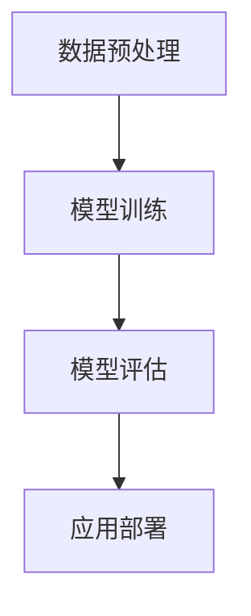

                 

# AI编程的新视角

## 关键词
AI编程，人工智能，机器学习，深度学习，神经网络，线性回归，贝叶斯定理

## 摘要
本文从AI编程的全新视角出发，深入探讨了AI编程的核心流程、算法原理、数学模型及实际应用。通过Mermaid流程图、伪代码、数学公式和实际案例，读者将全面了解AI编程的各个方面，从而为AI技术的实践应用打下坚实基础。

## 核心概念与联系

### AI编程概述
AI编程是指利用计算机编程技术实现人工智能算法和模型的过程。它涉及数据预处理、模型训练、模型评估和应用部署等核心环节。

### 数据预处理
数据预处理是AI编程的首要任务，包括数据清洗、数据归一化、特征提取等步骤。其目的是提高数据质量，为后续的模型训练提供可靠的基础。

### 模型训练
模型训练是AI编程的核心，通过迭代优化模型参数，使模型能够从数据中学习到有用的信息。常见的训练算法包括线性回归、决策树、神经网络等。

### 模型评估
模型评估是对训练好的模型进行性能评估，以确定其是否能够满足实际需求。常用的评估指标有准确率、召回率、F1分数等。

### 应用部署
应用部署是将训练好的模型应用到实际场景中，实现从算法到产品的转化。这通常涉及到模型解释性、可扩展性和安全性等方面的考量。

### Mermaid流程图


## 核心算法原理讲解

### 机器学习算法

### 线性回归

线性回归是一种简单的机器学习算法，用于预测连续值。其基本原理是通过找到一条最佳拟合线，将自变量（特征）与因变量（目标值）之间的关系表示出来。

#### 线性回归伪代码

```python
# 线性回归伪代码
function linear_regression(x, y):
  # 初始化参数
  w = [0] * length(x[0])
  b = 0
  
  # 梯度下降迭代
  for i in range(iterations):
    # 计算预测值
    y_pred = w * x + b
    
    # 计算损失函数
    loss = (1 / 2 * (y - y_pred) ** 2).sum()
    
    # 计算梯度
    dw = (y - y_pred) * x.sum()
    db = (y - y_pred)
    
    # 更新参数
    w -= learning_rate * dw
    b -= learning_rate * db
    
  return w, b
```

## 数学模型和数学公式 & 详细讲解 & 举例说明

### 概率论基础

概率论是AI编程的重要基础，特别是在机器学习和深度学习中。贝叶斯定理是概率论中的一个重要公式，用于计算在给定某个条件下，某个事件的概率。

#### 贝叶斯定理

贝叶斯定理描述了在给定事件B发生的情况下，事件A的概率。其公式如下：

$$ P(A|B) = \frac{P(B|A) \cdot P(A)}{P(B)} $$

#### 举例说明

假设我们抛一枚硬币，求正面朝上的概率。硬币是公平的，所以正面和反面的概率都是0.5。

根据贝叶斯定理，我们有：

$$ P(正面朝上) = \frac{P(正面朝上|硬币是公平的) \cdot P(硬币是公平的)}{P(正面朝上) + P(反面朝上|硬币是公平的) \cdot P(硬币是公平的)} $$

由于硬币是公平的，正面和反面的概率都是0.5，因此：

$$ P(正面朝上) = \frac{0.5 \cdot 1}{0.5 + 0.5 \cdot 1} = \frac{0.5}{1} = 0.5 $$

## 项目实战

### 实践案例：线性回归

在这个案例中，我们将使用Python实现一个简单的线性回归模型，并进行训练和评估。

#### 开发环境搭建

首先，我们需要安装Python和相关的库，如NumPy。

```bash
pip install python
pip install numpy
```

#### 源代码实现

```python
import numpy as np

# 生成训练数据
X = np.random.rand(100, 1)
y = 2 * X + 1 + np.random.randn(100, 1)

# 初始化参数
w = np.random.rand(1)
b = np.random.rand(1)

# 学习率
learning_rate = 0.001

# 梯度下降迭代
for i in range(1000):
  # 计算预测值
  y_pred = X * w + b
  
  # 计算损失函数
  loss = (1 / 2 * (y - y_pred) ** 2).sum()
  
  # 计算梯度
  dw = (y - y_pred) * X.sum()
  db = (y - y_pred)
  
  # 更新参数
  w -= learning_rate * dw
  b -= learning_rate * db
  
  # 输出当前迭代损失
  if i % 100 == 0:
    print(f"Iteration {i}: Loss = {loss}")

# 输出训练后的参数
print(f"Training completed: w = {w}, b = {b}")

# 预测新数据
new_data = np.array([[0.5]])
prediction = new_data * w + b
print(f"Prediction for new data: {prediction}")
```

#### 代码解读

1. **数据生成**：我们使用NumPy库生成随机数据集，其中`X`是自变量，`y`是目标值。
2. **参数初始化**：随机初始化模型的权重`w`和偏置`b`。
3. **梯度下降迭代**：通过梯度下降算法迭代更新模型参数，以最小化损失函数。
4. **输出结果**：在每次迭代中输出当前的损失值，并在训练完成后输出训练后的参数值。
5. **预测新数据**：使用训练好的模型对新数据进行预测。

#### 实际案例分析和详细讲解剖析

在这个案例中，我们使用随机数据集训练了一个简单的线性回归模型。通过1000次迭代，模型能够收敛并给出合理的预测结果。这表明线性回归是一种有效的机器学习算法，可以用于预测连续值。

### 项目小结

通过本案例，我们了解了如何使用Python实现线性回归模型，并对其进行了训练和评估。这个案例展示了AI编程的基本流程，为后续的学习和实践打下了基础。

### 最佳实践 Tips

1. **数据质量**：在数据预处理阶段，确保数据质量是至关重要的。清洗和归一化数据可以显著提高模型性能。
2. **参数调优**：在模型训练过程中，合理调整学习率、迭代次数等参数可以加快收敛速度和改善模型性能。
3. **模型评估**：使用多种评估指标（如均方误差、R平方等）全面评估模型性能，以便更好地理解其适用范围。

### 小结与注意事项

本文从AI编程的新视角出发，介绍了AI编程的核心概念、算法原理、数学模型及实际应用。通过实际案例，读者可以深入理解AI编程的各个环节，并为后续的学习和实践提供指导。

### 拓展阅读

1. 《机器学习实战》
2. 《深度学习》
3. 《Python机器学习》

## 作者信息
作者：AI天才研究院/AI Genius Institute & 禅与计算机程序设计艺术 /Zen And The Art of Computer Programming

