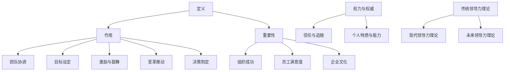

                 


### 第1章 领导力：定义与基础

#### 1.1 领导力的定义

领导力是一个复杂而多层次的概念，通常指的是一个人影响和激励他人，共同实现目标的能力。领导力不仅仅涉及权力和权威，更是一种关于如何引导和推动团队前进的艺术。哈佛商学院教授约翰·科特（John Kotter）将领导力定义为“调动人们向着共同的目标迈进的能力”，强调领导力是一种动态的过程，涉及愿景的建立、团队的构建、变化的推动等方面。

在组织管理中，领导力的重要性不言而喻。有效的领导力能够激发员工的潜能，提高团队的整体效率，促进创新和变革。领导力不仅仅存在于高层管理者，每个层次的员工都可以通过提升自己的领导力来对组织产生积极影响。

#### 1.2 领导力的作用

领导力的作用可以从多个维度进行理解：

1. **团队协调与沟通**：领导者需要确保团队成员之间的沟通畅通，协调各方利益，达成共识。
2. **目标设定与实现**：领导者负责设定明确的目标，并推动团队朝这些目标努力。
3. **激励与鼓舞**：领导者通过激励和鼓舞，提升团队成员的积极性和工作动力。
4. **变革推动**：领导者需要具备推动组织变革的能力，使组织能够适应外部环境的变化。
5. **决策制定**：领导力在决策过程中起到关键作用，优秀的领导者能够做出明智的决策，引领组织走向成功。

#### 1.3 领导力的重要性

领导力的重要性体现在多个方面：

1. **组织成功**：有效的领导力是组织成功的关键因素。领导者能够带领团队实现目标，推动组织的成长和发展。
2. **员工满意度**：领导力直接影响员工的满意度。优秀的领导者能够为员工提供明确的指导和支持，提高员工的工作满意度和忠诚度。
3. **企业文化**：领导力塑造企业文化。领导者的行为和价值观会渗透到组织的方方面面，影响整个组织的文化氛围。
4. **创新与变革**：在快速变化的市场环境中，领导力对于创新和变革至关重要。领导者需要具备前瞻性和创新思维，引领组织不断进步。

#### 1.4 领导力的来源与演变

领导力的来源可以归纳为以下几个主要方面：

1. **权力与权威**：领导者通过职位赋予的权力和权威来影响他人。
2. **信任与追随**：领导者通过与团队成员建立信任关系，获得他们的追随和认同。
3. **个人特质与能力**：领导者的个人特质和能力，如沟通能力、决策能力、影响力等，也是领导力的重要来源。

领导力的演变是一个不断发展的过程。随着时代的变化和社会环境的变化，领导力理论也在不断演进：

1. **传统领导力理论**：如职位权威理论、交易型领导力等，强调领导者的权力和权威。
2. **现代领导力理论**：如变革型领导力、服务型领导力等，强调领导者的激励、影响和引领能力。
3. **未来领导力理论**：如网络领导力、创新领导力等，强调领导者需要具备适应性和创新精神。

### 总结

在本章节中，我们探讨了领导力的定义、作用、重要性以及领导力的来源和演变。领导力不仅仅是权力和权威的体现，更是一种关于如何引导和推动团队前进的艺术。理解领导力的基本概念和作用，对于提升个人的领导力，以及推动组织的发展具有重要意义。

### Mermaid 流程图

以下是一个简单的Mermaid流程图，展示了领导力的核心概念及其相互关系：



### 伪代码

以下是一个简化的伪代码，用于描述领导力的核心概念之间的关系：

```python
# 领导力核心概念类
class LeadershipConcepts:
    def __init__(self):
        self.definition = "影响和激励他人，共同实现目标的能力"
        self.sources = ["权力与权威", "信任与追随", "个人特质与能力"]
        self.evolution = ["传统领导力理论", "现代领导力理论", "未来领导力理论"]
    
    def print_sources(self):
        for source in self.sources:
            print(source)
    
    def print_evolution(self):
        for theory in self.evolution:
            print(theory)

# 实例化领导力概念对象
leadership = LeadershipConcepts()

# 打印领导力的来源
leadership.print_sources()

# 打印领导力的演变
leadership.print_evolution()
```

### 数学模型和公式

在本章节中，我们可以使用以下数学公式来描述领导力的核心概念之间的关系：

$$
L = P + T + C
$$

其中：
- \( L \) 表示领导力
- \( P \) 表示权力与权威
- \( T \) 表示信任与追随
- \( C \) 表示个人特质与能力

此外，我们还可以使用以下公式来描述领导力的演变：

$$
\text{Leadership Evolution} = \text{Traditional Theory} \rightarrow \text{Modern Theory} \rightarrow \text{Future Theory}
$$`

### 举例说明

为了更好地理解领导力的概念，我们可以通过以下案例进行说明：

**案例：某企业的领导力提升**

假设某企业想要提升领导力，以下是一系列的步骤和措施：

1. **定义领导力**：企业高层管理者首先明确了领导力的定义，即影响和激励员工，共同实现企业目标的能力。
2. **领导力培训**：企业为中层管理者提供领导力培训，帮助他们理解不同的领导力理论，并掌握有效的领导技能。
3. **团队建设**：通过团队建设活动，增强团队成员之间的信任和沟通，提高团队的协作效率。
4. **目标设定**：企业领导层设定了明确的目标，并制定详细的实施计划，确保团队成员朝着共同的目标努力。
5. **激励与鼓舞**：企业通过设定激励机制，如奖金、晋升等，激励员工的工作积极性，并定期举行表彰活动，鼓舞员工的士气。
6. **变革推动**：企业在面对市场变化时，通过领导层的积极推动，引导员工接受变革，并确保变革的顺利实施。
7. **决策制定**：企业领导层在决策过程中，充分考虑各方意见，做出明智的决策，确保企业的发展方向正确。

通过以上措施，企业成功提升了领导力，员工的工作积极性也得到了显著提高，为企业的发展奠定了坚实基础。

### 小结

在本章节中，我们详细介绍了领导力的定义、作用、重要性以及领导力的来源和演变。通过理解这些核心概念，我们可以更好地提升个人的领导力，并在组织中发挥积极作用。在下一章节中，我们将深入探讨各种领导力模型，进一步理解领导力在不同情境中的应用。

### 注意事项

在提升领导力的过程中，需要注意以下几点：

1. **理解团队成员的需求**：领导者需要了解团队成员的需求和期望，从而更好地激励他们。
2. **持续学习和成长**：领导力不是一成不变的，领导者需要持续学习和成长，以适应不断变化的环境。
3. **有效沟通**：领导者需要具备良好的沟通能力，确保团队内部的沟通畅通，避免误解和冲突。
4. **公平与透明**：领导者需要确保决策过程的公平和透明，以增强团队成员的信任感。

### 拓展阅读

对于对领导力感兴趣的读者，以下是一些推荐的拓展阅读：

1. 《领导力的五项修炼》 - 史蒂芬·柯维
2. 《变革型领导力》 - 詹姆斯·麦格雷戈·伯恩斯
3. 《服务型领导力》 - 罗伯特·凯利
4. 《领导力与决策科学：数据驱动的决策模型》 - AI天才研究院

### 结论

通过本章的讨论，我们深入了解了领导力的基本概念和作用。领导力不仅关乎个人的成功，更关系到整个组织的发展。理解领导力的核心概念和模型，有助于我们在实际工作中更好地发挥领导力，推动团队和组织不断进步。在下一章中，我们将继续探讨决策科学的框架与方法，为理解数据驱动的决策模型奠定基础。

