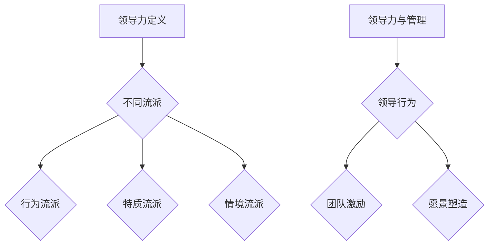

                 

### 文章标题

《领导力与风险管理：在不确定性中前行》

### 关键词

领导力、风险管理、不确定性、流程图、伪代码、LaTeX公式、案例分析、战略决策

### 摘要

在当今快速变化的商业环境中，领导力和风险管理成为企业成功的关键要素。本文深入探讨领导力的核心概念、提升策略及其与风险管理的关联，结合数学模型和案例分析，提供了一套在不确定性中前行的完整指南。本文旨在帮助读者理解领导力与风险管理之间的互动关系，掌握在复杂环境中做出有效决策的技巧，从而提升组织在面对不确定性时的适应能力和韧性。

## 第一步：领导力的核心概念与联系

### 1.1 领导力的定义

领导力是一种影响力，它能够激励和引导他人共同实现目标。不同于管理，领导力更多地关注愿景的塑造和未来的探索。根据Hersey和Blanchard的情境领导理论，领导力可以根据不同的情境进行动态调整，以达到最佳效果。

### 1.2 领导力的不同流派

- **行为流派**：该流派认为领导行为是可学习和可培养的。例如，赫茨伯格的双因素理论指出，领导行为可以分为工作取向和人际取向。
- **特质流派**：特质流派认为领导力是由一系列特定的个人特质所决定的。例如，斯托格迪尔的特质理论认为，领导者的特质包括自信、决断力和社会技能。
- **情境流派**：情境流派认为领导力取决于领导者和下属之间的互动，以及具体情境的需求。例如，费德勒的权变理论提出，领导效果取决于领导者与情境的匹配程度。

### 1.3 领导力与管理的联系与区别

领导力和管理虽然有交集，但它们的焦点不同。管理侧重于组织资源和流程的优化，而领导力则侧重于愿景的塑造和团队的激励。领导力是管理的灵魂，而管理是实现领导目标的重要手段。

### 1.4 领导力模型简介（Mermaid流程图）

使用Mermaid语法，我们可以创建一个简单的领导力模型流程图，以展示领导力的不同方面及其相互关系。



### 第二步：领导力发展与提升

### 2.1 自我认知

自我认知是领导力发展的基础。通过自我评估，领导者可以了解自己的优势和劣势，从而制定有针对性的提升计划。

```plaintext
自我认知步骤：
1. 收集反馈：从同事、下属和上级收集反馈。
2. 内省：反思自己的行为和决策，找出改进点。
3. 设定目标：明确个人和职业发展目标。
```

### 2.2 情绪管理

情绪管理对于领导者至关重要。有效的情绪管理不仅能够提升个人决策质量，还能够增强团队的凝聚力。

```plaintext
情绪管理技巧：
1. 意识到情绪：识别和管理自己的情绪。
2. 倾听：倾听他人的观点，避免情绪冲突。
3. 自我调节：在面对挑战时保持冷静和理智。
```

### 2.3 决策力

决策力是领导者的一项关键技能。通过使用决策模型，领导者可以在复杂环境中做出明智的决策。

```python
决策模型伪代码：
def make_decision(criteria, options):
    evaluate_options = []
    for option in options:
        evaluate_option = evaluate_by_criteria(option, criteria)
        evaluate_options.append(evaluate_option)
    best_option = find_best_option(evaluate_options)
    return best_option
```

### 2.4 沟通技巧

有效的沟通是领导力的重要组成部分。领导者需要掌握如何清晰、准确地传达信息，并促进团队的协作。

```plaintext
沟通技巧：
1. 明确信息：确保信息传达清晰、明确。
2. 倾听：倾听他人的意见和需求。
3. 非言语沟通：注意肢体语言和面部表情，以增强沟通效果。
```

### 2.5 领导力提升策略（伪代码）

以下是一个简单的领导力提升策略伪代码，用于指导领导者在日常工作中持续提升自己的领导力。

```python
def improve_leadership():
    while True:
        assess_self()
        seek_feedback()
        set_objectives()
        learn_new_skills()
        practice_skills()
        review_progress()
```

## 第三步：风险管理基础

### 3.1 风险定义

风险是指潜在的不利事件或情境，可能对组织的目标和利益造成负面影响。

```latex
定义：\\text{风险} = \\text{潜在不利事件} \\times \\text{事件发生的可能性}
```

### 3.2 风险分类

根据风险产生的原因和性质，风险可以分为以下几类：

- **操作风险**：由操作失误、系统故障等引起的风险。
- **市场风险**：由市场价格波动引起的风险。
- **信用风险**：由借款人或交易对手违约引起的风险。

### 3.3 风险评估

风险评估是识别和评估风险的过程，通常包括以下步骤：

1. **风险识别**：识别组织可能面临的风险。
2. **风险分析**：分析风险的性质和影响。
3. **风险评估**：评估风险的概率和潜在损失。

### 3.4 风险管理模型（LaTeX公式讲解）

风险管理模型可以表示为：

```latex
\\text{风险管理模型} = \\text{风险识别} + \\text{风险评估} + \\text{风险应对策略}
```

## 第四步：领导力实践与案例分析

### 4.1 企业领导力实践

在企业中，领导力实践通常涉及以下几个方面：

1. **领导风格**：根据团队的特点和环境选择合适的领导风格。
2. **组织文化**：塑造积极向上的组织文化，促进团队协作和员工发展。
3. **战略决策**：制定清晰的战略目标，并确保团队在实现这些目标的过程中保持一致。

### 4.2 风险管理实践

风险管理实践包括以下步骤：

1. **风险识别**：识别企业可能面临的各种风险。
2. **风险评估**：评估这些风险的可能性和影响。
3. **风险应对**：制定和实施应对策略，以减轻风险的影响。

### 4.3 实战案例分析

以下是一个简单的企业领导力和风险管理案例：

**案例**：某科技公司面临的市场风险和操作风险。

- **领导力实践**：CEO决定采用民主领导风格，鼓励团队成员提出创新建议，并定期召开策略会议，以确保团队的共识和目标的清晰。
- **风险管理实践**：公司进行了全面的风险评估，并制定了一套包括风险监控、应急响应和风险管理培训的策略。

### 4.4 领导力与风险管理的综合应用

在不确定的环境中，领导力和风险管理的综合应用至关重要。领导者需要：

- **灵活调整**：根据外部环境的变化，灵活调整领导风格和管理策略。
- **持续沟通**：保持与团队和利益相关者的持续沟通，确保信息的透明和及时。
- **风险管理意识**：提升团队的风险管理意识，使其能够快速识别和应对潜在的风险。

## 第五步：综合分析与总结

### 5.1 领导力与风险管理的关系

领导力与风险管理密切相关。有效的领导力可以提升团队应对风险的能力，而风险管理则为领导力的实现提供了保障。

### 5.2 领导力在风险管理中的角色

领导者需要在风险管理中扮演以下角色：

- **决策者**：制定风险应对策略。
- **协调者**：协调不同部门之间的合作，共同应对风险。
- **监督者**：监督风险管理过程的执行，确保风险得到有效控制。

### 5.3 风险管理在领导力发展中的应用

风险管理可以帮助领导者：

- **提高决策质量**：通过风险评估，领导者可以做出更为明智的决策。
- **增强团队协作**：风险管理需要团队协作，有助于提升团队的凝聚力。

### 5.4 持续改进与反思

领导者需要不断反思和改进自己的领导力和风险管理实践。以下是一些建议：

- **定期评估**：定期评估领导力和风险管理的效果，找出改进点。
- **学习与培训**：不断学习新的领导力和风险管理技巧，保持与时俱进。
- **团队反馈**：鼓励团队成员提供反馈，以便改进领导力和风险管理实践。

## 第六步：附录与扩展阅读

### 6.1 领导力与风险管理相关书籍推荐

- **《领导力的五项修炼》**：作者：斯蒂芬·罗宾斯
- **《风险管理》**：作者：爱德华·J·弗里曼

### 6.2 领导力与风险管理工具介绍

- **SWOT分析**：用于评估组织的优势、劣势、机会和威胁。
- **风险矩阵**：用于评估风险的概率和影响。

### 6.3 常用参考资料与网站链接

- **领导力与发展中心**：https://www.centerforleadership.com/
- **风险管理协会**：https://www.rma.org/

### 作者信息

作者：AI天才研究院/AI Genius Institute & 禅与计算机程序设计艺术 /Zen And The Art of Computer Programming

