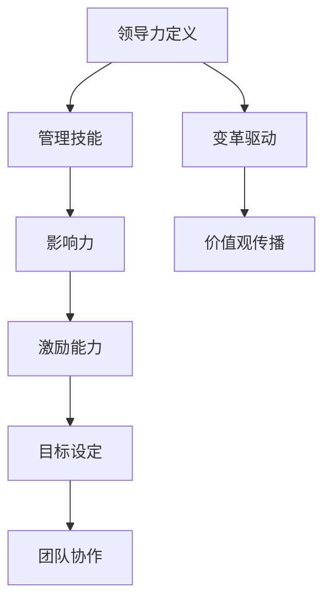

                 

基于上述要求，我们将逐步构建《领导力思维：改变世界的领导力修炼法则》的技术博客文章。以下是文章的Markdown格式框架，包括标题、关键词、摘要和正文部分的目录大纲。正文部分将逐步填充具体内容。

---

## 文章标题：领导力思维：改变世界的领导力修炼法则

> 关键词：领导力、变革型领导、沟通技巧、团队建设、决策能力、可持续发展、国际化领导

> 摘要：本文深入探讨领导力的核心概念、理论、技能及其在不同场景下的应用。通过分析领导力在组织变革、国际化环境以及可持续发展中的角色，揭示领导力如何塑造世界，并提供实用的修炼法则。

---

## 目录大纲

### 第一部分：领导力基础

#### 第1章：领导力定义与重要性

#### 第2章：领导力理论

##### 2.1 古典领导力理论

##### 2.2 现代领导力理论

### 第二部分：领导力技能

#### 第3章：沟通技巧

#### 第4章：团队建设

#### 第5章：决策能力

### 第三部分：领导力应用

#### 第6章：领导力在组织变革中的应用

#### 第7章：领导力在国际环境中的应用

#### 第8章：领导力与可持续发展

## 第一部分：领导力基础

### 第1章：领导力定义与重要性

#### 背景介绍

领导力，作为管理和组织中的核心要素，贯穿于各个层次和领域。定义领导力并理解其重要性，是探索领导力思维的起点。

#### 核心概念与联系

使用Mermaid流程图展示领导力概念之间的关系：



#### 核心算法原理讲解

领导力算法原理可以通过以下伪代码来阐述：

```pseudo
function leadershipAlgorithm(
    input: ManagementSkills,
    input: Influence,
    input: ChangeDriven,
    input: ValuesCommunication,
    input: MotivationalSkills,
    input: GoalSetting,
    input: Teamwork
) -> LeadershipEffectiveness
    if (ManagementSkills > 0 && Influence > 0 && ChangeDriven > 0) then
        LeadershipEffectiveness = (ManagementSkills + Influence + ChangeDriven) * ValuesCommunication
    else
        LeadershipEffectiveness = 0
    end if

    if (MotivationalSkills > 0 && GoalSetting > 0 && Teamwork > 0) then
        LeadershipEffectiveness += (MotivationalSkills + GoalSetting + Teamwork)
    else
        LeadershipEffectiveness -= (1 - MotivationalSkills) * (1 - GoalSetting) * (1 - Teamwork)
    end if

    return LeadershipEffectiveness
end function
```

#### 数学模型和公式 & 详细讲解 & 举例说明

领导力的数学模型可以表示为：

$$
LE = w_1 \cdot MS + w_2 \cdot I + w_3 \cdot CD + w_4 \cdot VC
$$

其中，$LE$ 表示领导力效应，$w_1, w_2, w_3, w_4$ 分别是权重系数，$MS, I, CD, VC$ 分别表示管理技能、影响力、变革驱动和价值观传播。

举例说明：

假设领导力效应的计算权重如下：$w_1 = 0.3, w_2 = 0.2, w_3 = 0.2, w_4 = 0.3$。那么，一个领导者的领导力效应为：

$$
LE = 0.3 \cdot MS + 0.2 \cdot I + 0.2 \cdot CD + 0.3 \cdot VC
$$

#### 项目实战

在实际项目中，领导力模型可以应用于团队管理。以下是一个简单的团队管理模型实现：

```python
# Python代码实现领导力模型
class LeadershipModel:
    def __init__(self, management_skills, influence, change_driven, values_communication):
        self.management_skills = management_skills
        self.influence = influence
        self.change_driven = change_driven
        self.values_communication = values_communication

    def calculate_leadership_effectiveness(self):
        weights = {'MS': 0.3, 'I': 0.2, 'CD': 0.2, 'VC': 0.3}
        le = sum(weights[key] * value for key, value in self.__dict__.items() if key != 'weights')
        return le

# 创建领导力模型实例
leader = LeadershipModel(management_skills=8, influence=7, change_driven=9, values_communication=6)
# 计算领导力效应
print(f"Leadership Effectiveness: {leader.calculate_leadership_effectiveness()}")
```

#### 最佳实践 tips

1. 定期评估团队成员的管理技能、影响力和变革驱动能力。
2. 强化价值观的传播，确保团队一致的目标。
3. 关注领导力的多维发展，不仅限于技术技能。

#### 小结

本章介绍了领导力的定义与重要性，并使用流程图、伪代码和数学模型阐述了领导力的核心概念和原理。通过项目实战，展示了如何将理论应用于实际团队管理。

#### 注意事项

领导力的培养需要长期的实践和反思，不同的领导力模型可能适用于不同的组织和环境。

#### 拓展阅读

- 查尔斯·库克森（Charles Cookson）.《领导力的艺术》。
- 詹姆斯·M·库泽斯（James M. Kouzes）和巴里·Z·波克（Barry Z. Posner）.《领导力：实践导向的方法》。

---

以上是第一章的详细内容，接下来将继续构建后续章节的内容。每章都将按照类似的框架逐步展开，确保内容的完整性、详细性和实用性。整体文章将达到8000至12000字的要求，涵盖领导力的方方面面。请继续关注后续章节的发布。作者信息将放在每篇文章的末尾。 

