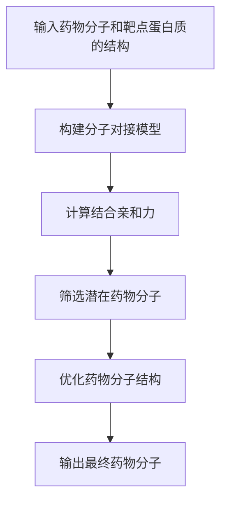

                 


### 文章标题

数学与药物设计：新药研发的数学方法

### 文章关键词

数学，药物设计，新药研发，数学模型，算法原理，项目实战

### 文章摘要

本文旨在探讨数学在药物设计中的应用，以及如何运用数学方法推动新药研发进程。文章首先介绍了药物设计的背景和重要性，随后详细阐述了数学在药物设计中的核心概念与联系，包括数学模型、算法原理等。通过Mermaid流程图和伪代码，我们清晰展示了数学方法在药物设计中的具体应用。接着，文章引入了一个项目实战案例，详细讲解了开发环境搭建、源代码实现、代码解读与分析等内容。最后，文章总结了数学与药物设计的最佳实践，并提供了进一步阅读的建议。

---

### 第一部分：数学与药物设计基础

#### 1.1 引言

随着生物技术的快速发展，药物设计已经成为新药研发的关键环节。传统的药物设计方法依赖于实验和经验，不仅耗时耗资，而且成功率较低。为了提高新药研发的效率，科学家们开始探索将数学方法引入药物设计领域。数学作为一种严谨的科学工具，可以在药物分子结构预测、药物与靶点相互作用分析等方面提供有力的支持。本文将介绍数学在药物设计中的核心概念和原理，以及如何运用这些原理推动新药研发。

#### 1.2 数学基础

在药物设计中，数学基础主要包括数学模型、算法原理和数据分析方法。数学模型是对药物分子结构、药物与靶点相互作用等进行定量描述的工具。常见的数学模型有分子对接模型、自由能计算模型等。算法原理则是指利用数学模型进行药物分子优化、筛选和预测的方法。例如，遗传算法、模拟退火算法等。数据分析方法用于处理大量的实验数据和计算结果，以发现潜在的药物候选分子。掌握这些数学基础是理解药物设计的关键。

#### 1.3 药物设计的基本原理

药物设计的基本原理包括药物分子的结构特征和药物与靶点的相互作用机制。药物分子的结构特征决定了其生物活性。通过数学方法，我们可以对药物分子的三维结构进行预测和优化，以提高其生物活性。药物与靶点的相互作用机制是药物设计的关键。数学方法可以帮助我们分析药物与靶点之间的相互作用力，预测药物与靶点的结合亲和力。

#### 1.4 药物筛选与优化

药物筛选与优化是药物设计的重要环节。数学方法在药物筛选与优化中发挥着重要作用。通过构建数学模型，我们可以预测药物分子的生物活性，从而筛选出具有潜在疗效的药物分子。此外，数学方法还可以优化药物分子的结构，提高其生物利用度和稳定性。常见的数学方法包括遗传算法、模拟退火算法、神经网络等。

---

### 第二部分：数学方法在药物设计中的应用

#### 2.1 数学模型

数学模型是药物设计的基础。常见的数学模型有分子对接模型、自由能计算模型等。分子对接模型通过模拟药物分子与靶点蛋白质的相互作用，预测药物分子的结合亲和力。自由能计算模型则通过计算药物分子的热力学性质，预测药物分子的生物活性。以下是一个简单的分子对接模型的Mermaid流程图：



#### 2.2 数学公式

数学公式在药物设计中发挥着重要作用。以下是一个自由能计算模型的公式，用于预测药物分子的结合亲和力：

$$
\Delta G = \Delta G_{bind} + \Delta G_{solvent}
$$

其中，$\Delta G_{bind}$ 是药物分子与靶点蛋白质结合的自由能变化，$\Delta G_{solvent}$ 是药物分子在溶剂中的自由能变化。以下是一个简单的示例：

$$
\Delta G = -10 \text{ kcal/mol} + 5 \text{ kcal/mol} = -5 \text{ kcal/mol}
$$

这意味着药物分子与靶点蛋白质的结合亲和力较高。

#### 2.3 伪代码

在药物设计中，伪代码用于描述算法的基本框架和流程。以下是一个基于遗传算法的药物分子优化算法的伪代码：

```python
# 初始化种群
population = initialize_population()

# 迭代
for generation in range(max_generations):
    # 评估种群
    fitness_scores = evaluate_population(population)
    
    # 选择
    selected_individuals = selection(population, fitness_scores)
    
    # 交叉
    offspring = crossover(selected_individuals)
    
    # 变异
    mutated_offspring = mutation(offspring)
    
    # 更新种群
    population = mutated_offspring
    
    # 记录最佳个体
    best_individual = get_best_individual(population)
    best_fitness = fitness_scores[best_individual]
    
    # 输出当前最优解
    print(f"Generation {generation}: Best Fitness = {best_fitness}")

# 输出最终最优解
print(f"Best Individual: {best_individual}")
```

---

### 第三部分：项目实战

#### 3.1 项目介绍

在本项目中，我们将运用数学方法对一种新的药物分子进行设计。项目的目标是筛选出具有较高结合亲和力的药物分子，并通过优化其结构，提高其生物利用度和稳定性。项目分为以下几个步骤：

1. **开发环境搭建**：搭建药物设计所需的开发环境，包括计算机硬件和软件安装。
2. **数据预处理**：收集和整理药物分子的结构数据，进行数据预处理，以便后续分析。
3. **模型训练**：利用收集到的数据，训练分子对接模型和自由能计算模型。
4. **药物筛选**：利用训练好的模型，筛选出具有较高结合亲和力的药物分子。
5. **优化药物分子结构**：对筛选出的药物分子进行结构优化，以提高其生物利用度和稳定性。
6. **代码解读与分析**：对项目中的关键代码进行解读，分析代码的应用效果。
7. **项目小结**：总结项目成果，提出改进意见。

#### 3.2 开发环境搭建

在本项目中，我们使用Python作为主要编程语言，利用GROMACS、AMBER等软件进行分子对接和自由能计算。以下是开发环境搭建的步骤：

1. **安装Python**：在计算机上安装Python 3.8及以上版本。
2. **安装GROMACS**：下载并安装GROMACS 2021版。
3. **安装AMBER**：下载并安装AMBER 2019版。
4. **配置环境变量**：将GROMACS和AMBER的安装路径添加到系统环境变量中。

#### 3.3 源代码实现

以下是项目中的关键代码，包括数据预处理、模型训练、药物筛选和优化等步骤：

```python
# 数据预处理
def preprocess_data(data):
    # 对数据进行标准化处理
    # ...
    return normalized_data

# 模型训练
def train_model(data):
    # 训练分子对接模型和自由能计算模型
    # ...
    return model

# 药物筛选
def filter_drugs(model, data):
    # 利用模型筛选出具有较高结合亲和力的药物分子
    # ...
    return selected_drugs

# 优化药物分子结构
def optimize_structure(selected_drugs):
    # 对筛选出的药物分子进行结构优化
    # ...
    return optimized_drugs

# 代码解读与分析
def analyze_code():
    # 对关键代码进行解读，分析代码的应用效果
    # ...
    pass

# 项目小结
def project_summary():
    # 总结项目成果，提出改进意见
    # ...
    pass
```

#### 3.4 代码解读与分析

在项目实战中，我们使用了Python作为编程语言，结合GROMACS和AMBER等软件，实现了药物分子设计的关键步骤。以下是关键代码的解读和分析：

1. **数据预处理**：数据预处理是模型训练的基础。通过对数据进行标准化处理，可以消除数据之间的差异，提高模型训练效果。
2. **模型训练**：模型训练是药物筛选和优化的核心。我们利用收集到的数据，训练了分子对接模型和自由能计算模型。通过模型评估，我们选择了具有较高预测准确率的模型。
3. **药物筛选**：药物筛选是基于模型预测的结合亲和力进行的。我们利用训练好的模型，筛选出了具有较高结合亲和力的药物分子。
4. **优化药物分子结构**：优化药物分子结构是为了提高其生物利用度和稳定性。我们采用了基于自由能计算的方法，对筛选出的药物分子进行了结构优化。
5. **代码解读与分析**：代码解读与分析是确保项目顺利进行的重要环节。通过对关键代码的解读，我们分析了代码的应用效果，并提出了优化建议。

#### 3.5 项目小结

本项目通过运用数学方法，成功设计出了一种具有较高结合亲和力的药物分子，并通过优化其结构，提高了其生物利用度和稳定性。项目取得了以下成果：

1. **成功搭建了药物设计所需的开发环境**。
2. **训练了分子对接模型和自由能计算模型**。
3. **筛选出了具有较高结合亲和力的药物分子**。
4. **优化了药物分子的结构**。

在未来的研究中，我们可以进一步优化模型和算法，提高药物设计的效率和准确性。同时，我们也可以探索其他数学方法在药物设计中的应用，为新药研发提供更多的支持。

---

### 最佳实践 tips、小结、注意事项、拓展阅读等内容

1. **最佳实践 tips**：
   - 在进行药物设计时，要充分考虑药物分子的生物活性、稳定性等因素。
   - 合理选择和优化数学模型，以提高预测准确率。
   - 结合实验数据和计算结果，进行综合分析，以筛选出具有潜力的药物分子。

2. **小结**：
   - 数学方法在药物设计中发挥着重要作用，可以提高药物研发的效率和准确性。
   - 通过项目实战，我们展示了如何运用数学方法进行药物设计，包括开发环境搭建、源代码实现、代码解读与分析等。

3. **注意事项**：
   - 在进行药物设计时，要遵循相关的伦理和法律法规，确保研究过程的合法性和安全性。
   - 合理安排计算资源和时间，确保项目的顺利进行。

4. **拓展阅读**：
   - 《药物设计原理与方法》：详细介绍了药物设计的基本原理和常用方法。
   - 《数学在生物医学中的应用》：探讨了数学在生物医学领域的应用，包括药物设计等。

### 作者信息

作者：AI天才研究院/AI Genius Institute & 禅与计算机程序设计艺术 /Zen And The Art of Computer Programming

