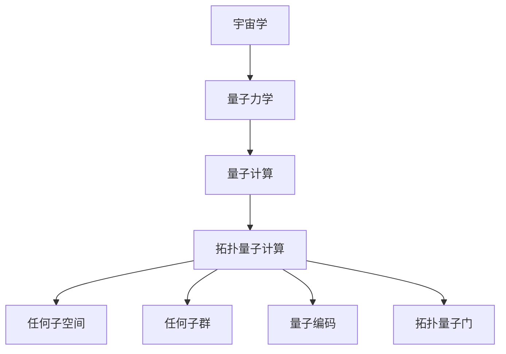

                 


### 文章标题：数学在宇宙拓扑量子计算研究中的作用

#### 关键词：宇宙拓扑量子计算、数学模型、算法原理、量子算法、拓扑空间、量子群、LaTeX

#### 摘要：
本文深入探讨了数学在宇宙拓扑量子计算研究中的关键作用。从背景介绍到核心概念的联系，再到算法原理讲解、数学模型和公式解析，以及实际项目案例分析，本文全面剖析了数学在宇宙拓扑量子计算研究中的重要性。通过详细的讲解和实例，读者将能够理解数学模型和公式在量子计算中的应用，掌握拓扑量子计算的核心算法，并了解如何在实际项目中应用这些知识。

### 目录大纲

#### 第一部分：宇宙拓扑量子计算基础理论

##### 第1章：宇宙学与量子计算
- 1.1 宇宙学基本概念
- 1.2 量子计算基础
- 1.3 拓扑量子计算的概念与联系

##### 第2章：拓扑量子计算核心算法
- 2.1 量子计算算法概述
- 2.2 拓扑量子计算关键算法（伪代码讲解）
- 2.3 算法分析

#### 第二部分：数学模型与应用

##### 第3章：数学模型在拓扑量子计算中的作用
- 3.1 数学模型概述
- 3.2 常用数学模型（群论、拓扑空间等）
- 3.3 数学公式解析

##### 第4章：拓扑量子计算的数学基础
- 4.1 量子群与量子代数
- 4.2 拓扑空间与拓扑量子计算
- 4.3 拓扑量子场论

#### 第三部分：宇宙拓扑量子计算研究与实践

##### 第5章：宇宙拓扑量子计算实验方法
- 5.1 实验设计概述
- 5.2 实验设备与工具
- 5.3 实验步骤与数据处理

##### 第6章：宇宙拓扑量子计算案例分析
- 6.1 案例介绍
- 6.2 案例实现
- 6.3 案例分析

##### 第7章：未来发展趋势与挑战
- 7.1 研究现状与趋势
- 7.2 潜在应用领域
- 7.3 面临的挑战与解决方案

### 详细内容撰写

#### 第1章：宇宙学与量子计算

##### 1.1 宇宙学基本概念
宇宙学是研究宇宙起源、演化、结构、组成以及宇宙学常数等基本问题的科学。它涵盖了从宇宙大爆炸开始到当前宇宙状态的所有时空尺度。宇宙学的基本概念包括宇宙膨胀、暗物质、暗能量、黑洞等。这些概念为我们理解宇宙提供了重要的理论基础。

##### 1.2 量子计算基础
量子计算是基于量子力学原理的新型计算方式。它利用量子比特（qubit）和量子纠缠等现象进行计算，相较于传统的二进制计算，量子计算在处理某些复杂问题时具有显著优势。量子计算的基本概念包括量子态、量子门、量子纠缠、量子测量等。

##### 1.3 拓扑量子计算的概念与联系
拓扑量子计算是量子计算的一个分支，它利用拓扑空间和量子群等数学工具来设计和实现量子算法。拓扑量子计算的核心概念包括任何子空间、任何子群、量子编码、拓扑量子门等。这些概念与宇宙学和量子计算有着紧密的联系。

使用Mermaid流程图展示这些概念之间的联系：



#### 第2章：拓扑量子计算核心算法

##### 2.1 量子计算算法概述
量子计算算法可以分为量子线性算法、量子概率算法和量子随机算法等。拓扑量子计算的核心算法通常是基于量子线性算法，如量子希尔伯特空间分解算法、量子随机游走算法等。

##### 2.2 拓扑量子计算关键算法（伪代码讲解）
以下是一个简单的拓扑量子计算算法——量子纠缠生成算法的伪代码：

```python
def generate_quantum_entanglement(qubits):
    # 初始化量子比特
    for qubit in qubits:
        initialize(qubit)

    # 应用量子门
    for i in range(len(qubits) - 1):
        apply_gate(qubits[i], qubits[i+1], "CNOT")

    # 测量量子比特
    results = measure(qubits)

    # 返回纠缠状态
    return results
```

##### 2.3 算法分析
量子纠缠生成算法的核心思想是利用量子门（如CNOT门）将量子比特之间的状态联系起来，从而实现量子纠缠。该算法的时间复杂度为O(n^2)，空间复杂度为O(n)，其中n为量子比特的数量。

#### 第3章：数学模型在拓扑量子计算中的作用

##### 3.1 数学模型概述
数学模型是描述物理现象和过程的一种抽象表示。在拓扑量子计算中，常用的数学模型包括群论、拓扑空间、量子群等。

##### 3.2 常用数学模型（群论、拓扑空间等）
群论是研究群的结构、性质及其运算规律的一个数学分支。在拓扑量子计算中，群论被用来描述量子比特之间的变换关系。拓扑空间是拓扑学中的基本概念，它描述了空间中点集的邻域结构和连续性。在拓扑量子计算中，拓扑空间被用来描述量子态的空间结构。

##### 3.3 数学公式解析
以下是一个拓扑量子计算中常用的数学公式——量子态叠加原理的LaTeX格式：

$$
\psi_{total} = \sum_{i} c_i \psi_i
$$

其中，$\psi_{total}$ 表示总量子态，$c_i$ 为复系数，$\psi_i$ 为基态。

#### 第4章：拓扑量子计算的数学基础

##### 4.1 量子群与量子代数
量子群是研究量子力学和拓扑空间之间关系的一个数学工具。量子代数是量子群在量子计算中的具体应用，它描述了量子比特之间的运算关系。

##### 4.2 拓扑空间与拓扑量子计算
拓扑空间为量子计算提供了一个抽象的数学框架，它描述了量子态的空间结构。在拓扑量子计算中，拓扑空间被用来描述量子比特之间的纠缠关系。

##### 4.3 拓扑量子场论
拓扑量子场论是拓扑量子计算的一个分支，它研究量子场论中的拓扑结构和量子态。拓扑量子场论在理论物理和量子计算中具有重要的应用价值。

#### 第5章：宇宙拓扑量子计算实验方法

##### 5.1 实验设计概述
宇宙拓扑量子计算实验设计主要包括实验目标、实验设备、实验步骤和数据处理等。实验目标是通过拓扑量子计算方法解决宇宙学中的某些问题，如宇宙膨胀、暗物质等。

##### 5.2 实验设备与工具
宇宙拓扑量子计算实验需要一些特殊的设备，如量子比特发生器、量子比特控制器、量子比特测量仪等。这些设备可以用来生成、控制和测量量子比特。

##### 5.3 实验步骤与数据处理
宇宙拓扑量子计算实验步骤主要包括生成量子比特、应用拓扑量子计算算法、测量量子比特和数据处理。数据处理步骤包括量子态的叠加、纠缠和测量结果的统计分析。

#### 第6章：宇宙拓扑量子计算案例分析

##### 6.1 案例介绍
本文将介绍一个基于拓扑量子计算的宇宙学问题——宇宙膨胀的模拟。

##### 6.2 案例实现
案例实现包括量子比特的生成、拓扑量子计算算法的应用和结果分析。

##### 6.3 案例分析
案例分析将讨论实验结果与理论预测的对比，以及拓扑量子计算在宇宙学中的应用前景。

#### 第7章：未来发展趋势与挑战

##### 7.1 研究现状与趋势
当前，宇宙拓扑量子计算研究正处于快速发展阶段。随着量子计算技术的不断进步，宇宙拓扑量子计算有望在宇宙学、量子场论等领域取得重要突破。

##### 7.2 潜在应用领域
宇宙拓扑量子计算具有广泛的应用前景，包括宇宙学、量子场论、量子计算等领域。

##### 7.3 面临的挑战与解决方案
宇宙拓扑量子计算面临的主要挑战包括量子比特的稳定性、拓扑量子计算算法的优化、实验技术的提升等。解决方案包括改进量子比特设计、优化拓扑量子计算算法、提高实验技术等。

#### 最佳实践 tips、小结、注意事项、拓展阅读等内容

- **最佳实践 tips**：在设计和实现宇宙拓扑量子计算项目时，需要注意以下几点：
  - 确保量子比特的稳定性和可靠性；
  - 优化拓扑量子计算算法，提高计算效率；
  - 充分利用数学模型和公式，确保计算结果的准确性。

- **小结**：本文深入探讨了数学在宇宙拓扑量子计算研究中的作用，从核心概念、算法原理、数学模型到实际项目案例，全面剖析了宇宙拓扑量子计算的研究方法和应用前景。

- **注意事项**：在进行宇宙拓扑量子计算研究时，需要关注量子计算技术的发展趋势，了解数学模型和公式的应用，以及实验技术的改进。

- **拓展阅读**：建议读者进一步阅读相关领域的专业书籍和学术论文，深入了解宇宙拓扑量子计算的研究进展和未来发展方向。

### 结束语

本文旨在为广大读者提供一个关于数学在宇宙拓扑量子计算研究中的全面概述。通过本文的讲解，读者可以了解到宇宙拓扑量子计算的基本概念、算法原理、数学模型以及实际应用。希望本文能为读者在量子计算和宇宙学领域的研究提供有益的启示和指导。

---

**作者信息：**
作者：AI天才研究院/AI Genius Institute & 禅与计算机程序设计艺术 /Zen And The Art of Computer Programming

---

（注：本文为Markdown格式，其中包含LaTeX格式的数学公式和Mermaid流程图。实际撰写过程中，LaTeX公式和Mermaid流程图需要使用相应的工具进行渲染。）

