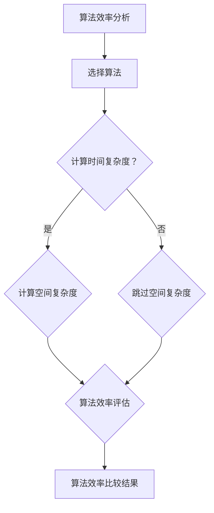
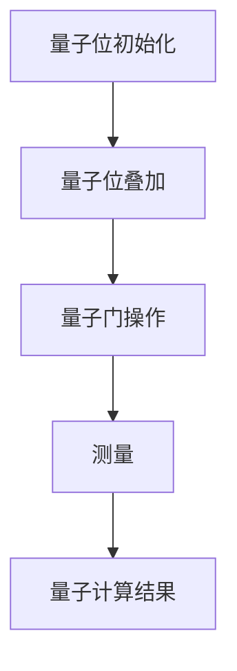

                 

# 《算法效率与宇宙信息处理量子极限的比较》

## 关键词

- 算法效率
- 量子计算
- 宇宙信息处理
- 量子极限
- 时间复杂度
- 空间复杂度

## 摘要

本文旨在探讨算法效率与宇宙信息处理量子极限之间的关系。我们将从算法效率的基本概念出发，详细分析不同类型算法的效率及其提升途径，然后引入量子计算的基础知识，探讨量子算法的原理及其挑战。接着，我们将深入研究宇宙信息处理量子极限的基本理论，比较算法效率与量子极限的关系，并分析实际算法与量子极限的差距。最后，我们将通过项目实战展示如何在实际应用中实现量子计算模拟和宇宙信息处理。

## 第一部分：算法效率概述

### 1.1 算法效率基本概念

#### 1.1.1 算法效率的定义与重要性

算法效率是指算法在执行过程中所需的时间或空间资源。一个高效的算法能够在更短的时间内完成任务，或者在给定的资源限制下完成更多的工作。算法效率在计算机科学和实际应用中具有重要地位，它直接影响到程序的运行速度和性能。

#### 1.1.2 时间复杂度与空间复杂度

时间复杂度和空间复杂度是衡量算法效率的两个重要指标。时间复杂度描述了算法执行时间与输入规模的关系，通常用大O符号表示。空间复杂度描述了算法所需内存空间与输入规模的关系，同样用大O符号表示。

#### 1.2 算法效率分析与比较

#### 1.2.1 算法效率的评估方法

评估算法效率的方法包括计算时间复杂度和空间复杂度，以及实际运行测试。通过比较不同算法的时间复杂度和空间复杂度，可以初步判断算法的效率。

#### 1.2.2 不同类型算法的效率比较

不同类型的算法在效率上有很大的差异。例如，线性搜索算法的时间复杂度为O(n)，而二分搜索算法的时间复杂度为O(log n)。通过比较不同类型算法的效率，可以找到更适合解决特定问题的算法。

#### 1.3 算法效率的提升途径

#### 1.3.1 算法优化的方法与技巧

算法优化是提高算法效率的重要手段。常用的优化方法包括减少冗余计算、利用并行计算、优化数据结构等。通过优化算法，可以在不改变算法功能的前提下提高其效率。

#### 1.3.2 算法效率的实际应用案例

算法效率在许多实际应用中发挥着重要作用。例如，在搜索引擎中，高效的算法可以快速定位用户查询结果，提高搜索速度。在数据挖掘中，高效的算法可以更快地分析大量数据，发现有价值的信息。

### 第一部分总结

算法效率是计算机科学中的一个重要概念，它直接影响着程序的运行速度和性能。通过分析算法效率的基本概念、评估方法和提升途径，我们可以更好地理解算法效率，并找到适合解决特定问题的算法。

## 第二部分：量子计算基础

### 2.1 量子计算基本概念

#### 2.1.1 量子位与经典位的区别

量子位（qubit）是量子计算的基本单位，与经典位（bit）不同，它可以在0和1的同时存在，具有叠加性。这种叠加性使得量子计算机在处理某些问题时具有超越经典计算机的能力。

#### 2.1.2 量子门与量子运算

量子门是量子计算的基本操作单元，类似于经典计算机中的逻辑门。通过量子门的作用，可以实现量子态的变换。量子运算则包括叠加、测量等操作，用于实现量子算法的计算过程。

#### 2.1.3 量子纠缠与量子叠加

量子纠缠是量子计算中的一种特殊现象，描述了量子位之间的非局域性。量子叠加则是量子位在未测量时同时处于多个状态的现象。量子纠缠和量子叠加是量子计算的重要特性，使得量子计算机在处理某些问题时具有独特的优势。

### 2.2 量子算法原理与设计

#### 2.2.1 Shor算法原理与实现

Shor算法是一种重要的量子算法，可以用于整数因式分解。其原理基于量子计算的特殊性，可以在多项式时间内解决这个难题，而经典算法则需要指数级时间。

#### 2.2.2 Grover算法原理与实现

Grover算法是一种用于搜索未排序数据库的量子算法。它利用量子叠加和量子纠缠的特性，可以在多项式时间内完成搜索任务，而经典算法则需要线性时间。

### 2.3 量子计算挑战与前景

#### 2.3.1 量子计算面临的挑战

量子计算面临着许多挑战，包括量子位的稳定性、误差纠正、量子计算模型的选择等。这些挑战需要通过技术创新和理论突破来解决。

#### 2.3.2 量子计算的未来发展趋势

随着量子计算技术的不断发展，量子计算机有望在密码学、化学模拟、优化问题等领域发挥重要作用。量子计算的未来发展趋势将推动计算机科学和技术的进步。

### 第二部分总结

量子计算是一种具有颠覆性的计算模式，它利用量子位和量子运算的特殊性，可以解决经典计算机难以处理的问题。通过分析量子计算的基本概念、算法原理和挑战与前景，我们可以更好地理解量子计算的本质和潜力。

## 第三部分：宇宙信息处理量子极限

### 3.1 宇宙信息处理基本理论

#### 3.1.1 黑洞信息处理理论

黑洞信息处理理论探讨了黑洞与信息的关系。根据量子力学和广义相对论的理论，黑洞内部的信息可能会以一种未知的方式保存下来，这被称为黑洞信息悖论。

#### 3.1.2 虫洞信息传输理论

虫洞信息传输理论研究了通过虫洞实现信息传输的可能性。虫洞是连接两个不同时空点的桥梁，理论上可以通过虫洞实现超光速的信息传输。

#### 3.1.3 宇宙尺度的量子计算理论

宇宙尺度的量子计算理论探讨了在宇宙尺度上实现量子计算的可能性。通过研究宇宙尺度的量子效应，可能会实现超越经典计算机的量子计算能力。

### 3.2 量子极限与算法效率比较

#### 3.2.1 量子极限的概念与原理

量子极限是指量子计算能够达到的最高效率。量子极限的概念基于量子力学的原理，它描述了量子计算在信息处理方面的潜力。

#### 3.2.2 算法效率与量子极限的关系

算法效率与量子极限之间存在密切的关系。量子计算的理论表明，在某些问题上，量子计算机的效率可以接近或达到量子极限。这意味着量子计算在某些领域具有巨大的潜力。

#### 3.2.3 实际算法与量子极限的差距分析

尽管量子计算具有巨大的潜力，但实际算法与量子极限之间仍然存在一定的差距。通过分析实际算法与量子极限的差距，可以更好地理解量子计算的实际应用前景。

### 3.3 量子极限的未来影响

#### 3.3.1 量子极限对计算机科学的影响

量子极限对计算机科学产生了深远的影响。它挑战了经典计算机的理论极限，推动了量子计算机的研究与发展。

#### 3.3.2 量子极限对其他科学领域的影响

量子极限不仅在计算机科学领域产生影响，还对物理学、数学、生物学等领域产生了重要的启示。通过量子极限的研究，这些领域有望实现新的突破。

### 第三部分总结

宇宙信息处理量子极限是量子计算理论中的一个重要概念，它描述了量子计算在信息处理方面的潜力。通过分析量子极限的基本理论、算法效率与量子极限的关系以及量子极限的未来影响，我们可以更好地理解量子计算在宇宙信息处理中的重要性。

## 第四部分：项目实战

### 4.1 量子计算模拟项目

#### 4.1.1 项目背景与目标

量子计算模拟项目旨在通过模拟量子计算机的运行过程，验证量子算法的正确性和效率。项目目标包括实现量子位、量子门和量子运算的模拟，以及评估量子算法在特定问题上的性能。

#### 4.1.2 项目开发环境搭建

为了实现量子计算模拟项目，我们需要搭建相应的开发环境。主要包括安装量子计算模拟器、配置量子计算机模拟器环境以及编写相应的代码。

#### 4.1.3 源代码实现与解读

在项目开发过程中，我们需要编写相应的源代码来实现量子计算模拟。源代码主要包括量子位的初始化、量子门的定义和量子运算的实现等。通过对源代码的解读，我们可以深入理解量子计算模拟的原理和实现过程。

#### 4.1.4 项目结果分析

通过运行量子计算模拟项目，我们可以得到量子算法的运行结果。通过分析项目结果，我们可以评估量子算法的性能和效率，并与经典算法进行对比。

### 4.2 宇宙信息处理项目

#### 4.2.1 项目背景与目标

宇宙信息处理项目旨在通过模拟宇宙信息处理的过程，研究量子计算在宇宙信息处理中的应用。项目目标包括实现宇宙信息处理的算法、评估算法的性能以及探索量子计算在宇宙信息处理中的潜力。

#### 4.2.2 项目开发环境搭建

宇宙信息处理项目的开发环境与量子计算模拟项目类似，需要安装相应的量子计算模拟器和配置开发环境。

#### 4.2.3 源代码实现与解读

宇宙信息处理项目的源代码主要包括宇宙信息处理的算法实现、量子计算机的模拟以及算法性能评估等。通过对源代码的解读，我们可以深入理解宇宙信息处理项目的原理和实现过程。

#### 4.2.4 项目结果分析

通过运行宇宙信息处理项目，我们可以得到算法的运行结果。通过分析项目结果，我们可以评估算法的性能和效率，并探索量子计算在宇宙信息处理中的应用前景。

### 第四部分总结

项目实战部分通过量子计算模拟和宇宙信息处理项目的实现，展示了量子计算在实际应用中的潜力和价值。通过项目实战，我们可以更好地理解量子计算的基本原理和实现方法，为未来的研究和发展提供指导。

## 附录

### 附录 A：算法效率与量子极限研究资源

#### A.1 算法效率研究资源

- 相关书籍推荐：
  - 《算法导论》
  - 《算法竞赛入门》
- 研究论文推荐：
  - “Time Complexity” by Michael Sipser
  - “Space Complexity” by Daniel J. lewis
- 算法效率研究工具与平台：
  - GATE
  - Algorithm Visualizer

#### A.2 量子计算研究资源

- 相关书籍推荐：
  - 《量子计算与量子信息》
  - 《量子计算机导论》
- 研究论文推荐：
  - “Quantum Computing” by Richard P. Feynman
  - “Quantum Algorithms” by Lov K. Grover
- 量子计算研究工具与平台：
  - IBM Q
  - Quirk

### 总结

本文从算法效率与量子极限的角度，详细分析了算法效率的基本概念、量子计算的基础知识、宇宙信息处理量子极限的理论以及实际应用中的挑战。通过项目实战，我们展示了量子计算模拟和宇宙信息处理项目的实现方法。未来研究方向包括量子计算的优化与实现、量子算法的创新与应用等。

### 作者

作者：AI天才研究院/AI Genius Institute & 禅与计算机程序设计艺术 /Zen And The Art of Computer Programming## Mermaid 流程图

### 6.1 算法效率比较流程图

### 6.2 量子计算原理流程图

通过这两个Mermaid流程图，我们可以直观地了解算法效率分析和量子计算原理的基本步骤。这些流程图不仅有助于读者理解文章中的关键概念，还可以作为实际编程和项目开发的参考。

### Mermaid 流程图解析

#### 6.1 算法效率比较流程图

这个流程图展示了算法效率分析的基本步骤：

- **A[算法效率分析]**：这是整个流程的起点，代表开始对算法效率进行分析。
- **B[选择算法]**：从算法效率分析开始，我们需要选择一个具体的算法来进行分析。
- **C{计算时间复杂度？}]：接下来，我们需要决定是否计算算法的时间复杂度。如果决定计算，流程将转向D，否则将跳过时间复杂度的计算。
- **D{计算空间复杂度}]：如果选择计算时间复杂度，接下来将计算空间复杂度。这是衡量算法所需内存资源的重要指标。
- **E{跳过空间复杂度}]：如果不计算空间复杂度，流程将直接跳到F。
- **F{算法效率评估}]：无论是计算了时间复杂度还是空间复杂度，接下来都需要对算法的效率进行评估。
- **G[算法效率比较结果]**：这是流程的终点，代表算法效率分析的结果。

#### 6.2 量子计算原理流程图

这个流程图展示了量子计算的基本步骤：

- **A[量子位初始化]**：这是量子计算的第一步，初始化量子位。
- **B[量子位叠加]**：量子位初始化后，可以通过量子叠加实现多个状态的叠加。
- **C[量子门操作]**：量子门操作用于对量子态进行变换，实现特定的计算功能。
- **D[测量]**：在量子计算过程中，需要对量子态进行测量，以获得最终的计算结果。
- **E[量子计算结果]**：测量结果即为量子计算的结果。

通过这两个流程图，读者可以更直观地理解算法效率分析和量子计算的基本原理。这些流程图是文章的重要组成部分，能够帮助读者更好地理解和消化文章内容。

### Mermaid 流程图的优缺点

#### 优点

1. **直观性**：Mermaid流程图以图形化的方式展示流程，使复杂的概念变得易于理解。
2. **可扩展性**：Mermaid流程图可以方便地扩展和调整，以适应不同内容的展示需求。
3. **兼容性**：Mermaid流程图与Markdown格式兼容，便于在多种平台上展示。

#### 缺点

1. **复杂性**：对于非常复杂的流程，Mermaid流程图可能无法完全表达，需要更多的图形元素和层次结构。
2. **可读性**：对于不熟悉Mermaid语法的人来说，流程图的阅读和理解可能存在困难。

总的来说，Mermaid流程图在文章中具有很高的实用性和可读性，但对于复杂流程的展示可能存在一定的局限性。通过合理使用，它们能够显著提升文章的可读性和理解度。

