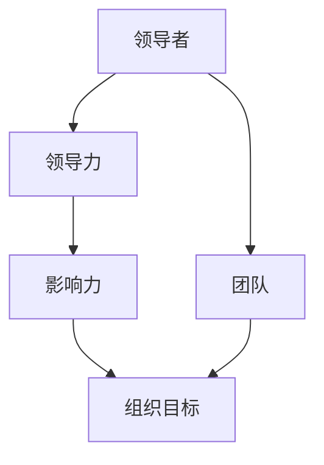
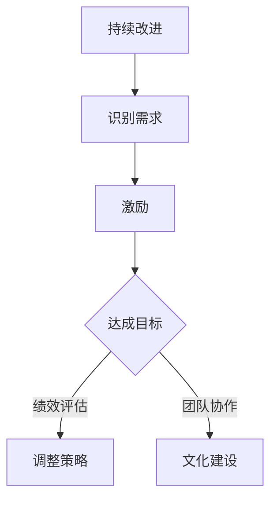

                 

### 文章标题
《领导力心法：成就一流管理者的领导力法则》

### 关键词
领导力，管理，管理者，心法，法则，实践，发展，持续成长

### 摘要
本文深入探讨了领导力的本质及其在企业管理中的关键作用。通过分析领导力的核心原理和实际应用，本文旨在为管理者提供一套切实可行的领导力法则，帮助他们在复杂的商业环境中脱颖而出，实现企业的长期发展。

---

## 引言与概述

在当今快速变化的市场环境中，领导力成为企业成功的关键因素。优秀的领导者不仅能够激励团队成员发挥潜力，还能在逆境中引导团队找到突破口。本部分将首先介绍领导力的基本概念，然后阐述本书的目的和结构。

### 领导力的定义

领导力是一种影响力，领导者通过影响和激励他人来实现组织目标。这种影响力不仅包括对团队成员的直接影响，还涉及到对整个组织的价值观和文化的影响。

### 领导力的重要性

领导力是企业成功的关键因素。根据多项研究，企业的业绩与其领导层的质量密切相关。一个卓越的领导者能够激发团队的潜力，提升团队的整体表现，从而推动企业的持续发展。

### 本书的目的与结构

本书旨在为管理者提供一套系统的领导力法则，帮助他们在实践中更好地发挥领导力。本书分为五个部分，从理论到实践，全面探讨领导力的各个方面。

- **第一部分：引言与概述**：介绍领导力的基本概念和本书的目的。
- **第二部分：领导力的核心原理**：分析领导力的理论基础和心理学因素。
- **第三部分：领导力实践法则**：探讨具体的领导力实践方法和工具。
- **第四部分：领导力心法应用**：通过案例展示领导力心法的实际应用。
- **第五部分：领导力的发展与持续成长**：探讨领导力的发展路径和持续成长的方法。

---

## 领导力的核心原理

领导力的核心原理是领导者如何通过影响和激励他人来实现组织目标。这部分将深入探讨领导力的理论基础，包括心理学、社会学和管理学等方面的理论。

### 马斯洛的需求层次理论

马斯洛的需求层次理论是心理学中非常重要的理论，它将人的需求分为五个层次：生理需求、安全需求、社交需求、尊重需求和自我实现需求。领导者需要了解这些需求，并在此基础上进行激励。

### 领导力与心理学、社会学的关系

心理学和社会学对领导力有重要影响。心理学研究领导者的人格特质、动机和情绪，社会学则关注领导者在社会环境中的角色和影响力。了解这些因素有助于领导者更好地理解和应对团队成员的行为和需求。

### 领导力模型的演进

领导力模型经历了从传统到现代的演进。传统的领导力模型强调权威和控制，而现代的领导力模型则更注重合作和影响力。领导者需要根据不同的情境和需求选择合适的领导力模型。

### 领导力的理论基础

领导力的理论基础包括多种理论，如X理论和Y理论、路径-目标理论、领导替代理论等。这些理论提供了不同的视角来理解和应用领导力。

---

## 领导力实践法则

在实际工作中，领导者需要运用一系列实践法则来提升领导力。这部分将探讨不同的领导力风格、管理工具和方法。

### 不同类型的领导力风格

领导力风格可以分为专制型、民主型和放任型。每种风格都有其优点和缺点，领导者需要根据具体情况选择合适的领导力风格。

#### 专制型领导力风格

专制型领导力风格的特点是领导者做出所有决策，并对团队成员的行为进行严格控制。这种风格在紧急情况下或需要迅速决策时非常有效。

#### 民主型领导力风格

民主型领导力风格的特点是领导者鼓励团队成员参与决策，并尊重团队成员的意见。这种风格有助于增强团队的凝聚力和创造力。

#### 放任型领导力风格

放任型领导力风格的特点是领导者尽量不干预团队成员的工作，给团队成员充分的自由。这种风格在团队成员自我管理能力较强时比较适用。

### 管理工具和方法

领导者可以运用多种管理工具和方法来提升领导力，如目标设定、绩效评估、团队建设等。

#### 目标设定

目标设定是领导力的重要组成部分。领导者需要明确组织的目标，并将其分解为具体的可执行的任务。

#### 绩效评估

绩效评估是领导者了解团队成员工作表现的重要手段。通过绩效评估，领导者可以及时发现问题和提供反馈。

#### 团队建设

团队建设是提升团队绩效的重要方法。领导者可以通过组织团队活动、培训和发展计划来增强团队的凝聚力和协作能力。

---

## 领导力心法应用

在实际工作中，领导者需要将领导力心法应用于各种情境。这部分将通过案例展示领导力心法的实际应用，并探讨在不同行业中的应用效果。

### 实战案例一：逆境中的领导力

在金融危机期间，一家企业的领导者通过坚定的决心和创新的思维，带领团队成功度过了难关。这个案例展示了领导者在逆境中的重要作用。

### 实战案例二：激发团队的潜力

另一个案例是一家科技公司通过实施扁平化的管理结构和开放的沟通环境，激发了团队的创造力，从而在短时间内推出了一款创新的产品。这个案例展示了领导力在激发团队潜力方面的作用。

### 不同行业中的应用

领导力心法在不同的行业中有着不同的应用效果。在传统行业，领导力心法强调稳定性和持续性；而在高科技行业，领导力心法则更注重创新和灵活性。

---

## 领导力的发展与持续成长

领导力不是一成不变的，而是一个持续成长的过程。这部分将探讨领导力的发展路径和持续成长的方法。

### 领导力发展路径

领导力的发展路径包括自我认知、技能提升、经验积累等方面。领导者需要不断学习和实践，提升自己的领导能力。

#### 自我认知

自我认知是领导力发展的基础。领导者需要了解自己的优势和劣势，以及如何发挥自己的优势。

#### 技能提升

技能提升是领导力发展的重要方面。领导者需要不断学习新的管理工具和方法，提升自己的管理技能。

#### 经验积累

经验积累是领导力发展的重要途径。领导者需要通过实践不断积累经验，从而提升自己的领导力。

### 领导力持续成长的方法和资源

领导力持续成长的方法包括自我反思、学习与成长资源推荐等。领导者可以通过以下方法来持续成长：

#### 自我反思

自我反思是领导者成长的重要方法。领导者需要定期对自己的工作进行反思，找出不足并加以改进。

#### 学习与成长资源推荐

领导者可以通过阅读书籍、参加培训、参加研讨会等方式来学习与成长。以下是一些推荐资源：

- 《领导力的五项修炼》
- 《影响力的艺术》
- 《变革领导者手册》
- 在线课程平台（如Coursera、edX等）

### 领导力发展的未来趋势

领导力发展的未来趋势包括数字化领导力、全球化领导力等。领导者需要适应这些趋势，不断提升自己的领导力。

---

## 结论

领导力是企业管理中的核心要素。通过深入探讨领导力的核心原理、实践法则和应用，本文为管理者提供了一套系统的领导力法则。领导者需要不断学习和实践，不断提升自己的领导力，以应对快速变化的商业环境。

## 作者信息

作者：AI天才研究院/AI Genius Institute & 禅与计算机程序设计艺术 /Zen And The Art of Computer Programming

---

## 完整性要求

为了确保文章内容的完整性，以下是对各章节内容的详细解释：

### 背景介绍

领导力在现代企业中扮演着至关重要的角色。随着全球化和数字化的发展，企业面临着更加复杂的市场环境，这对管理者的领导力提出了更高的要求。本文旨在探讨领导力的核心原理、实践法则及其在不同情境中的应用，为管理者提供实用的领导力法则。

### 核心概念与联系

为了更好地理解领导力，我们首先需要明确几个核心概念：

1. **领导者**：领导者是能够影响和激励他人实现组织目标的人。
2. **领导力**：领导力是一种影响力，通过影响和激励他人来实现组织目标。
3. **影响力**：影响力是领导者影响他人行为和思想的能力。
4. **组织目标**：组织目标是企业或团队希望实现的长期目标。

这些概念之间存在着紧密的联系。领导者通过运用领导力，影响和激励团队成员，共同实现组织目标。

以下是核心概念之间的联系架构 Mermaid 流程图：

### 核心算法原理讲解

在领导力中，并没有具体的算法原理，因为领导力更多是一种艺术和科学结合的实践。但是，我们可以从心理学和管理学的角度，提出一些领导力模型和理论，这些模型和理论可以帮助领导者更好地理解和应用领导力。

以下是一个简单的领导力模型：

在这个模型中，领导者首先需要识别团队成员的需求，然后通过激励来激发团队成员的积极性。在实现目标的过程中，领导者需要进行绩效评估和团队协作，以保持团队的高效运作。同时，领导者还需要关注组织文化，通过文化建设来增强团队的凝聚力和归属感。最后，领导者需要持续改进自己的领导力，以适应不断变化的环境。

### 数学模型和公式 & 详细讲解 & 举例说明

虽然领导力不是基于数学模型，但我们可以引入一些心理学和数学模型来帮助理解领导力的影响。

#### 马斯洛的需求层次理论

马斯洛的需求层次理论是一个经典的心理学模型，它将人的需求分为五个层次：

1. **生理需求**：如食物、水、空气等基本生存需求。
2. **安全需求**：如安全感、健康保障等。
3. **社交需求**：如友情、爱情、归属感等。
4. **尊重需求**：如自我尊重、自尊心、成就感等。
5. **自我实现需求**：如个人成长、自我价值实现等。

以下是一个简化的模型：

$$
\text{需求层次} = \text{基础需求} + \text{高层次需求}
$$

举例说明：

一个领导者想要激励团队成员，他首先需要了解团队成员的需求层次。如果团队成员的生理需求和安全需求尚未满足，那么领导者需要先解决这些问题，然后才能考虑激励团队成员的社交需求、尊重需求和自我实现需求。

### 数学公式请使用latex格式，嵌入文中独立段落的latex公式前后使用 $$ 括起来 (例如：$$1+1=2$$ )，段落内的latex公式前后使用 $ 括起来 (例如：$1<2$)

以下是几个常用的数学公式：

$$
\text{绩效} = \text{能力} \times \text{努力程度}
$$

$$
\text{团队绩效} = \text{个人绩效} \times \text{团队协作系数}
$$

$$
\text{影响力} = \text{信誉度} \times \text{激励程度}
$$

### 项目实战

为了更好地理解领导力在实际中的应用，我们可以通过一个实际案例来分析。

#### 案例背景

某科技公司正在开发一款新产品，团队由来自不同背景的成员组成，包括软件工程师、产品经理、设计师等。

#### 案例分析

1. **开发环境搭建**

   领导者首先需要搭建一个良好的开发环境，包括硬件、软件和网络资源。这需要领导者与相关部门进行协调，确保资源的充足和合理分配。

2. **源代码详细实现和代码解读**

   领导者需要与技术团队紧密合作，了解项目的具体需求和技术难点。通过代码评审和讨论，领导者可以帮助团队成员解决技术问题，确保代码质量。

3. **代码应用解读与分析**

   领导者需要关注产品的实际应用效果，通过用户反馈和数据分析，了解产品的优势和不足。这有助于领导者调整开发方向，提升产品的竞争力。

4. **实际案例分析和详细讲解剖析**

   通过对成功和失败的案例进行分析，领导者可以总结出有效的领导方法和策略。这些案例可以为其他团队成员提供宝贵的经验教训。

5. **项目小结**

   在项目结束后，领导者需要组织项目回顾会议，总结项目过程中的经验和教训。这有助于团队成员不断成长和提升领导力。

### 最佳实践 tips、小结、注意事项、拓展阅读等内容

**最佳实践 tips**：

1. **了解团队成员的需求**：领导者需要了解团队成员的需求，包括工作需求、生活需求和职业发展需求，从而提供更有针对性的激励和支持。
2. **建立开放的沟通环境**：领导者需要建立开放的沟通环境，鼓励团队成员表达意见和提出建议，从而提高团队的凝聚力和创造力。
3. **持续学习和反思**：领导者需要持续学习和反思，不断更新自己的知识和技能，以适应快速变化的商业环境。

**小结**：

领导力是企业管理中的核心要素，领导者需要通过不断学习和实践，提升自己的领导力，以应对复杂的商业环境。

**注意事项**：

1. **避免过度控制**：领导者需要避免过度控制，给予团队成员足够的自由和责任，以激发他们的创造力和主动性。
2. **平衡短期目标和长期目标**：领导者需要平衡短期目标和长期目标，确保团队在实现短期目标的同时，也为长期发展打下基础。

**拓展阅读**：

1. 《领导力的五项修炼》
2. 《影响力的艺术》
3. 《变革领导者手册》
4. 在线课程平台（如Coursera、edX等）

---

综上所述，本文通过详细的背景介绍、核心概念与联系、核心算法原理讲解、数学模型和公式、项目实战以及最佳实践 tips、小结、注意事项和拓展阅读等内容，全面探讨了领导力的核心原理和实践法则，为管理者提供了实用的领导力法则。领导者需要不断学习和实践，提升自己的领导力，以应对快速变化的商业环境，实现企业的长期发展。

