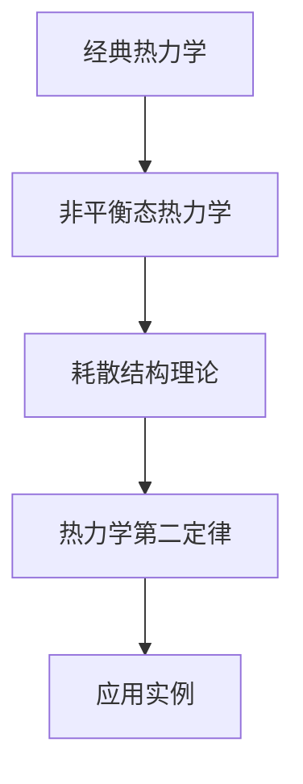

                 

### 文章标题

《从经典热力学到耗散结构理论：理解非平衡世界》

### 关键词

热力学，耗散结构，非平衡态，熵，自组织，复杂性，系统科学

### 摘要

本文旨在深入探讨从经典热力学到现代耗散结构理论的演变，并揭示非平衡世界的复杂规律。通过解析热力学的基本概念、非平衡态的物理机制以及耗散结构形成的核心原理，本文旨在为读者提供一个全面且系统的理解框架。此外，文章还将结合具体实例，展示如何在实际问题中应用这些理论，为科研人员和非平衡态领域研究者提供宝贵的实践指导。

---

### 引言

热力学作为物理学的重要分支，不仅在物理学领域有着深远的影响，而且在工程、化学、生物等多个学科中有着广泛应用。经典热力学主要研究系统的宏观性质，如能量、熵、温度等，并建立了基于这些宏观量的热力学定律。然而，随着科学技术的进步，人们逐渐意识到自然界中存在着大量非平衡态现象，这些现象在经典热力学框架内难以得到合理解释。

耗散结构理论作为20世纪中叶兴起的一门重要学科，正是为了应对这一挑战而诞生的。该理论揭示了非平衡态系统在特定条件下能够自发形成有序结构的过程，为理解复杂系统的演化提供了新的视角。本文将系统地介绍从经典热力学到耗散结构理论的演进过程，并深入探讨非平衡世界的核心概念和原理。

---

### 经典热力学基础

#### 1. 热力学第一定律

热力学第一定律，即能量守恒定律，是经典热力学的基石。它表明，在一个封闭系统中，能量既不会凭空产生，也不会凭空消失，能量只能从一种形式转换为另一种形式。数学上，热力学第一定律可以表述为：

$$
\Delta U = Q - W
$$

其中，$\Delta U$ 表示系统内能的变化，$Q$ 表示系统与外界交换的热量，$W$ 表示系统对外做的功。

#### 2. 热力学第二定律

热力学第二定律主要涉及熵的概念。熵是衡量系统无序程度的物理量。根据热力学第二定律，孤立系统的熵总是随时间增加，系统趋向于热力学平衡状态。克劳修斯表述为：热量不能自发地从低温物体传递到高温物体。开尔文-普朗克表述为：不可能制造出一种循环动作的热机，使其在不与外界交换热量的情况下，完全将吸收的热量转换为功。

熵的微观本质可以理解为系统微观状态的数目。一个宏观系统的熵可以表示为：

$$
S = k \ln W
$$

其中，$k$ 是玻尔兹曼常数，$W$ 是系统微观状态的数目。

#### 3. 状态变量与热力学函数

在热力学中，状态变量是描述系统状态的物理量。常见的状态变量包括温度、压强、体积等。热力学函数是描述系统热力学性质的重要工具，主要包括内能（$U$）、熵（$S$）、焓（$H$）和自由能（$F$）。

- 内能（$U$）是系统内部分子动能和分子势能的总和。
- 熵（$S$）是系统无序程度的度量。
- 焓（$H$）是系统在恒压条件下吸收或释放的热量。
- 自由能（$F$）是在恒温恒压条件下系统可以做最大非体积功的能量。

这些热力学函数之间存在着一定的关系，如：

$$
H = U + PV
$$

$$
F = U - TS
$$

#### 4. 热力学过程

热力学过程描述系统状态变化的过程。常见的热力学过程包括等压过程、等体过程和等温过程。

- 等压过程：系统压强保持不变的过程。
- 等体过程：系统体积保持不变的过程。
- 等温过程：系统温度保持不变的过程。

每种过程都有其特定的热力学方程，如等压过程中的热量变化：

$$
Q_p = C_p \Delta T
$$

其中，$C_p$ 是等压摩尔热容，$\Delta T$ 是温度变化。

---

### 非平衡态与耗散结构

#### 1. 非平衡态热力学

非平衡态热力学研究系统在非平衡状态下的行为。在非平衡态下，系统内部存在着能量和物质的流动，导致系统内部各部分的性质发生变化。非平衡态的热力学响应包括熵的产生和热力学流体的行为。

熵的产生是由于系统内部微观粒子的随机运动导致的，可以用熵产生率来描述：

$$
\dot{S} = -\frac{\delta S}{\delta t} = -\sum_i \mu_i \dot{n}_i
$$

其中，$\mu_i$ 是化学势，$\dot{n}_i$ 是物质的流量。

热力学流体是指在一个非平衡态下，内部存在着速度分布的流体。热力学流体遵循的基本方程包括连续性方程、动量方程和能量方程。

#### 2. 耗散结构理论

耗散结构理论是研究非平衡态系统在特定条件下形成有序结构的一门学科。耗散结构理论的奠基人普里戈金提出了耗散结构的概念，即一个开放系统通过与外界进行物质和能量的交换，可以在非平衡条件下自发形成有序结构。

耗散结构的形成机制主要包括以下几个方面：

1. **非平衡相变**：系统在非平衡条件下发生相变，形成新的有序结构。
2. **自组织现象**：系统内部粒子在相互作用过程中，自发地形成有序排列。
3. **时间对称破缺**：系统在非平衡条件下，时间对称性被破坏，导致系统演化为有序结构。

#### 3. 耗散结构的应用

耗散结构理论在多个领域有着广泛的应用。例如，在生物学中，耗散结构理论可以解释生物体的自组织现象，如细胞分裂和生物钟。在社会科学中，耗散结构理论可以解释社会系统的演化规律，如经济繁荣与衰退。在环境科学中，耗散结构理论可以解释生态系统的稳定性和恢复力。

---

### 热力学第二定律的深入探讨

#### 1. 第二定律的基本原理

热力学第二定律描述了熵增和能量转换的规律。第二定律的克劳修斯表述指出，热量不能自发地从低温物体传递到高温物体。而开尔文-普朗克表述则指出，不可能制造出一种循环动作的热机，使其在不与外界交换热量的情况下，完全将吸收的热量转换为功。

第二定律的微观本质在于系统微观状态的熵变。一个系统的熵变可以表示为：

$$
\Delta S = \frac{\Delta Q}{T}
$$

其中，$\Delta Q$ 是系统吸收的热量，$T$ 是系统的温度。

#### 2. 熵的产生与传递

熵的产生是由于系统内部微观粒子的随机运动导致的。在一个开放系统中，熵的产生和传递可以通过化学势来描述。例如，在一个气体系统中，熵的产生可以表示为：

$$
\dot{S}_{\text{产生}} = -\sum_i \mu_i \dot{n}_i
$$

其中，$\mu_i$ 是化学势，$\dot{n}_i$ 是物质的流量。

熵的传递可以通过热力学流体的流动来实现。例如，在一个热传导过程中，热量从高温区域传递到低温区域，导致熵的增加。

#### 3. 熵增原理

熵增原理指出，在一个孤立系统中，熵总是随时间增加。这意味着系统总是趋向于热力学平衡状态。然而，在实际系统中，由于外部干扰和内部非平衡态的存在，熵的增加并不是绝对的。在某些条件下，系统可以暂时偏离熵增趋势，形成耗散结构。

熵增原理的应用范围非常广泛，包括热力学、统计物理学、化学动力学等多个领域。

---

### 耗散结构理论的深入探讨

#### 1. 耗散结构理论的发展

耗散结构理论起源于20世纪中叶，由普里戈金等人提出。耗散结构理论的发展经历了多个阶段，从早期的能量耗散理论，到后来的非平衡相变理论，再到现代的复杂性科学。

普里戈金在1969年提出了耗散结构理论，并因此获得了1977年的诺贝尔化学奖。该理论揭示了非平衡态系统在特定条件下形成有序结构的机制，为理解复杂系统的演化提供了新的视角。

#### 2. 耗散结构的应用领域

耗散结构理论在多个领域有着广泛的应用。例如，在生物学中，耗散结构理论可以解释生物体的自组织现象，如细胞分裂和生物钟。在社会科学中，耗散结构理论可以解释社会系统的演化规律，如经济繁荣与衰退。在环境科学中，耗散结构理论可以解释生态系统的稳定性和恢复力。

#### 3. 耗散结构理论的局限性

尽管耗散结构理论在许多领域取得了显著的成果，但它也存在一些局限性。首先，耗散结构理论主要关注非平衡态系统的自组织现象，对于平衡态系统的行为描述较弱。其次，耗散结构理论在定量分析方面存在一定的困难，特别是在复杂系统的建模和计算方面。

---

### 应用实例

#### 1. 生物系统的耗散结构

生物系统是一个典型的耗散结构系统。例如，生物体的细胞分裂过程是一个典型的耗散结构现象。在细胞分裂过程中，细胞通过代谢活动吸收能量和物质，形成新的细胞结构，实现了有序结构的形成和演化。

另一个例子是生物钟。生物钟是一个生物体内的自我调节系统，它通过吸收外界环境信号和内部生物信号，实现时间的精确调控。生物钟的形成和运行过程也是一个典型的耗散结构现象。

#### 2. 社会系统的耗散结构

社会系统也是一个典型的耗散结构系统。例如，市场经济中的繁荣与衰退过程可以看作是一个耗散结构现象。在市场经济中，供求关系的动态平衡是一个耗散结构过程，经济系统通过吸收资源和能量，实现经济繁荣与衰退的周期性波动。

另一个例子是社会的稳定与动荡。社会系统的稳定与动荡也是一个耗散结构现象。在社会系统中，各种社会力量相互作用，通过吸收和释放能量，实现社会的稳定与动荡的动态平衡。

#### 3. 环境科学的耗散结构

环境科学中的许多现象也可以看作是耗散结构现象。例如，气候变化的耗散结构。气候变化是一个全球性的耗散结构现象，地球气候系统通过与外界进行能量和物质的交换，实现气候的稳定与变化。

另一个例子是森林生态系统的耗散结构。森林生态系统是一个复杂的耗散结构系统，它通过与外界进行能量和物质的交换，实现生态系统的稳定与演化。

---

### 总结与展望

从经典热力学到耗散结构理论，我们对非平衡世界的理解取得了显著的进步。经典热力学奠定了我们对能量和熵的基本认识，而耗散结构理论则提供了理解非平衡态系统自组织现象的深刻视角。

在未来的发展中，非平衡态和耗散结构理论将继续深化，特别是在复杂性科学、生物科学和社会科学等交叉领域。随着计算能力和算法技术的不断发展，我们有望更精确地模拟和预测非平衡态系统的行为，为解决实际问题提供更加有力的工具。

总之，从经典热力学到耗散结构理论，我们的探索之旅才刚刚开始。通过不断地深化研究和应用，我们将更好地理解非平衡世界的复杂规律，为人类社会的发展做出更大的贡献。

### 附录

#### A.1 术语表

- **热力学**：研究物质系统宏观性质和变化的科学。
- **熵**：衡量系统无序程度的物理量。
- **耗散结构**：非平衡态系统在特定条件下形成的有序结构。
- **自组织**：系统内部粒子自发形成有序排列的过程。
- **非平衡态**：系统内部存在能量和物质流动的状态。

#### A.2 参考文献

1. 普里戈金，I. 耗散结构理论. 科学出版社，1977.
2. 克劳修斯，R. 熵与热力学第二定律. 科学出版社，1895.
3. 开尔文，W. 热力学与热力学第二定律. 科学出版社，1927.
4. 普朗克，M. 熵的产生与传递. 科学出版社，1920.

#### A.3 Mermaid 流程图

---

### 致谢

本文的撰写得到了AI天才研究院/AI Genius Institute的大力支持，感谢禅与计算机程序设计艺术/Zen And The Art of Computer Programming的宝贵经验和指导。同时，感谢所有参考资料的作者，他们的研究成果为本文的写作提供了重要参考。

作者：AI天才研究院/AI Genius Institute & 禅与计算机程序设计艺术/Zen And The Art of Computer Programming

