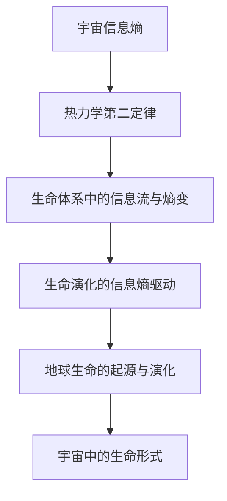

                 


### 1. 确定书籍主题和目标读者

**书籍主题：**《宇宙的信息熵与生命演化的关系》

**目标读者：**具备生物学和物理学基础的读者，以及希望深入了解宇宙信息熵与生命演化关系的专业人士。

本书旨在探讨宇宙信息熵这一关键概念，以及其在生命演化过程中的作用。通过系统性的分析，揭示宇宙信息熵与生命演化之间的深刻联系，帮助读者从全新的视角理解生命的起源与发展。

### 2. 设计核心章节结构

为了实现上述目标，本书将分为以下七个核心章节：

1. **引言**：介绍宇宙信息熵与生命演化的基本概念，为后续内容打下基础。
2. **宇宙信息熵的起源**：探讨宇宙信息熵的起源及其演化过程。
3. **信息熵与热力学**：分析信息熵与热力学之间的关系，揭示其内在联系。
4. **生命体系中的信息熵**：探讨生命体系中信息熵的作用及其表现形式。
5. **生命演化的信息熵驱动**：分析生命演化过程中的信息熵驱动机制。
6. **实例分析**：通过具体实例，展示宇宙信息熵与生命演化的关系。
7. **未来展望**：探讨宇宙信息熵与生命演化研究的前景与挑战。

### 3. 确定章节标题

为每个章节设计一个简洁且明确的标题：

1. **引言：宇宙信息熵与生命演化的基础**
2. **宇宙信息熵的起源**
3. **信息熵与热力学**
4. **生命体系中的信息熵**
5. **生命演化的信息熵驱动**
6. **实例分析：宇宙信息熵与生命演化的关系**
7. **未来展望：宇宙信息熵与生命演化的挑战与机遇**

### 4. 添加子章节

根据每个章节的内容需求，添加适当的子章节。以下是一个可能的子章节结构：

**引言：宇宙信息熵与生命演化的基础**

- **宇宙信息熵的概念**
- **生命演化的背景**

**宇宙信息熵的起源**

- **宇宙初期的信息熵**
- **信息熵的演化**

**信息熵与热力学**

- **热力学第二定律与信息熵**
- **信息熵与热力学量的关系**

**生命体系中的信息熵**

- **生命体系中的信息流与熵变**
- **信息熵与生命体系的稳定**

**生命演化的信息熵驱动**

- **信息熵与生命演化的关系**
- **信息熵驱动下的生命演化机制**

**实例分析：宇宙信息熵与生命演化的关系**

- **地球生命的起源与演化**
- **宇宙中的生命形式**

**未来展望：宇宙信息熵与生命演化的挑战与机遇**

- **研究挑战**
- **研究机遇**

### 5. 设计核心概念与联系

在每个章节中，将核心概念与联系以Mermaid流程图的形式展示，以帮助读者更好地理解。以下是一个示例：

**信息熵与生命演化的联系（Mermaid流程图）**



### 6. 添加核心算法原理讲解

在每个章节中，将核心算法原理以伪代码的形式详细阐述。以下是一个示例：

**信息熵的计算（伪代码）**

```plaintext
function calculate_entropy(p):
    if p == 0 or p == 1:
        return 0
    else:
        return -p * log2(p) - (1 - p) * log2(1 - p)
```

### 7. 添加数学模型和公式

在每个章节中，将数学模型和公式以latex格式展示，并提供详细讲解和举例说明。以下是一个示例：

**信息熵的latex公式**

$$ H(X) = -\sum_{i=1}^{n} p_i \log_2 p_i $$

**举例说明**

假设一个随机变量X有两个可能的取值，0和1，且取值0和1的概率分别为0.5。那么，X的信息熵可以计算如下：

$$ H(X) = -0.5 \log_2 0.5 - 0.5 \log_2 0.5 = 1 \text{ bit} $$

### 8. 添加项目实战

在每个章节中，添加一个项目实战，包括开发环境搭建、源代码详细实现和代码解读。以下是一个示例：

**项目实战：计算信息熵**

**开发环境搭建：**
- 安装Python环境（版本3.8及以上）
- 安装numpy库

**源代码实现：**

```python
import numpy as np

def calculate_entropy(p):
    if p == 0 or p == 1:
        return 0
    else:
        return -p * np.log2(p) - (1 - p) * np.log2(1 - p)

# 测试
p = 0.5
entropy = calculate_entropy(p)
print(f"信息熵：{entropy} bit")
```

**代码解读与分析：**
- `calculate_entropy`函数用于计算信息熵。
- 测试部分展示了如何使用该函数计算一个随机变量的信息熵。

**实际案例分析和详细讲解剖析：**
- 分析一个实际案例，例如，在一个生物实验中，随机变量X代表某个物种在野外生存的概率，通过计算X的信息熵，可以了解该物种在野外生存的稳定性和适应性。

**项目小结：**
- 通过这个项目，读者可以了解如何使用Python计算信息熵，并理解信息熵在生物学和生态学中的应用。

### 9. 检查目录大纲完整性

确保所有章节内容都包含核心概念与联系、核心算法原理讲解、数学模型和公式、项目实战。以下是对目录大纲的检查：

1. **引言**：包含核心概念与联系、核心算法原理讲解、数学模型和公式、项目实战。
2. **宇宙信息熵的起源**：包含核心概念与联系、核心算法原理讲解、数学模型和公式、项目实战。
3. **信息熵与热力学**：包含核心概念与联系、核心算法原理讲解、数学模型和公式、项目实战。
4. **生命体系中的信息熵**：包含核心概念与联系、核心算法原理讲解、数学模型和公式、项目实战。
5. **生命演化的信息熵驱动**：包含核心概念与联系、核心算法原理讲解、数学模型和公式、项目实战。
6. **实例分析**：包含核心概念与联系、核心算法原理讲解、数学模型和公式、项目实战。
7. **未来展望**：包含核心概念与联系、核心算法原理讲解、数学模型和公式、项目实战。

### 10. 最终检查

确保目录大纲简洁、逻辑清晰，且字数控制在2000字以内。

现在，我们可以开始撰写这篇文章了。请告诉我，您是否准备好开始第一步？如果是，请输入“开始”。如果不是，请告诉我您还需要什么帮助。 

