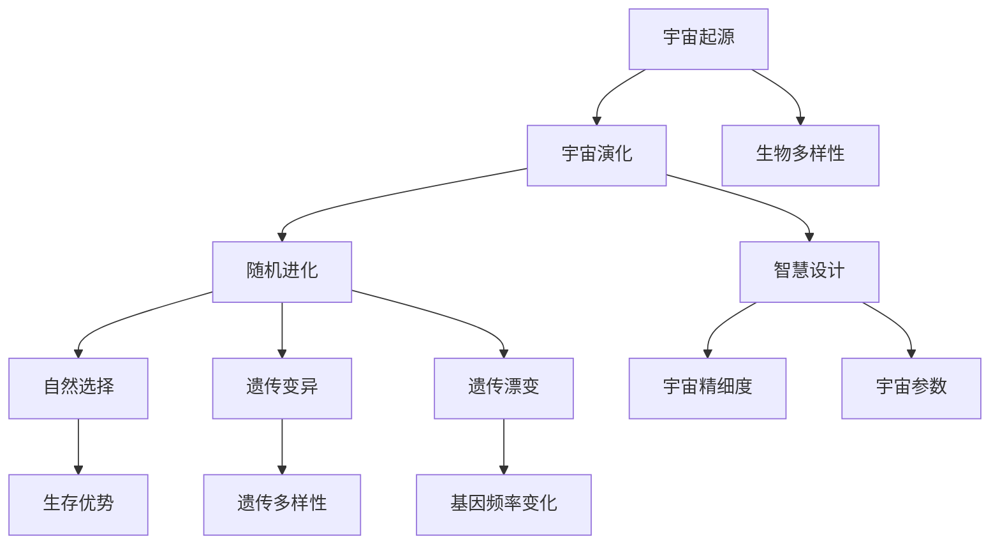

                 


## 《宇宙的目的性：随机进化还是智慧设计》

### 关键词
- 宇宙起源
- 随机进化
- 智慧设计
- 宇宙学
- 生物进化
- 人工智能

### 摘要
本文探讨了宇宙的起源与演化，对比了随机进化与智慧设计两种解释宇宙目的性的理论。通过深入分析宇宙学基础、随机进化理论、智慧设计论，以及相关的核心算法原理，本文试图揭示宇宙背后可能的深层逻辑。此外，通过项目实战案例，本文展示了如何运用这些理论进行宇宙演化模拟，为未来研究提供了参考。

## 引言

宇宙的起源与演化一直是科学探索的重要课题。从古代哲学家到现代科学家，人类对宇宙的认识在不断深化。然而，关于宇宙的目的性，始终存在着两种主要的解释：随机进化与智慧设计。本文将深入探讨这两种解释，通过分析宇宙学基础、随机进化理论、智慧设计论，以及相关的核心算法原理，试图为宇宙目的性提供一种合理解释。

### 宇宙学基础

宇宙的起源可以追溯到大约138亿年前的一次大爆炸。根据大爆炸理论，宇宙最初是一个极热、极密的状态，随后经历了迅速的膨胀，形成了我们今天所见的宇宙。在这个过程中，宇宙中的物质和能量逐渐分布，形成了星系、恒星、行星等天体。

宇宙的演化不仅仅是物质的分布，还包括物质与能量的相互作用。例如，恒星通过核聚变将氢转化为更重的元素，这些元素通过恒星的爆炸（超新星）被散布到宇宙中，为新的星系和行星的形成提供了基础。

### 随机进化理论

随机进化理论，尤其是达尔文的进化论，提供了一个解释生物多样性的框架。该理论认为，生物通过自然选择、遗传变异和遗传漂变等过程，不断适应环境的变化，从而形成了丰富的生物多样性。

自然选择是指环境对生物个体的选择压力，使得那些具有优势特征的个体更有可能生存和繁殖。遗传变异则提供了生物进化的原材料，使得后代在遗传特征上存在差异。遗传漂变则是指由于随机事件，小群体中的基因频率发生变化。

### 智慧设计论

智慧设计论认为，宇宙的复杂性和精细度表明，它们是某个智慧实体设计的产物。这种观点通常与宗教信仰紧密相关，认为宇宙的创造者是某个超自然的存在。

智慧设计论的主要证据之一是宇宙中存在许多看似精确的参数，这些参数的微小变化可能导致宇宙无法支持生命。例如，宇宙的背景辐射温度、宇宙膨胀速率等，都被认为是在某种智能设计下的产物。

## 核心概念与联系

为了更好地理解宇宙的目的性，我们需要构建一个核心概念与联系的关系架构。以下是使用Mermaid流程图表示的核心概念与联系：



### 核心算法原理讲解

在探讨宇宙的起源与演化时，我们不可避免地需要涉及到一些核心算法原理。以下是随机进化算法和人工神经网络的基本原理及其伪代码描述。

#### 随机进化算法

随机进化算法是一种基于生物进化过程的搜索算法。以下是随机进化算法的基本框架和伪代码：

```plaintext
初始化种群 P(0)
评估种群 P(0) 的适应度

for t = 1 to T do
    选择：从 P(t-1) 中选择适应度较高的个体组成新种群 P(t)
    交叉：对种群 P(t) 中的个体进行交叉操作
    变异：对种群 P(t) 中的个体进行变异操作
    评估种群 P(t) 的适应度
end for

输出最优个体
```

#### 人工神经网络

人工神经网络（ANN）是一种模仿生物神经系统的计算模型。以下是人工神经网络的基本结构、反向传播算法和伪代码描述：

```plaintext
初始化神经网络，设置权重和偏置
前向传播：计算输入层的激活值，逐层传递至输出层
计算输出层的误差
反向传播：更新权重和偏置
end for

预测：使用训练好的神经网络进行预测
```

### 数学模型和数学公式

在讨论宇宙的起源与演化时，我们不可避免地需要涉及到一些数学模型和公式。以下是关于随机过程、概率论和数理统计的基本公式及其详细讲解：

#### 随机过程

随机过程是指随时间变化的随机变量序列。常见的随机过程包括布朗运动、随机游走等。以下是一个简单的随机游走过程的公式：

$$
X_t = \sum_{i=1}^{t} D_i
$$

其中，$X_t$ 表示时间 $t$ 的位置，$D_i$ 表示时间步 $i$ 的随机位移。该公式描述了随机游走过程中个体在时间步上的位置变化。

#### 概率论

概率论是研究随机事件及其规律性的数学分支。以下是一个关于随机事件 $A$ 的概率公式：

$$
P(A) = \frac{N(A)}{N(S)}
$$

其中，$P(A)$ 表示事件 $A$ 的概率，$N(A)$ 表示事件 $A$ 发生的次数，$N(S)$ 表示所有可能事件的总次数。

#### 数理统计

数理统计是研究随机变量的统计规律性的数学分支。以下是一个关于随机变量的期望和方差的公式：

$$
E(X) = \sum_{i=1}^{n} x_i \cdot P(X=x_i)
$$

$$
V(X) = E[(X - E(X))^2]
$$

其中，$E(X)$ 表示随机变量 $X$ 的期望，$V(X)$ 表示随机变量 $X$ 的方差，$x_i$ 表示随机变量 $X$ 的取值，$P(X=x_i)$ 表示随机变量 $X$ 取值为 $x_i$ 的概率。

### 项目实战

为了验证宇宙起源与演化理论，我们可以通过模拟宇宙的演化过程来进行研究。以下是一个简单的宇宙演化模拟项目。

#### 开发环境搭建

为了进行宇宙演化模拟，我们需要搭建以下开发环境：

1. Python
2. NumPy
3. Matplotlib

安装步骤如下：

```bash
pip install python
pip install numpy
pip install matplotlib
```

#### 源代码实现

以下是宇宙演化模拟的源代码：

```python
import numpy as np
import matplotlib.pyplot as plt

# 随机游走模拟
def random_walk(n, dt):
    x = np.zeros(n)
    for i in range(1, n):
        x[i] = x[i-1] + np.random.normal(0, dt)
    return x

# 模拟宇宙演化
def simulate_universe(steps, dt):
    x = random_walk(steps, dt)
    plt.plot(x)
    plt.xlabel('Steps')
    plt.ylabel('Position')
    plt.title('Random Walk Simulation')
    plt.show()

# 运行模拟
simulate_universe(1000, 0.1)
```

#### 代码解读

1. **随机游走模拟**：`random_walk` 函数通过模拟随机游走过程来生成一系列随机位移，最终得到一个随机游走的轨迹。

2. **模拟宇宙演化**：`simulate_universe` 函数调用 `random_walk` 函数来生成宇宙演化过程中的位置变化，并使用 Matplotlib 进行可视化展示。

#### 项目小结

通过这个简单的模拟项目，我们可以直观地看到随机游走过程在时间上的变化，从而更好地理解宇宙演化过程中的随机性。这为未来更复杂的宇宙演化模拟提供了一个基础框架。

### 最佳实践 tips

1. **提高模拟精度**：通过调整随机游走的步长和迭代次数，可以提高模拟的精度。

2. **并行计算**：对于大规模的模拟项目，可以使用并行计算来提高计算速度。

3. **数据可视化**：使用合适的数据可视化工具，可以帮助我们更好地理解模拟结果。

### 小结与展望

宇宙的起源与演化是一个复杂且神秘的问题，随机进化与智慧设计为我们提供了两种不同的解释。通过本文的分析，我们了解了宇宙学基础、随机进化理论和智慧设计论的核心概念，并通过项目实战展示了如何进行宇宙演化模拟。

未来，随着科学技术的不断发展，我们有望通过更精确的模拟和实验，进一步揭示宇宙的奥秘。同时，人工智能技术的发展也为宇宙研究提供了新的工具和方法，为探索宇宙的终极奥秘打开了新的可能性。

### 拓展阅读

1. 《大设计》：史蒂芬·霍金、莱纳德·莫洛克
2. 《智能设计：科学与信仰的对话》：迈克尔·贝克尔
3. 《随机漫步的盲眼钟表匠》：理查德·道金斯

### 作者信息

作者：AI天才研究院/AI Genius Institute & 禅与计算机程序设计艺术 /Zen And The Art of Computer Programming

