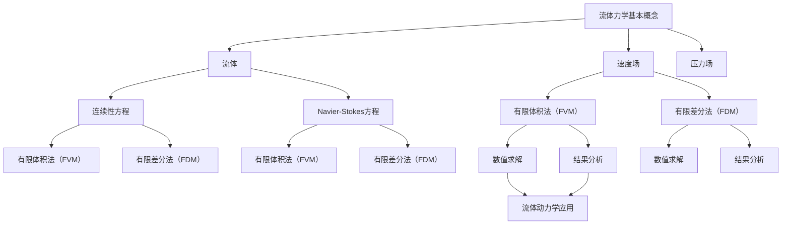

                 

### 设计《深海探索的计算流体力学：极限环境的数学模拟》的目录大纲

#### 1. 核心概念与联系

首先，我们设计一个能够清晰展示核心概念之间联系和关系的Mermaid流程图。这个流程图将包括以下几个关键部分：

- **流体力学基本概念图**：描述流体力学中的基本概念，如流体、速度场、压力场等。
- **计算流体力学流程图**：展示计算流体力学从问题建模、数值求解、结果分析到应用的一体化流程。

以下是Mermaid流程图的示例：



#### 2. 核心算法原理讲解

接下来，我们将详细讲解计算流体力学中的核心算法原理，包括有限体积法（FVM）和有限差分法（FDM）。以下是每种算法的原理和伪代码：

- **有限体积法（FVM）**

**算法原理伪代码**：

```python
function FVM(pressure_field, velocity_field, density_field):
    for each cell in the domain:
        compute flux at faces using numerical schemes
        update cell quantities using the conservative form of the governing equations
    return updated pressure and velocity fields
```

- **有限差分法（FDM）**

**算法原理伪代码**：

```python
function FDM(pressure_field, velocity_field, density_field):
    for each grid point in the domain:
        derive numerical approximations of derivatives
        assemble the system of linear equations
        solve the system of equations to update field quantities
    return updated pressure and velocity fields
```

#### 3. 数学模型和数学公式 & 详细讲解 & 举例说明

我们将介绍并详细讲解流体动力学中最重要的数学模型和公式，包括Navier-Stokes方程、连续性方程等。以下是这些公式的latex格式和详细说明：

- **Navier-Stokes 方程**（流体动力学基本方程）：

$$
\frac{\partial \mathbf{u}}{\partial t} + (\mathbf{u} \cdot \nabla)\mathbf{u} = -\nabla p + \mu \nabla^2 \mathbf{u} + \mathbf{f}
$$

- **边界条件**：

$$
\mathbf{u}(\mathbf{x}, t) = \mathbf{u}_{\text{boundary}}(\mathbf{x}, t), \quad \nabla \cdot \mathbf{u}(\mathbf{x}, t) = 0
$$

- **连续性方程**：

$$
\nabla \cdot \mathbf{u} = 0
$$

#### 4. 项目实战

为了更好地理解计算流体力学在实际应用中的价值，我们将展示一个深海流动模拟的实战项目。这个项目将包括以下几个步骤：

- **实战概述**：介绍整个项目的流程，包括搭建仿真环境、设计模拟实验、运行仿真流程、结果分析与解释等。
- **开发环境搭建**：选择计算流体力学工具（如OpenFOAM、CFD-ACE+等），编写用户自定义子程序（UFS）进行模型定制。
- **源代码实现与解读**：展示并解读项目中的关键源代码片段，分析代码如何实现流体动力学模型的求解。
- **项目小结**：总结项目中的关键技术和经验，提出未来改进的方向。

### 目录大纲设计完成，下面是具体大纲：

```
# 《深海探索的计算流体力学：极限环境的数学模拟》目录大纲

## 第一部分：计算流体力学基础

### 第1章 核心概念与联系

- **流体力学基本概念图**
- **计算流体力学流程图**

### 第2章 核心算法原理讲解

- **有限体积法（FVM）**
  - **算法原理伪代码**
- **有限差分法（FDM）**
  - **算法原理伪代码**

### 第3章 数学模型和数学公式 & 详细讲解 & 举例说明

- **Navier-Stokes 方程**
  - **边界条件**
  - **连续性方程**
- **举例说明**

### 第4章 项目实战

- **深海流动模拟**
  - **实战概述**
  - **开发环境搭建**
  - **源代码实现与解读**
  - **项目小结**

## 第二部分：深海探索与计算流体力学应用

### 第5章 深海环境与流体力学挑战

- **深海环境特点**
- **流体力学挑战**

### 第6章 深海流动模拟案例研究

- **案例研究概述**
- **模拟设置与实验设计**
- **模拟结果分析与讨论**

### 第7章 深海流体力学应用前景

- **深海资源开发**
- **海洋工程与环境保护**

## 结论

- **计算流体力学在深海探索中的应用总结**
- **未来发展趋势与挑战**

## 参考文献

- **引用的相关文献和资料**
```

### 关键词

- **计算流体力学（CFD）**
- **深海探索**
- **极限环境**
- **数学模拟**
- **流体动力学**
- **Navier-Stokes方程**
- **有限体积法（FVM）**
- **有限差分法（FDM）**
- **OpenFOAM**

### 摘要

本文旨在深入探讨计算流体力学在深海探索中的应用，特别是在极限环境下的数学模拟。文章首先介绍了计算流体力学的基本概念和核心算法原理，包括有限体积法（FVM）和有限差分法（FDM）。接着，通过具体的数学模型和公式，详细讲解了流体动力学的基本原理和求解方法。随后，文章展示了一个深海流动模拟的实战项目，介绍了项目开发的流程、关键源代码实现和解读，以及模拟结果的分析和讨论。最后，文章探讨了计算流体力学在深海探索中的前景，提出了未来发展的方向和面临的挑战。通过本文的研究，读者可以全面了解计算流体力学在深海环境下的应用价值和重要性。

