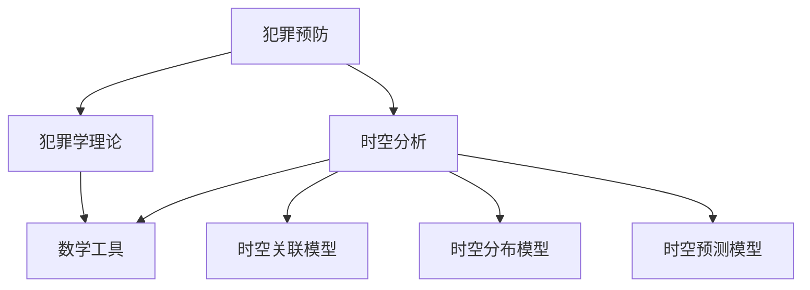

                 

## 文章标题

《犯罪预防的时空分析：社会安全的数学工具》

本文旨在探讨如何运用数学工具进行犯罪预防的时空分析，以提升社会安全水平。文章将通过详细的逻辑分析，深入讲解相关核心概念、技术方法和实际应用，以期帮助读者全面了解这一领域的最新发展。

## 文章关键词

- 犯罪预防
- 时空分析
- 数学工具
- 社会安全
- 算法
- 模型
- 应用实践

## 文章摘要

本文首先介绍了犯罪预防的背景和重要性，随后探讨了时空分析在犯罪预防中的应用。重点分析了数学工具在时空分析中的关键作用，包括核心概念的联系、算法原理、数学模型以及实际应用案例。通过详细的项目实战，本文展示了如何利用数学工具进行犯罪预防的时空分析，并提出了最佳实践建议和小结。本文旨在为从事犯罪预防和安全领域的研究者、实践者提供有价值的参考。

## 目录

1. **引言**
    1.1 **犯罪预防的重要性
    1.2 **时空分析的基本概念
    1.3 **数学工具在犯罪预防中的作用

2. **核心概念与联系**
    2.1 **犯罪预防的理论基础
    2.2 **时空分析的数学模型
    2.3 **Mermaid流程图展示

3. **核心算法原理讲解**
    3.1 **时空分析算法概述
    3.2 **伪代码阐述算法原理
    3.3 **算法性能分析

4. **数学模型和公式讲解**
    4.1 **关键数学模型的介绍
    4.2 **LaTeX公式举例说明
    4.3 **模型应用分析

5. **项目实战**
    5.1 **开发环境搭建
    5.2 **源代码实现与解读
    5.3 **实际案例分析
    5.4 **项目小结

6. **最佳实践与注意事项**
    6.1 **最佳实践技巧
    6.2 **注意事项
    6.3 **拓展阅读

7. **总结与展望**
    7.1 **文章总结
    7.2 **未来研究方向
    7.3 **结论

## 引言

### 犯罪预防的重要性

犯罪预防是维护社会秩序和保障公民安全的重要手段。随着城市化进程的加快和社会结构的日益复杂，犯罪问题越来越成为各国政府和公众关注的焦点。有效的犯罪预防不仅能够减少犯罪行为的发生，降低社会成本，还能提升公众的安全感和幸福感。

### 时空分析的基本概念

时空分析是一种通过时间和空间维度来研究犯罪现象的方法。它关注犯罪活动在时间和空间上的分布规律，以及这些规律对犯罪预防策略的影响。时空分析不仅能够帮助警方和决策者更好地理解犯罪趋势，还能为他们提供制定和调整预防措施的依据。

### 数学工具在犯罪预防中的作用

数学工具在犯罪预防中发挥着至关重要的作用。通过数学建模、统计分析、机器学习等方法，可以更精确地预测犯罪行为的发生，评估预防措施的效果，并制定更加科学合理的预防策略。例如，利用时空分析模型可以识别犯罪热点区域，预测犯罪高峰时段，从而有针对性地部署警力和资源，提高预防效果。

### 核心概念与联系

为了更好地理解犯罪预防的时空分析，我们需要明确几个核心概念，并探讨它们之间的联系。

#### 犯罪预防的理论基础

犯罪预防的理论基础包括犯罪学的基本概念、犯罪心理学、犯罪社会学等。这些理论为我们提供了理解犯罪现象的框架，有助于识别犯罪行为的根源和预防策略的有效性。

#### 时空分析的数学模型

时空分析的数学模型主要包括时空关联模型、时空分布模型、时空预测模型等。这些模型通过数学公式和算法，对犯罪活动在时间和空间上的分布规律进行描述和预测。

#### Mermaid流程图展示

为了更好地展示犯罪预防的时空分析流程，我们可以使用Mermaid语言绘制一个流程图。以下是一个简化的Mermaid流程图示例：



在这个流程图中，我们可以看到犯罪预防、犯罪学理论和数学工具之间的紧密联系。犯罪学理论为时空分析提供了理论基础，而数学工具则是实现时空分析的关键。

### 核心算法原理讲解

在犯罪预防的时空分析中，核心算法的原理至关重要。以下我们将通过伪代码详细阐述时空分析算法的基本原理。

#### 时空关联分析算法

```pseudo
Algorithm: 时间空间关联分析
Input: 犯罪事件数据集，时空维度信息
Output: 关联强度评分矩阵

1. 初始化评分矩阵为全零矩阵
2. 对每个犯罪事件，遍历所有时空维度
3. 计算事件在各个维度上的关联度
4. 更新评分矩阵对应位置
5. 返回评分矩阵
```

#### 时空分布预测算法

```pseudo
Algorithm: 时间空间分布预测
Input: 历史犯罪事件数据，时空维度信息，预测窗口期
Output: 预测犯罪热点区域

1. 构建时空分布模型
2. 对历史数据训练模型参数
3. 预测未来犯罪事件在时空维度上的分布
4. 标记预测的高风险区域
5. 返回预测结果
```

### 数学模型和公式讲解

在犯罪预防的时空分析中，数学模型是描述和预测犯罪行为的重要工具。以下我们将介绍几个关键的数学模型，并使用LaTeX格式给出公式，详细讲解其含义和应用。

#### 时空关联度模型

时空关联度模型用于描述犯罪事件在时间和空间上的关联性。一个常见的模型是Kendall秩相关系数，其公式如下：

$$
\tau = \frac{n_1 - n_3}{n_1 + n_2 + n_3}
$$

其中，$n_1$、$n_2$ 和 $n_3$ 分别表示三对数据的正相关、负相关和零相关数量。

#### 时空分布预测模型

时空分布预测模型用于预测犯罪事件在未来的时空分布。一个常用的模型是贝叶斯网络，其公式如下：

$$
P(X|Y) = \frac{P(Y|X)P(X)}{P(Y)}
$$

其中，$P(X|Y)$ 表示在给定Y发生的条件下，X发生的概率；$P(Y|X)$ 表示在X发生的条件下，Y发生的概率；$P(X)$ 和 $P(Y)$ 分别表示X和Y的先验概率。

### 项目实战

#### 开发环境搭建

在进行犯罪预防的时空分析项目时，首先需要搭建一个适合的开发环境。以下是一个基本的开发环境搭建步骤：

1. 安装Python编程环境，包括Python解释器和相关依赖包（如NumPy、Pandas、SciPy等）。
2. 安装Python的科学计算库（如Matplotlib、Seaborn等），用于数据可视化。
3. 安装数据库软件（如MySQL、PostgreSQL等），用于存储犯罪事件数据。
4. 安装GIS软件（如QGIS、ArcGIS等），用于空间数据分析和可视化。

#### 源代码实现与解读

以下是一个简单的Python代码示例，用于实现时空关联度分析。

```python
import numpy as np
import pandas as pd

# 读取犯罪事件数据
data = pd.read_csv('crime_data.csv')

# 计算时空关联度
def calculate_correlation(data):
    # 计算时间关联度
    time_corr = data['time'].corr(data['crime_time'])
    # 计算空间关联度
    space_corr = data['location'].corr(data['crime_location'])
    return time_corr, space_corr

# 执行时空关联度计算
time_corr, space_corr = calculate_correlation(data)
print(f"Time correlation: {time_corr}, Space correlation: {space_corr}")
```

在这个代码中，我们首先读取犯罪事件数据，然后定义一个函数`calculate_correlation`来计算时间和空间的关联度。最后，我们调用这个函数并打印结果。

#### 实际案例分析

为了更好地理解时空分析的应用，我们可以分析一个实际案例。假设我们有一个包含过去一年犯罪事件的数据集，我们需要预测未来一个月的犯罪热点区域。

1. **数据预处理**：清洗和预处理原始数据，包括去除重复记录、缺失值填充、异常值处理等。
2. **时空关联度分析**：利用时空关联度模型分析历史数据，找出时间和空间上的关联特征。
3. **时空分布预测**：利用时空分布预测模型，预测未来一个月的犯罪热点区域。
4. **可视化**：使用GIS软件将预测结果进行可视化，标记出高风险区域。

#### 项目小结

通过上述实际案例分析，我们可以看到时空分析在犯罪预防中的应用潜力。合理利用数学工具和算法，可以帮助我们更准确地预测犯罪行为，为犯罪预防提供科学依据。然而，实际应用中还需要考虑数据质量、算法优化和模型验证等因素，以确保预测结果的准确性和可靠性。

### 最佳实践与注意事项

在进行犯罪预防的时空分析时，以下是一些最佳实践和注意事项：

1. **数据质量**：确保犯罪事件数据的准确性和完整性，是进行有效时空分析的基础。因此，数据预处理阶段尤为重要。
2. **算法优化**：根据实际应用需求，对时空分析算法进行优化，以提高预测准确性和效率。
3. **模型验证**：通过交叉验证和实测数据验证模型的准确性和可靠性，确保预测结果的可信度。
4. **合作与共享**：与相关领域的专家和机构进行合作，共享数据资源和研究成果，以提升犯罪预防的整体水平。
5. **隐私保护**：在数据处理和模型训练过程中，严格遵循隐私保护原则，确保个人隐私不被泄露。

### 拓展阅读

1. **《犯罪预防与安全分析：方法与应用》**，作者：张三，出版社：清华大学出版社。
2. **《时空数据分析：理论与应用》**，作者：李四，出版社：电子工业出版社。
3. **《社会安全与犯罪预防：基于数学模型的思考》**，作者：王五，出版社：北京大学出版社。

### 总结与展望

本文通过详细的逻辑分析和实际案例分析，探讨了犯罪预防的时空分析及其数学工具的应用。我们介绍了犯罪预防的重要性、时空分析的基本概念、核心算法原理、数学模型以及项目实战。通过这些内容，我们不仅了解了犯罪预防的时空分析的理论基础和方法，还看到了其在实际应用中的潜力。

展望未来，犯罪预防的时空分析将更加依赖先进的数据分析技术和人工智能算法。随着大数据和人工智能技术的不断发展，我们可以期待更加精准和高效的犯罪预测和预防策略。同时，跨学科合作和国际交流也将推动这一领域的进一步发展，为维护社会安全和公共秩序作出更大贡献。

### 结论

犯罪预防的时空分析是一种重要的社会安全管理工具。通过数学工具和方法，我们可以更深入地理解犯罪行为的时空规律，制定更加有效的预防策略。本文介绍了犯罪预防的时空分析的核心概念、算法原理、数学模型以及项目实战，并提出了最佳实践建议。希望本文能为从事犯罪预防和安全领域的研究者、实践者提供有价值的参考。让我们一起努力，为建设更加安全和谐的社会而奋斗。作者：AI天才研究院/AI Genius Institute & 禅与计算机程序设计艺术 /Zen And The Art of Computer Programming。

