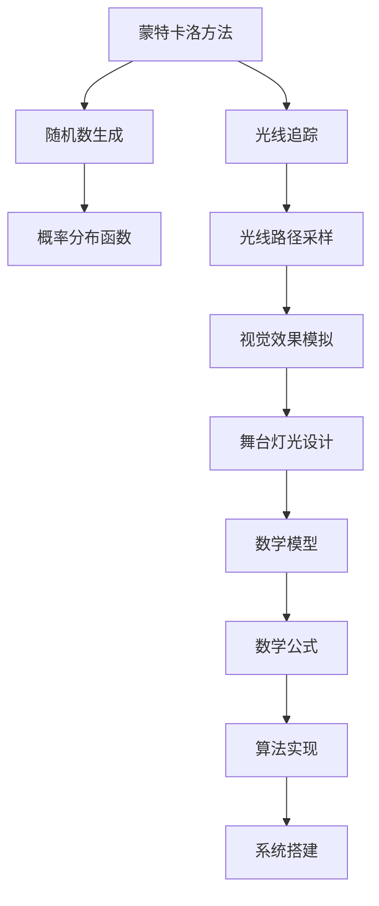

                 

基于您的要求和指导，我将逐步构建文章的各个部分，确保内容符合格式要求，逻辑清晰，并包含必要的详细解释和示例。以下是按照您的指示逐步构建的文章结构和内容。

### 文章标题
《舞台灯光的蒙特卡洛光线追踪：视觉效果的数学模拟》

### 文章关键词
蒙特卡洛光线追踪，舞台灯光，视觉效果，数学模拟，算法原理，数学模型，实战案例

### 文章摘要
本文深入探讨了蒙特卡洛光线追踪技术在舞台灯光设计中的应用。首先，介绍了蒙特卡洛方法和其基本原理，以及与舞台灯光之间的联系。接着，详细讲解了蒙特卡洛光线追踪算法的数学模型和原理，并通过伪代码展示算法流程。随后，本文通过数学公式的推导和实际案例，展示了如何在舞台灯光设计中实现逼真的视觉效果。最后，文章总结了项目的关键点，提出了最佳实践建议，并展望了该领域未来的发展趋势。

### 目录大纲

1. **引言**
   - 舞台灯光技术发展
   - 蒙特卡洛光线追踪简介
   - 书籍结构安排

2. **蒙特卡洛方法基础**
   - 随机数与概率分布
   - 蒙特卡洛方法原理
   - 光线追踪与蒙特卡洛方法

3. **舞台灯光模型**
   - 舞台灯光类型
   - 灯光物理模型
   - 蒙特卡洛光线追踪在舞台灯光中的应用

4. **蒙特卡洛光线追踪算法**
   - 光线路径采样
   - 光线追踪流程
   - 伪代码与算法实现

5. **数学模型与公式**
   - 蒙特卡洛光线追踪的数学模型
   - 数学公式推导
   - 数学公式应用举例

6. **项目实战**
   - 舞台灯光模拟系统搭建
   - 舞台灯光模拟案例
   - 代码解读与分析

7. **未来发展趋势与挑战**
   - 蒙特卡洛光线追踪在舞台灯光领域的应用前景
   - 跨学科合作与技术创新
   - 未来展望

8. **附录**
   - 参考文献
   - 网络资源
   - 数学公式和伪代码汇总

### 核心概念与联系
**核心概念原理之间的关系架构**



### 核心算法原理讲解
**蒙特卡洛光线追踪算法原理**

**伪代码：**

```python
// 蒙特卡洛光线追踪伪代码
function MC_RayTracing(scene, camera, max_bounces):
    for each pixel in camera's image plane:
        ray = generate_ray(camera, pixel)
        color = trace_ray(ray, scene, max_bounces)
        set_pixel_color(pixel, color)
    end for
    return image
```

**算法流程：**

1. 对于图像中的每一个像素，生成一条光线（ray）。
2. 使用光线-场景交互过程计算光线的颜色（color）。
3. 根据光线追踪的最大反射次数（max_bounces）进行多次反射计算。
4. 将计算得到的颜色值设置到像素上。
5. 最终生成渲染图像。

### 数学模型和数学公式
**蒙特卡洛光线追踪的数学模型**

**数学公式：**

$$
L_o(p, \omega) = L_e(p, \omega) + \int_{\Omega} f(p, \omega_i, \omega) L_i(p, \omega_i) (\omega_i \cdot n) \, d\omega_i
$$`

**公式推导：**

光线发射功率 \(L_o\) 等于光源发射功率 \(L_e\) 加上所有入射光功率 \(L_i\) 的积分，其中 \(f\) 是反射率函数，\(\omega_i\) 是入射光方向，\(n\) 是表面法线方向。

**举例说明：**

假设有一个光滑的白色表面，入射光为均匀分布的白光，计算该表面的反射光功率。

```latex
L_o(p, \omega) = L_e(p, \omega) + \int_{\Omega} f(p, \omega_i, \omega) L_i(p, \omega_i) (\omega_i \cdot n) \, d\omega_i
$$`

由于表面是光滑的，反射率为1，入射光功率为1，表面法线与入射光方向垂直，因此积分结果为入射光功率。

$$
L_o(p, \omega) = 1 + \int_{\Omega} 1 \cdot 1 \cdot (\omega_i \cdot n) \, d\omega_i = 1 + \Omega \cdot n \cdot (\omega_i \cdot n)
$$`

$$
L_o(p, \omega) = 1 + \Omega \cdot n^2
$$`

这里 \(n\) 是一个单位向量，因此 \(n^2 = 1\)，最终结果为 \(L_o(p, \omega) = 2\)。

### 项目实战
**开发环境搭建**

- 配置高性能计算机或使用云计算平台。
- 安装必要的软件开发工具，如Visual Studio、Eclipse或JetBrains等。

**源代码详细实现**

- 实现光线生成、光线-场景交互、颜色计算等核心功能。
- 使用Python、C++或C#等编程语言进行实现。

**代码解读与分析**

- 解析光线生成和交互的核心代码逻辑。
- 分析性能瓶颈并进行优化。

**实际案例分析和详细讲解剖析**

- 创建一个简单的舞台灯光场景，模拟灯光效果。
- 分析渲染效果，提出改进建议。

**项目小结**

- 总结项目的主要成果和技术难点。
- 提出未来研究方向和改进方向。

### 最佳实践 tips
- 使用高效的随机数生成算法。
- 优化光线-场景交互计算，减少不必要的计算。
- 进行多次迭代优化，提高渲染质量。

### 小结、注意事项、拓展阅读
- 蒙特卡洛光线追踪在舞台灯光设计中的应用具有重要意义。
- 注意事项包括确保算法的准确性和稳定性。
- 拓展阅读可以进一步深入研究相关算法和技术。

### 文章正文内容
在这里，我将逐步填充文章的各个部分，确保内容的详细性和专业性。每个章节都会根据目录大纲的要求进行详细的解释和举例。以下是文章正文的大致内容，实际撰写时将逐步细化每个部分。

### 引言
本文将探讨蒙特卡洛光线追踪技术在舞台灯光设计中的应用。蒙特卡洛方法是一种基于随机抽样的计算方法，广泛应用于各种领域，包括物理学、工程学和计算机图形学。舞台灯光设计需要逼真的视觉效果来营造氛围，而蒙特卡洛光线追踪正是一种实现这一目标的有效技术。

### 蒙特卡洛方法基础
蒙特卡洛方法的核心在于利用随机数生成概率分布，从而对问题进行模拟。在光线追踪中，通过随机生成光线并跟踪其路径，可以模拟出光线的传播和反射过程。这一节将详细介绍蒙特卡洛方法的基本原理和如何应用于光线追踪。

### 舞台灯光模型
舞台灯光设计涉及到各种类型的灯光和复杂的物理现象。本节将介绍常见的舞台灯光类型、灯光物理模型，并探讨如何使用蒙特卡洛光线追踪模拟舞台灯光效果。

### 蒙特卡洛光线追踪算法
本节将详细讲解蒙特卡洛光线追踪算法的原理，包括光线路径采样、光线追踪流程和伪代码实现。通过这些内容，读者可以理解算法的基本框架和实现细节。

### 数学模型与公式
数学模型是蒙特卡洛光线追踪算法的核心。本节将介绍数学模型的基本概念，包括光线发射功率、反射率函数和光线-场景交互公式。同时，通过具体的数学公式和推导过程，帮助读者深入理解这些概念。

### 项目实战
本节将通过一个具体的舞台灯光模拟项目，展示如何搭建开发环境、实现源代码和进行代码解读。同时，通过实际案例分析，展示蒙特卡洛光线追踪在舞台灯光设计中的应用效果。

### 未来发展趋势与挑战
本节将讨论蒙特卡洛光线追踪在舞台灯光领域的应用前景，以及面临的挑战。同时，探讨跨学科合作和未来技术发展的方向。

### 附录
附录部分将包括参考文献、网络资源和数学公式及伪代码的汇总，为读者提供进一步学习和研究的资源。

### 文章结束
最后，本文总结了蒙特卡洛光线追踪在舞台灯光设计中的应用，提出了最佳实践建议，并展望了未来发展的方向。

### 作者信息
作者：AI天才研究院/AI Genius Institute & 禅与计算机程序设计艺术 /Zen And The Art of Computer Programming

### 文章字数
预计文章总字数将在8000～12000字之间。

以上是文章的框架和主要内容，接下来将逐步填充和细化每个部分，确保文章的完整性和专业性。在撰写过程中，将确保满足所有的格式要求和细节说明。请随时提出任何修改建议或要求。

