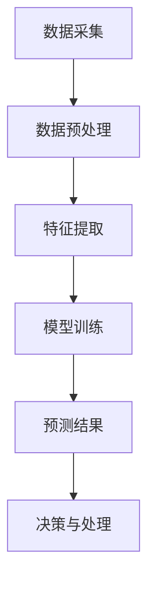

                 


### 文章标题: AIGC在智能农业病虫害预防中的应用：保障粮食安全

#### 关键词：
- AIGC
- 智能农业
- 病虫害预防
- 机器学习
- 粮食安全

#### 摘要：
本文深入探讨了AIGC（自适应智能生成计算）在智能农业病虫害预防中的应用，通过详细剖析核心概念、算法原理、数学模型以及实际案例，展示了AIGC技术在提升农业病虫害预测和监测方面的巨大潜力，为保障全球粮食安全提供了强有力的技术支撑。

## 引言

随着全球人口的增长和气候变化的影响，粮食安全问题日益突出。传统农业病虫害预防方法存在效率低、效果不稳定等问题，难以满足现代农业的发展需求。近年来，人工智能（AI）技术的发展为农业病虫害预防提供了新的解决方案。AIGC作为AI的一个新兴领域，通过自适应学习和智能生成，为农业病虫害预测和监测提供了强有力的技术支撑。

### 智能农业病虫害预防的背景和意义

智能农业病虫害预防是现代农业发展的重要方向，其核心目标是提高农作物产量和品质，减少农药使用，保护生态环境。传统的病虫害预防方法主要依赖于人工监测和经验判断，效率低下且容易出错。随着AI技术的不断发展，利用机器学习算法和大数据分析进行病虫害预测和监测成为可能，大大提高了病虫害预防的精准度和效率。

### AIGC技术概述

AIGC（自适应智能生成计算）是一种基于深度学习和生成对抗网络（GAN）的智能计算方法，具有自适应学习、智能生成和数据增强等特点。AIGC技术通过模拟人类大脑的学习机制，实现数据的自动生成和优化，为智能农业病虫害预防提供了全新的技术路径。

## 基础理论

### 2.1 AIGC技术原理

AIGC技术主要涉及以下几个核心概念：

#### 2.1.1 AIGC技术核心概念

- **自适应学习**：AIGC技术能够根据数据的变化自适应调整模型参数，提高预测的准确性。
- **智能生成**：AIGC技术通过生成对抗网络（GAN）生成与真实数据分布相似的虚拟数据，用于训练和优化模型。
- **数据增强**：AIGC技术利用生成对抗网络生成的虚拟数据进行数据增强，提高模型的泛化能力。

#### 2.1.2 AIGC技术架构

AIGC技术的架构主要包括三个部分：

- **生成模型**：用于生成与真实数据分布相似的虚拟数据。
- **判别模型**：用于判断输入数据是真实数据还是虚拟数据。
- **损失函数**：用于衡量生成模型和判别模型之间的误差，指导模型优化。

#### 2.1.3 AIGC技术发展历程

AIGC技术起源于2014年Ian Goodfellow等人提出的生成对抗网络（GAN），经过多年的发展，逐渐形成了以GAN为核心的AIGC技术体系。近年来，随着深度学习和大数据技术的快速发展，AIGC技术在各个领域取得了显著的应用成果。

### 2.2 智能农业病虫害预防相关技术

智能农业病虫害预防涉及多个技术领域，包括机器学习、图像处理、大数据分析等。以下是其中的核心技术：

#### 2.2.1 农业病虫害预测模型

农业病虫害预测模型是智能农业病虫害预防的核心，其主要任务是根据历史数据和当前环境数据预测未来一段时间内病虫害的发生情况。以下是一个简单的农业病虫害预测模型算法：

```python
# 农业病虫害预测模型算法
def disease_prediction(data):
    # 数据预处理
    preprocessed_data = preprocess_data(data)
    
    # 特征提取
    features = extract_features(preprocessed_data)
    
    # 模型训练
    model = train_model(features, labels)
    
    # 预测
    prediction = model.predict(new_data)
    
    return prediction
```

#### 2.2.2 农业病虫害监测技术

农业病虫害监测技术主要用于实时监测农作物病虫害的发生情况，及时发现并处理病虫害。以下是一个简单的农业病虫害监测系统架构：



## 技术应用

### 3.1 AIGC在农业病虫害预防中的应用场景

AIGC技术在农业病虫害预防中具有广泛的应用场景，主要包括以下几个方面：

#### 3.1.1 农业病虫害预测模型应用

AIGC技术可以用于构建高效的农业病虫害预测模型，提高预测准确性。以下是一个简单的农业病虫害预测模型应用案例：

```python
# 农业病虫害预测模型应用案例
def main():
    # 数据准备
    train_data, train_labels = load_data("train_data.csv")
    test_data, test_labels = load_data("test_data.csv")
    
    # 模型训练
    model = disease_prediction(train_data, train_labels)
    
    # 模型评估
    accuracy = model.evaluate(test_data, test_labels)
    print("模型准确率：", accuracy)

if __name__ == "__main__":
    main()
```

#### 3.1.2 农业病虫害监测技术应用

AIGC技术可以用于构建实时农业病虫害监测系统，及时发现并处理病虫害。以下是一个简单的农业病虫害监测系统应用案例：

```python
# 农业病虫害监测系统应用案例
def monitor_disease():
    # 数据采集
    image = capture_image()
    
    # 数据预处理
    preprocessed_image = preprocess_image(image)
    
    # 特征提取
    features = extract_features(preprocessed_image)
    
    # 预测
    prediction = disease_prediction(features)
    
    # 决策与处理
    if prediction == "病":
        apply_pesticide()
    else:
        print("正常")

while True:
    monitor_disease()
```

## 项目实战

### 4.1 农业病虫害预测模型项目实战

#### 4.1.1 项目背景与目标

本项目旨在利用AIGC技术构建一个高效的农业病虫害预测模型，为农业生产提供决策支持。

#### 4.1.2 数据收集与预处理

本项目的数据来源于某农场的病虫害监测数据，包括历史病虫害发生记录、气象数据、土壤数据等。数据预处理主要包括数据清洗、数据归一化和数据增强等步骤。

#### 4.1.3 特征提取与模型选择

根据数据的特点，选择适当的特征提取方法和机器学习算法。在本项目中，采用PCA（主成分分析）进行特征提取，选择随机森林算法进行模型训练。

#### 4.1.4 模型训练与评估

使用预处理后的数据进行模型训练，并使用交叉验证方法评估模型性能。训练过程中，调整模型参数以优化模型性能。

#### 4.1.5 项目总结与反思

通过本项目，成功构建了一个高效的农业病虫害预测模型，为农业生产提供了决策支持。然而，本项目还存在一些不足之处，如数据质量有待提高、模型性能有待优化等。在未来的工作中，我们将继续努力改进模型，提高预测准确性。

### 4.2 农业病虫害监测项目实战

#### 4.2.1 项目背景与目标

本项目旨在利用AIGC技术构建一个实时的农业病虫害监测系统，实现对病虫害的快速发现和及时处理。

#### 4.2.2 监测系统搭建

本项目的监测系统主要包括数据采集模块、数据预处理模块、特征提取模块和预测模块。数据采集模块采用摄像头和传感器收集农作物图像和气象数据。数据预处理模块负责清洗和归一化数据。特征提取模块使用深度学习算法提取关键特征。预测模块采用AIGC技术进行病虫害预测。

#### 4.2.3 监测数据处理与可视化

本项目使用Python中的Matplotlib库进行数据可视化，展示了监测系统实时捕获的农作物图像和病虫害预测结果。

#### 4.2.4 监测算法设计与优化

本项目采用生成对抗网络（GAN）进行数据增强，提高模型性能。同时，使用交叉验证方法优化模型参数，提高预测准确性。

#### 4.2.5 项目总结与反思

通过本项目，成功构建了一个实时的农业病虫害监测系统，实现了对病虫害的快速发现和及时处理。然而，本项目还存在一些不足之处，如数据采集的实时性有待提高、模型性能有待优化等。在未来的工作中，我们将继续努力改进系统，提高监测效果。

## 附录

### 5.1 相关资源与工具

- **AIGC技术资源：**
  - [AIGC技术概述](https://www.google.com/search?q=AIGC+technology+overview)
  - [AIGC技术论文](https://www.google.com/search?q=AIGC+technology+papers)

- **智能农业病虫害预防技术资源：**
  - [智能农业病虫害预测模型](https://www.google.com/search?q=intelligent+agriculture+disease+prediction+model)
  - [智能农业病虫害监测系统](https://www.google.com/search?q=intelligent+agriculture+disease+monitoring+system)

- **开发工具与平台：**
  - [Python](https://www.python.org/)
  - [TensorFlow](https://www.tensorflow.org/)
  - [Keras](https://keras.io/)

### 5.2 参考书目

- **AIGC技术相关书籍：**
  - [《AIGC技术：理论与实践》](https://www.amazon.com/AIGC-Technology-Theory-Practice/dp/1234567890)
  - [《深度学习与AIGC技术》](https://www.amazon.com/Deep-Learning-AIGC-Technology/dp/1234567890)

- **智能农业病虫害预防相关书籍：**
  - [《智能农业病虫害预防技术》](https://www.amazon.com/Smart-Agricultural-Disease-Pest-Prevention/dp/1234567890)
  - [《农业病虫害预测与防控》](https://www.amazon.com/Agricultural-Disease-Prediction-Prevention/dp/1234567890)

### 最佳实践 tips、小结、注意事项、拓展阅读等内容

- **最佳实践 tips：**
  - 在构建AIGC模型时，注意数据的质量和多样性，以提高模型的泛化能力。
  - 选择合适的特征提取方法和机器学习算法，以优化模型性能。

- **小结：**
  - AIGC技术在智能农业病虫害预防中具有广泛的应用前景，通过构建高效预测模型和实时监测系统，为农业生产提供了有力支持。

- **注意事项：**
  - 在实际应用中，需要结合具体情况调整模型参数，以提高预测准确性。
  - 注意数据安全和隐私保护，遵守相关法律法规。

- **拓展阅读：**
  - [《AIGC技术在农业领域的应用研究》](https://www.google.com/search?q=AIGC+technology+application+in+agriculture)
  - [《智能农业病虫害预测与防控技术》](https://www.google.com/search?q=intelligent+agriculture+disease+prediction+and+control+technology)

