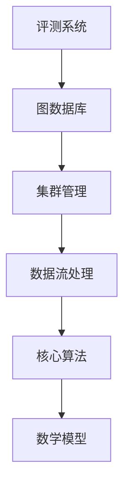

                 

### 文章标题

《评测系统的可扩展性设计》

### 关键词

- 可扩展性设计
- 评测系统
- 数据库架构
- 核心算法
- 数学模型
- 部署与维护
- 安全性与可靠性
- 水平扩展
- 垂直扩展

### 摘要

本文将深入探讨评测系统的可扩展性设计，从核心概念到架构设计，从算法原理到数学模型，再到部署与维护，全面解析评测系统的可扩展性设计策略。文章将结合实际项目案例，提供详细的开发过程讲解，并探讨安全性与可靠性设计，最后总结全文，展望评测系统的未来发展方向。

## 引言

### 1.1 评测系统的意义

评测系统在现代信息社会中扮演着至关重要的角色。它们不仅用于评估用户的行为、质量和性能，还被广泛应用于各种领域，如在线教育、电商平台、社交媒体等。一个高效的评测系统能够提供准确的评估结果，为业务决策提供有力支持。然而，随着数据量和用户量的不断增长，评测系统的性能和可扩展性成为亟待解决的问题。

### 1.2 可扩展性设计的必要性

可扩展性设计是指系统在设计时考虑未来可能出现的负载增长，确保系统能够在需要时轻松扩展，而不会导致性能下降或功能失效。对于评测系统来说，可扩展性设计尤为关键。因为评测系统需要处理大量的数据，并支持实时评估和查询，如果系统不具备良好的扩展性，一旦数据量和用户量达到临界点，系统可能会出现严重的性能瓶颈，导致评估结果不准确或无法及时响应。

## 核心概念与联系

### 2.1 图数据库

图数据库是一种用于存储和查询具有复杂关联关系的图形数据的数据库。在评测系统中，图数据库常用于存储用户之间的社交关系、物品之间的关联关系等。图数据库的优势在于其高效的查询性能和对复杂关系的支持。

#### 2.1.1 数据存储与检索

图数据库的数据存储通常采用邻接矩阵或邻接表的方式。邻接矩阵可以快速找到两个节点之间的边，但存储空间大；邻接表存储空间较小，但查询时间较长。在实际应用中，可以根据具体情况选择合适的存储方式。

#### 2.1.2 数据模型

图数据库的数据模型主要包括点（节点）和边。点表示实体，如用户、物品等；边表示点与点之间的关联关系。图数据库通常提供丰富的操作接口，如添加点、添加边、删除点、删除边等。

### 2.2 集群管理

集群管理是指通过多个服务器协同工作，共同提供服务的系统。在评测系统中，集群管理是实现系统扩展的关键。通过集群管理，可以轻松实现横向扩展和纵向扩展。

#### 2.2.1 节点配置

节点配置包括服务器硬件配置、操作系统、数据库等。在选择硬件时，应考虑性能、稳定性和成本等因素；在操作系统和数据库方面，应根据实际需求进行选择。

#### 2.2.2 集群调度

集群调度是指根据负载情况，动态调整节点的工作负载。常见的调度算法包括负载均衡、故障转移等。通过集群调度，可以确保系统的高可用性和高性能。

### 2.3 数据流处理

数据流处理是一种实时处理大量数据的方法。在评测系统中，数据流处理可用于实时评估用户行为、更新用户评分等。

#### 2.3.1 流处理框架

流处理框架如Apache Kafka、Apache Flink等，提供了高效、可扩展的数据流处理能力。流处理框架通常包括数据采集、数据存储、数据处理、数据输出等环节。

#### 2.3.2 实时数据处理

实时数据处理需要处理大量并发请求，并保证数据的一致性和准确性。常用的技术包括消息队列、分布式缓存等。

### Mermaid流程图

## 评测系统的架构设计

### 3.1 数据库架构

数据库架构是评测系统的核心。一个良好的数据库架构可以提供高效的数据存取和查询能力。

#### 3.1.1 数据存储

数据存储采用分布式数据库架构，将数据分布在多个节点上。这样可以提高系统的扩展性和可靠性。常用的分布式数据库如Hadoop、HBase、Cassandra等。

#### 3.1.2 数据访问

数据访问包括读操作和写操作。读操作通常采用缓存机制，提高数据访问速度。写操作通常采用分布式事务管理，确保数据的一致性。

### 3.2 应用层架构

应用层架构是评测系统的对外接口。一个良好的应用层架构可以提供高效、稳定的服务。

#### 3.2.1 接口设计

接口设计包括RESTful API、GraphQL等。接口设计应考虑易用性、性能和安全性。

#### 3.2.2 服务拆分

服务拆分是将系统拆分为多个独立的服务，每个服务负责不同的功能。这样可以提高系统的可维护性和可扩展性。

## 核心算法原理讲解

### 4.1 评分算法

评分算法是评测系统的核心。一个良好的评分算法可以提供准确的评估结果。

#### 4.1.1 评分模型

评分模型包括用户行为分析、用户属性分析等。评分模型可以根据不同业务场景进行调整。

#### 4.1.2 评分计算

评分计算包括用户行为评分、用户属性评分等。评分计算可以使用机器学习算法，如线性回归、决策树等。

### 4.2 排名算法

排名算法用于对用户、物品等进行排序。

#### 4.2.1 排名策略

排名策略包括基于分数的排名、基于流量的排名等。排名策略可以根据业务需求进行调整。

#### 4.2.2 排名优化

排名优化包括排序算法优化、缓存优化等。排名优化可以提高排名的准确性和响应速度。

## 数学模型和数学公式

### 5.1 概率模型

概率模型用于评估用户行为和用户属性。

#### 5.1.1 贝叶斯公式

贝叶斯公式是一个常用的概率模型，用于计算条件概率。公式如下：

$$P(A|B) = \frac{P(B|A)P(A)}{P(B)}$$

#### 5.1.2 概率分布

概率分布用于描述随机变量的概率分布情况。常用的概率分布有正态分布、泊松分布等。

### 5.2 线性回归模型

线性回归模型用于预测用户行为和用户属性。

#### 5.2.1 回归方程

线性回归方程如下：

$$y = \beta_0 + \beta_1x_1 + \beta_2x_2 + ... + \beta_nx_n$$

#### 5.2.2 参数优化

参数优化包括最小二乘法、梯度下降法等。参数优化可以提高模型的准确性和稳定性。

## 评测系统的部署与维护

### 6.1 硬件选择

硬件选择包括服务器、存储设备等。

#### 6.1.1 服务器选择

服务器选择应考虑性能、稳定性、扩展性等因素。常用的服务器有X86服务器、ARM服务器等。

#### 6.1.2 存储选择

存储选择应考虑性能、容量、可靠性等因素。常用的存储设备有SSD、HDD等。

### 6.2 软件配置

软件配置包括操作系统、数据库等。

#### 6.2.1 操作系统

操作系统选择应考虑性能、稳定性、安全性等因素。常用的操作系统有Linux、Windows等。

#### 6.2.2 软件安装

软件安装包括数据库、中间件、应用等。安装过程中应注意版本兼容性、依赖关系等。

### 6.3 监控与维护

监控与维护是确保评测系统稳定运行的关键。

#### 6.3.1 性能监控

性能监控包括CPU、内存、磁盘、网络等资源的监控。监控工具如Zabbix、Nagios等。

#### 6.3.2 故障恢复

故障恢复包括故障定位、故障排除、故障恢复等。故障恢复策略包括自动恢复、人工干预等。

## 项目实战

### 7.1 环境搭建

#### 7.1.1 开发环境搭建

开发环境搭建包括操作系统安装、数据库安装、开发工具安装等。

#### 7.1.2 源代码实现

源代码实现包括数据库设计、应用开发、接口开发等。

### 7.2 实际案例分析与讲解

#### 7.2.1 数据采集

数据采集包括用户行为数据、用户属性数据等。

#### 7.2.2 代码解读

代码解读包括评分算法实现、排名算法实现等。

#### 7.2.3 应用解读

应用解读包括评测系统在实际业务中的应用，如用户行为分析、用户推荐等。

### 7.3 项目小结

项目小结包括项目收获、项目不足、改进方向等。

## 扩展性设计策略

### 8.1 水平扩展

水平扩展是指通过增加服务器节点来提高系统性能。水平扩展策略包括负载均衡、节点动态调整等。

### 8.2 垂直扩展

垂直扩展是指通过提高单个服务器性能来提高系统性能。垂直扩展策略包括硬件升级、软件优化等。

## 安全性与可靠性

### 9.1 数据加密

数据加密是确保数据安全的重要措施。常用的加密算法有AES、RSA等。

### 9.2 权限控制

权限控制是确保系统安全的重要措施。常用的权限控制策略有角色控制、权限分配等。

### 9.3 故障恢复

故障恢复是确保系统可靠性的重要措施。常用的故障恢复策略有自动恢复、人工干预等。

## 总结与展望

### 10.1 总结

总结全文，回顾评测系统的可扩展性设计策略、核心算法、数学模型、部署与维护等关键内容。

### 10.2 展望

展望评测系统的未来发展方向，如人工智能技术的应用、大数据分析等。讨论评测系统在新兴技术领域的发展潜力。

### 作者

- 作者：AI天才研究院/AI Genius Institute & 禅与计算机程序设计艺术 /Zen And The Art of Computer Programming

