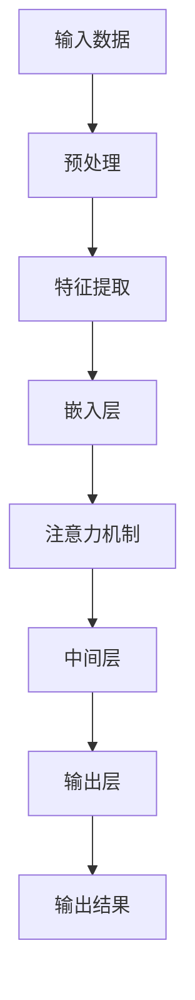
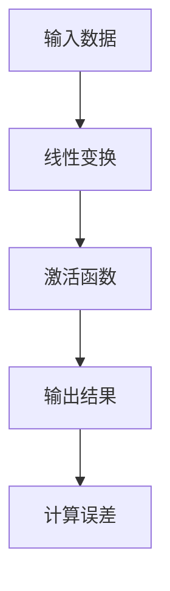

                 


## 文章标题

《AI大模型编程：提示词的力量与潜力》

## 文章关键词

AI大模型、提示词、编程、算法、数学模型、项目实战

## 文章摘要

本文旨在深入探讨AI大模型编程中的关键要素——提示词。我们将从背景介绍开始，逐步分析提示词在AI大模型中的核心概念与联系，通过Mermaid流程图展示大模型架构，使用伪代码讲解核心算法原理，详细解读数学模型和公式。随后，我们将探讨提示词的设计原则和应用，介绍AI大模型编程环境搭建，展示具体编程实战案例，并进行实际案例分析。最后，本文将总结提示词在AI大模型编程中的潜力，以及未来可能面临的挑战和最佳实践。

## 第一部分：AI大模型基础理论

### 1.1 AI大模型概述

AI大模型，通常指的是具有巨大参数规模、能够处理复杂数据的大型神经网络模型。这些模型能够通过大量数据进行学习，从而在图像识别、自然语言处理、机器翻译等领域实现卓越的性能。例如，Transformer模型通过自我注意力机制在多个维度上捕捉信息，成为自然语言处理领域的重要突破。

### 1.2 提示词的概念与作用

提示词（Prompt）是AI大模型中用于引导模型输出特定信息的重要工具。通过向模型输入特定的提示词，我们可以让模型生成相关的内容、预测结果或执行特定的任务。例如，在问答系统中，提示词可以是一个问题，模型需要根据这个问题生成相应的答案。

### 1.3 AI大模型的发展历程

AI大模型的发展可以追溯到20世纪80年代的神经网络研究。随着计算能力的提升和数据量的爆炸增长，深度学习技术在21世纪初逐渐成熟，大模型的概念应运而生。近年来，诸如GPT、BERT等大模型的问世，标志着AI大模型技术已经进入了一个全新的阶段。

## 2. AI大模型核心概念与联系

### 2.1 AI大模型原理

为了更好地理解AI大模型的工作原理，我们可以借助Mermaid流程图来展示其核心架构。以下是一个简化的Mermaid流程图：



在这个流程图中，输入数据经过预处理，然后通过特征提取和嵌入层，进入注意力机制进行处理。注意力机制允许模型在处理数据时自动关注重要信息。接下来，通过中间层进行复杂的计算，最后在输出层生成结果。

### 2.2 大模型的核心算法原理

为了深入理解AI大模型的核心算法原理，我们可以使用伪代码来详细阐述一个简单的神经网络模型：

```python
# 伪代码：简单神经网络模型

# 初始化权重和偏置
weights = [随机数(), 随机数(), ...]
biases = [随机数(), 随然数(), ...]

# 前向传播
def forward-propagation(input_data):
    # 特征提取和嵌入层
    hidden_layer = [激活函数(加权输入 + 偏置)]
    
    # 注意力机制
    attention_scores = 计算注意力分数(hidden_layer)
    attention_weights = 应用Softmax函数(attention_scores)
    
    # 中间层
    for i in range(len(hidden_layer)):
        hidden_layer[i] = 激活函数(加权输入 + 偏置)
    
    # 输出层
    output = 激活函数(加权输入 + 偏置)
    
    return output

# 反向传播
def backward-propagation(output, expected_output):
    # 计算误差
    error = expected_output - output
    
    # 更新权重和偏置
    for i in range(len(weights)):
        weight_derivative = 计算偏导数(hidden_layer[i], error)
        weights[i] -= 学习率 * weight_derivative
    
    for i in range(len(biases)):
        bias_derivative = 计算偏导数(hidden_layer[i], error)
        biases[i] -= 学习率 * bias_derivative
```

这个伪代码展示了神经网络模型的前向传播和反向传播过程，包括权重和偏置的更新。

### 2.3 数学模型

AI大模型依赖于复杂的数学模型，以下是一些基本的数学公式和概念：

$$
z = wx + b
$$

$$
a = \sigma(z)
$$

$$
\delta = \frac{\partial L}{\partial z}
$$

其中，\(z\) 表示线性变换的结果，\(w\) 和 \(b\) 分别代表权重和偏置，\(\sigma\) 是激活函数，\(L\) 是损失函数，\(\delta\) 是误差的偏导数。

### 2.4 数学公式讲解

这些数学公式在AI大模型中起到了关键作用。例如，线性变换 \(z = wx + b\) 实现了输入数据到特征空间的转换，激活函数 \(a = \sigma(z)\) 则决定了神经元的输出。误差的偏导数 \(\delta = \frac{\partial L}{\partial z}\) 则用于反向传播过程中更新模型参数。

### 2.5 举例说明

假设我们有一个二分类问题，目标是判断一个数字是否大于5。我们可以使用以下简单的神经网络模型来解决这个问题：



在这个模型中，输入数据经过线性变换，然后通过激活函数，最后生成输出结果。我们可以使用损失函数（如均方误差）来计算模型的误差，并通过反向传播更新权重和偏置。

## 第二部分：AI大模型编程实战

### 3.1 编程环境搭建

在开始AI大模型编程之前，我们需要搭建一个合适的编程环境。以下是一个基本的步骤：

1. 安装Python环境
2. 安装深度学习框架，如TensorFlow或PyTorch
3. 安装必要的依赖库，如NumPy、Pandas等

### 3.2 提示词编程实战

#### 3.2.1 文本生成

以下是一个简单的文本生成案例，使用GPT模型生成给定提示词的文本：

```python
import openai

# 设置API密钥
openai.api_key = "your_api_key"

# 生成文本
def generate_text(prompt, max_tokens=50):
    response = openai.Completion.create(
        engine="text-davinci-002",
        prompt=prompt,
        max_tokens=max_tokens
    )
    return response.choices[0].text.strip()

# 测试
prompt = "为什么太阳是红色的？"
generated_text = generate_text(prompt)
print(generated_text)
```

#### 3.2.2 图像识别

以下是一个使用PyTorch实现图像识别的案例，使用预训练的ResNet模型：

```python
import torch
import torchvision
import torchvision.transforms as transforms

# 加载预训练模型
model = torchvision.models.resnet50(pretrained=True)
model.eval()

# 定义预处理函数
transform = transforms.Compose([
    transforms.Resize(256),
    transforms.CenterCrop(224),
    transforms.ToTensor(),
    transforms.Normalize(mean=[0.485, 0.456, 0.406], std=[0.229, 0.224, 0.225]),
])

# 加载图像
image = torchvision.datasets.ImageFolder(root='path_to_images', transform=transform)
images, labels = image[:1]

# 预测
with torch.no_grad():
    outputs = model(images)
    _, predicted = torch.max(outputs, 1)

# 输出结果
print(f"Predicted label: {predicted.item()}")
```

### 3.3 实际案例分析与讲解

我们可以通过一个实际案例，如使用AI大模型进行情感分析，来展示如何将提示词编程应用于实际项目。

#### 3.3.1 项目介绍

我们的目标是使用AI大模型对社交媒体帖子进行情感分析，判断其是否为正面或负面情感。

#### 3.3.2 项目需求分析

1. 数据采集：从社交媒体平台收集大量帖子数据。
2. 数据预处理：清洗数据，去除噪声，标记情感标签。
3. 模型训练：使用标记数据训练AI大模型，学习情感分类。
4. 模型部署：将训练好的模型部署到线上服务，接受用户输入进行情感分析。

#### 3.3.3 项目实现与部署

以下是实现情感分析项目的步骤：

1. 数据采集：使用API从社交媒体平台获取帖子数据。
2. 数据预处理：使用自然语言处理技术清洗和标记数据。
3. 模型训练：使用标记数据训练AI大模型，使用交叉熵损失函数进行优化。
4. 模型部署：将训练好的模型部署到云服务器，提供API接口供用户调用。

### 3.4 项目小结

通过这个实际案例，我们可以看到如何将AI大模型编程应用于情感分析项目。提示词在项目中的关键作用是引导模型生成预测结果，通过不断优化提示词，可以提升模型的预测准确性。

## 第三部分：AI大模型编程的未来与挑战

### 4.1 未来趋势

随着AI大模型技术的不断发展，我们可以预见以下几个趋势：

1. 模型规模将进一步扩大，参数数量达到数十亿甚至千亿级别。
2. 新型算法和架构的出现，如图神经网络和强化学习，将推动AI大模型的发展。
3. AI大模型将在更多领域得到应用，如医疗、金融、教育等。

### 4.2 挑战与应对

尽管AI大模型具有巨大的潜力，但也面临着一些挑战：

1. **数据隐私与安全**：如何保护用户数据隐私，防止数据泄露是一个重要问题。解决方案包括数据加密、隐私增强技术等。
2. **可解释性与透明度**：如何提高AI大模型的解释性，使其决策过程更加透明。这可能需要新的算法和工具，如可解释性AI和可视化技术。
3. **计算资源与能耗**：训练和部署AI大模型需要巨大的计算资源和能耗，如何降低这些需求是亟待解决的问题。

### 4.3 最佳实践

为了应对这些挑战，以下是一些最佳实践：

1. **数据隐私保护**：使用差分隐私技术，在保留数据价值的同时保护用户隐私。
2. **模型解释性提升**：采用可解释性AI方法，如LIME、SHAP等，提高模型的透明度。
3. **计算资源优化**：采用模型压缩技术，如蒸馏、剪枝等，降低模型对计算资源的需求。

## 总结

AI大模型编程是一个充满挑战和机遇的领域。通过深入理解提示词的作用和设计原则，我们可以更好地利用AI大模型进行编程。本文介绍了AI大模型的基础理论、核心算法原理、编程实战和未来趋势，为读者提供了全面的指导。通过不断实践和探索，我们相信AI大模型编程将为人类带来更多的创新和变革。

### 作者信息

作者：AI天才研究院/AI Genius Institute & 禅与计算机程序设计艺术 /Zen And The Art of Computer Programming

AI天才研究院致力于推动人工智能技术的创新与发展，致力于培养下一代AI领域的杰出人才。同时，我们的研究成果也在禅与计算机程序设计艺术中得到了深入的应用与探索。我们期待与您共同探索AI大模型编程的无限可能。

