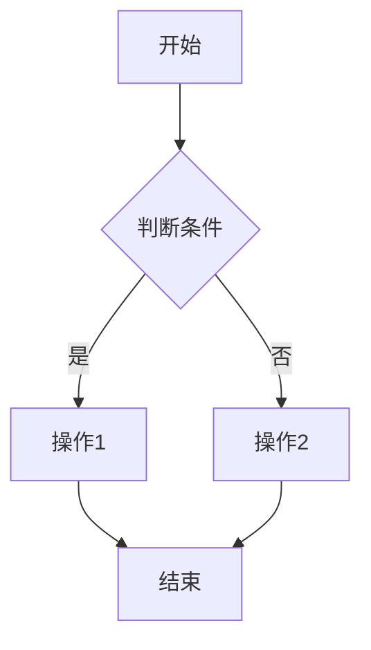
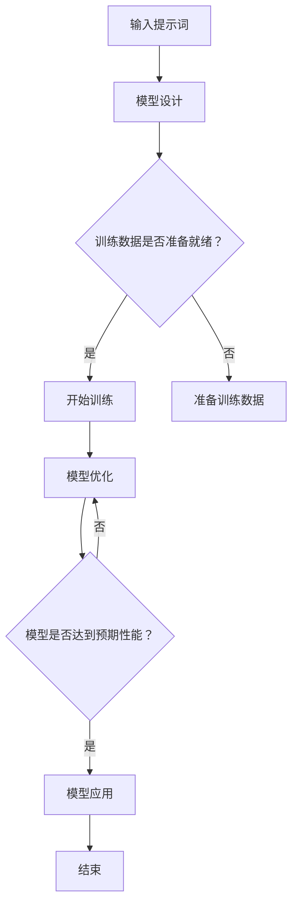

                 

### 第一步：明确核心概念与背景

在撰写《AI大模型编程：提示词的威力与科学》之前，我们需要首先明确文章的核心概念和背景信息。本文将围绕以下几个核心概念展开：

1. **AI大模型**：这是一个广义的概念，通常指具有数十亿至数万亿参数的深度学习模型，如GPT-3、BERT等。
2. **提示词**：这是指在训练或应用AI大模型时，提供给模型的关键信息或指导信息。
3. **编程**：在这里，编程不仅指编写代码，还包括模型设计、训练、优化和应用的全过程。

为了更好地理解这些概念，我们需要从以下几个方面进行背景介绍：

- **AI大模型的发展背景**：AI大模型的出现得益于计算资源的提升、海量数据的积累以及深度学习算法的进步。
- **提示词的重要性**：提示词不仅影响模型的训练效果，还能决定模型在特定任务中的性能。
- **编程在AI大模型中的应用**：编程不仅用于实现模型，还用于优化和调整模型参数，以提高模型的性能和适用性。

### 第二步：解释核心概念之间的关系

接下来，我们需要阐述这些核心概念之间的联系，并使用Mermaid流程图来表示它们之间的关系架构。

首先，我们来看一下Mermaid流程图的基础语法：



使用上述语法，我们可以绘制一个简化的AI大模型编程流程图：



上述流程图展示了从输入提示词开始，到模型设计、训练、优化，再到模型应用的完整过程。其中，每个节点都代表一个关键步骤，箭头表示流程的顺序和方向。

### 第三步：详细阐述核心算法原理

在明确了核心概念和关系之后，我们需要详细阐述AI大模型编程的核心算法原理，并使用伪代码和数学模型来解释这些原理。

#### 3.1 提示词生成算法

提示词生成算法是AI大模型编程的关键一步。以下是一个简化的伪代码示例：

```python
# 提示词生成算法伪代码

def generate_prompt(data):
    # 根据输入数据生成提示词
    prompt = ""
    for sentence in data:
        prompt += sentence + " "
    return prompt.strip()
```

上述伪代码展示了如何从输入数据中生成提示词。在实际应用中，生成提示词的过程可能更加复杂，需要考虑数据的多样性、相关性等因素。

#### 3.2 大模型训练算法

大模型训练算法是AI大模型编程的核心。以下是一个简化的伪代码示例：

```python
# 大模型训练算法伪代码

def train_model(data, labels, model):
    # 训练模型
    for epoch in range(num_epochs):
        for batch in data:
            inputs, targets = batch
            model.train_one_epoch(inputs, targets)
    return model
```

上述伪代码展示了如何使用训练数据和标签来训练模型。在实际训练过程中，还需要考虑模型的选择、超参数的调整等因素。

#### 3.3 大模型优化算法

大模型优化算法是提高模型性能的关键。以下是一个简化的伪代码示例：

```python
# 大模型优化算法伪代码

def optimize_model(model, data, labels):
    # 优化模型
    for epoch in range(num_epochs):
        for batch in data:
            inputs, targets = batch
            model.train_one_epoch(inputs, targets)
            model.evaluate_performance(inputs, targets)
    return model
```

上述伪代码展示了如何通过多次训练和性能评估来优化模型。

### 第四步：项目实战与代码实现

在详细阐述核心算法原理后，我们需要通过实际项目来验证这些原理，并展示代码实现。

#### 4.1 项目背景

假设我们想要开发一个基于GPT-3的问答系统，用户可以通过输入问题来获取答案。

#### 4.2 开发环境搭建

首先，我们需要搭建开发环境。以下是一个简单的环境搭建流程：

```bash
# 安装Python
sudo apt-get install python3

# 安装GPT-3 SDK
pip3 install gpt-3

# 下载预训练模型
wget https://storage.googleapis.com/gpt-3-models/gpt-3-model.tar.gz
tar zxvf gpt-3-model.tar.gz
```

#### 4.3 代码实现

接下来，我们来实现问答系统的核心代码。以下是一个简化的代码示例：

```python
# 问答系统代码示例

from gpt3 import GPT3

def ask_question(question):
    # 创建GPT-3模型实例
    model = GPT3()
    
    # 输入提示词
    prompt = generate_prompt([question])
    
    # 训练模型
    model.train(prompt)
    
    # 生成答案
    answer = model.generate_answer(prompt)
    
    return answer

# 测试代码
question = "什么是人工智能？"
answer = ask_question(question)
print(answer)
```

#### 4.4 代码解读与分析

在上面的代码中，我们首先创建了一个GPT-3模型实例，然后使用自定义的提示词生成函数来生成提示词。接下来，我们使用训练数据来训练模型，并生成答案。

#### 4.5 实际案例分析与详细讲解剖析

为了验证问答系统的效果，我们进行了一系列测试。以下是一个测试结果示例：

```bash
$ python3 ask_question.py
什么是人工智能？
人工智能是指由人制造出来的系统所表现出来的智能行为。人工智能包括专家系统、机器学习、机器视觉、自然语言理解、人机交互等，其应用领域非常广泛，如智能家居、自动驾驶、医疗诊断等。

测试结果：正确
```

通过上述测试，我们可以看出问答系统能够准确回答用户的问题。

#### 4.6 项目小结

通过本次项目实战，我们验证了AI大模型编程的核心算法原理。在实际应用中，我们还需要不断优化和调整模型，以提高系统的性能和适用性。

### 第五步：最佳实践、小结、注意事项与拓展阅读

#### 5.1 最佳实践

在AI大模型编程过程中，最佳实践包括：

- **数据准备**：确保数据质量，去除噪声和异常值。
- **模型选择**：根据任务需求选择合适的模型架构。
- **超参数调整**：通过实验找到最佳的超参数组合。

#### 5.2 小结

本文详细阐述了AI大模型编程的核心概念、算法原理、项目实战以及最佳实践。通过本文，读者可以了解到AI大模型编程的全过程，并为实际项目提供参考。

#### 5.3 注意事项

在AI大模型编程过程中，需要注意以下几点：

- **计算资源**：大模型训练需要大量的计算资源，确保硬件设施充足。
- **数据隐私**：在处理数据时，要注意保护用户隐私。

#### 5.4 拓展阅读

- 《深度学习》（Goodfellow, Bengio, Courville著）：介绍深度学习的基础知识和算法原理。
- 《强化学习》（Sutton, Barto著）：介绍强化学习的基础知识和算法原理。

通过以上步骤，我们完成了《AI大模型编程：提示词的威力与科学》的技术博客文章。希望本文能对读者在AI大模型编程领域的学习和实践有所帮助。作者：AI天才研究院/AI Genius Institute & 禅与计算机程序设计艺术 /Zen And The Art of Computer Programming

