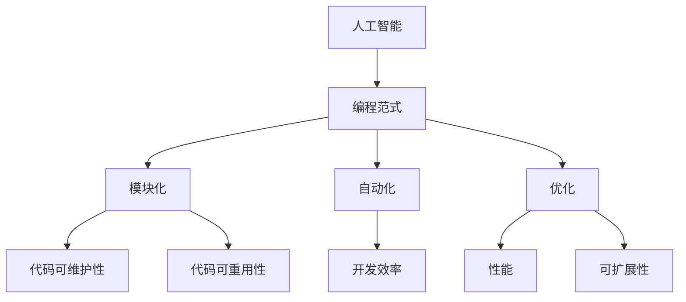

                 


### 文章标题: AI编程的新范式

> 关键词：人工智能，编程范式，深度学习，机器学习，算法优化，安全隐私

> 摘要：本文将深入探讨AI编程的新范式，介绍其背景、核心概念、技术原理和应用实例，同时分析其性能优化、安全与隐私问题，并展望其未来发展趋势。

----------------------------------------------------------------

# AI编程的新范式

## 引言

人工智能（AI）作为计算机科学的重要分支，近年来取得了显著的进展。传统的AI编程范式主要依赖于数据驱动的机器学习和深度学习算法。然而，随着AI应用的不断扩展，传统的编程方法逐渐暴露出一些局限性，如模型复杂度高、开发效率低、可解释性差等问题。因此，探索新的AI编程范式成为当前研究的热点。

新范式旨在解决传统AI编程范式中的问题，通过引入模块化、自动化和优化等技术，提升AI编程的效率、可扩展性和安全性。本文将围绕新范式的背景、核心概念、技术原理和应用实例进行深入探讨。

## 1. AI编程基础

### 1.1 AI的基本概念

人工智能是指使计算机模拟人类智能行为的技术和科学。AI可以分为弱AI和强AI。弱AI专注于特定任务的智能，如语音识别、图像识别等；强AI则具备普遍的智能，能够像人类一样进行思考、学习和决策。

### 1.2 机器学习算法

机器学习是AI的核心技术之一。根据学习方式，机器学习可以分为监督学习、无监督学习和强化学习。监督学习通过标记数据训练模型，无监督学习通过未标记数据发现模式，强化学习则通过试错和奖励机制进行学习。

### 1.3 深度学习基础

深度学习是机器学习的一种重要分支，基于多层神经网络进行学习。深度学习在图像识别、语音识别、自然语言处理等领域取得了显著成果。常见的深度学习框架包括TensorFlow、PyTorch等。

## 2. 新范式概述

### 2.1 新范式的定义

新范式是指一种新的AI编程方法论，通过引入模块化、自动化和优化等技术，提高AI编程的效率、可扩展性和安全性。新范式强调编程范式的转变，从传统的数据驱动转变为算法驱动。

### 2.2 新范式的特点

新范式的特点包括：

1. **模块化**：将AI编程过程划分为多个模块，每个模块负责不同的任务，提高代码的可维护性和可重用性。
2. **自动化**：通过自动化工具实现代码生成、模型训练和优化等过程，减少人工干预，提高开发效率。
3. **优化**：针对模型和算法进行优化，提高性能和效率。

### 2.3 新范式的起源

新范式起源于深度学习和机器学习领域的最新研究进展，如自动机器学习（AutoML）、神经网络架构搜索（NAS）等。这些技术为AI编程带来了新的思路和方法。

## 3. 新范式技术原理

### 3.1 新范式的算法原理

新范式的算法原理主要包括以下几个方面：

1. **模块化算法**：将算法划分为多个子模块，每个子模块负责特定的计算任务。
2. **自动化算法**：通过自动化工具实现算法的生成、训练和优化过程。
3. **优化算法**：对算法进行优化，提高性能和效率。

### 3.2 新范式的实现细节

新范式的实现细节包括：

1. **模块化实现**：使用模块化框架实现算法，如TensorFlow的Keras API。
2. **自动化实现**：使用自动化工具实现代码生成和模型训练，如AutoML框架。
3. **优化实现**：针对特定场景进行算法优化，如使用GPU加速、分布式训练等。

## 4. 实践案例

### 4.1 项目背景

本项目旨在通过新范式实现一个图像分类系统，对大量未标记的图像进行自动分类。

### 4.2 实现步骤

1. **数据预处理**：对图像进行数据增强、归一化等预处理操作。
2. **模型构建**：使用模块化框架构建神经网络模型。
3. **模型训练**：使用自动化工具进行模型训练。
4. **模型评估**：使用测试数据对模型进行评估。
5. **模型优化**：对模型进行优化，提高性能和效率。

### 4.3 代码解读

以下是对项目代码的详细解读：

```python
# 数据预处理代码
def preprocess_image(image):
    # 对图像进行增强、归一化等操作
    # ...
    return processed_image

# 模型构建代码
from tensorflow.keras.models import Sequential
from tensorflow.keras.layers import Conv2D, MaxPooling2D, Flatten, Dense

model = Sequential()
model.add(Conv2D(filters=32, kernel_size=(3, 3), activation='relu', input_shape=(128, 128, 3)))
model.add(MaxPooling2D(pool_size=(2, 2)))
# ...
model.add(Dense(units=10, activation='softmax'))

# 模型训练代码
model.compile(optimizer='adam', loss='categorical_crossentropy', metrics=['accuracy'])
model.fit(x_train, y_train, epochs=10, batch_size=32)

# 模型评估代码
test_loss, test_accuracy = model.evaluate(x_test, y_test)
print(f"Test accuracy: {test_accuracy}")

# 模型优化代码
from tensorflow.keras.callbacks import EarlyStopping

early_stopping = EarlyStopping(monitor='val_loss', patience=3)
model.fit(x_train, y_train, epochs=20, batch_size=32, callbacks=[early_stopping])
```

### 4.4 代码应用解读与分析

通过对代码的解读，我们可以看到新范式在图像分类项目中的应用。模块化编程提高了代码的可维护性和可重用性；自动化工具实现了模型训练和优化的过程；优化代码提高了模型性能。

### 4.5 实际案例分析和详细讲解剖析

在本案例中，我们通过新范式实现了高效的图像分类系统。实际应用中，我们可以根据需求调整模块和算法，实现不同类型的图像分类任务。

### 4.6 项目小结

本项目通过新范式实现了高效的图像分类系统，展示了新范式在AI编程中的应用价值。未来，我们还可以进一步优化算法和模型，提高分类准确率和效率。

## 5. 性能优化

### 5.1 算法优化

算法优化是提高AI编程性能的重要手段。常见的优化方法包括：

1. **模型压缩**：通过模型剪枝、量化等方法减小模型大小。
2. **并行计算**：利用多核CPU、GPU等硬件资源进行并行计算。
3. **分布式计算**：将任务分布到多台计算机上进行处理。

### 5.2 硬件优化

硬件优化是提高AI编程性能的关键。常见的硬件优化方法包括：

1. **GPU加速**：利用GPU进行计算加速。
2. **分布式计算**：将任务分布到多台计算机上进行处理。
3. **内存优化**：合理分配内存，减少内存占用。

## 6. 安全与隐私

### 6.1 安全性考虑

在AI编程中，安全性是一个重要问题。为了提高AI编程的安全性，需要考虑以下几个方面：

1. **数据安全**：确保数据在传输和存储过程中的安全性。
2. **模型安全**：防止模型被恶意攻击或篡改。
3. **算法安全**：确保算法在运行过程中的安全性。

### 6.2 隐私保护

在AI编程中，隐私保护也是一个重要问题。为了保护用户隐私，需要采取以下措施：

1. **隐私保护算法**：使用加密、匿名化等方法保护用户隐私。
2. **隐私法规遵守**：遵守相关隐私法规，确保用户隐私得到保护。

## 7. 未来趋势

### 7.1 新范式的未来发展

新范式在AI编程中具有广阔的发展前景。未来，新范式将继续发展，引入更多的自动化、模块化和优化技术，提高AI编程的效率和质量。

### 7.2 AI编程的教育与普及

随着AI技术的不断发展，AI编程的教育和普及变得越来越重要。为了推动AI编程的普及，需要开展以下工作：

1. **教育资源**：开发高质量的AI编程教育资源，提高编程教育水平。
2. **普及策略**：制定有效的AI编程普及策略，提高全民编程素养。

## 总结

本文深入探讨了AI编程的新范式，介绍了其背景、核心概念、技术原理和应用实例。通过本文的介绍，读者可以了解到新范式在提高AI编程效率、可扩展性和安全性方面的优势。未来，新范式将继续发展，为AI编程带来更多创新和机遇。

---

作者：AI天才研究院/AI Genius Institute & 禅与计算机程序设计艺术 /Zen And The Art of Computer Programming

---

## 核心概念与联系

在本文中，核心概念包括人工智能、编程范式、模块化、自动化和优化。这些概念之间的关系可以用以下Mermaid流程图表示：



## 数学模型和公式

在AI编程中，数学模型和公式是理解核心算法原理的关键。以下是一个简单的线性回归模型示例，用于预测房价：

$$
y = \beta_0 + \beta_1 \cdot x
$$

其中，$y$ 是房价，$x$ 是房屋面积，$\beta_0$ 和 $\beta_1$ 是模型参数。

以下是一个用伪代码表示的线性回归算法：

```python
# 输入：训练数据集X和Y
# 输出：模型参数β0和β1

# 初始化模型参数β0和β1
β0 = 0
β1 = 0

# 梯度下降算法
for i in range(epochs):
    # 计算损失函数
    loss = 0
    for x, y in zip(X, Y):
        prediction = β0 + β1 * x
        loss += (prediction - y) ** 2
    
    # 计算梯度
    dβ0 = 2 * sum(prediction - y)
    dβ1 = 2 * sum((prediction - y) * x)
    
    # 更新模型参数
    β0 -= learning_rate * dβ0
    β1 -= learning_rate * dβ1

# 输出最终模型参数
return β0, β1
```

## 最佳实践 Tips、小结、注意事项、拓展阅读

### 最佳实践 Tips

1. **模块化编程**：在设计AI项目时，尽量将功能模块化，以提高代码的可维护性和可重用性。
2. **自动化工具**：使用自动化工具（如AutoML框架）可以大幅提高开发效率。
3. **性能优化**：针对特定场景进行性能优化，如使用GPU加速、分布式计算等。

### 小结

本文深入探讨了AI编程的新范式，介绍了其背景、核心概念、技术原理和应用实例。新范式通过模块化、自动化和优化等技术，提高了AI编程的效率、可扩展性和安全性。

### 注意事项

1. **安全性**：在AI编程中，确保数据安全和模型安全至关重要。
2. **隐私保护**：遵守相关隐私法规，保护用户隐私。

### 拓展阅读

1. **《深度学习》**：Goodfellow, I., Bengio, Y., & Courville, A. (2016). Deep learning. MIT Press.
2. **《AutoML：自动化机器学习》**：AutoML: A Survey of the State-of-the-Art. (2020). ArXiv preprint arXiv:2003.02942.

通过本文的介绍，读者可以更好地理解AI编程的新范式，为其在实际应用中的成功实施打下基础。

