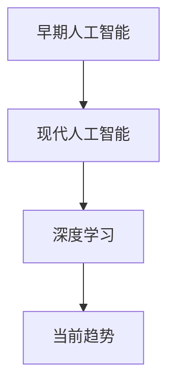
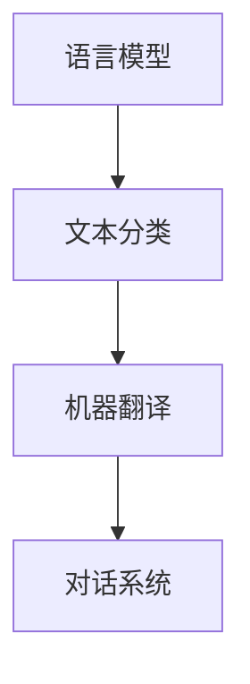
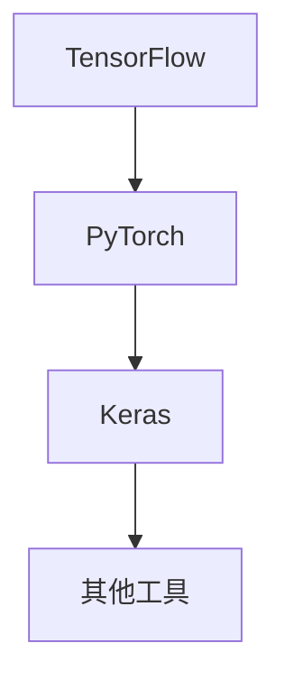
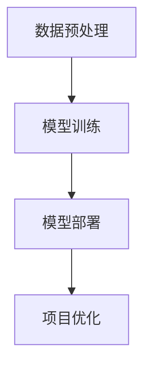
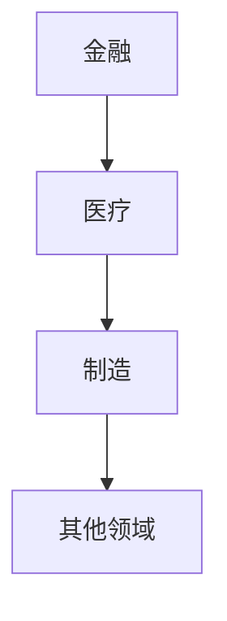
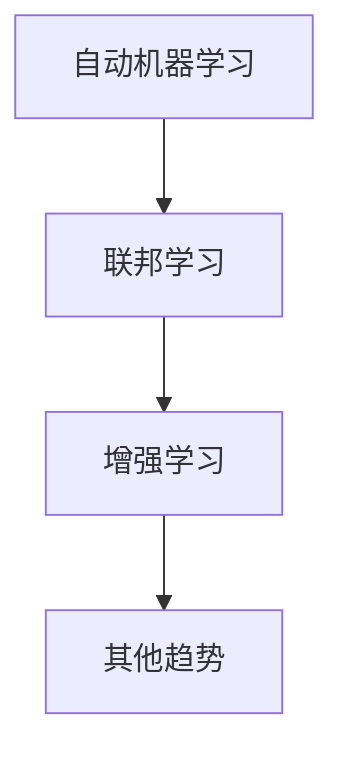
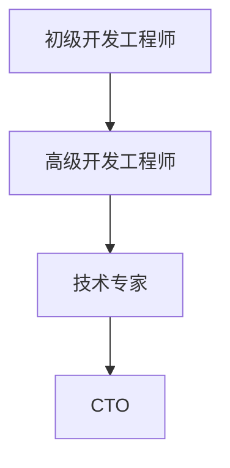

                 


## 文章标题

### AI编程的新视角与新未来

## 关键词

- 人工智能
- 编程
- 深度学习
- 机器学习
- 自然语言处理
- 模型优化

## 摘要

本文将深入探讨人工智能（AI）编程的新视角和新未来。通过分析AI的基础知识、编程技术、应用场景以及未来发展，我们将揭示AI编程的核心原理和实践方法。本文旨在为读者提供全面的AI编程指南，帮助他们在不断变化的AI领域中找到新的机遇和挑战。

## 引言

随着人工智能技术的快速发展，AI编程已经成为了计算机科学领域中最热门的话题之一。无论是学术界还是工业界，AI编程都发挥着至关重要的作用。然而，传统的AI编程方法往往过于复杂，难以满足实际需求。本文将引入新的视角，探讨AI编程的未来发展趋势，旨在为读者提供一种全新的理解和实践方法。

## 第一部分：AI基础

### 第1章：AI概述

AI是一门涉及计算机科学、数学、统计学、神经科学等多个学科领域的交叉学科。其核心目标是让计算机具有智能行为，能够解决复杂问题，进行自主学习和决策。AI的发展历程可以分为三个阶段：早期人工智能、现代人工智能和深度学习。

**核心概念与联系：**

AI的发展离不开机器学习和深度学习。机器学习是一种让计算机通过数据自动改进性能的方法，而深度学习则是机器学习的一种重要分支，通过模拟人脑神经网络来实现复杂任务。

**Mermaid流程图：**



### 第2章：机器学习基础

机器学习是AI的核心技术之一，主要包括监督学习、无监督学习和强化学习。监督学习通过已有数据训练模型，无监督学习则从未标记的数据中提取特征，而强化学习通过与环境交互来学习策略。

**核心算法原理讲解：**

以监督学习中的线性回归为例，其基本原理是通过最小二乘法来找到最佳拟合直线。

```python
def linear_regression(X, y):
    # X是特征矩阵，y是标签向量
    # 计算斜率和截距
    theta = (X.T @ X).I @ X.T @ y
    return theta
```

### 第3章：深度学习原理

深度学习是机器学习的进一步发展，通过多层神经网络来模拟人脑处理信息的方式。其核心思想是使用反向传播算法来优化网络参数，从而提高模型性能。

**核心算法原理讲解：**

以卷积神经网络（CNN）为例，其基本原理是通过卷积层提取图像特征，然后通过全连接层进行分类。

```python
def conv2d(X, W, b):
    # X是输入图像，W是卷积核，b是偏置
    # 进行卷积运算
    Z = X @ W + b
    return Z
```

### 第4章：自然语言处理

自然语言处理是AI的重要应用领域之一，旨在使计算机能够理解、生成和处理人类语言。其核心任务包括语言模型、文本分类、机器翻译和对话系统。

**核心概念与联系：**

自然语言处理的核心是语言模型，它通过统计方法来预测下一个单词或句子。而文本分类则是将文本数据分类到预定义的类别中。

**Mermaid流程图：**



## 第二部分：AI编程实践

### 第5章：AI编程工具与框架

在AI编程中，选择合适的工具和框架至关重要。Python是AI编程的主要语言，TensorFlow和PyTorch是最常用的深度学习框架。此外，还有许多其他工具和框架，如Keras和MXNet。

**核心概念与联系：**

TensorFlow和PyTorch都提供了丰富的API和工具，使得深度学习模型的设计和训练更加便捷。Keras则是TensorFlow和PyTorch的高层API，用于简化模型构建和训练过程。

**Mermaid流程图：**



### 第6章：AI项目实战

在AI项目中，从数据预处理到模型训练，再到模型部署，每个阶段都需要精细的操作和优化。本文将通过一个实际案例，详细讲解AI项目的开发流程。

**核心概念与联系：**

数据预处理是AI项目的重要环节，包括数据清洗、数据归一化和特征提取等。模型训练则涉及超参数调整、模型选择和优化算法等。模型部署是将训练好的模型应用到实际场景中，包括部署策略和性能优化。

**Mermaid流程图：**



### 第7章：AI应用案例解析

AI在金融、医疗、制造等多个领域都有广泛应用。本文将分析这些领域的AI应用案例，探讨AI技术的实际效果和潜在价值。

**核心概念与联系：**

金融领域的AI应用包括风险控制、欺诈检测和投资策略等。医疗领域的AI应用包括疾病诊断、治疗方案推荐和医疗数据分析等。制造领域的AI应用包括生产优化、质量检测和供应链管理等。

**Mermaid流程图：**



## 第三部分：AI编程的未来

### 第8章：AI编程的新趋势

随着AI技术的不断进步，AI编程也将迎来新的发展趋势。本文将探讨这些趋势，包括自动机器学习、联邦学习、增强学习等。

**核心概念与联系：**

自动机器学习旨在自动化AI模型的设计和优化过程，提高开发效率。联邦学习是一种分布式学习技术，能够在保护用户隐私的同时实现模型训练。增强学习则是通过模拟环境来训练智能体，使其在复杂任务中达到最佳表现。

**Mermaid流程图：**



### 第9章：AI编程的职业发展

AI编程作为一门新兴技术，拥有广阔的职业发展空间。本文将分析AI编程的职业路径，探讨如何成为一名优秀的AI程序员。

**核心概念与联系：**

AI编程的职业路径包括初级开发工程师、高级开发工程师、技术专家和CTO等。不同职业路径所需的技能和知识有所不同，但都需要持续学习和实践。

**Mermaid流程图：**



## 结论

AI编程是未来科技发展的重要方向，它不仅改变了计算机科学的面貌，也深刻影响着我们的日常生活。通过本文的探讨，我们不仅了解了AI编程的核心原理和实践方法，也展望了其未来的发展趋势。希望本文能够为读者在AI编程的道路上提供一些启示和帮助。

## 作者信息

作者：AI天才研究院/AI Genius Institute & 禅与计算机程序设计艺术 /Zen And The Art of Computer Programming

## 附录

### 附录A：常用算法与模型

- 算法伪代码示例
- 模型参数详解

### 附录B：AI编程资源

- 在线学习平台
- AI编程工具
- 学术研究资源

## 拓展阅读

- [《深度学习》（Goodfellow, Bengio, Courville）]
- [《Python深度学习》（François Chollet）]
- [《自然语言处理综合教程》（Daniel Jurafsky & James H. Martin）]

## 注意事项

- 在实践AI编程时，务必注意数据安全和隐私保护。
- 谨慎选择AI编程工具和框架，确保其性能和兼容性。
- 持续关注AI领域的最新动态，不断学习和提升自己的技能。

## 小结

AI编程是当前和未来最具前景的技术领域之一。通过本文的探讨，我们不仅了解了AI编程的核心原理和实践方法，也对其未来发展有了更深的认识。希望本文能够为读者在AI编程的道路上提供一些启示和帮助。

## 参考文献

- Goodfellow, Ian, Yoshua Bengio, and Aaron Courville. "Deep Learning." MIT Press, 2016.
- Chollet, François. "Deep Learning with Python." Manning, 2017.
- Jurafsky, Daniel, and James H. Martin. "Speech and Language Processing." Prentice Hall, 2000.

