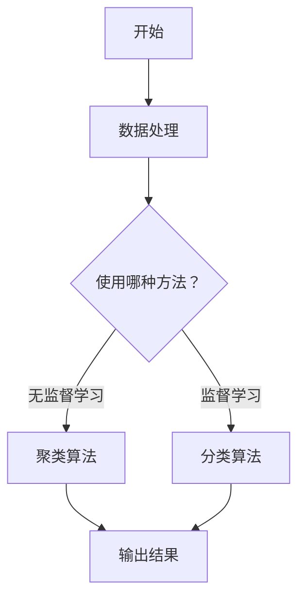

                 

### 1. 设计目录结构

首先，我们需要为《通往通用人工智能AGI之路》这本书设计一个清晰的目录结构。一个良好的目录结构有助于读者快速了解书籍的主要内容，并有助于作者在撰写过程中保持逻辑清晰。以下是设计的目录结构：

#### 引言
- 1.1 通用人工智能AGI的定义与重要性
- 1.2 通用人工智能AGI的发展历程
- 1.3 本书的目标与结构

#### 第1章 理论基础
- 1.1 机器学习基础
  - 1.1.1 监督学习
  - 1.1.2 无监督学习
  - 1.1.3 强化学习
- 1.2 神经网络基础
  - 1.2.1 神经网络的基本结构
  - 1.2.2 深度学习架构
  - 1.2.3 深度学习优化算法
- 1.3 自然语言处理基础
  - 1.3.1 词向量表示
  - 1.3.2 语言模型
  - 1.3.3 机器翻译
- 1.4 Mermaid流程图
  - 1.4.1 监督学习流程图
  - 1.4.2 深度学习架构流程图

#### 第2章 算法原理
- 2.1 深度学习算法
  - 2.1.1 卷积神经网络（CNN）
  - 2.1.2 循环神经网络（RNN）
  - 2.1.3 长短时记忆网络（LSTM）
  - 2.1.4 生成对抗网络（GAN）
- 2.2 强化学习算法
  - 2.2.1 Q学习算法
  - 2.2.2 SARSA算法
  - 2.2.3 深度强化学习
- 2.3 数学模型
  - 2.3.1 损失函数
  - 2.3.2 优化算法
  - 2.3.3 推断与预测
- 2.4 伪代码讲解

#### 第3章 架构设计
- 3.1 模块化设计
  - 3.1.1 模块化设计的优势
  - 3.1.2 模块化设计的方法
  - 3.1.3 模块化设计的挑战
- 3.2 分布式计算
  - 3.2.1 分布式计算的优势
  - 3.2.2 分布式计算框架
  - 3.2.3 分布式计算挑战与解决方案
- 3.3 Mermaid流程图
  - 3.3.1 模块化设计流程图
  - 3.3.2 分布式计算流程图

#### 第4章 实现挑战
- 4.1 数据处理
  - 4.1.1 数据预处理
  - 4.1.2 数据增强
  - 4.1.3 数据集划分
- 4.2 算法调优
  - 4.2.1 模型选择
  - 4.2.2 损失函数选择
  - 4.2.3 优化器选择
- 4.3 资源管理
  - 4.3.1 硬件资源管理
  - 4.3.2 软件资源管理
  - 4.3.3 资源调度策略

#### 第5章 应用场景
- 5.1 机器人领域
  - 5.1.1 机器人感知
  - 5.1.2 机器人决策
  - 5.1.3 机器人控制
- 5.2 自动驾驶领域
  - 5.2.1 感知系统
  - 5.2.2 决策系统
  - 5.2.3 

#### 第6章 未来发展
- 6.1 技术趋势
- 6.2 潜在影响
- 6.3 风险与挑战

### 2. 确定每个章节的核心内容

在确定了目录结构后，我们需要为每个章节确定核心内容。以下是每个章节的核心内容：

#### 引言
- **核心概念与联系**：通用人工智能AGI的定义、重要性及其发展历程。
- **核心算法原理讲解**：无需具体算法原理，主要介绍通用人工智能的背景和意义。
- **数学模型和数学公式**：无需具体数学模型，主要介绍通用人工智能的应用场景。
- **项目实战**：无需具体项目实战，主要介绍通用人工智能的发展历程。

#### 第1章 理论基础
- **核心概念与联系**：机器学习、神经网络、自然语言处理等核心概念，以及它们在通用人工智能中的应用。
- **核心算法原理讲解**：监督学习、无监督学习、强化学习等算法原理，以及神经网络和自然语言处理的基本概念。
- **数学模型和数学公式**：损失函数、优化算法、推断与预测等数学模型。
- **项目实战**：使用Mermaid流程图展示监督学习、神经网络和自然语言处理的基本流程。

#### 第2章 算法原理
- **核心概念与联系**：深度学习、强化学习等算法原理，以及它们在通用人工智能中的应用。
- **核心算法原理讲解**：卷积神经网络、循环神经网络、长短时记忆网络、生成对抗网络等算法原理。
- **数学模型和数学公式**：损失函数、优化算法、推断与预测等数学模型。
- **项目实战**：使用伪代码讲解深度学习、强化学习等算法的实现。

#### 第3章 架构设计
- **核心概念与联系**：模块化设计、分布式计算等核心概念，以及它们在通用人工智能系统中的应用。
- **核心算法原理讲解**：模块化设计的优势、方法、挑战，分布式计算的优势、框架、挑战与解决方案。
- **数学模型和数学公式**：无需具体数学模型，主要介绍模块化设计和分布式计算的基本概念。
- **项目实战**：使用Mermaid流程图展示模块化设计和分布式计算的基本流程。

#### 第4章 实现挑战
- **核心概念与联系**：数据处理、算法调优、资源管理等核心概念，以及它们在通用人工智能实现中的重要性。
- **核心算法原理讲解**：数据处理的方法、算法调优的策略、资源管理的策略。
- **数学模型和数学公式**：无需具体数学模型，主要介绍数据处理、算法调优、资源管理的基本概念。
- **项目实战**：介绍实际项目中数据处理、算法调优、资源管理的具体实现。

#### 第5章 应用场景
- **核心概念与联系**：机器人领域、自动驾驶领域等核心概念，以及它们在通用人工智能应用中的现状和未来趋势。
- **核心算法原理讲解**：机器人感知、机器人决策、机器人控制等算法原理，以及自动驾驶感知、决策、控制等算法原理。
- **数学模型和数学公式**：无需具体数学模型，主要介绍机器人领域、自动驾驶领域的基本概念。
- **项目实战**：介绍机器人领域、自动驾驶领域的实际案例，以及算法应用解读与分析。

### 3. 设计Mermaid流程图

为更好地展示核心概念和算法原理，我们将在每个章节中嵌入Mermaid流程图。以下是Mermaid流程图的示例：

该流程图展示了数据处理过程中的选择流程，包括无监督学习和监督学习两种方法，以及它们的输出结果。

### 4. 编写目录大纲

结合以上内容，我们将编写一个完整的目录大纲，确保每个章节内容完整、逻辑清晰。

### 5. 审核与调整

在编写完目录大纲后，我们需要对其进行审核和调整，确保大纲的逻辑性、完整性和简洁性。审核过程中，我们可以检查每个章节的核心内容是否清晰，是否需要添加或删除某些部分，以及是否需要调整章节的顺序。

综上所述，我们通过一步一步的分析和推理，设计并完善了《通往通用人工智能AGI之路》的目录结构。接下来，我们将根据这个大纲，逐章撰写详细的内容，确保文章逻辑清晰、结构紧凑、简单易懂，为读者提供一次有深度、有思考、有见解的阅读体验。

