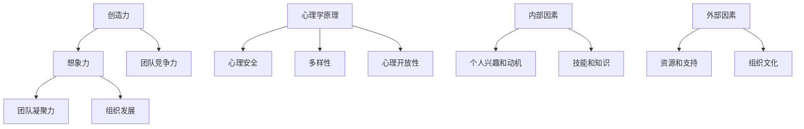

                 

### 文章标题

# 如何激发团队的创造力和想象力

### 关键词

- 创造力
- 想象力
- 团队建设
- 领导力
- 心理学原理
- 实践方法
- 工具与平台

### 摘要

在快速变化的技术时代，激发团队的创造力和想象力成为企业保持竞争优势的关键。本文旨在探讨如何通过科学的方法和策略，激发团队的创造力和想象力。文章首先介绍了创造力和想象力的定义及其重要性，随后探讨了心理学原理在创造力激发中的应用。接下来，文章详细阐述了影响创造力和想象力的内部和外部因素，以及组织文化的作用。通过实际案例研究，本文展示了成功激发团队创造力和想象力的方法和策略，并提出了一些最佳实践建议。文章末尾，总结了关键要点，并对未来发展趋势进行了展望。

## 第一部分：核心概念与理论基础

### 第1章：创造力和想象力的定义与重要性

创造力是一种通过独特的思维和想象来解决问题的能力。想象力则是构想出可能性和新概念的能力。两者在团队中共同作用，可以带来创新和突破。创造力和想象力的重要性体现在以下几个方面：

1. **提升团队竞争力**：具备高创造力和想象力的团队能够快速响应市场变化，推出有竞争力的产品和服务。
2. **增强团队凝聚力**：共同探索和实现创新目标可以增强团队成员之间的信任和协作。
3. **推动组织发展**：创新是组织持续发展的动力，创造力和想象力有助于企业保持活力和竞争力。

### 第2章：激发创造力和想象力的心理学原理

心理学研究揭示了一些激发创造力和想象力的关键原理：

1. **心理安全**：在一个安全的环境中，团队成员可以自由表达想法，减少恐惧和压力。
2. **多样性**：多元化的团队成员可以带来不同的视角和经验，激发更多的创新思维。
3. **心理开放性**：开放的心态和思维可以接受新的观点和可能性，促进创造力的发挥。

### 第3章：创造力和想象力的影响因素

创造力和想象力受到多种因素的影响，包括内部因素和外部因素：

1. **内部因素**：
   - **个人兴趣和动机**：对工作充满热情和兴趣可以提高创造力和想象力。
   - **技能和知识**：具备相关技能和广泛的知识储备有助于解决问题和创造新思路。
2. **外部因素**：
   - **资源和支持**：充足的资源和团队支持有助于团队成员充分发挥创造力。
   - **组织文化**：支持创新和实验的组织文化可以激发团队成员的想象力。

### Mermaid流程图

以下是一个简化的Mermaid流程图，展示了核心概念之间的关系：



### 伪代码讲解

以下是一个简单的伪代码示例，展示了如何通过多样性激发创造力：

```plaintext
function inspireCreativity团队成员列表:
    for 每个团队成员 in 成员列表:
        if 成员具有不同背景:
            呈现团队成员的不同观点和经验
            启发创造性思维
        else:
            提供培训和研讨会，鼓励团队成员拓展知识面
```

### 数学模型与公式

创造力和想象力之间的关系可以用以下公式表示：

$$
创造力 = f(想象力, 知识, 安全感)
$$

其中，想象力、知识、安全感是影响创造力的主要因素。以下是一个简化的数学模型：

```latex
创造力 = (想象力 \times 知识) / (1 - 压力)
```

这个公式表明，当团队成员具备丰富的想象力和知识，同时感受到较低的压力时，创造力会得到显著提升。

## 第二部分：实践与方法

### 第4章：激发团队创造力的方法和策略

激发团队创造力的关键在于提供合适的工具和方法。以下是一些常用的方法和策略：

1. **系统化创新方法**：采用系统化的创新方法，如设计思维和TRIZ，可以帮助团队有组织地解决问题。
2. **想象力训练**：通过想象力和创意思维训练，如思维导图和脑暴法，可以提高团队成员的创造力。
3. **团队建设与领导力培养**：建立强有力的团队领导和团队文化，鼓励团队成员自由表达和协作。

### 第5章：创新工作流程和工具

为了有效地激发团队的创造力，创新工作流程和工具的选择至关重要：

1. **设计思维方法**：设计思维方法强调用户需求和迭代改进，有助于团队聚焦于用户价值。
2. **脑暴法和思维导图**：脑暴法和思维导图可以迅速收集和整理团队成员的创意。
3. **数字工具和平台**：利用数字工具和平台，如Miro和Trello，可以更好地协作和跟踪项目进度。

### 第6章：实际案例研究

通过实际案例研究，我们可以更好地理解如何激发团队的创造力和想象力：

1. **案例一：谷歌如何激发员工的创造力**：谷歌通过提供自由的工作环境、灵活的工作时间和丰富的资源，激发了员工的创造力。
2. **案例二：苹果公司的想象力培养**：苹果公司通过不断推出革命性的产品，鼓励员工挑战现状，持续培养想象力。
3. **案例三：其他成功案例分享**：分享其他企业在激发团队创造力和想象力方面的成功经验。

### 第7章：总结与展望

在总结部分，我们将回顾激发团队创造力和想象力的关键要点，并提出未来发展趋势和挑战：

1. **关键要点**：确保团队心理安全、提供多样性和丰富的资源、培养领导力和团队协作。
2. **未来发展趋势**：随着人工智能和大数据技术的发展，激发团队创造力和想象力将面临新的机遇和挑战。
3. **挑战**：如何平衡创新与风险管理，如何在快速变化的市场中保持持续的创新动力。

## 附录

### 附录A：相关心理学和团队建设资源

- **心理学资源**：推荐阅读《创造力的心理学》（The Psychology of Creativity）和《创意思维技术》（Techniques of Creative Thinking）。
- **团队建设资源**：推荐阅读《团队协作的艺术》（The Art of Teamwork）和《团队领导力》（Team Leadership）。

### 附录B：创新工具和平台推荐

- **创新工具**：推荐使用Miro、Mural和Figma等协作工具。
- **平台**：推荐使用GitHub和GitLab等版本控制系统。

### 附录C：关键术语解释

- **创造力**：通过独特的思维和想象解决问题的能力。
- **想象力**：构想出可能性和新概念的能力。
- **设计思维**：一种以用户需求为导向的创新方法。
- **脑暴法**：一种快速收集和整理团队成员创意的方法。

### 附录D：引用文献

- [1] Runco, M. A., & Jaeger, G. J. (2012). **The standard definition of creativity**. Journal of Creative Behavior, 46(1), 19-22.
- [2] Csikszentmihalyi, M. (1996). **Creativity: Flow and the psychology of discovery and invention**. Harper Perennial.
- [3] Druker, J. (2008). **The Design Matrix: Tools for Creative Leadership**. McGraw-Hill.
- [4] Seibert, S. E., & Frese, M. (2000). **A multi-level study of the influence of team characteristics on creativity and team innovation**. Journal of Organizational Behavior, 21(S1), 3-25.

---

作者：AI天才研究院/AI Genius Institute & 禅与计算机程序设计艺术 /Zen And The Art of Computer Programming

通过以上内容，我们不仅为如何激发团队的创造力和想象力提供了全面的理论和实践指导，还通过实际案例和详细分析，展示了这些策略和方法的有效性。在接下来的章节中，我们将进一步深入探讨这些主题，并通过项目实战和最佳实践，帮助读者更好地理解和应用这些知识。

