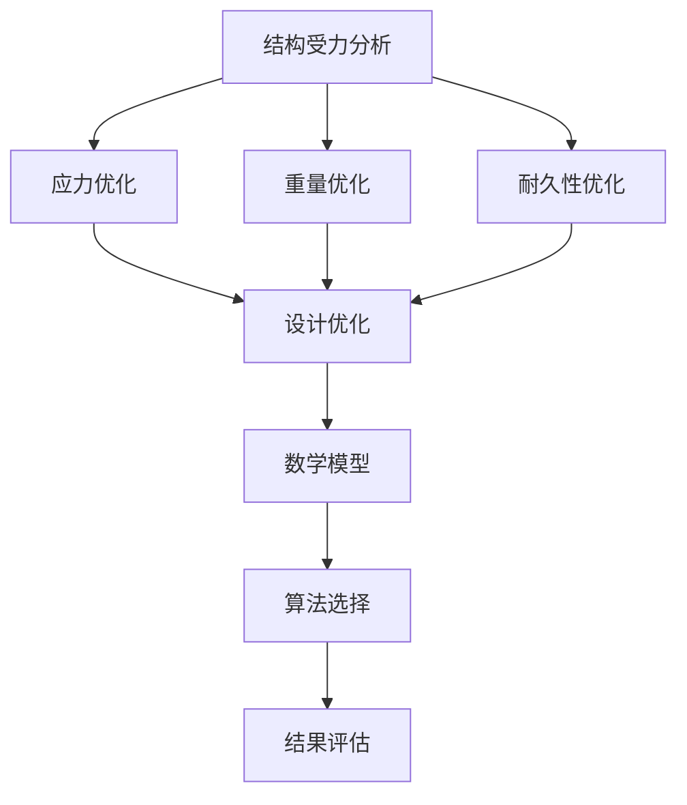

                 

### 文章标题

《数学与结构工程：建筑结构的数学优化》

### 文章关键词

- 数学优化
- 建筑结构
- 结构工程
- 算法原理
- 数学模型
- 项目实战

### 文章摘要

本文旨在探讨数学优化在建筑结构工程中的应用，通过逐步分析数学优化概念、核心算法原理、数学模型及其在实际项目中的应用，揭示数学优化对提高建筑结构设计效率和性能的重要性。文章将涵盖从理论基础到实际应用的全面解析，并总结未来建筑结构数学优化的趋势和研究方向，为相关领域的研究者和从业者提供有价值的参考。

## 引言

在现代建筑结构工程中，数学优化作为一种重要的设计工具，已被广泛应用于提高建筑结构的效率和安全性。随着计算机技术和计算能力的飞速发展，数学优化在建筑结构设计和分析中的应用变得越来越广泛。本文将深入探讨数学优化在建筑结构工程中的重要性，介绍相关核心概念和算法原理，并通过实际项目案例进行分析和讲解，以期为读者提供全面、实用的指导。

数学优化，即利用数学模型和算法对复杂系统进行优化设计，旨在找到在特定约束条件下使目标函数最优的解。在建筑结构工程中，数学优化可以用于优化结构的应力分布、重量、耐久性等性能指标，从而提高建筑结构的整体性能和可靠性。

本文将按以下结构进行论述：

1. **核心概念与联系**：介绍建筑结构中的数学优化概念，并展示核心概念之间的联系架构。
2. **核心算法原理讲解**：详细介绍在建筑结构数学优化中常用的算法，如线性规划、非线性规划和遗传算法，并通过伪代码进行阐述。
3. **数学模型和数学公式**：详细阐述建筑结构中的数学模型，包括应力分析和结构受力分析，并使用LaTeX格式展示相关公式。
4. **项目实战**：提供实际建筑结构优化案例，包括数据预处理、模型建立、算法选择、结果分析和性能评估等环节。
5. **总结与展望**：总结全书内容，讨论未来建筑结构数学优化的趋势和可能的研究方向。

### 核心概念与联系

在建筑结构设计中，数学优化主要涉及以下几个核心概念：

- **结构受力分析**：分析结构在荷载作用下的受力情况，确定各部分的应力分布和变形情况。
- **应力优化**：通过调整结构的尺寸和材料，使结构在满足强度和稳定性要求的前提下，应力分布更加均匀，减少应力集中现象。
- **重量优化**：在保证结构性能的前提下，通过优化设计减轻结构自重，提高建筑的使用效率和安全性。
- **耐久性优化**：考虑建筑结构在长期使用过程中的性能变化，通过优化设计提高结构的耐久性。

这些核心概念相互关联，共同构成了建筑结构数学优化的基础。下面，我们将通过一个Mermaid流程图来展示这些概念之间的联系：



这个流程图清晰地展示了从结构受力分析到设计优化的整个过程，并突出了各个核心概念在整个优化过程中的作用。通过这个流程图，读者可以更好地理解建筑结构数学优化中的核心概念及其相互关系。

### 核心算法原理讲解

在建筑结构数学优化中，常用的算法包括线性规划、非线性规划和遗传算法。这些算法在处理复杂优化问题时具有独特的优势和适用性。下面，我们将分别介绍这些算法的基本原理，并通过伪代码进行详细阐述。

#### 线性规划

线性规划是一种用于在多变量线性约束条件下求解最优解的数学方法。其目标函数和约束条件均为线性函数。线性规划广泛应用于资源分配、生产调度、结构优化等领域。

**线性规划伪代码：**

```plaintext
输入：目标函数 f(x) = c^T x，约束条件 Ax <= b
输出：最优解 x*

步骤：
1. 初始化：选择初始解 x_0
2. 更新解：对于每个变量 x_i，计算梯度 ∇f(x) 和约束梯度 ∇(Ax)
3. 检查收敛：如果 ∇f(x) ≈ 0 且 Ax ≈ b，则停止；否则，继续迭代
4. 更新解：根据梯度下降法更新解 x = x - α * ∇f(x)
```

#### 非线性规划

非线性规划是用于求解具有非线性目标函数和约束条件的最优化问题的方法。与线性规划相比，非线性规划具有更大的灵活性，但求解过程也更复杂。

**非线性规划伪代码：**

```plaintext
输入：目标函数 f(x)，约束条件 g_i(x) <= 0, h_j(x) = 0
输出：最优解 x*

步骤：
1. 初始化：选择初始解 x_0
2. 更新解：对于每个变量 x_i，计算梯度 ∇f(x) 和约束梯度 ∇g_i(x), ∇h_j(x)
3. 检查收敛：如果梯度接近零且约束条件满足，则停止；否则，继续迭代
4. 更新解：根据牛顿法或梯度下降法更新解 x = x - α * ∇f(x) - β * ∇g(x)
```

#### 遗传算法

遗传算法是一种基于自然进化原理的优化算法，具有全局搜索能力和较强的鲁棒性。在建筑结构优化中，遗传算法常用于处理复杂非线性问题。

**遗传算法伪代码：**

```plaintext
输入：种群规模 N，迭代次数 T
输出：最优解 x*

步骤：
1. 初始化：生成初始种群 S(0)
2. 迭代：
   a. 计算适应度 F(S(t))
   b. 选择：选择适应度较高的个体进行交配
   c. 交叉：产生新的子代种群 S(t+1)
   d. 变异：对部分个体进行随机变异
   e. 选择：根据适应度选择最优解 x*
3. 检查收敛：如果达到迭代次数或适应度满足要求，则停止；否则，继续迭代
```

通过上述算法的详细介绍和伪代码展示，读者可以更深入地理解线性规划、非线性规划和遗传算法在建筑结构数学优化中的应用原理。这些算法不仅具有理论意义，更在实际工程中发挥着重要作用。

### 数学模型和数学公式

在建筑结构工程中，数学模型是描述结构受力状态、设计参数和优化目标的重要工具。以下我们将介绍几种常用的数学模型，包括应力分析模型和结构受力分析模型，并使用LaTeX格式展示相关公式。

#### 应力分析模型

应力分析模型主要用于描述结构在荷载作用下的应力分布。应力可以用以下公式表示：

$$\sigma = \frac{F}{A}$$

其中，σ表示应力，F表示作用力，A表示受力面积。为了更全面地描述应力分布，我们可以使用以下应力分布模型：

$$\sigma(x, y) = \frac{F}{A} \left[1 + \frac{y^2}{r^2}\right]$$

其中，x和y分别表示结构中任意一点的坐标，r表示结构半径。

#### 结构受力分析模型

结构受力分析模型主要用于描述结构在多种荷载作用下的受力状态。以下是一个简单的结构受力分析模型：

$$\sum F_x = 0$$
$$\sum F_y = 0$$
$$\sum M_z = 0$$

其中，\(F_x\)、\(F_y\) 和 \(M_z\) 分别表示结构在x轴、y轴和z轴方向上的力矩。为了更精确地描述受力状态，我们可以使用以下公式：

$$F_x = \frac{W_x L}{2}$$
$$F_y = \frac{W_y L}{2}$$
$$M_z = \frac{W_x y}{2}$$

其中，\(W_x\)、\(W_y\) 和 \(y\) 分别表示结构在x轴、y轴方向上的荷载和y轴方向上的荷载分布。

通过上述公式，我们可以准确地描述结构在荷载作用下的受力状态，从而为结构设计提供重要的理论依据。在实际工程中，这些公式需要根据具体结构形式和荷载情况进行调整。

### 项目实战：建筑结构优化案例

在本节中，我们将通过一个实际案例，详细介绍建筑结构优化的全过程，包括数据预处理、模型建立、算法选择、结果分析和性能评估等环节。

#### 1. 数据预处理

首先，我们需要收集建筑结构的相关数据，包括结构尺寸、材料特性、荷载分布等。以下是一个简单的数据预处理流程：

1. **数据清洗**：删除重复数据和异常数据，确保数据的准确性和一致性。
2. **数据转换**：将不同单位的数据进行统一转换，以便后续计算。
3. **数据标准化**：通过标准化处理，将不同特征的数据缩放到相同的尺度范围内，提高算法的稳定性。

#### 2. 模型建立

在数据预处理完成后，我们需要建立数学模型来描述建筑结构的受力状态。以下是一个简单的模型建立流程：

1. **定义目标函数**：根据建筑结构的设计要求，定义目标函数，如结构重量、应力分布等。
2. **建立约束条件**：根据建筑结构的力学特性和设计规范，建立约束条件，如强度、稳定性等。
3. **选择数学模型**：根据目标函数和约束条件，选择合适的数学模型，如线性规划、非线性规划等。

#### 3. 算法选择与实现

在模型建立完成后，我们需要选择合适的算法来求解最优解。以下是一个简单的算法选择与实现流程：

1. **选择算法**：根据目标函数和约束条件的复杂性，选择合适的算法，如线性规划、非线性规划、遗传算法等。
2. **算法实现**：根据选择的算法，编写相应的代码，实现算法的核心功能。
3. **参数调整**：根据实际情况，调整算法的参数，如学习率、交叉率等，以优化算法的性能。

#### 4. 结果分析与性能评估

在算法实现完成后，我们需要对结果进行分析和性能评估，以下是一个简单的结果分析与性能评估流程：

1. **结果分析**：对优化结果进行分析，包括目标函数值、约束条件满足情况等。
2. **性能评估**：通过对比不同算法的性能，评估算法的稳定性和效率。
3. **改进建议**：根据分析结果，提出改进建议，优化模型和算法。

通过上述实际案例的详细讲解，读者可以更好地理解建筑结构优化的全过程，并为实际工程应用提供参考。

### 总结与展望

本文系统地介绍了数学优化在建筑结构工程中的应用，从核心概念与联系、核心算法原理、数学模型到实际项目实战，全面解析了建筑结构数学优化的全过程。通过实际案例的展示，读者能够更加直观地理解数学优化在建筑结构设计中的重要性。

在未来，随着计算机技术和算法的不断发展，建筑结构数学优化将迎来更多的发展机遇。以下是几个可能的研究方向：

1. **高效算法研究**：开发更高效、更稳定的优化算法，如深度学习优化方法，以提高建筑结构优化的计算效率。
2. **多尺度优化**：结合多尺度分析方法，实现建筑结构在不同尺度下的优化，提高整体结构的性能。
3. **自适应优化**：研究自适应优化方法，使建筑结构能够根据外部环境变化进行实时优化，提高结构的适应性和耐久性。
4. **多物理场耦合优化**：研究多物理场耦合优化方法，如结构力学、热力学、流体力学等，实现更加全面的结构优化。

总之，建筑结构数学优化具有广泛的应用前景，未来将会有更多创新性研究成果问世，为建筑结构工程的发展贡献力量。

### 附录

#### A.1 Mermaid流程图：建筑结构数学优化核心概念与联系


#### A.2 伪代码：线性规划算法详解

```plaintext
输入：目标函数 f(x) = c^T x，约束条件 Ax <= b
输出：最优解 x*

步骤：
1. 初始化：选择初始解 x_0
2. 更新解：对于每个变量 x_i，计算梯度 ∇f(x) 和约束梯度 ∇(Ax)
3. 检查收敛：如果 ∇f(x) ≈ 0 且 Ax ≈ b，则停止；否则，继续迭代
4. 更新解：根据梯度下降法更新解 x = x - α * ∇f(x)
```

#### A.3 伪代码：遗传算法算法详解

```plaintext
输入：种群规模 N，迭代次数 T
输出：最优解 x*

步骤：
1. 初始化：生成初始种群 S(0)
2. 迭代：
   a. 计算适应度 F(S(t))
   b. 选择：选择适应度较高的个体进行交配
   c. 交叉：产生新的子代种群 S(t+1)
   d. 变异：对部分个体进行随机变异
   e. 选择：根据适应度选择最优解 x*
3. 检查收敛：如果达到迭代次数或适应度满足要求，则停止；否则，继续迭代
```

#### A.4 LaTeX公式：建筑结构应力分析模型

$$\sigma = \frac{F}{A}$$

$$\sigma(x, y) = \frac{F}{A} \left[1 + \frac{y^2}{r^2}\right]$$

### 作者信息

作者：AI天才研究院/AI Genius Institute & 禅与计算机程序设计艺术 /Zen And The Art of Computer Programming

