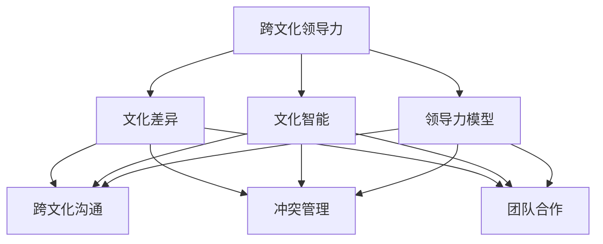

                 

### 文章标题

# 跨文化领导力：全球化时代的必备技能

在当今全球化的时代，企业面临的挑战和机遇前所未有。国际间的商业往来、技术创新和人才流动日益频繁，文化差异成为不可忽视的重要因素。在这种背景下，跨文化领导力成为企业成功的关键。本文将深入探讨跨文化领导力的概念、重要性及其在全球化时代的应用，为读者提供一套实用的指南。

### 关键词

- 全球化
- 跨文化领导力
- 文化差异
- 领导力模型
- 国际企业
- 案例分析

### 摘要

本文旨在揭示跨文化领导力在全球化时代的重要性。通过分析文化差异、文化智能和领导力模型等核心概念，本文探讨了跨文化沟通、冲突管理和团队合作等方面的理论与实践。此外，本文通过案例分析，为读者提供了实际操作中的指导和建议，以应对全球化背景下的领导力挑战。

### 引言

在全球化浪潮中，企业不仅要在国内市场保持竞争力，还需在海外市场拓展业务。这使得企业面临诸多文化差异，如价值观、行为规范和沟通方式等。跨文化领导力在此背景下显得尤为重要，它不仅是企业国际化的基础，更是企业成功的关键因素。本文将从以下几个方面展开探讨：

1. **背景与目的**：介绍跨文化领导力的概念及其在全球化背景下的重要性。
2. **基础概念**：详细解释文化差异、文化智能和领导力模型等核心概念。
3. **核心理论**：探讨跨文化沟通、冲突管理和团队合作等方面的理论与实践。
4. **案例分析**：分析跨国公司的成功与失败案例，总结跨文化领导力的关键要素。
5. **实践指南**：提供具体的领导力工具和方法，帮助读者在实际工作中应用跨文化领导力。
6. **挑战与未来趋势**：分析跨文化领导力在全球化时代面临的挑战和未来发展趋势。
7. **结论**：总结文章的主要观点，提出对读者的建议和未来研究方向。

### 基础概念

#### 文化差异

文化差异是跨文化领导力研究的基础。文化差异指的是不同文化群体在价值观、行为规范、沟通方式等方面的差异。了解文化差异有助于领导者更好地理解和沟通不同文化背景的员工。

**文化差异的类型**：

- **价值观差异**：不同文化对个人成就、权力距离、集体主义与个人主义有不同的看法。
- **行为规范差异**：不同文化在礼仪、时间观念、决策方式等方面存在差异。
- **沟通方式差异**：不同文化在语言表达、非语言交流、沟通频率等方面有所不同。

**文化差异的度量**：

- **霍夫斯泰德的文化维度模型**：通过权力距离、个体主义与集体主义、不确定性规避、价值观的长期与短期等维度，度量文化差异。
- **其他度量方法**：如格雷文化模型、特雷西文化成熟度模型等。

**文化差异对领导力的影响**：

- **领导风格适应性**：领导者需要根据不同文化的特点，调整领导风格，以适应不同文化背景的员工。
- **决策过程**：文化差异会影响决策过程，如决策速度、决策方式等。

#### 文化智能

文化智能是指个体在不同文化背景下有效沟通、学习和工作的能力。它是跨文化领导力的核心要素之一。

**文化智能的维度**：

- **文化意识**：了解和尊重不同文化的价值观和行为规范。
- **文化适应**：在不同文化环境中灵活调整自己的行为和沟通方式。
- **文化沟通**：有效沟通和解决跨文化冲突的能力。
- **文化学习**：持续学习和适应不同文化的态度和技能。

**培养文化智能的策略**：

- **文化培训**：通过文化课程、研讨会等方式，提高员工的文化意识。
- **经验交流**：鼓励员工跨文化交流，分享不同文化的经验和见解。
- **领导力发展**：为领导者提供跨文化领导力培训，提高其文化适应能力和沟通技巧。

#### 领导力模型

跨文化领导力需要一套适合不同文化背景的领导力模型。以下是几种常见的领导力模型：

- **情境领导模型**：根据员工的不同成熟度，选择合适的领导风格。
- **赫塞-布兰查德模型**：根据任务重要性和关系性质，选择合适的领导风格。
- **全球化领导模型**：结合文化智能和领导力情境，为跨文化环境提供指导。

### 核心理论

#### 跨文化沟通

跨文化沟通是跨文化领导力的核心。有效的跨文化沟通可以减少误解和冲突，提高团队合作效率。

**跨文化沟通的原则**：

- **相互尊重**：尊重不同文化的价值观和行为规范。
- **明确表达**：清晰表达自己的意图，避免使用含糊的词汇。
- **倾听与理解**：积极倾听他人的观点，理解其背后的文化意义。
- **非语言沟通**：注意不同文化的非语言沟通方式，如肢体语言、面部表情等。

**跨文化沟通的技巧**：

- **文化敏感度训练**：提高对文化差异的敏感度，避免文化偏见。
- **跨文化沟通工具**：使用跨文化沟通工具，如文化地图、沟通矩阵等。
- **多元化团队沟通**：建立多元化团队沟通机制，促进不同文化背景的员工交流。

#### 冲突管理

跨文化冲突是跨文化领导力中常见的挑战。有效的冲突管理可以降低冲突对团队和组织的负面影响。

**冲突管理的原则**：

- **相互理解**：理解冲突背后的文化差异，避免单一文化视角。
- **平等对待**：平等对待不同文化背景的员工，避免文化偏见。
- **合作解决**：通过合作和协商，寻找解决问题的方法。

**冲突管理的技巧**：

- **冲突预警机制**：建立冲突预警机制，提前发现和解决潜在冲突。
- **文化调适**：根据不同文化背景，调整冲突管理策略。
- **多元化团队冲突管理**：在多元化团队中，采用多元化的冲突管理策略。

#### 团队合作

团队合作是跨文化领导力的重要目标之一。有效的团队合作可以提升团队绩效，促进企业国际化。

**团队合作的原则**：

- **共同目标**：明确团队目标，确保团队成员共同努力。
- **相互信任**：建立团队成员之间的信任关系，提高团队合作效率。
- **沟通协作**：建立良好的沟通机制，促进团队成员之间的协作。

**团队合作的技巧**：

- **团队建设活动**：通过团队建设活动，增强团队成员之间的互动和信任。
- **多元文化融合**：促进不同文化背景的员工融合，提高团队整体绩效。
- **绩效评估**：建立多元化的绩效评估体系，激励团队成员合作。

### 案例分析

#### 案例一：跨国公司的成功领导

**背景**：某跨国公司在全球多个国家运营，文化差异明显。

**成功要素**：

- **文化敏感度**：公司领导者高度重视文化差异，尊重当地文化。
- **本地化管理**：公司采取本地化管理策略，灵活调整管理方式。
- **文化融合**：公司鼓励多元文化融合，促进团队成员之间的交流。

**结论**：跨国公司的成功领导在于文化敏感度和本地化管理策略的结合，有助于降低文化冲突，提高团队绩效。

#### 案例二：多元文化团队的管理挑战

**背景**：某跨国公司在多元化团队中面临管理挑战。

**挑战**：

- **沟通障碍**：团队成员来自不同文化背景，沟通存在障碍。
- **文化冲突**：不同文化之间的价值观和行为规范存在差异，导致冲突。
- **决策困难**：多元化团队在决策过程中，需要充分考虑不同文化的因素。

**解决方案**：

- **沟通培训**：为团队成员提供跨文化沟通培训，提高沟通效果。
- **文化融合**：建立多元文化融合机制，促进团队成员之间的交流。
- **领导力提升**：为领导者提供跨文化领导力培训，提高其文化适应能力和冲突管理能力。

**结论**：多元文化团队的管理挑战需要通过沟通培训、文化融合和领导力提升等方式解决，以实现团队的高效合作。

#### 案例三：全球化企业的文化适应策略

**背景**：某全球化企业面临文化适应挑战。

**策略**：

- **文化适应培训**：为员工提供文化适应培训，提高其文化适应能力。
- **本地化政策**：根据不同国家的情况，制定本地化政策，确保企业运营的适应性。
- **多元化领导团队**：建立多元化领导团队，促进文化融合和协同工作。

**结论**：全球化企业的文化适应策略需要从文化适应培训、本地化政策和多元化领导团队等方面入手，以实现企业的长期发展。

### 实践指南

#### 跨文化领导力的工具与方法

**文化差异分析工具**：使用文化差异分析工具，如霍夫斯泰德文化维度模型，了解不同文化之间的差异。

**文化智能评估工具**：使用文化智能评估工具，如文化智能问卷，评估员工的文化智能水平。

**领导力发展工具**：使用领导力发展工具，如情境领导模型和赫塞-布兰查德模型，为领导者提供跨文化领导力培训。

#### 领导力发展的实践路径

1. **文化培训**：为员工提供文化培训，提高其文化意识和文化适应能力。
2. **跨文化团队建设**：通过团队建设活动，增强团队成员之间的信任和合作。
3. **领导力发展计划**：为领导者提供跨文化领导力培训，提高其文化适应能力和冲突管理能力。
4. **绩效评估**：建立多元化的绩效评估体系，激励团队成员合作。

#### 跨文化领导力在项目管理中的应用

1. **项目沟通规划**：在项目启动阶段，制定跨文化沟通计划，确保项目顺利进行。
2. **文化适应策略**：根据不同文化背景，制定文化适应策略，降低文化冲突。
3. **多元化团队管理**：建立多元化团队，促进不同文化背景的员工合作。
4. **项目绩效评估**：建立多元化的项目绩效评估体系，激励团队成员合作。

### 挑战与未来趋势

#### 跨文化领导力面临的挑战

1. **文化差异**：文化差异是跨文化领导力面临的最大挑战之一，容易导致误解和冲突。
2. **领导力发展**：跨文化领导力的培养需要长期投入和持续努力，领导者需要不断提升自己的文化适应能力和领导力水平。
3. **国际竞争**：在全球化的竞争中，企业需要不断提高自身的跨文化领导力，以应对国际市场的挑战。

#### 全球化时代的领导力趋势

1. **文化智能**：随着全球化的深入，文化智能成为跨文化领导力的核心要素，领导者需要具备更高的文化适应能力和沟通技巧。
2. **多元化团队**：多元化团队成为企业的重要组成部分，领导者需要善于管理多元化团队，发挥团队的整体优势。
3. **领导力发展**：企业需要关注领导力的发展，为领导者提供跨文化领导力培训，提升其领导力水平。

#### 未来研究方向与建议

1. **文化差异研究**：进一步研究不同文化之间的差异及其对领导力的影响，为跨文化领导力提供理论支持。
2. **文化智能发展**：关注文化智能的发展，为领导者提供有效的文化适应策略和领导力培训。
3. **多元化团队管理**：研究多元化团队管理的方法和技巧，提高多元化团队的绩效。
4. **领导力发展模型**：构建适用于跨文化背景的领导力发展模型，为领导者提供实用的指导。

### 结论

跨文化领导力是全球化时代企业成功的关键。通过理解文化差异、培养文化智能、应用领导力模型和有效的沟通策略，领导者可以更好地应对跨文化挑战，实现企业的国际化发展。本文旨在为读者提供一套跨文化领导力的实践指南，以应对全球化背景下的领导力挑战。希望本文对读者在跨文化领导力方面的研究和实践有所帮助。

### 作者信息

作者：AI天才研究院/AI Genius Institute & 禅与计算机程序设计艺术 /Zen And The Art of Computer Programming

---

**Mermaid 流程图：**

---

本文通过逐步分析跨文化领导力的核心概念、理论、案例和实践指南，为读者提供了一套全面的跨文化领导力框架。希望读者能够通过本文，更好地理解和应用跨文化领导力，为企业全球化发展贡献力量。

### 最佳实践 Tips

1. **文化敏感性**：领导者应具备文化敏感性，尊重并理解不同文化的价值观和行为规范。
2. **持续学习**：跨文化领导力是一个持续发展的过程，领导者应不断学习和更新知识。
3. **团队建设**：通过团队建设活动，增强团队成员之间的信任和合作，提高团队绩效。
4. **有效沟通**：建立有效的沟通机制，确保信息准确传达，减少误解和冲突。
5. **多元化团队**：建立多元化团队，发挥团队成员的各自优势，提高团队整体竞争力。

### 小结

跨文化领导力是全球化时代企业成功的关键。通过理解文化差异、培养文化智能、应用领导力模型和有效的沟通策略，领导者可以更好地应对跨文化挑战，实现企业的国际化发展。本文为读者提供了一套全面的跨文化领导力框架，希望对读者在跨文化领导力方面的研究和实践有所帮助。

### 注意事项

1. **避免文化偏见**：领导者应避免文化偏见，尊重并理解不同文化的价值观和行为规范。
2. **个性化领导**：领导者应根据不同文化背景，采取个性化的领导方式，提高领导效果。
3. **持续反思**：领导者应持续反思自己的领导行为，不断优化领导策略。

### 拓展阅读

- 《跨文化管理》（郝志坚 著）
- 《文化冲突与融合》（詹姆斯·E·凯恩 著）
- 《全球领导力：如何在多元文化环境中实现卓越》（菲利普·H·罗施 著）

本文旨在为读者提供一套实用的跨文化领导力指南，帮助企业在全球化背景下取得成功。希望读者能够在实际工作中，结合本文的理论和实践，不断提升自己的跨文化领导力水平。

