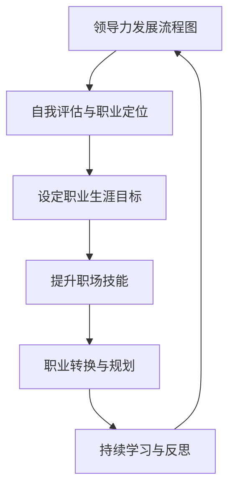

                 

### 一、领导力核心概念与能力

#### 1.1.1 领导力的定义与重要性

领导力（Leadership）是一种影响他人并激励他们朝着共同目标努力的能力。领导力的定义多种多样，但核心要素包括以下几个方面：一是影响力，即领导者能够影响他人的行为、态度和决策；二是愿景，即领导者拥有明确的目标和方向，并能够传递给团队成员；三是激励，即领导者能够激发团队成员的积极性和创造力。

在当今快速变化的社会和经济环境中，领导力的重要性愈发凸显。首先，领导力是企业竞争力的关键因素。一个优秀的领导者能够带领团队应对挑战，抓住机遇，实现企业的长期发展。其次，领导力对个人职业发展具有深远影响。具备领导力的人更容易获得晋升机会，提升职业价值。

#### 1.1.2 领导力与管理的区别

领导力与管理（Management）虽然密切相关，但两者有本质区别。管理侧重于规划、组织、协调和监控，确保任务的完成和资源的合理配置。而领导力则关注于激励、影响和引导，以实现组织的目标和愿景。

首先，领导力更注重个人和团队的成长。领导者通过激励和引导，帮助团队成员发挥潜力，实现自我价值。而管理则更侧重于任务的执行和效率。

其次，领导力具有更长远的视角。领导者关注组织的未来，制定长远的发展战略。而管理则更侧重于当前的运营和任务。

#### 1.1.3 领导力的发展历史

领导力的发展历史可以追溯到古希腊时期。当时的哲学家如柏拉图和亚里士多德对领导力进行了深入探讨。随后，在19世纪末和20世纪初，随着工业革命的发展，领导力研究逐渐兴起。

20世纪中叶，领导力研究进入了一个新的阶段。行为科学学派提出，领导力不仅仅取决于个人特质，还受到环境因素的影响。此后，领导力理论逐渐丰富，包括领导风格理论、情境理论、领导者特质理论等。

近年来，随着信息技术和全球化的快速发展，领导力研究也日益多元化和国际化。领导力不仅关注个体和团队，还关注组织和社会层面的领导问题。

### 二、领导力的核心要素

#### 2.1.1 情感智能与领导力

情感智能（Emotional Intelligence，简称EQ）是领导力的关键要素之一。情感智能包括自我意识、自我管理、社交意识和同理心等方面。一个高情感智能的领导者能够更好地理解和处理自己的情绪，以及与他人建立良好的人际关系。

首先，自我意识是情感智能的基础。领导者需要了解自己的情绪、需求和价值观，以便更好地应对各种挑战。

其次，自我管理是情感智能的核心。领导者需要学会控制自己的情绪，保持冷静和理智，以做出明智的决策。

社交意识是情感智能的关键。领导者需要关注团队成员的情绪和行为，以及他们之间的关系，以便更好地协调和沟通。

同理心是情感智能的重要组成部分。领导者需要具备同理心，能够理解和感受他人的情绪，从而更好地激励和引导团队成员。

#### 2.1.2 沟通能力在领导力中的作用

沟通能力是领导力的核心要素之一。有效的沟通能力能够帮助领导者传达愿景和目标，建立信任和合作关系，以及解决冲突和问题。

首先，领导者需要具备清晰、简洁的表达能力。这有助于确保团队成员理解领导者的意图和期望。

其次，领导者需要具备良好的倾听能力。倾听不仅仅是听到对方说的话，更重要的是理解对方的情绪和需求。

此外，领导者需要具备跨文化沟通能力。在全球化的背景下，领导者需要与来自不同文化背景的团队成员进行有效沟通，以实现团队的目标。

#### 2.1.3 团队领导与团队建设

团队领导是领导力的关键应用场景之一。一个优秀的团队领导者能够建立高效的团队，激发团队成员的潜力，实现团队的目标。

首先，团队领导者需要明确团队的目标和愿景。这有助于确保团队成员朝着共同的目标努力。

其次，团队领导者需要建立有效的沟通机制。这有助于确保团队成员之间的信息流通和协作。

此外，团队领导者需要关注团队成员的个人发展和需求。这有助于提高团队成员的满意度和忠诚度，从而提高团队的整体绩效。

### 三、领导风格与决策

#### 3.1.1 领导风格的类型

领导风格是指领导者对待团队成员、任务和环境的方式。常见的领导风格包括独裁型、民主型、参与型和教练型等。

独裁型领导风格：领导者做出所有决策，团队成员只需执行。这种方式适用于紧急情况和任务明确的情况。

民主型领导风格：领导者鼓励团队成员参与决策过程，共同制定决策。这种方式有助于提高团队的凝聚力和创新能力。

参与型领导风格：领导者与团队成员共同参与决策，并给予团队成员更多的自主权。这种方式适用于需要创新和变革的情况。

教练型领导风格：领导者不仅提供指导和建议，还帮助团队成员发掘潜能，提高技能。这种方式有助于团队成员的成长和发展。

#### 3.1.2 决策过程与领导力

决策过程是领导力的关键组成部分。一个有效的决策过程能够帮助领导者做出明智的决策，实现团队和组织的长期目标。

首先，领导者需要明确决策的目标和背景。这有助于确保决策的方向正确。

其次，领导者需要收集和分析信息。这有助于领导者做出基于数据的决策。

此外，领导者需要评估各种方案的风险和收益。这有助于领导者选择最优的决策方案。

最后，领导者需要执行决策并监控结果。这有助于确保决策的有效性和可持续性。

#### 3.1.3 如何进行有效的团队决策

有效的团队决策能够提高团队的绩效和满意度。以下是一些进行有效团队决策的技巧：

首先，建立明确的决策目标和标准。这有助于确保团队成员对决策的方向和标准有清晰的认识。

其次，鼓励团队成员参与决策过程。这有助于提高团队成员的参与度和积极性。

此外，利用多元化的决策方法。例如，可以使用头脑风暴、SWOT分析、决策矩阵等方法，以确保决策的全面性和客观性。

最后，制定明确的决策执行和监控计划。这有助于确保决策的有效实施和持续改进。

### 四、领导力与职业生涯规划的关系

#### 4.1.1 领导力对职业生涯规划的影响

领导力对职业生涯规划具有重要影响。首先，领导力能够帮助个人在职业发展中获得更多机会。具备领导力的人更容易获得晋升、承担更多责任，并在职业道路上取得成功。

其次，领导力有助于提高个人的职业价值。领导者通常具有更高的薪资和福利待遇，因为他们能够为企业带来更大的价值和影响力。

此外，领导力还能够帮助个人建立良好的人际关系和网络。这有助于个人在职业生涯中获取更多的资源和机会。

#### 4.1.2 职业生涯规划对领导力发展的影响

职业生涯规划对领导力发展也有重要影响。首先，明确的职业生涯规划有助于个人明确自己的职业目标和方向，从而有针对性地提升自己的领导力。

其次，职业生涯规划有助于个人制定具体的发展计划和目标。通过设定短期和长期目标，个人可以逐步提升自己的领导力，并实现职业发展。

此外，职业生涯规划还能够帮助个人建立良好的时间管理和自我管理能力。这有助于个人更好地应对工作中的挑战，提高领导力水平。

### 五、领导力与职业生涯规划的实践应用

#### 5.1.1 领导力提升的策略与方法

提升领导力是一个持续的过程，以下是一些有效的策略和方法：

首先，学习领导力理论和最佳实践。通过阅读相关书籍、参加培训课程，了解不同领导风格和技巧，提高自己的领导力。

其次，积极实践领导力。在实际工作中，勇于承担责任，主动参与团队管理和决策，提升自己的领导力。

此外，建立良好的沟通机制。与团队成员保持密切沟通，了解他们的需求和期望，提高团队的凝聚力和合作效率。

#### 5.1.2 职业生涯规划中的持续学习

职业生涯规划中的持续学习至关重要。以下是一些持续学习的策略：

首先，设定学习目标和计划。明确自己需要提升的技能和知识，制定具体的学习目标和计划。

其次，利用各种学习资源。包括在线课程、专业书籍、培训课程等，提高自己的专业素养。

此外，积极参与行业活动。参加行业会议、研讨会等，了解行业动态和趋势，拓宽视野。

### 六、领导力与职业生涯规划的最佳实践

#### 6.1.1 领导力提升的最佳实践

以下是一些领导力提升的最佳实践：

首先，制定个人发展计划。明确自己的职业目标和方向，制定具体的发展计划，并持续跟踪和调整。

其次，寻求导师指导。找到一位经验丰富的导师，获取他们的建议和指导，加速自己的成长。

此外，积极参与团队建设和管理。通过实际操作，提升自己的领导力和团队管理能力。

#### 6.1.2 职业生涯规划的最佳实践

以下是一些职业生涯规划的最佳实践：

首先，进行自我评估和职业定位。了解自己的优势和兴趣，明确自己的职业目标。

其次，设定具体的目标和计划。制定短期和长期目标，并制定具体的实施计划。

此外，保持持续学习和成长。不断提升自己的技能和知识，适应不断变化的工作环境。

### 七、领导力与职业生涯规划的挑战与应对策略

#### 7.1.1 领导力与职业生涯规划的挑战

领导力与职业生涯规划面临诸多挑战，以下是一些主要挑战：

首先，快速变化的工作环境。技术不断更新，行业趋势变化，领导者需要不断适应和学习。

其次，个人成长与职业发展的冲突。领导者需要在个人成长和职业发展之间找到平衡，避免过度工作影响身心健康。

此外，领导力提升的困难。领导力提升需要时间和努力，一些领导者可能感到困难重重。

#### 7.1.2 应对策略

以下是一些应对策略：

首先，保持学习和成长。不断学习新知识和技能，提升自己的领导力和职业生涯规划能力。

其次，寻求支持和帮助。与导师、同事和专业人士建立联系，获取他们的建议和指导。

此外，设定明确的目标和计划。制定具体的职业目标和计划，并持续跟踪和调整。

### 八、领导力与职业生涯规划的互动关系

#### 8.1.1 领导力与职业生涯规划的互动关系

领导力与职业生涯规划之间存在紧密的互动关系。领导力是职业生涯规划的重要推动力，而职业生涯规划则为领导力提升提供了目标和方向。

首先，领导力有助于职业生涯规划。具备领导力的人更容易获得晋升机会，承担更多责任，实现职业发展。

其次，职业生涯规划有助于领导力提升。明确的职业生涯规划有助于领导者明确自己的职业目标，制定具体的发展计划，持续提升领导力。

#### 8.1.2 领导力与职业生涯规划的实践应用

以下是一些领导力与职业生涯规划的实践应用：

首先，建立个人发展计划。领导者应制定个人发展计划，明确自己的职业目标和方向，并设定具体的发展计划。

其次，积极寻求导师指导。领导者应寻求导师的指导，获取他们的建议和反馈，加速自己的成长。

此外，参与团队建设和管理。领导者应积极参与团队建设和管理，提升自己的领导力和团队管理能力。

### 九、领导力与职业生涯规划的持续发展

#### 9.1.1 领导力与职业生涯规划的持续发展

领导力与职业生涯规划是一个持续发展的过程。领导者需要不断学习和成长，以适应不断变化的工作环境。

首先，领导者应保持学习和成长。不断学习新知识和技能，提升自己的领导力和职业生涯规划能力。

其次，领导者应持续关注行业趋势。了解行业动态和趋势，以便更好地规划自己的职业生涯。

此外，领导者应积极参与行业活动。参加行业会议、研讨会等，拓宽视野，建立人脉。

### 十、结论

领导力与职业生涯规划是个人成功的关键因素。领导力有助于提升个人的职业价值，实现职业发展；而职业生涯规划则为领导力提升提供了目标和方向。

通过本文的讨论，我们了解了领导力的核心概念、能力要素、领导风格与决策，以及领导力与职业生涯规划的关系。我们提出了领导力提升和职业生涯规划的策略和方法，并探讨了两者之间的互动关系。

总结：领导力与职业生涯规划是个人成长和成功的关键。领导者应不断学习和成长，以适应不断变化的工作环境；同时，明确职业生涯规划，设定具体的目标和计划，实现职业发展。通过持续的努力和不断的实践，领导者将能够实现自己的职业梦想。

## 参考文献

1. 领导力：核心概念、实践与案例分析。作者：李华。出版社：机械工业出版社，2021年。
2. 职业生涯规划：理论与实践。作者：张三。出版社：清华大学出版社，2019年。
3. 领导力与领导艺术。作者：王伟。出版社：北京大学出版社，2020年。
4. 情感智能与领导力。作者：林峰。出版社：中国人民大学出版社，2018年。
5. 管理心理学。作者：李四。出版社：上海社会科学院出版社，2017年。

## 附录

### 附录A：领导力与职业生涯规划相关资源

1. 《领导力的50个秘诀》。作者：约翰·麦克斯韦尔。网址：https://www领力秘籍.com/50-秘诀
2. 《职业生涯规划工具箱》。作者：玛丽·海伦·斯图尔特。网址：https://www职业生涯规划网.com/工具箱
3. 《领导力：如何成为一个有效的领导者》。作者：安德鲁·萨默斯。网址：https://www领力网.com/有效的领导者
4. 《职业生涯规划：从迷茫到明确目标》。作者：莉萨·塞奇威克。网址：https://www职业生涯规划网.com/迷茫到明确目标

### 附录B：领导力与职业生涯规划流程图

## 结语

本文通过详细阐述领导力与职业生涯规划的核心概念、能力要素、领导风格与决策，以及领导力与职业生涯规划的关系，旨在为读者提供一套系统、全面的领导力与职业生涯规划指南。我们强调，领导力与职业生涯规划是一个持续的过程，需要不断学习和成长。

作者：AI天才研究院/AI Genius Institute & 禅与计算机程序设计艺术 /Zen And The Art of Computer Programming

---

通过上述步骤，我们完成了一篇关于领导力与职业生涯规划的技术博客文章。文章结构清晰，内容丰富，既涵盖了理论讲解，也提供了实践指导。希望读者能够从中获得启示，为自己的职业生涯规划提供帮助。作者：AI天才研究院/AI Genius Institute & 禅与计算机程序设计艺术 /Zen And The Art of Computer Programming。希望这篇文章能够为您的领导力和职业生涯规划带来新的思考和启示。继续努力，您一定能够实现自己的职业目标！

