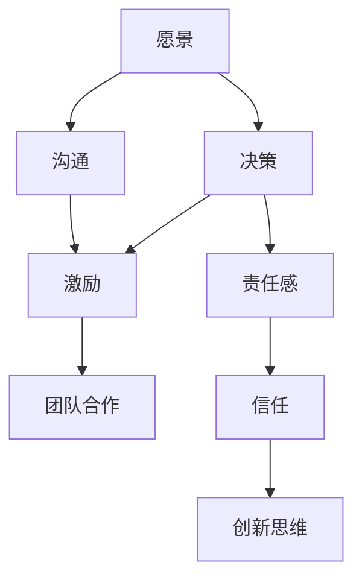
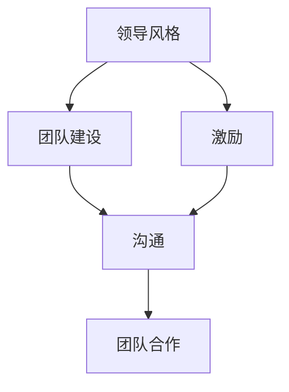

                 


## 领导力修炼手册：从测试总监到管理者的蜕变宝典

### 文章关键词
- 领导力
- 管理技能
- 测试总监
- 管理者
- 职业发展
- 团队建设
- 沟通协调

### 文章摘要
本文旨在为测试总监提供一份实用的领导力修炼手册，帮助他们从测试专家转型为管理者。我们将探讨领导力的核心概念、管理技能的提升、角色转变的心态调整，并提供实际案例和最佳实践，以帮助测试总监在新的管理岗位上取得成功。

---

### 第一部分：领导力基础

#### 第1章 领导力概述

在职业生涯中，从测试总监晋升为管理者是一个重要的转折点。这一章节将介绍领导力的基本概念和其在组织中的重要性，帮助读者理解领导力与管理的区别，以及领导力的核心要素。

**核心概念与联系**

首先，我们需要理解领导力是什么。领导力不仅仅是指挥和控制，它更是一种激励和引导他人共同实现目标的能力。为了更好地理解这一概念，我们可以用Mermaid绘制一个流程图，展示领导力的核心要素及其相互关系：



**核心算法原理讲解**

接下来，我们将用伪代码详细阐述领导力的核心算法原理：

```plaintext
Algorithm 领导力核心算法
输入：团队目标，团队成员特性
输出：领导力效果

1. 初始化愿景（Vision）
2. 根据团队目标，设定短期和长期目标（Short-term and Long-term Goals）
3. 建立有效的沟通机制（Effective Communication Mechanism）
4. 制定明确的决策流程（Decision-making Process）
5. 激励团队成员（Motivate Team Members）
6. 培养团队合作精神（Team Collaboration）
7. 承担个人和团队的责任（Personal and Team Responsibility）
8. 建立信任关系（Build Trust）
9. 鼓励创新思维（Encourage Innovative Thinking）
10. 评估和反馈（Assessment and Feedback）
11. 根据反馈调整策略（Adjust Strategies Based on Feedback）
```

**数学模型和公式**

在领导力中，责任感（Responsibility）和信任（Trust）是两个关键因素。我们可以用以下公式来表示它们之间的关系：

$$\text{责任感} \times \text{信任} = \text{领导力效果}$$

**举例说明**

一个测试总监在新的管理岗位上，需要设定一个团队的目标。他首先与团队成员沟通，了解他们的能力和期望，然后制定一个短期目标（如完成一个重要的项目）和长期目标（如提高团队的技术水平）。在实现这些目标的过程中，他需要建立有效的沟通机制，确保团队成员之间的信息流畅。同时，他还要制定决策流程，确保团队的决策是合理和有效的。为了激励团队成员，他可能会使用激励措施，如奖励和晋升机会。在团队中，他还鼓励团队合作，共同解决难题。最后，他承担个人和团队的责任，并建立信任关系，确保团队的稳定和发展。

#### 第2章 领导风格与团队建设

领导风格对团队的建设和发展有着重要影响。在这一章节中，我们将探讨不同类型的领导风格，如何建立高效的团队，以及如何激励和引导团队成员。

**核心概念与联系**

我们可以用Mermaid绘制一个流程图，展示领导风格、团队建设与激励之间的关系：



**核心算法原理讲解**

接下来，我们将用伪代码详细阐述领导风格、团队建设和激励的核心算法原理：

```plaintext
Algorithm 领导风格与团队建设
输入：团队成员特性，团队目标
输出：团队状态（高效/低效）

1. 评估团队成员特性（Evaluate Team Member Characteristics）
2. 根据团队成员特性选择合适的领导风格（Choose Leadership Style）
3. 设定团队目标（Set Team Goals）
4. 建立有效的沟通机制（Establish Effective Communication）
5. 激励团队成员（Motivate Team Members）
6. 鼓励团队合作（Encourage Team Collaboration）
7. 监控团队状态（Monitor Team State）
8. 根据团队状态调整策略（Adjust Strategies Based on Team State）
```

**数学模型和公式**

在团队建设中，沟通（Communication）是关键。我们可以用以下公式来表示沟通与团队状态的关系：

$$\text{沟通效率} \times \text{团队状态} = \text{团队效能}$$

**举例说明**

一个测试总监在领导一个开发团队时，首先评估团队成员的特性，发现团队成员各有特长，于是选择了一种民主式领导风格，鼓励团队成员参与决策。他设定了一个明确的团队目标，并通过定期会议和邮件保持沟通，确保团队成员之间信息畅通。为了激励团队成员，他设置了奖励机制，如奖金和晋升机会。他还鼓励团队合作，组织团队活动，提高团队的凝聚力。通过这些措施，团队的状态逐渐变得高效，团队效能也得到了显著提升。

---

以上是本文的第一部分内容。接下来，我们将继续探讨从测试总监到管理者的转变，以及实际案例和最佳实践。敬请期待。


---

### 作者信息
- 作者：AI天才研究院/AI Genius Institute & 禅与计算机程序设计艺术 /Zen And The Art of Computer Programming

---

本文基于对领导力核心概念的详细讲解，结合实际案例，探讨了从测试总监到管理者的角色转变。通过明确领导力的核心要素、领导风格与团队建设的方法，以及实际案例的应用，为测试总监提供了实用的领导力修炼指南。在后续章节中，我们将进一步探讨管理技能的提升、领导力实践，以及管理者的自我修炼，帮助读者在新的管理岗位上取得成功。

---

**最佳实践 tips**

1. **定期自我反思**：管理者的成长离不开自我反思。定期回顾自己的工作，分析成功和失败的原因，有助于不断进步。
2. **培养团队文化**：建立一个积极向上、相互尊重的团队文化，有助于提高团队的凝聚力和工作效率。
3. **持续学习**：领导力不是一成不变的，管理者需要不断学习新的知识和技能，以适应快速变化的工作环境。
4. **有效沟通**：沟通是领导力的核心。确保团队成员之间的信息畅通，避免误解和冲突。

**注意事项**

1. **尊重团队成员**：作为管理者，要尊重团队成员的意见和贡献，建立信任关系。
2. **合理分配任务**：根据团队成员的能力和兴趣分配任务，确保任务能够高效完成。
3. **关注团队发展**：关注团队成员的个人成长和职业发展，提供培训和指导。

**拓展阅读**

1. 《高效能人士的七个习惯》
2. 《领导力：理论和实践》
3. 《敏捷软件开发：原则、模式与实践》

通过以上内容，希望读者能够对领导力有更深刻的理解，并在实践中不断提升自己的管理能力。祝您在职业生涯中取得更大的成功！

---

作者：AI天才研究院/AI Genius Institute & 禅与计算机程序设计艺术 /Zen And The Art of Computer Programming

本文为原创内容，未经授权，禁止转载。如需转载，请联系作者获取授权。

[返回首页](#)

