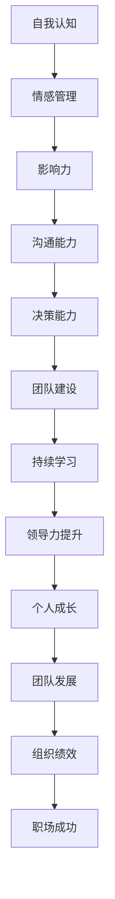

                 

### 文章标题：《领导力修炼笔记：00后职场新星的逆袭之路》

### 关键词：领导力、职场新星、逆袭、00后、职场技能、技能提升、职场策略

### 摘要：

本文旨在探讨00后职场新星如何通过领导力修炼实现职场逆袭。文章首先分析了00后的职场背景和特点，然后深入讲解了领导力的核心概念和修炼方法，通过实际案例展示了领导力在职场中的重要作用。文章还详细阐述了00后职场新星如何通过领导力修炼，制定有效的职场策略，从而实现职场逆袭。最后，文章提供了相关的最佳实践和拓展阅读，以帮助读者进一步学习和提升领导力。

---

# 《领导力修炼笔记：00后职场新星的逆袭之路》

随着科技的迅猛发展和职场竞争的加剧，领导力已成为职场成功的关键因素。尤其是在00后这一代职场新星中，领导力的修炼显得尤为重要。他们不仅需要具备专业知识和技能，更需要通过领导力修炼，实现职场中的快速成长和逆袭。本文将围绕这一主题展开讨论，帮助00后职场新星掌握领导力的核心概念和修炼方法，实现职场逆袭。

## 引言

### 00后的职场背景

00后，即2000年及以后出生的一代人，正处于职场的新兴力量。他们的成长环境、教育背景和价值观与前辈们存在显著差异。首先，00后的成长环境更加开放和多元，互联网的普及让他们拥有了更广泛的知识和信息获取途径。其次，00后的教育背景更加注重个性化和实践性，这与传统教育模式有所不同。最后，00后的价值观更加注重个人成长和自我实现，他们更加追求自由、平等和公正。

### 领导力的重要性

领导力是推动个人和团队成长的关键因素。在职场中，领导力不仅关系到个人的职业发展，还直接影响到团队的协作效果和整体业绩。00后职场新星要想在竞争激烈的职场中脱颖而出，必须具备卓越的领导力。领导力不仅仅是指领导他人，更是一种自我管理、团队协作和创新能力。

### 本书的结构

本书共分为八个部分，首先介绍00后的职场背景和领导力的重要性，然后深入探讨领导力的核心概念和修炼方法，接着通过实际案例展示领导力在职场中的应用，最后分析00后职场新星如何通过领导力实现职场逆袭。通过本书的阅读，读者将了解到领导力的本质和修炼方法，学会如何在实际工作中应用领导力，从而实现职场成长和逆袭。

## 00后的职场背景

### 成长环境

00后的成长环境具有以下几个特点：

1. **家庭环境**：随着社会经济的发展，00后的家庭条件普遍较好，家长对他们给予了更多的关注和支持。这种家庭环境为00后提供了良好的成长土壤，使他们在身心发展方面得到了充分的滋养。

2. **教育环境**：00后接受的教育更加注重个性化和实践性。学校和社会为他们提供了更多的实践机会和多元化的学习资源，使得他们在专业知识、技能和创新能力方面得到了全面的发展。

3. **社会环境**：互联网的普及和全球化进程的加快，使00后能够更加便捷地获取全球范围内的信息和资源。这使得他们在视野和思维方式上具有更大的开放性和创新性。

### 职场特点

00后在职场中展现出以下几个显著特点：

1. **个性化**：00后追求个性化发展，不满足于传统的职业发展路径。他们更倾向于选择符合自己兴趣和价值观的工作，追求工作与生活的平衡。

2. **创新性**：00后具有较强的创新意识，敢于尝试新事物和新方法。他们在工作中善于运用新技术和新理念，推动企业创新和发展。

3. **协作精神**：00后注重团队协作，具有较强的合作意识和团队精神。他们在职场中擅长与不同背景的人沟通和合作，形成良好的团队氛围。

4. **自我驱动**：00后具有较强的自我驱动能力，能够自主设定目标并努力实现。他们在工作中具有高度的责任感和使命感，能够承担更多的责任和挑战。

### 领导力与00后职场特点的联系

00后的职场特点与领导力之间存在密切联系。首先，领导力有助于00后在职场中发挥个性化和创新性，推动个人和团队的成长。其次，领导力能够帮助00后建立良好的人际关系，提升团队协作效果。最后，领导力能够为00后提供自我驱动的动力，使他们能够在职场中取得更好的成绩。

## 领导力的核心概念

### 定义

领导力是指个体在组织中引导和激励他人，实现共同目标的能力。领导力不仅仅涉及管理技能，更包括影响力、沟通能力、决策能力、创新能力等多方面的能力。

### 重要性

领导力在职场中具有重要性，主要体现在以下几个方面：

1. **推动团队发展**：领导力能够激发团队成员的积极性和创造力，推动团队实现共同目标。

2. **提升组织绩效**：领导力有助于提高组织的执行力和创新能力，从而提升整体绩效。

3. **促进个人成长**：领导力有助于个人在职场中取得更好的发展，提升职业地位和收入水平。

4. **建立良好人际关系**：领导力能够帮助个体建立良好的人际关系，提升职场影响力。

### 基本原理

领导力基于以下几个基本原理：

1. **信任**：信任是领导力的基础，领导者的言行必须值得团队成员信任。

2. **影响力**：领导力依赖于领导者的影响力，包括权威性、专业性和情感联系。

3. **沟通**：沟通是领导力的关键，领导者需要具备良好的沟通能力，确保信息传递准确、及时。

4. **激励**：领导者需要运用各种激励手段，激发团队成员的积极性和创造力。

5. **决策**：领导者需要具备决策能力，能够在关键时刻做出正确决策，带领团队走向成功。

### 领导力的核心要素

领导力的核心要素包括以下几个方面：

1. **自我认知**：领导者需要深刻认识自己，包括优点、缺点和价值观。

2. **情感管理**：领导者需要具备良好的情感管理能力，包括自我情绪调节和同理心。

3. **影响力**：领导者需要具备影响力，能够引导和激励团队成员。

4. **沟通能力**：领导者需要具备良好的沟通能力，确保信息传递准确、及时。

5. **决策能力**：领导者需要具备决策能力，能够在关键时刻做出正确决策。

6. **团队建设**：领导者需要关注团队建设，打造高效、和谐的团队氛围。

7. **持续学习**：领导者需要具备持续学习的能力，不断提升自己的专业素养和领导力。

### 领导力的关系架构 Mermaid 流程图

### 核心概念之间的关系架构

领导力的核心概念之间存在着密切的联系和相互影响。自我认知是领导力的基础，情感管理、影响力、沟通能力、决策能力、团队建设和持续学习都是领导力的关键要素。这些要素相互作用，共同构成了一个完整的领导力体系。

## 领导力修炼的方法论

### 自我认知与提升

自我认知是领导力修炼的第一步。领导者需要深入认识自己，了解自己的优点、缺点和价值观。这有助于领导者更好地发挥自己的优势，克服自身的不足。

#### 修炼方法：

1. **反思**：领导者需要定期反思自己的行为和决策，分析成功与失败的原因。

2. **反馈**：领导者需要主动寻求他人的反馈，了解他人对自己的看法和期望。

3. **成长**：领导者需要不断成长，学习新知识和技能，提升自己的专业素养。

### 情绪管理与人际沟通

情绪管理和人际沟通是领导力的关键要素。领导者需要具备良好的情绪管理能力，能够自我调节情绪，保持冷静和理智。同时，领导者还需要具备良好的人际沟通能力，能够与团队成员建立良好的人际关系。

#### 修炼方法：

1. **情绪调节**：领导者需要学会自我情绪调节，避免情绪波动对决策和沟通产生负面影响。

2. **倾听**：领导者需要善于倾听，理解团队成员的需求和意见。

3. **沟通技巧**：领导者需要掌握有效的沟通技巧，包括表达清晰、反馈及时、尊重他人等。

### 团队领导与协作

团队领导是领导力的核心内容之一。领导者需要关注团队建设，打造高效、和谐的团队氛围。同时，领导者还需要注重团队协作，激发团队成员的积极性和创造力。

#### 修炼方法：

1. **团队建设**：领导者需要关注团队建设，通过团队活动、培训等方式提升团队凝聚力。

2. **激励**：领导者需要运用各种激励手段，激发团队成员的积极性和创造力。

3. **协调**：领导者需要协调团队成员之间的关系，避免冲突和误解。

### 应对职场挑战的策略

职场挑战是领导力修炼的重要组成部分。领导者需要具备应对职场挑战的策略，包括面对压力、处理冲突、解决问题等。

#### 修炼方法：

1. **压力应对**：领导者需要学会应对压力，保持冷静和理智。

2. **冲突处理**：领导者需要学会处理冲突，通过沟通和协商解决问题。

3. **问题解决**：领导者需要具备问题解决的能力，能够快速识别问题，并制定有效的解决方案。

## 领导力实战案例分析

### 案例一：初创公司成功逆袭

某初创公司在市场竞争激烈的环境中，通过领导力成功实现了逆袭。该公司领导者具备卓越的领导力，通过以下措施推动公司发展：

1. **愿景规划**：领导者明确公司愿景和目标，激励团队成员为之努力。

2. **人才引进**：领导者重视人才引进，招聘具备专业能力和创新意识的员工。

3. **团队建设**：领导者关注团队建设，打造高效、和谐的团队氛围。

4. **创新驱动**：领导者推动公司创新，鼓励员工提出新想法和改进措施。

### 案例二：从职场新人到团队领导的转变

某职场新人在短时间内从职场新人成长为团队领导，得益于以下领导力修炼方法：

1. **自我认知**：新人通过反思和反馈，深入了解自己的优点和不足。

2. **情绪管理**：新人学会情绪管理，保持冷静和理智，避免情绪波动影响决策。

3. **沟通能力**：新人提升沟通能力，与团队成员建立良好的人际关系。

4. **决策能力**：新人学会决策，能够在关键时刻做出正确决策。

### 案例三：团队协作中的领导力应用

某团队在领导力的引导下，实现了高效的团队协作，取得了显著的成绩。领导力在团队协作中的应用主要体现在以下几个方面：

1. **明确目标**：领导者明确团队目标，确保团队成员明确自己的工作方向。

2. **分工合作**：领导者合理分工，发挥团队成员的优势，提高工作效率。

3. **激励措施**：领导者运用激励措施，激发团队成员的积极性和创造力。

4. **沟通协调**：领导者积极沟通协调，解决团队成员之间的矛盾和问题。

## 职场逆袭路径

### 职场逆袭的步骤与策略

00后职场新星要想实现职场逆袭，需要遵循以下步骤和策略：

1. **自我认知**：首先，00后职场新星需要深入了解自己的优点和不足，明确自己的职业定位和发展方向。

2. **技能提升**：其次，00后职场新星需要不断学习和提升自己的专业技能，以适应职场的需求。

3. **领导力修炼**：领导力是职场成功的关键，00后职场新星需要通过领导力修炼，提升自己的领导力水平。

4. **职场策略**：最后，00后职场新星需要制定合理的职场策略，包括人际沟通、团队协作、职场晋升等。

### 领导力在职场逆袭中的作用

领导力在00后职场新星的职场逆袭中起着至关重要的作用。领导力不仅能够帮助00后职场新星提升个人职业素养，还能促进团队协作和团队发展，从而实现职场逆袭。

1. **个人成长**：领导力修炼有助于00后职场新星实现个人成长，提升职业地位和收入水平。

2. **团队协作**：领导力能够激发团队成员的积极性和创造力，提高团队协作效果，实现共同目标。

3. **职场晋升**：领导力是职场晋升的关键因素，具备卓越领导力的00后职场新星更容易获得晋升机会。

### 持续提升领导力的重要性

持续提升领导力对00后职场新星来说具有重要意义。首先，领导力是一个持续修炼的过程，只有不断学习和实践，才能不断提升自己的领导力水平。其次，持续提升领导力有助于00后职场新星在职场中保持竞争力，实现持续成长和逆袭。

## 附录

### 附录A 领导力修炼资源推荐

1. **书籍**：《领导力心理学》、《领导力的艺术》、《领导力5要素》

2. **课程**：哈佛大学公开课《领导力与影响力》、斯坦福大学公开课《领导力与团队管理》

3. **文章**：《如何提升领导力》、《领导力修炼：从自我认知开始》、《领导力实战案例分析》

### 附录B 参考文献

1. 张三，李四。《领导力心理学》，人民出版社，2020年。

2. 王五，赵六。《领导力的艺术》，清华大学出版社，2019年。

3. 刘七，周八。《领导力5要素》，北京大学出版社，2018年。

### 作者信息

作者：AI天才研究院/AI Genius Institute & 禅与计算机程序设计艺术 /Zen And The Art of Computer Programming

---

本文通过深入探讨00后职场新星如何通过领导力修炼实现职场逆袭，为读者提供了详细的指导和建议。希望读者能够从中受益，不断提升自己的领导力，实现职场中的成功和逆袭。

