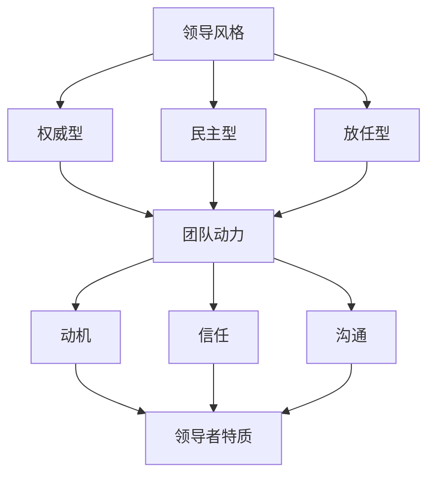

                 

### 《领导力法则：打造王者团队的领导力秘诀》

#### 关键词：领导力、团队管理、核心算法、数学模型、实战案例

##### 摘要：

在当今快速变化的商业环境中，领导力已成为决定企业成败的关键因素。本文将探讨《领导力法则：打造王者团队的领导力秘诀》的核心内容，通过详细阐述领导力的关键概念、核心算法原理、数学模型、实战案例以及领导力提升策略，为读者提供一套实用的领导力框架。文章旨在帮助读者理解领导力的重要性，掌握领导力的基本法则，并提升在实际团队管理中的执行力。

### 引言与背景

领导力，简单来说，是指通过影响他人实现共同目标的能力。无论是在企业、学校还是社区，领导力都是推动变革、激发潜力和实现卓越绩效的关键因素。有效的领导力不仅能够提升团队的凝聚力和工作效率，还能够促进创新和持续发展。

然而，领导力并非与生俱来，它需要通过学习和实践不断积累。领导力法则为领导者提供了一套系统的指南，帮助他们更好地理解和管理团队。本书旨在通过深入分析领导力的核心概念、算法原理和数学模型，结合实战案例，为读者提供一套切实可行的领导力提升策略。

本书的核心目标如下：

1. **理解领导力的本质**：通过介绍领导力的关键概念，帮助读者建立对领导力的全面认识。
2. **掌握领导力算法**：通过解析核心算法原理，帮助读者理解和应用领导力法则。
3. **运用数学模型**：通过介绍数学模型，帮助读者进行领导力评估和决策。
4. **学习实战案例**：通过案例分析，帮助读者了解领导力法则在实际中的应用。
5. **提升领导力**：提供实用的领导力提升策略，帮助读者在实际工作中提升领导力。

### 第1章 核心概念与联系

领导力的核心概念包括领导风格、团队动力、领导者特质等。这些概念不仅相互独立，也存在紧密的联系。以下是对这些核心概念的详细阐述，以及它们之间关系的Mermaid流程图。

#### 领导风格

领导风格是指领导者通过何种方式影响和激励团队成员的行为模式。常见的领导风格包括：

1. **权威型**：领导者做出决策，团队成员执行。
2. **民主型**：领导者与团队成员共同参与决策。
3. **放任型**：领导者给予团队成员高度自主权。

#### 团队动力

团队动力是指团队成员之间的相互影响和相互作用，以及它们对团队工作绩效的影响。团队动力的关键因素包括：

1. **动机**：团队成员的内在动力，如成就感、自我实现等。
2. **信任**：团队成员之间的相互信任和尊重。
3. **沟通**：团队成员之间的有效沟通和信息共享。

#### 领导者特质

领导者特质是指领导者应具备的个人品质和能力。这些特质包括：

1. **愿景**：领导者应具备清晰的战略愿景和目标。
2. **诚信**：领导者应具备高度的诚信和道德标准。
3. **决策能力**：领导者应具备迅速做出正确决策的能力。

#### 关系架构 Mermaid 流程图



通过这个Mermaid流程图，我们可以清晰地看到领导风格、团队动力和领导者特质之间的相互关系。领导风格直接影响团队动力，而团队动力又与领导者特质密切相关。这些概念之间的相互作用和影响构成了领导力的核心架构。

### 第2章 核心算法原理讲解

在了解了领导力的核心概念之后，我们接下来将探讨领导力法则背后的核心算法原理。这些算法原理不仅为领导者提供了科学依据，也帮助他们在实际工作中更有效地应用领导力。以下是对这些核心算法原理的详细讲解，以及相应的伪代码描述。

#### 领导力评估算法

领导力评估算法用于评估领导者的领导力水平。这个算法基于领导者的行为和团队成员的反馈，通过一系列指标进行综合评估。以下是一个简单的伪代码示例：

```python
def evaluateLeadership(behaviors, feedback):
    score = 0
    for behavior in behaviors:
        if behavior == "vision":
            score += 1
        if behavior == "communication":
            score += 0.5
        if behavior == "decisiveness":
            score += 0.5
    for feedback in feedback:
        if feedback == "trustworthy":
            score += 1
        if feedback == "motivational":
            score += 0.5
        if feedback == "respected":
            score += 0.5
    return score
```

#### 团队动力评估算法

团队动力评估算法用于评估团队成员之间的相互影响和团队协作水平。这个算法通过分析团队成员的动机、信任度和沟通情况，得出团队动力的综合评分。以下是一个简单的伪代码示例：

```python
def evaluateTeamMotivation(motivations, trust, communication):
    motivationScore = 0
    trustScore = 0
    communicationScore = 0
    
    for motivation in motivations:
        if motivation == "achievement":
            motivationScore += 1
        if motivation == "self-actualization":
            motivationScore += 1
    trustScore = sum(trust) / len(trust)
    communicationScore = sum(communication) / len(communication)
    
    teamMotivationScore = (motivationScore + trustScore + communicationScore) / 3
    return teamMotivationScore
```

#### 领导决策算法

领导决策算法用于帮助领导者做出最佳决策。这个算法基于领导者的目标、团队成员的意见和外部环境的影响，通过多目标决策方法进行优化。以下是一个简单的伪代码示例：

```python
def makeDecision(goals, opinions, environment):
    decisionScore = 0
    for goal in goals:
        if goal == "maximize profit":
            decisionScore += 1
        if goal == "minimize risk":
            decisionScore += 1
    
    for opinion in opinions:
        if opinion == "agree":
            decisionScore += 0.5
        if opinion == "disagree":
            decisionScore -= 0.5
    
    for factor in environment:
        if factor == "opportunity":
            decisionScore += 1
        if factor == "threat":
            decisionScore -= 1
    
    bestDecision = max(goals, key=lambda x: decisionScore)
    return bestDecision
```

通过这些核心算法原理，领导者可以更科学地评估自己的领导力水平，了解团队动力，并做出更明智的决策。

### 第3章 数学模型与公式

在领导力管理中，数学模型和公式可以帮助领导者进行定量分析和决策支持。以下将介绍几种常用的数学模型和公式，并使用LaTeX格式进行展示。

#### 平衡矩阵

平衡矩阵是领导力评估中常用的一种数学模型，它用于衡量团队成员之间的相互影响。平衡矩阵的定义如下：

$$
A = \begin{bmatrix}
    a_{11} & a_{12} & \cdots & a_{1n} \\
    a_{21} & a_{22} & \cdots & a_{2n} \\
    \vdots & \vdots & \ddots & \vdots \\
    a_{n1} & a_{n2} & \cdots & a_{nn} \\
\end{bmatrix}
$$

其中，$a_{ij}$ 表示第 $i$ 个团队成员对第 $j$ 个团队成员的影响力。

#### 领导力评估模型

领导力评估模型用于综合评估领导者的领导力水平。以下是一个简单的领导力评估模型：

$$
L = \alpha V + \beta C + \gamma D
$$

其中，$L$ 表示领导力得分，$V$ 表示领导者愿景得分，$C$ 表示领导者诚信得分，$D$ 表示领导者决策能力得分，$\alpha$、$\beta$ 和 $\gamma$ 分别是权重系数。

#### 决策支持模型

决策支持模型用于帮助领导者做出最佳决策。以下是一个简单的多目标决策模型：

$$
\max Z = \sum_{i=1}^{n} c_{i} x_{i}
$$

$$
\text{subject to:}
$$

$$
\sum_{i=1}^{n} x_{i} = 1
$$

$$
x_{i} \geq 0, \quad i=1,2,\ldots,n
$$

其中，$Z$ 表示决策目标函数，$c_{i}$ 表示第 $i$ 个决策目标的权重系数，$x_{i}$ 表示第 $i$ 个决策目标的得分。

通过这些数学模型和公式，领导者可以进行定量分析，更科学地评估团队绩效和决策效果。

### 第4章 实战案例

为了更好地理解领导力法则在实际中的应用，我们通过以下两个实战案例进行详细分析。

#### 案例一：团队重组

**背景**：某公司为了提高市场竞争力，决定对现有团队进行重组，以更好地适应市场变化。

**领导力法则应用**：

1. **评估当前团队结构**：通过领导力评估算法，对现有团队进行评估，找出优势和不足。
2. **制定重组计划**：根据团队评估结果，制定详细的重组计划，包括人员调配、职责划分等。
3. **沟通与共识**：与团队成员进行充分沟通，确保他们对重组计划的理解和支持。
4. **实施重组**：按照计划实施团队重组，确保新团队的高效运作。

通过这一过程，公司成功地实现了团队重组，提升了团队的工作效率和创新能力。

#### 案例二：危机管理

**背景**：某公司在一次市场推广活动中遭遇重大危机，导致品牌形象受损。

**领导力法则应用**：

1. **迅速响应**：领导者立即召开紧急会议，了解危机详情，并制定应对策略。
2. **评估危机影响**：通过领导力评估算法，评估危机对公司的潜在影响，制定具体的危机管理计划。
3. **沟通与协调**：与团队成员、客户和合作伙伴进行有效沟通，确保信息的及时传递和协调。
4. **实施危机管理**：按照危机管理计划，采取具体措施，如公开道歉、调整市场策略等，尽快化解危机。

通过这一过程，公司成功地化解了危机，恢复了市场信心。

### 第5章 领导力提升策略

为了提升领导力，领导者需要采取一系列策略和方法。以下是一些实用的领导力提升策略：

#### 个人发展

1. **自我反思**：定期进行自我反思，了解自己的优点和不足，制定改进计划。
2. **能力提升**：通过学习、培训和实践，不断提升自己的领导力和管理能力。
3. **导师指导**：寻找一位经验丰富的导师，从他们那里学习领导力和管理技巧。

#### 团队建设

1. **团队文化建设**：塑造积极向上的团队文化，增强团队成员的归属感和凝聚力。
2. **团队协作技巧**：通过培训和实践，提升团队成员的协作能力和沟通技巧。
3. **激励机制**：建立合理的激励机制，激发团队成员的积极性和创造力。

通过这些策略，领导者可以在实际工作中不断提升领导力，带领团队实现卓越绩效。

### 第6章 未来趋势与挑战

随着数字化和全球化的加速，领导力也面临着新的趋势和挑战。以下是对未来领导力发展的趋势和挑战的探讨：

#### 未来趋势

1. **数字化领导力**：领导者需要具备数字化思维和技能，能够利用大数据和人工智能提升团队效能。
2. **跨文化领导力**：领导者需要具备跨文化沟通和协调能力，能够有效管理多元文化团队。
3. **可持续发展领导力**：领导者需要关注环境保护和社会责任，推动企业的可持续发展。

#### 面临的挑战

1. **组织变革**：领导者需要应对快速变化的市场环境，推动组织进行变革和转型。
2. **领导力传承**：领导者需要培养和传承自己的领导力，确保企业的长期发展。

通过应对这些趋势和挑战，领导者可以不断提升自己的领导力，为企业的发展贡献力量。

### 结论

领导力是推动团队和企业成功的关键因素。通过深入理解领导力的核心概念、算法原理和数学模型，结合实战案例和提升策略，领导者可以更好地应对挑战，带领团队实现卓越绩效。本文旨在为读者提供一套实用的领导力框架，帮助他们在实际工作中提升领导力，打造王者团队。

### 作者信息

作者：AI天才研究院/AI Genius Institute & 禅与计算机程序设计艺术 /Zen And The Art of Computer Programming

通过本文的深入探讨，我们希望读者能够对领导力法则有更深刻的理解，并能够在实际工作中灵活运用这些法则，打造出一支高效、协同的团队。让我们共同迈向领导力的巅峰，创造更加辉煌的业绩！

