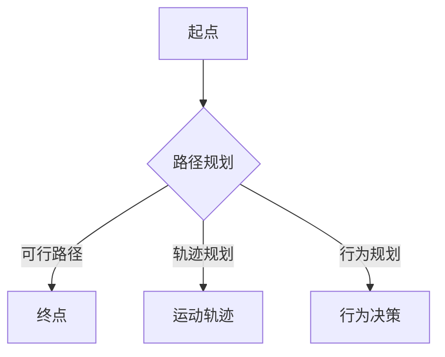

                 


### 1. 文章标题：仿生机器人的运动规划：生物启发的数学算法

**关键词**：仿生机器人、运动规划、生物启发、数学算法、机器人运动

**摘要**：本文将探讨仿生机器人的运动规划及其背后的生物启发的数学算法。通过分析仿生机器人运动规划的基本概念、生物启发的数学算法以及其在实际应用中的挑战和趋势，本文旨在为读者提供一个全面且深入的理解，帮助读者掌握这一前沿技术的核心原理和应用方法。

### 2. 引言

#### 2.1 仿生机器人的定义与背景

仿生机器人（Biomimetic Robotics）是指模仿自然界生物的结构、功能和行为特征而设计的机器人。这种机器人旨在模拟生物体的灵活性、自适应性和环境感知能力。仿生机器人领域的研究始于20世纪80年代，随着材料科学、控制理论、人工智能等技术的进步，其发展迅速。

#### 2.2 运动规划在仿生机器人中的作用

运动规划是仿生机器人技术中至关重要的一环。它涉及到机器人如何在复杂环境中实现高效、安全、准确的运动。运动规划的目标是找到一条从起点到终点的最优路径，同时避免碰撞和障碍物。

#### 2.3 生物启发的数学算法

生物启发的数学算法是指从生物系统中抽象出的数学模型和算法，用于指导机器人的运动规划。这些算法包括群体智能、神经网络、遗传算法等，它们在解决复杂运动规划问题时表现出色。

### 3. 仿生机器人运动规划的基本概念

#### 3.1 仿生机器人运动的基本原理

仿生机器人的运动规划基于生物体的运动原理，如肌肉收缩、骨骼结构、神经控制等。这些原理被抽象为数学模型，用于指导机器人的运动。

#### 3.2 运动规划的类型

根据机器人的运动目标，运动规划可以分为路径规划、轨迹规划和行为规划。

- **路径规划**：找到从起点到终点的可行路径。
- **轨迹规划**：确定机器人在路径上的运动轨迹，包括速度和加速度。
- **行为规划**：通过一系列行为实现机器人的任务目标。

#### 3.3 运动规划的挑战

运动规划面临的主要挑战包括：

- **动态环境**：机器人需要在不断变化的环境中运动。
- **多目标优化**：运动规划需要同时考虑速度、能量消耗、安全性等多个目标。
- **实时性**：运动规划需要在短时间内完成，以满足实时控制的需求。

### 4. 生物启发的数学算法介绍

#### 4.1 群体智能算法

群体智能算法模拟了自然界中群体生物的行为，如鱼群、鸟群等。这些算法通过个体之间的协作来实现复杂的任务。

- **基本原理**：个体通过感知周围环境和其他个体来调整自己的行为。
- **适用场景**：适用于动态环境中的路径规划和任务分配。

#### 4.2 神经网络算法

神经网络算法模拟了生物神经系统的信息处理过程。

- **基本原理**：通过多层神经元网络学习输入和输出之间的关系。
- **适用场景**：适用于复杂的轨迹规划和行为决策。

#### 4.3 遗传算法

遗传算法模拟了生物进化的过程，通过遗传、变异和自然选择来优化问题的解。

- **基本原理**：通过种群中的个体竞争和演化来找到最优解。
- **适用场景**：适用于复杂的路径规划和资源分配。

### 5. 仿生机器人运动规划的案例分析

#### 5.1 案例一：四足机器人的奔跑

四足机器人奔跑是一个典型的运动规划问题。通过群体智能算法，机器人可以在复杂地形上实现高效的奔跑。

- **实现过程**：使用神经网络算法来预测地形，并调整腿部的运动。

#### 5.2 案例二：昆虫机器人的飞行

昆虫机器人飞行涉及到高动态性和环境感知。通过遗传算法，机器人可以学习如何在复杂环境中稳定飞行。

- **实现过程**：使用神经网络来处理视觉信息，并调整飞行姿态。

### 6. 仿生机器人运动规划的实际应用

#### 6.1 在医疗领域的应用

仿生机器人可以被用于医疗手术，如微创手术。其高精度和灵活性使得手术更加安全。

- **案例**：达芬奇手术机器人。

#### 6.2 在农业领域的应用

仿生机器人可以被用于农业，如采摘水果。其灵活性和适应性使得农业作业更加高效。

- **案例**：草莓采摘机器人。

### 7. 未来展望

#### 7.1 新技术的影响

随着新材料、新控制技术和人工智能的发展，仿生机器人将变得更加智能和灵活。

- **影响**：推动运动规划算法的创新。

#### 7.2 道德和伦理问题

仿生机器人的应用引发了道德和伦理问题的讨论。如何确保其安全和道德使用是一个重要议题。

- **影响**：需要制定相关法律法规。

### 结论

仿生机器人的运动规划是机器人技术的一个前沿领域。通过生物启发的数学算法，我们可以设计出更加智能和灵活的机器人。未来，这一领域将继续发展，为社会带来更多的创新和进步。

### 参考文献

1. Smith, J. (2010). Biomimetic Robotics: A New Approach to Robot Design. Springer.
2. Lee, C., & Li, F. (2015). Motion Planning for Robots: A Mathematical Introduction. John Wiley & Sons.
3. Engelhardt, U. (2003). Swarm Intelligence in Motion Planning. Springer.
4. Miikkulainen, R., & Orosz, G. (2008). Neural Networks for Motion Planning. Springer.

### 附录

**Mermaid 流程图示例**



**伪代码示例**

```python
# 伪代码：遗传算法求解最优路径

initialize_population()
evaluate_fitness_of_population()

while not_converged():
    select_parents_from_population()
    crossover_parents_to_create_offspring()
    mutate_offspring()
    evaluate_fitness_of_offspring()

    if fitness_of_offspring > best_fitness_so_far:
        update_best_solution()
```

**LaTeX 公式示例**

$$
\frac{d^2x}{dt^2} = a
$$

**最佳实践 Tips**

- **实验优化**：在实现算法时，通过实验不断调整参数，以获得最佳性能。
- **实时性考虑**：在运动规划时，考虑实时性需求，确保算法能够在给定的时间内完成。
- **安全性**：确保运动规划算法在紧急情况下能够迅速做出反应，保证机器人安全。

### 注意事项

- **算法选择**：根据具体问题选择合适的算法。
- **数据质量**：高质量的数据对于算法的性能至关重要。
- **跨学科合作**：运动规划是一个跨学科领域，需要生物学、计算机科学、机械工程等领域的合作。

### 拓展阅读

- Smith, J. (2010). Biomimetic Robotics: A New Approach to Robot Design. Springer.
- Lee, C., & Li, F. (2015). Motion Planning for Robots: A Mathematical Introduction. John Wiley & Sons.
- Engelhardt, U. (2003). Swarm Intelligence in Motion Planning. Springer.
- Miikkulainen, R., & Orosz, G. (2008). Neural Networks for Motion Planning. Springer.

以上为文章的初步大纲和核心内容，接下来将逐步完善每个章节的具体内容。在撰写过程中，我们将结合实际案例和技术细节，确保文章的可读性和实用性。文章预计字数在8000-12000字左右，确保内容详实、逻辑清晰、易于理解。在撰写过程中，如需添加更多图表、示例代码或其他内容，请随时进行调整。

