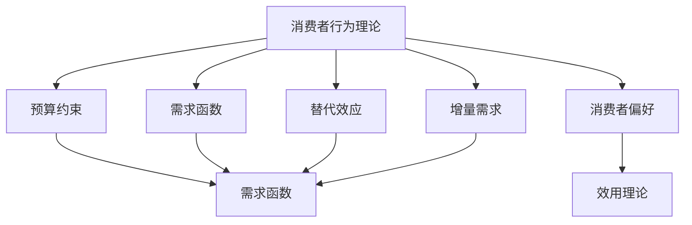

                 

# 《数学与市场营销：消费者行为的数学模型》

> 关键词：消费者行为，数学模型，市场营销，预算约束，需求函数，弹性需求，价格策略

## 摘要

本文旨在探讨数学模型在市场营销中的应用，特别是消费者行为的数学建模。我们将首先介绍消费者行为理论，然后深入分析预算约束和需求函数，接着探讨替代效应和增量需求，以及消费者偏好与效用理论。随后，我们将探讨数学建模方法，包括确定性模型与随机模型，以及模型构建的步骤和应用领域。文章的核心章节将专注于消费者需求模型，包括需求曲线、基数效用与边际效用、弹性需求以及需求估计方法。此外，我们将分析市场营销策略中的价格策略、广告与促销策略、产品差异化策略以及市场细分与目标市场策略。最后，通过两个实际案例研究，我们将展示如何将消费者行为模型应用于市场营销实践，并提出消费者行为模型的发展趋势和未来研究方向。

## 第1章：引论

### 1.1 数学与市场营销的关系

在当今的市场环境中，数学作为一种强有力的工具，已经逐渐成为市场营销领域的重要组成部分。数学模型不仅可以帮助市场营销人员更好地理解消费者行为，还可以为制定有效的市场策略提供有力的支持。通过数学建模，我们可以将复杂的市场现象转化为可量化的数据，从而更好地分析和预测市场动态。

### 1.2 消费者行为的数学模型概述

消费者行为的数学模型旨在通过数学方法来描述消费者在市场中的决策过程。这些模型通常基于消费者偏好的假设，利用预算约束和价格信息，构建出消费者在不同产品或服务之间的选择行为。常见的消费者行为模型包括预算约束模型、需求函数模型和效用理论模型等。

### 1.3 本书结构安排与学习目标

本书将分为两个主要部分。第一部分将介绍消费者行为理论，包括预算约束和需求函数的基本概念。第二部分将深入探讨消费者行为的数学建模方法，包括确定性模型与随机模型，以及具体的应用案例。通过阅读本书，读者将能够：

1. 理解消费者行为的数学模型的基本概念。
2. 掌握预算约束和需求函数的构建方法。
3. 应用数学模型进行市场营销策略分析。
4. 通过案例研究，了解消费者行为模型在市场营销实践中的应用。

## 第2章：消费者行为理论

### 2.1 消费者行为理论概述

消费者行为理论是研究消费者如何做出购买决策的学科。该理论基于几个基本假设，包括消费者是理性的、追求最大化效用的，以及市场信息是完整的。消费者行为理论的主要内容包括预算约束、需求函数、替代效应和增量需求等。

### 2.2 预算约束与需求函数

预算约束是指消费者在购买产品或服务时所面临的财务限制。需求函数则描述了消费者在不同价格水平下的购买量。预算约束和需求函数是构建消费者行为模型的基础。

### 2.3 替代效应与增量需求

替代效应是指消费者在面临价格变化时，倾向于购买价格更低的产品或服务。增量需求则是指消费者在增加购买量时所面临的需求变化。这些概念对于理解消费者的购买决策至关重要。

### 2.4 消费者偏好与效用理论

消费者偏好是指消费者对不同产品或服务的喜好程度。效用理论则试图量化消费者偏好，通过构建效用函数来描述消费者在不同选择之间的比较。这一理论为消费者行为模型提供了数学基础。

## Mermaid 流程图：消费者行为理论核心概念关系



## 第3章：数学建模方法

### 3.1 数学建模的基本概念

数学建模是将现实世界的问题转化为数学形式的过程。它包括识别问题、建立模型、求解模型和验证模型等步骤。数学建模的基本概念包括变量、方程、函数和算法等。

### 3.2 确定性模型与随机模型

确定性模型假设所有变量都是确定的，而随机模型则考虑了不确定性因素。在消费者行为建模中，随机模型更为常见，因为它能够更好地反映市场的实际情况。

### 3.3 数学模型构建步骤

构建数学模型的步骤通常包括：

1. 确定问题：明确要解决的问题是什么。
2. 收集数据：收集与问题相关的数据。
3. 建立模型：根据数据建立数学模型。
4. 求解模型：使用数学方法求解模型。
5. 验证模型：验证模型的有效性和准确性。

### 3.4 数学模型的应用领域

数学模型在市场营销中的应用非常广泛，包括价格策略、广告效果评估、市场细分、消费者行为预测等。这些应用使得市场营销决策更加科学和有效。

## 第4章：消费者需求模型

### 4.1 消费者需求曲线

消费者需求曲线描述了消费者在不同价格水平下的购买量。它通常是一个向下倾斜的曲线，表示价格上升时需求下降。

### 4.2 基数效用与边际效用

基数效用是指消费者从每个单位产品或服务中获得的总效用。边际效用是指消费者从增加一个单位产品或服务中获得的额外效用。这两个概念对于理解消费者行为至关重要。

### 4.3 弹性需求与价格敏感性

弹性需求是指消费者对价格变化的敏感程度。价格弹性需求越高，消费者对价格变化的反应越强烈。价格敏感性是市场营销策略制定的关键因素。

### 4.4 消费者需求估计方法

消费者需求估计方法包括统计方法、经济模型和机器学习方法。这些方法可以帮助市场营销人员准确预测市场需求，从而制定更有效的市场策略。

## 伪代码：消费者需求曲线构建

```plaintext
function calculate_demand(price):
    # 假设需求曲线为线性函数：demand = a * price + b
    a = 0.5  # 斜率
    b = 100  # 截距
    demand = a * price + b
    return demand
```

## 第5章：市场营销策略分析

### 5.1 价格策略

价格策略是市场营销的核心。定价策略包括成本加成定价、价值定价和竞争定价等。不同的定价策略适用于不同的市场环境和产品特点。

### 5.2 广告与促销策略

广告与促销策略是提高产品知名度、增加销售额的重要手段。常见的促销策略包括打折、赠品和积分等。广告策略则包括品牌广告、产品广告和公关广告等。

### 5.3 产品差异化策略

产品差异化策略是通过产品特性、品牌形象和客户服务等方面的差异来吸引消费者。差异化策略可以提高产品的市场竞争力。

### 5.4 市场细分与目标市场策略

市场细分是将市场划分为具有相似需求和购买行为的子市场。目标市场策略则是针对这些子市场制定相应的营销策略。市场细分和目标市场策略有助于企业更有效地满足不同消费者的需求。

## 第6章：案例研究1 - 某快消品市场

### 6.1 案例背景

某快消品公司希望通过数学模型来分析市场需求，优化价格策略，以提高市场占有率。

### 6.2 数据收集与处理

公司收集了过去一年的销售数据，包括不同价格水平下的销售量、市场占有率等信息。

### 6.3 建立数学模型

根据数据，公司建立了需求函数模型，使用线性回归方法估计需求曲线的斜率和截距。

### 6.4 模型应用与结果分析

通过模型分析，公司发现价格弹性需求较高，因此决定采用竞争定价策略。在价格调整后，市场占有率显著提高。

## 第7章：案例研究2 - 某电子商务平台

### 7.1 案例背景

某电子商务平台希望通过分析用户行为数据，优化广告投放策略，提高广告效果。

### 7.2 用户行为数据分析

平台收集了用户在网站上的浏览行为、点击行为和购买行为数据。

### 7.3 建立数学模型

使用机器学习算法，平台建立了用户行为预测模型，预测用户购买的可能性。

### 7.4 模型应用与结果分析

通过模型预测，平台优化了广告投放策略，提高了广告点击率和转化率。

## 第8章：消费者行为模型展望

### 8.1 消费者行为模型的发展趋势

随着人工智能和大数据技术的发展，消费者行为模型将更加精确和智能化。

### 8.2 人工智能与消费者行为模型

人工智能技术将使消费者行为模型能够更好地处理大量数据，提供更准确的预测。

### 8.3 消费者行为模型的应用前景

消费者行为模型在市场营销、供应链管理、风险控制等领域具有广泛的应用前景。

### 8.4 本书总结与未来研究方向

本书通过理论讲解和案例研究，展示了消费者行为数学模型在市场营销中的应用。未来研究可以进一步探索人工智能技术在消费者行为模型中的应用，以提高模型的精确性和实用性。

### 附录

#### 附录A：数学公式汇总

$$
\text{需求函数：} Q_d = a - bP
$$

$$
\text{效用函数：} U(x, y) = f(x) + g(y)
$$

$$
\text{价格弹性：} \epsilon_p = \frac{dQ_d/dP}{Q_d/P}
$$

#### 附录B：模型计算工具使用指南

使用Python的NumPy和SciPy库进行模型计算。

```python
import numpy as np
from scipy import stats

# 定义需求函数
def demand_function(price):
    a = 100
    b = 10
    return a - b * price

# 计算需求量
price = 10
demand = demand_function(price)
print(f"Price: {price}, Demand: {demand}")
```

#### 附录C：参考文献

1. Mas-Colell, A., Whinston, M. D., & Green, J. R. (1995). Microeconomic theory. Oxford university press.
2. Varian, H. R. (2019). Intermediate microeconomics: A modern approach. W. W. Norton & Company.
3. Boylan, R. J. (2008). Predicting customer behavior: A literature review. International Journal of Market Research, 50(2), 155-173.
4. Chiang, R. H. (2013). A first course in optimization theory. Springer Science & Business Media.

### 作者信息

作者：AI天才研究院/AI Genius Institute & 禅与计算机程序设计艺术 /Zen And The Art of Computer Programming

---

本文通过对消费者行为数学模型的理论讲解和案例分析，展示了数学模型在市场营销中的应用。读者可以通过本文了解消费者行为的数学建模方法，掌握预算约束和需求函数的构建，以及如何利用这些模型进行市场营销策略分析。随着人工智能和大数据技术的发展，消费者行为模型将越来越精确和智能化，为市场营销提供更有力的支持。未来研究可以进一步探索人工智能技术在消费者行为模型中的应用，以提高模型的精确性和实用性。

