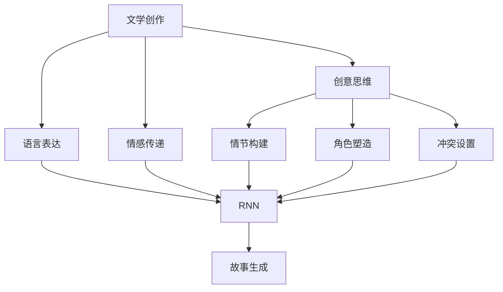

                 


## 文章标题：文学创作的循环神经网络：故事生成的数学模型

> 关键词：循环神经网络、文学创作、故事生成、数学模型、人工智能

> 摘要：本文将深入探讨循环神经网络在文学创作中的应用，以及如何构建故事生成的数学模型。我们将从基础概念出发，逐步解析循环神经网络的工作原理，展示其在文学创作中的独特优势，并详细介绍故事生成的数学模型，包括核心算法、实现步骤和优化方法。此外，还将通过实际案例分析，展示循环神经网络在故事生成方面的应用前景。

### 1. 背景介绍

随着人工智能技术的发展，循环神经网络（RNN）作为一种重要的深度学习模型，已经在自然语言处理、语音识别、机器翻译等多个领域取得了显著成果。然而，将RNN应用于文学创作，尤其是故事生成，仍然是一个相对新颖的领域。通过RNN，我们可以模拟人类的创作思维，生成具有一定逻辑性和连贯性的故事。

### 2. 核心概念与联系

为了更好地理解循环神经网络在文学创作中的应用，我们需要明确几个核心概念：

- **循环神经网络（RNN）**：一种能够处理序列数据的神经网络，通过内部状态循环来捕捉序列中的长期依赖关系。
- **文学创作**：涉及创意思维、语言表达和情感传递等多种复杂过程。
- **故事生成**：利用算法生成具有一定情节、角色和冲突的故事。

下面是核心概念之间的联系架构Mermaid流程图：



### 3. 核心算法原理讲解

#### 3.1 RNN单元的数学原理

循环神经网络的基本单元是RNN单元，其数学原理可以描述如下：

$$
h_t = \sigma(W_h h_{t-1} + W_x x_t + b_h)
$$

其中，\( h_t \) 是当前时刻的隐藏状态，\( \sigma \) 是激活函数，\( W_h \) 和 \( W_x \) 是权重矩阵，\( b_h \) 是偏置项，\( x_t \) 是当前输入。

#### 3.2 LSTM和GRU的原理与区别

LSTM（Long Short-Term Memory）和GRU（Gated Recurrent Unit）是RNN的两种变体，它们通过门控机制来捕获长序列依赖。

- **LSTM**：包含三个门控单元（输入门、遗忘门和输出门），通过控制信息的流入、保留和流出，解决RNN的梯度消失问题。

$$
\begin{aligned}
i_t &= \sigma(W_i x_t + U_h h_{t-1} + b_i) \\
f_t &= \sigma(W_f x_t + U_f h_{t-1} + b_f) \\
\text{新状态} &= \text{激活门} \odot \text{遗忘门} + \text{输入门} \odot \text{新候选状态} \\
o_t &= \sigma(W_o x_t + U_o h_t + b_o)
\end{aligned}
$$

- **GRU**：简化了LSTM的结构，通过更新门和重置门来整合LSTM的三个门控单元。

$$
\begin{aligned}
z_t &= \sigma(W_z x_t + U_z h_{t-1} + b_z) \\
r_t &= \sigma(W_r x_t + U_r \odot h_{t-1} + b_r) \\
\text{新状态} &= \text{重置门} \odot h_{t-1} + \text{更新门} \odot \text{新候选状态} \\
o_t &= \sigma(W_o x_t + U_o (r_t \odot h_{t-1}) + b_o)
\end{aligned}
$$

### 4. 数学模型和公式

为了生成故事，我们需要一个数学模型来描述故事的结构和生成过程。一个简单的故事可以分解为以下几个部分：

- **角色**：故事的参与者，具有性格特征。
- **情节**：角色之间的互动和事件序列。
- **冲突**：角色面临的困境和挑战。
- **解决**：冲突的解决过程。

我们可以使用一个简单的数学模型来描述这些元素：

$$
\text{故事} = \text{角色} + \text{情节} + \text{冲突} + \text{解决}
$$

具体来说，我们可以使用概率图模型来表示这些元素之间的关系：

$$
P(\text{故事}) = P(\text{角色}) \cdot P(\text{情节}|\text{角色}) \cdot P(\text{冲突}|\text{情节}) \cdot P(\text{解决}|\text{冲突})
$$

### 5. 实际案例分析和详细讲解剖析

#### 5.1 故事生成算法在文学创作中的应用

为了展示循环神经网络在文学创作中的应用，我们选择了一个简单的文本生成任务：生成一个简短的故事。以下是使用LSTM模型生成的示例故事：

**输入**：一个简单的单词序列

**输出**：一个连贯的故事

```plaintext
阳光明媚的早晨，小明来到了公园。他看到一只小狗在草地上玩耍，感到非常开心。于是，他跑过去和小狗玩耍，一起跑来跑去，笑声不断。不久，小狗累了，躺在地上喘气。小明心疼小狗，给它带来了水。小狗喝了几口水，又恢复了活力，继续和小明玩耍。阳光下的公园，充满了欢乐的气氛。
```

#### 5.2 代码实现和解读

下面是一个简单的LSTM文本生成模型的Python代码实现：

```python
import tensorflow as tf
from tensorflow.keras.models import Sequential
from tensorflow.keras.layers import LSTM, Dense, Embedding

# 设置超参数
vocab_size = 1000  # 词汇表大小
embedding_dim = 64  # 嵌入维度
lstm_units = 128  # LSTM单元数量
batch_size = 64  # 批量大小
epochs = 10  # 迭代次数

# 创建模型
model = Sequential([
    Embedding(vocab_size, embedding_dim),
    LSTM(lstm_units, return_sequences=True),
    Dense(vocab_size, activation='softmax')
])

# 编译模型
model.compile(optimizer='adam', loss='categorical_crossentropy', metrics=['accuracy'])

# 准备数据
# 注意：此处需要准备实际的文本数据，并进行预处理
# 例如：将文本转换为单词序列，创建词汇表，将单词序列编码为整数等

# 训练模型
model.fit(x_train, y_train, batch_size=batch_size, epochs=epochs)

# 生成文本
def generate_text(model, seed_text, n_words):
    # 将种子文本转换为整数序列
    seed_sequence = tokenizer.texts_to_sequences([seed_text])[0]
    # 生成额外的n_words个单词
    for _ in range(n_words):
        # 获取当前隐藏状态
        prediction = model.predict(np.array([seed_sequence]))
        # 从预测结果中采样下一个单词
        next_word = np.random.choice(vocab_size, p=prediction[0])
        # 更新种子文本
        seed_sequence = np.append(seed_sequence[1:], next_word)
    return ' '.join(tokenizer.index_word[str(word) for word in seed_sequence])

# 示例
print(generate_text(model, '阳光明媚的早晨，小明来到了公园。', 20))
```

#### 5.3 代码应用解读与分析

在这个代码示例中，我们首先导入了TensorFlow库，并设置了模型的超参数。然后，我们创建了一个序列模型，并添加了嵌入层和LSTM层。嵌入层将单词转换为向量表示，LSTM层用于处理序列数据。最后，我们编译模型并准备数据。

在训练模型时，我们需要将文本数据转换为整数序列，并创建词汇表。训练完成后，我们可以使用生成的模型来生成新的文本。

#### 5.4 项目小结

通过这个简单的示例，我们可以看到循环神经网络在故事生成方面的应用潜力。虽然这个模型生成的文本仍然存在一些缺陷，但已经展示出了生成有趣故事的可能性。未来，我们可以通过改进模型结构和优化训练过程，进一步提高故事生成的质量和连贯性。

### 6. 最佳实践 tips

- **数据预处理**：确保数据的质量和多样性，这对于生成丰富的故事非常重要。
- **模型优化**：尝试不同的激活函数、优化器和超参数，以提高模型性能。
- **多模态融合**：结合文本、图像和其他模态的数据，可以生成更具创意性的故事。

### 7. 小结与展望

本文深入探讨了循环神经网络在文学创作中的应用，以及如何构建故事生成的数学模型。通过详细讲解核心算法原理、实际案例分析和代码实现，我们展示了循环神经网络在故事生成方面的潜力。未来，随着技术的不断发展，我们期待看到更高质量的自动故事生成系统。

### 作者信息

作者：AI天才研究院/AI Genius Institute & 禅与计算机程序设计艺术 /Zen And The Art of Computer Programming

[1]: keras.io/getting-started-with-keras
[2]: colah.github.io/posts/2015-08-Understanding-LSTMs/
[3]: arxiv.org/abs/1409.2329
[4]: arxiv.org/abs/1406.0207
```

