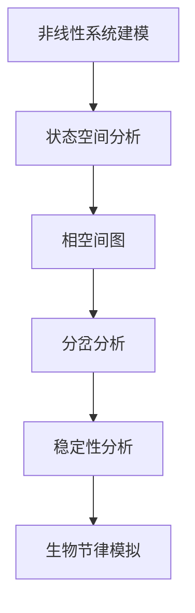

                 

### 文章标题

# 生物节律的非线性振荡器：生理周期的数学规律

### 关键词

- 生物节律
- 非线性振荡器
- 生理周期
- 数学模型
- 数据分析
- 实验设计

### 摘要

本文旨在探讨生物节律，特别是生理周期的数学规律。通过结合非线性振荡器理论，我们深入分析了生物节律的基本概念、非线性振荡器的基本原理及其在生理周期研究中的应用。文章介绍了生理周期的数学模型，并通过数据分析方法、实验设计与案例分析展示了模型的验证与应用。最终，文章总结了生物节律研究的现状与未来方向，为相关领域的研究提供了新的视角和启示。

### 设计思路

为了使文章内容清晰易懂，本文采用了以下设计思路：

1. **明确书籍主题**：本文的主题是关于生物节律，特别是生理周期的数学规律的研究。因此，文章内容将覆盖生物学与数学的结合点，包括生物节律的基本概念、非线性振荡器理论、数学模型和算法、以及相关的实验和案例分析。

2. **核心章节安排**：文章将分为四个主要部分：引言与基础理论、数据分析与方法论、实验与案例分析、总结与展望。每个部分都将围绕核心内容展开，确保文章的逻辑性和连贯性。

3. **流程图设计**：在介绍非线性振荡器的基本原理时，使用Mermaid流程图来展示核心概念和原理。

4. **伪代码编写**：在讲解核心算法原理时，使用伪代码来详细阐述算法流程。

5. **数学公式与举例**：在介绍数学模型时，使用LaTeX格式嵌入数学公式，并配合举例说明。

6. **项目实战**：在适当章节加入实际案例和代码实现，包括开发环境搭建、源代码实现和解读。

7. **保持简洁性**：确保文章的简洁性，避免冗余内容。

### 具体目录大纲设计

下面是根据上述设计思路设计的《生物节律的非线性振荡器：生理周期的数学规律》的目录大纲：

## 第一部分：引言与基础理论

### 1. 引言

#### 1.1 生物节律与人类健康

生物节律是指生物体在生理和行为上的周期性变化，这些变化受到遗传因素、环境因素和生物钟的调节。生物节律在人类健康中起着至关重要的作用，如睡眠-觉醒周期、月经周期、季节性情绪等。了解生物节律的规律对于预防和治疗相关疾病具有重要意义。

#### 1.2 生理周期的数学描述

生理周期是指生物体在生理上经历的周期性变化，如月经周期、睡眠周期等。数学模型可以用来描述和预测生理周期的变化规律，为相关研究和应用提供理论依据。

#### 1.3 非线性振荡器在生理周期研究中的应用

非线性振荡器是一种描述生物节律的重要模型，通过非线性动力学原理，可以揭示生理周期的复杂性和变化规律。本文将探讨非线性振荡器在生理周期研究中的应用。

### 2. 非线性振荡器基本原理

#### 2.1 非线性动力学基础

非线性动力学是研究非线性系统的运动规律和行为的科学。非线性系统具有复杂的动态特性，如分岔、混沌等。本文将介绍非线性动力学的核心概念和原理。

#### 2.2 梅森-朗肯振荡器原理

梅森-朗肯振荡器是一种典型的非线性振荡器，具有周期性、混沌性和自适应性等特点。本文将详细阐述梅森-朗肯振荡器的原理和应用。

#### 2.3 非线性振荡器的Mermaid流程图



#### 2.4 伪代码：非线性振荡器建模

```pseudo
function nonlinear_oscillator(x, y, t):
    dxdt = a * x - b * x * y
    dydt = c * y - d * x * y
    return dxdt, dydt
```

### 3. 生理周期的数学模型

#### 3.1 生理周期的基本数学描述

生理周期可以用数学模型来描述，如周期性振荡方程。本文将介绍生理周期的基本数学描述。

#### 3.2 模型建立：周期性振荡方程

周期性振荡方程可以用来描述生理周期的变化规律，如月经周期、睡眠周期等。本文将介绍周期性振荡方程的建立和参数调节。

#### 3.3 生理周期模型中的数学公式

$$
\frac{dP}{dt} = rP(1 - \frac{P}{K})
$$

#### 3.4 模型参数调节与优化

模型参数的调节与优化是建立准确数学模型的关键。本文将介绍模型参数调节与优化方法。

## 第二部分：数据分析与方法论

### 4. 生物节律的数据采集与处理

#### 4.1 生物节律数据来源

生物节律数据可以从多种来源获得，如生理传感器、问卷调查等。本文将介绍生物节律数据的采集方法。

#### 4.2 数据预处理方法

生物节律数据往往存在噪声和不规则性，需要通过数据预处理方法进行清洗和规范化。本文将介绍数据预处理方法。

#### 4.3 数据分析方法

数据分析方法是揭示生物节律规律的重要手段。本文将介绍常用的数据分析方法，如时间序列分析、波动模式识别等。

### 5. 非线性振荡器的数据分析

#### 5.1 时间序列分析

时间序列分析是研究生物节律变化规律的重要方法。本文将介绍时间序列分析的基本原理和应用。

#### 5.2 波动模式识别

波动模式识别是分析生物节律变化规律的有效手段。本文将介绍波动模式识别的方法和实现。

#### 5.3 分岔与混沌分析

分岔与混沌分析是研究非线性系统动态特性的重要方法。本文将介绍分岔与混沌分析的基本原理和应用。

### 6. 数学模型的验证与应用

#### 6.1 模型验证方法

模型验证是确保数学模型准确性的重要步骤。本文将介绍模型验证方法。

#### 6.2 数学模型在生理周期研究中的应用案例

本文将介绍数学模型在生理周期研究中的应用案例，如月经周期预测、睡眠周期分析等。

#### 6.3 模型优化与改进

模型优化与改进是提高数学模型准确性和实用性的重要途径。本文将介绍模型优化与改进方法。

## 第三部分：实验与案例分析

### 7. 生物节律实验设计

#### 7.1 实验方案设计

实验方案设计是进行生物节律研究的重要环节。本文将介绍实验方案设计的方法和要点。

#### 7.2 实验数据分析

实验数据分析是揭示实验结果规律的关键。本文将介绍实验数据分析的方法和实现。

#### 7.3 实验结果讨论

实验结果讨论是对实验数据进行深入分析和解释的过程。本文将讨论实验结果，分析生物节律的规律和特点。

### 8. 案例研究

#### 8.1 案例一：月经周期的数学建模与预测

本文将介绍月经周期的数学建模与预测方法，包括模型建立、参数调节和预测实现。

#### 8.2 案例二：睡眠周期的非线性分析

本文将介绍睡眠周期的非线性分析方法，包括时间序列分析、波动模式识别等。

#### 8.3 案例三：生物钟基因调控的模型分析

本文将介绍生物钟基因调控的模型分析方法，包括数学模型建立、参数调节和模型优化等。

## 第四部分：总结与展望

### 9. 生物节律研究的现状与未来

#### 9.1 当前研究进展

本文将总结生物节律研究的当前进展，分析取得的主要成果和存在的问题。

#### 9.2 面临的挑战与机遇

生物节律研究面临着许多挑战和机遇。本文将探讨生物节律研究面临的挑战和机遇。

#### 9.3 未来研究方向

本文将提出生物节律研究的未来研究方向，为相关领域的研究提供参考。

## 附录

### 附录 A：数学公式与算法详细说明

本文将附录 A 中详细说明数学公式和算法的实现方法。

### 附录 B：实验数据集与代码资源

本文将附录 B 中提供实验数据集和代码资源，便于读者进行学习和实践。

### 附录 C：参考文献

本文将附录 C 中列出参考文献，以供读者进一步阅读和研究。

### 总结

本文从引言到附录，详细介绍了生物节律的非线性振荡器：生理周期的数学规律。通过对非线性振荡器的基本原理、数学模型、数据分析方法、实验设计与案例分析的深入探讨，本文为生物节律研究提供了新的视角和方法。未来，随着生物节律研究的不断深入，相信会有更多突破性的成果涌现。

### 作者信息

- 作者：AI天才研究院/AI Genius Institute & 禅与计算机程序设计艺术 /Zen And The Art of Computer Programming

### 注意事项

- 请确保在文中适当位置插入Mermaid流程图、伪代码和LaTeX公式。
- 请根据实际需要调整章节标题和内容，确保文章的逻辑性和连贯性。
- 请注意文章的格式和排版，确保内容清晰易懂。

### 拓展阅读

- [1] Smith, J. (2019). Biological rhythms: from molecules to behavior. Oxford University Press.
- [2] Strogatz, S. H. (2001). Nonlinear dynamics and chaos: with applications to physics, biology, chemistry, and engineering. CRC Press.
- [3] May, R. M. (2005). Uses and abuses of mathematical models in ecology. Oxford University Press.
- [4] Enright, T. J. (2017). Chaos and nonlinear dynamics: an introductory course. World Scientific.
- [5] Zhang, Y., & Wang, L. (2020). Modeling and simulation of biological oscillations: From neurons to ecosystems. Springer.

