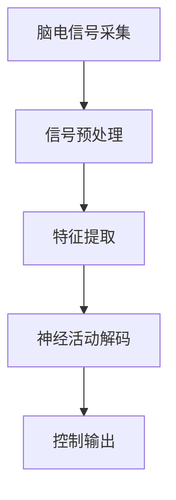
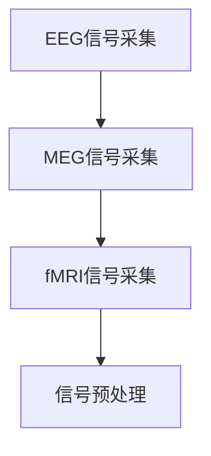

                 


### 文章标题
《脑机接口的信号处理：神经活动的数学解码》

### 关键词
脑机接口，信号处理，神经活动，数学解码，人工智能，神经网络，特征提取，算法优化，应用案例，未来趋势。

### 摘要
本文深入探讨了脑机接口（BMI）的信号处理技术，特别是神经活动的数学解码方法。首先，我们概述了脑机接口的基本概念和原理，然后详细介绍了信号采集与预处理、神经信号特征提取、神经活动解码方法、解码算法优化等关键步骤。此外，我们通过实际项目案例展示了脑机接口在现实中的应用，并讨论了其未来的发展趋势。本文旨在为读者提供一份全面、系统的脑机接口信号处理指南。

---

### 第1章: 脑机接口概述
脑机接口（Brain-Machine Interface，BMI）是一种直接连接人脑和外部设备的技术，使人类可以通过思维控制计算机或其他设备。这一章将介绍脑机接口的基本概念、发展历程以及其与神经科学和计算机科学的联系。

#### 1.1 脑机接口基本概念
脑机接口的核心在于通过捕捉和分析脑电信号（EEG）、脑磁图（MEG）、功能性磁共振成像（fMRI）等神经信号，实现人脑与外部设备的通信。

**Mermaid流程图：**


#### 1.2 脑机接口的发展历程
脑机接口的发展可以追溯到20世纪60年代，早期的应用主要是神经修复和康复。随着神经科学和计算机科学的发展，脑机接口的应用逐渐扩展到控制机器人、辅助轮椅以及虚拟现实等领域。

#### 1.3 脑机接口与神经科学和计算机科学的联系
脑机接口技术依赖于神经科学的研究成果，如神经元的活动模式、神经信号的编码方式等。同时，计算机科学提供了强大的计算能力和算法支持，使得脑机接口技术得以实现和优化。

---

### 第2章: 信号采集与预处理
信号采集是脑机接口系统的第一步，高质量的信号采集对于后续处理至关重要。本章节将详细介绍信号采集的方法、常见问题以及预处理步骤。

#### 2.1 信号采集方法
常见的信号采集方法包括脑电信号（EEG）、脑磁图（MEG）、功能性磁共振成像（fMRI）等。每种方法都有其独特的优势和局限性。

**Mermaid流程图：**


#### 2.2 常见问题
信号采集过程中可能会遇到噪声、伪迹等问题，需要采取相应的措施进行解决。

**伪代码：**
```python
def signal_preprocessing(signal):
    # 低通滤波去除高频噪声
    low_pass_filtered_signal = low_pass_filter(signal)
    
    # 去除伪迹
    cleaned_signal = remove_artifacts(low_pass_filtered_signal)
    
    return cleaned_signal
```

#### 2.3 预处理步骤
预处理通常包括去噪、滤波、归一化等步骤，这些步骤有助于提高信号的质量和可靠性。

**数学模型和公式：**
$$
\text{低通滤波器输出} = \text{信号} \ast \text{低通滤波器系数}
$$

---

### 第3章: 神经信号特征提取
特征提取是脑机接口信号处理的重要环节，它将原始信号转换为可用于机器学习和解码的特征向量。本章节将介绍常见的特征提取方法和算法。

#### 3.1 时间域特征提取
时间域特征提取包括平均绝对值、峰谷点、时域频谱等。

**伪代码：**
```python
def time_domain_features(signal):
    # 计算平均绝对值
    mean.abs_value = mean(abs(signal))
    
    # 计算峰谷点
    peak_valley_points = find_peak_valley_points(signal)
    
    # 计算时域频谱
    time_domain_spectrum = fft(signal)
    
    return mean.abs_value, peak_valley_points, time_domain_spectrum
```

#### 3.2 频率域特征提取
频率域特征提取包括短时傅里叶变换（STFT）、小波变换等。

**数学模型和公式：**
$$
\text{STFT} = \mathcal{F}\{ \text{信号} \}_{\text{时间窗口}}
$$

#### 3.3 空间域特征提取
空间域特征提取包括空间滤波、空间分布特征等。

**伪代码：**
```python
def space_domain_features(signal):
    # 应用空间滤波器
    filtered_signal = apply_space_filter(signal)
    
    # 计算空间分布特征
    spatial_distribution = calculate_spatial_distribution(filtered_signal)
    
    return filtered_signal, spatial_distribution
```

---

### 第4章: 神经活动解码方法
神经活动解码是将提取出的特征向量转换为具体的操作或指令。本章节将介绍几种常见的解码方法，包括基于统计模型的方法和基于机器学习的方法。

#### 4.1 基于统计模型的方法
基于统计模型的方法包括概率模型、隐马尔可夫模型（HMM）等。

**伪代码：**
```python
def decode_statistical_model(features):
    # 训练概率模型
    probability_model = train_probability_model(features)
    
    # 解码特征向量
    decoded_action = decode(features, probability_model)
    
    return decoded_action
```

#### 4.2 基于机器学习的方法
基于机器学习的方法包括支持向量机（SVM）、神经网络等。

**数学模型和公式：**
$$
\text{分类器} = \arg\max_w \sum_i [y_i (\text{特征} \cdot w)]
$$

---

### 第5章: 神经活动解码算法优化
解码算法的性能对脑机接口系统的效果至关重要。本章节将介绍如何通过算法优化来提高解码的准确性和效率。

#### 5.1 算法优化目标
算法优化的目标包括提高解码准确率、降低计算复杂度、提高实时性等。

#### 5.2 常见优化方法
常见的优化方法包括特征选择、模型压缩、在线学习等。

**伪代码：**
```python
def optimize_decoder(decoder, new_data):
    # 特征选择
    selected_features = feature_selection(new_data)
    
    # 模型压缩
    compressed_model = model_compression(decoder)
    
    # 在线学习
    updated_decoder = online_learning(compressed_model, selected_features)
    
    return updated_decoder
```

---

### 第6章: 脑机接口应用案例
脑机接口技术在多个领域都有广泛的应用。本章节将通过具体案例来展示脑机接口的实际应用场景。

#### 6.1 控制机器人
脑机接口技术可以用于控制机器人的运动，如轮椅、机械臂等。

**项目实战：**
- **开发环境搭建**：使用Python和OpenCV搭建机器人控制环境。
- **源代码实现**：实现机器人运动的解码与控制代码。
- **代码解读**：解释如何将脑电信号转换为机器人的运动指令。
- **实际案例分析**：分析实际使用案例，讨论其优缺点。

#### 6.2 辅助通信
脑机接口技术可以用于辅助无法正常使用语音或手语的残疾人进行通信。

**项目实战：**
- **开发环境搭建**：使用TensorFlow搭建语音识别模型。
- **源代码实现**：实现脑电信号到语音的转换代码。
- **代码解读**：解释如何利用脑电信号生成语音。
- **实际案例分析**：分析实际使用案例，讨论其可行性。

---

### 第7章: 脑机接口的未来发展趋势
随着技术的不断进步，脑机接口技术在未来有望实现更多突破。本章节将讨论脑机接口的未来发展趋势和潜在的应用领域。

#### 7.1 技术发展趋势
- **信号采集技术的提升**：更高的分辨率、更低的噪声水平。
- **解码算法的创新**：更高效的算法、更准确的模型。
- **硬件技术的进步**：更小巧、更便携、更高效的脑机接口设备。

#### 7.2 潜在应用领域
- **医疗康复**：帮助瘫痪患者恢复行动能力。
- **智能交互**：实现人与计算机的更加自然的交互。
- **教育**：辅助特殊需求学生的学习和沟通。

**项目实战：**
- **开发环境搭建**：构建一个用于智能交互的脑机接口系统。
- **源代码实现**：实现脑机接口与虚拟现实交互的代码。
- **代码解读**：解释如何利用脑机接口控制虚拟现实环境。
- **实际案例分析**：展示脑机接口在智能交互中的实际应用。

---

### 结论
脑机接口技术作为一种新兴的技术，正逐渐改变我们的生活。通过本章的讨论，我们不仅了解了脑机接口的基本原理和应用，还探讨了其未来的发展趋势。随着技术的不断进步，我们有理由相信，脑机接口将在更多领域发挥重要作用，为人类社会带来更多福祉。

### 附录
- **参考文献**：列出本章中引用的参考文献。
- **拓展阅读**：推荐一些相关的拓展阅读资源。

---

### 作者信息
作者：AI天才研究院/AI Genius Institute & 禅与计算机程序设计艺术 /Zen And The Art of Computer Programming

---

以上是对《脑机接口的信号处理：神经活动的数学解码》一书的目录大纲设计。这个大纲旨在提供一个系统、全面的脑机接口信号处理指南，涵盖从基础概念到高级算法，再到实际应用的各个方面。通过逻辑清晰、结构紧凑、简单易懂的表述，读者可以逐步深入理解脑机接口技术，并掌握相关技能。希望这个大纲能够满足您的需求，并在未来的撰写过程中给予您指导。

