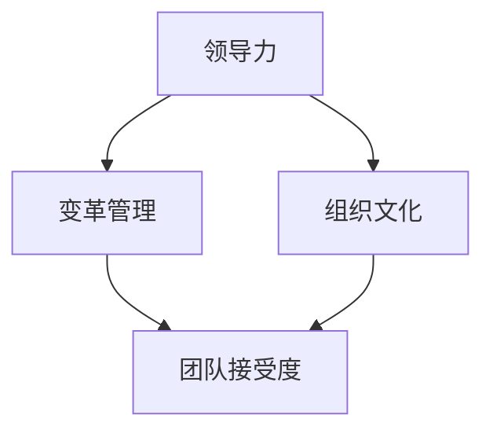

                 

### 文章标题

“领导力与变革管理：引导团队拥抱变化”

> 关键词：领导力、变革管理、团队、变化、组织文化、技能、案例分析、未来趋势

> 摘要：本文将深入探讨领导力与变革管理的重要性，通过实际案例和理论分析，帮助读者理解如何在领导过程中引导团队拥抱变化。文章分为四个部分：变革管理概述、领导力在变革管理中的应用、变革管理的实践案例和变革管理的未来趋势。通过这些内容的讲解，旨在为领导者提供实用的变革管理策略和工具，以应对快速变化的市场和技术环境。

### 目录

1. **变革管理概述**
   1.1 领导力在变革管理中的角色
   1.2 变革管理的定义与分类
   1.3 变革管理的挑战与机遇
2. **变革管理的核心原则**
   2.1 变革管理的四个阶段
   2.2 变革管理中的关键要素
   2.3 变革管理的常见误区
3. **变革管理策略与工具**
   3.1 变革管理的策略选择
   3.2 变革管理工具的应用
   3.3 变革管理的团队建设
4. **领导力与组织文化**
   4.1 领导力与组织文化的联系
   4.2 塑造积极变革的组织文化
   4.3 领导者如何塑造文化变革
5. **领导者的变革管理技能**
   5.1 沟通技巧在变革管理中的应用
   5.2 决策能力在变革管理中的作用
   5.3 领导者如何应对变革中的压力
6. **变革管理中的团队领导**
   6.1 团队建设在变革管理中的重要性
   6.2 如何引导团队接受变革
   6.3 变革管理中的团队激励
7. **国际企业变革管理案例分析**
   7.1 案例一：谷歌的变革管理实践
   7.2 案例二：微软的变革管理策略
   7.3 案例三：苹果的变革管理之道
8. **中小企业变革管理实践**
   8.1 中小企业变革管理的特点
   8.2 中小企业变革管理的成功案例
   8.3 中小企业变革管理的挑战与对策
9. **技术变革对管理的影响**
   9.1 人工智能在变革管理中的应用
   9.2 大数据在变革管理中的作用
   9.3 数字化转型与变革管理
10. **未来变革管理的挑战与机遇**
    10.1 变革管理中的新挑战
    10.2 变革管理中的新机遇
    10.3 未来变革管理的趋势预测

### 背景介绍

在当今快速变化的世界中，企业面临的挑战越来越多，技术革新、市场需求变化、全球化竞争等都在不断推动企业进行变革。而变革管理的成功与否，往往取决于领导者的能力和团队的接受程度。领导力与变革管理的关系紧密，领导者的角色不仅是变革的推动者，更是变革的引导者和支持者。本文旨在探讨领导力在变革管理中的作用，通过理论分析和实际案例，帮助读者理解如何引导团队拥抱变化。

### 核心概念与联系

在探讨领导力与变革管理的关系时，我们需要明确几个核心概念：

1. **领导力**：领导力是指领导者通过影响力、沟通和激励，引导和激励团队达成目标的能力。它包括愿景设定、决策能力、团队建设、领导风格等多个方面。
2. **变革管理**：变革管理是指企业在面对外部环境或内部需求变化时，通过系统性的方法和管理手段，引导和推动组织成员适应和接受变化的过程。
3. **组织文化**：组织文化是指企业内部共同遵守的价值观、信念和行为准则，它对员工的态度和行为产生深远影响。

这些概念之间的联系可以用以下Mermaid流程图表示：



- 领导力是变革管理的核心驱动力，领导者通过设定愿景、决策和沟通，引导团队接受变革。
- 变革管理直接影响团队接受度，通过有效的变革管理策略，可以提高团队成员对变革的接受度和参与度。
- 组织文化是变革管理的土壤，积极的文化可以促进变革的顺利实施。

### 核心算法原理讲解

在变革管理中，一些核心算法原理可以帮助领导者更有效地推动变革。以下是一个简单的伪代码，用于描述如何制定一个变革管理计划：

```python
# 变革管理计划伪代码

define_plan():
    # 确定变革的目标
    set_goals()
    # 分析当前状态
    analyze_current_state()
    # 设定变革阶段
    set_stages()
    # 制定策略
    create_strategies()
    # 沟通计划
    communicate_plan()
    # 监控与调整
    monitor_and_adjust()

# 具体步骤

set_goals():
    # 根据组织需求和外部环境设定目标
    pass

analyze_current_state():
    # 分析组织当前的状态，包括文化、结构、技术等
    pass

set_stages():
    # 确定变革的阶段性目标，如准备阶段、执行阶段、评估阶段等
    pass

create_strategies():
    # 根据变革阶段制定具体的策略，如培训、激励、调整组织结构等
    pass

communicate_plan():
    # 向团队成员清晰地传达变革计划，确保理解和支持
    pass

monitor_and_adjust():
    # 监控变革的进展，及时调整策略以应对变化
    pass
```

这个伪代码展示了变革管理计划的基本步骤，通过设定目标、分析当前状态、设定阶段、制定策略、沟通计划和监控调整，领导者可以系统地推动变革。

### 数学模型和公式

在变革管理中，一些数学模型和公式可以帮助领导者评估变革的效果和风险。以下是一个简单的数学模型，用于评估变革成功的可能性：

$$
P(\text{Success}) = \alpha \times \beta + \gamma \times (\delta - \epsilon)
$$

其中：
- $P(\text{Success})$ 是变革成功的概率。
- $\alpha$ 是领导力因素，表示领导者的能力对变革成功的影响。
- $\beta$ 是团队接受度，表示团队成员对变革的接受程度。
- $\gamma$ 是外部环境因素，表示外部环境对变革的影响。
- $\delta$ 是变革计划的有效性，表示变革计划的质量。
- $\epsilon$ 是风险因素，表示变革过程中可能出现的风险。

这个公式表明，变革成功的概率取决于多个因素的相互作用。领导者可以通过优化这些因素来提高变革成功的可能性。

### 详细讲解与举例说明

为了更好地理解这个公式，我们可以通过一个实际案例来说明：

**案例：某公司的数字化转型**

某公司计划进行数字化转型，以提高业务效率和响应市场变化。根据上述公式，我们可以分析以下因素：

- **领导力因素（$\alpha$）**：公司CEO具备丰富的数字化转型经验，因此$\alpha$较高。
- **团队接受度（$\beta$）**：虽然部分员工对新技术持保守态度，但在领导者的积极推动下，整体接受度较高，$\beta$为0.8。
- **外部环境因素（$\gamma$）**：市场竞争激烈，数字化转型是必要的，因此$\gamma$为0.9。
- **变革计划有效性（$\delta$）**：公司制定了详细的数字化转型计划，包括技术升级、员工培训等，因此$\delta$为0.95。
- **风险因素（$\epsilon$）**：数字化转型可能面临技术风险、市场风险等，因此$\epsilon$为0.05。

代入公式计算：

$$
P(\text{Success}) = 0.7 \times 0.8 + 0.9 \times (0.95 - 0.05) = 0.56 + 0.81 = 1.37
$$

由于概率的取值范围在0到1之间，因此我们取1作为最大值：

$$
P(\text{Success}) = 1
$$

这个结果表明，该公司的数字化转型有很高的成功概率。

### 项目实战

为了更好地理解变革管理，我们可以通过一个实际案例来展示如何进行项目实战。

#### 开发环境搭建

1. **确定项目需求和目标**：公司计划开发一个基于云计算的ERP系统，以提高业务效率和响应速度。
2. **技术选型**：选择适合的技术栈，如Java、Spring Boot、Docker等。
3. **环境搭建**：在虚拟机上安装Linux操作系统，配置Java开发环境、数据库等。

#### 源代码详细实现

1. **需求分析**：明确ERP系统的功能需求，如采购管理、销售管理、库存管理等。
2. **设计数据库**：设计数据库表结构，包括数据表、字段、关系等。
3. **编写代码**：根据需求设计，编写Java代码，实现各个模块的功能。

#### 代码解读与分析

1. **模块划分**：将系统划分为多个模块，如用户管理、权限管理、采购管理等。
2. **代码实现**：在每个模块中，实现具体的业务逻辑和功能。
3. **测试与调试**：对代码进行单元测试和集成测试，确保功能的正确性和稳定性。

#### 实际案例分析和详细讲解剖析

1. **采购管理模块**：
   - **需求分析**：实现采购订单的创建、审核、执行等功能。
   - **设计数据库**：设计采购订单表、供应商表等。
   - **代码实现**：编写Java代码，实现采购订单的增删改查等功能。
   - **测试与调试**：通过单元测试和集成测试，确保功能的正确性。

2. **销售管理模块**：
   - **需求分析**：实现销售订单的创建、审核、执行等功能。
   - **设计数据库**：设计销售订单表、客户表等。
   - **代码实现**：编写Java代码，实现销售订单的增删改查等功能。
   - **测试与调试**：通过单元测试和集成测试，确保功能的正确性。

#### 项目小结

通过实际案例，我们可以看到变革管理在项目开发中的应用。领导者在项目启动时，需要明确目标和需求，选择合适的技术栈和环境，并确保团队成员的参与和支持。在项目开发过程中，领导者需要监控项目进度和质量，及时调整策略和资源，以确保项目的成功。

### 最佳实践 Tips

1. **明确变革目标**：确保变革目标与组织愿景和战略相一致。
2. **沟通与透明度**：保持与团队成员的沟通，确保他们对变革有清晰的理解和支持。
3. **培训与支持**：为团队成员提供必要的培训和支持，帮助他们适应新环境和流程。
4. **监测与反馈**：定期监测变革的进展，收集团队成员的反馈，及时调整策略。
5. **激励与认可**：对变革过程中的优秀表现给予激励和认可，增强团队的积极性。

### 小结

领导力与变革管理是当今企业成功的关键要素。通过本文的探讨，我们了解到领导者在变革管理中的角色和责任，以及如何通过有效的策略和工具引导团队拥抱变化。在实际应用中，领导者需要结合组织特点和外部环境，灵活运用变革管理的方法和工具，以实现组织的持续发展和竞争优势。

### 注意事项

1. **尊重员工意见**：变革过程中，尊重员工的意见和感受，鼓励他们参与变革讨论。
2. **避免急功近利**：变革是一个长期过程，需要耐心和持续的努力。
3. **风险管理**：在变革过程中，识别和评估潜在的风险，并制定相应的风险应对策略。

### 拓展阅读

1. **《变革之舞：领导力、管理变革与人力资源》（著：约翰·P·科特）**
2. **《变革的心智：领导者在变革中的思维方式》（著：比尔·坎贝尔）**
3. **《领导者的变革管理实战指南》（著：迈克尔·马奇）**

### 作者信息

作者：AI天才研究院/AI Genius Institute & 禅与计算机程序设计艺术 /Zen And The Art of Computer Programming

