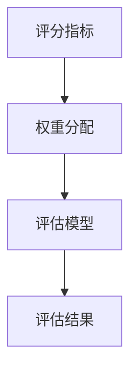

                 


### 文章标题
《多维度评分机制：LLM支持的综合评估体系》

### 文章关键词
多维度评分机制，综合评估体系，LLM，人工智能，评分算法

### 文章摘要
本文旨在深入探讨多维度评分机制及其在人工智能领域的应用，特别是通过大型语言模型（LLM）的支持构建综合评估体系。文章首先介绍多维度评分机制的背景和核心概念，随后分析LLM的基本原理和在评分机制中的应用。接着，文章详细解释多维度评分机制的数学模型，并通过实际项目实战展示其在现实中的应用。最后，文章讨论了未来发展趋势和最佳实践。

### 目录大纲

## 《多维度评分机制：LLM支持的综合评估体系》

### 第一部分：多维度评分机制基础理论

### 第1章：多维度评分机制概述

#### 1.1 多维度评分机制的背景

多维度评分机制是一种评估体系，旨在通过多个维度的综合评价，对对象进行更为准确和全面的评估。这种机制在多个领域，如商业、教育、医疗等，都得到了广泛应用。本文将探讨多维度评分机制的发展历程、重要性及其应用场景。

#### 1.2 多维度评分机制的定义

多维度评分机制涉及对多个指标的考量，这些指标可以是定量的，如数值分数，也可以是定性的，如评级、评语。多维度的综合评估可以更准确地反映对象的实际表现。

#### 1.3 多维度评分机制的重要性

多维度评分机制的重要性在于它能够提供更为客观和全面的评估结果，减少单一评估维度的偏差和局限性，从而提高评估的准确性和可靠性。

### 第2章：多维度评分机制的核心概念

#### 2.1 相关概念与联系（Mermaid流程图）

在多维度评分机制中，核心概念包括评分指标、权重分配、评估模型等。通过Mermaid流程图，我们可以清晰地展示这些概念之间的联系。



#### 2.2 多维度评分机制的组成部分

多维度评分机制通常包括以下几个组成部分：评估指标体系、权重体系、评估模型和评估结果。

#### 2.3 多维度评分机制与LLM的关系

随着人工智能技术的发展，大型语言模型（LLM）在多维度评分机制中的应用逐渐受到关注。LLM可以用于评估指标体系的构建、权重分配的优化以及评估模型的训练。

### 第3章：LLM在评分机制中的应用

#### 3.1 LLM的基本原理（伪代码）

```python
# LLM的基本结构
class LanguageModel:
    def __init__(self, vocabulary_size, embedding_size, hidden_size):
        self.embedding = Embedding(vocabulary_size, embedding_size)
        self.lstm = LSTM(hidden_size)
        self.dense = Dense(vocabulary_size, activation='softmax')

    def forward(self, inputs):
        embeds = self.embedding(inputs)
        outputs, state = self.lstm(embeds)
        logits = self.dense(outputs)
        return logits
```

#### 3.2 LLM在评分机制中的应用场景

LLM可以应用于多个场景，如自动评分、个性化推荐、风险评估等。在这些场景中，LLM通过处理大量的文本数据，生成对评分指标和权重的深刻理解，从而提高评估的准确性和效率。

#### 3.3 LLM的优势与挑战

LLM的优势在于其强大的文本处理能力和学习能力，但同时也面临着数据质量、模型解释性等挑战。

### 第4章：多维度评分机制的数学模型

#### 4.1 多维度评分机制的数学模型（LaTeX公式）

多维度评分机制的数学模型可以表示为：

$$
S = w_1 \cdot S_1 + w_2 \cdot S_2 + \ldots + w_n \cdot S_n
$$

其中，$S$ 是综合评分，$S_i$ 是第 $i$ 个维度的评分，$w_i$ 是第 $i$ 个维度的权重。

#### 4.2 模型参数的优化

为了提高评分机制的准确性，需要对模型参数进行优化。常见的优化方法包括梯度下降、随机梯度下降等。

#### 4.3 模型评估与验证

模型评估与验证是确保评分机制有效性的重要环节。常用的评估指标包括均方误差（MSE）、决定系数（R²）等。

### 第5章：构建综合评估体系

#### 5.1 综合评估体系的构建原则

构建综合评估体系需要遵循以下原则：科学性、系统性、可操作性和动态调整性。

#### 5.2 数据收集与处理

数据收集与处理是构建综合评估体系的关键步骤。需要收集全面、准确的数据，并对数据进行清洗、预处理和分析。

#### 5.3 评估指标设计

评估指标设计需要根据评估目标和对象特点进行。常见的评估指标包括质量指标、效率指标、效益指标等。

### 第6章：LLM支持的综合评估体系实现

#### 6.1 LLM在评估体系中的应用（伪代码）

```python
# LLM在评估体系中的应用
class AssessmentSystem:
    def __init__(self, model):
        self.model = model

    def evaluate(self, data):
        predictions = self.model.predict(data)
        return predictions
```

#### 6.2 LLM模型训练与优化

LLM模型的训练与优化是构建评估体系的重要环节。需要使用大量标注数据进行训练，并对模型进行调优，以提高评估准确性。

#### 6.3 LLM模型部署与维护

LLM模型的部署与维护是确保评估体系正常运行的关键。需要建立完善的部署方案，并进行定期维护和更新。

### 第7章：项目实战：多维度评分机制在现实中的应用

#### 7.1 项目背景与目标

本节将介绍一个实际项目案例，展示多维度评分机制在现实中的应用。

#### 7.2 项目实施过程

项目实施过程包括需求分析、系统设计、模型训练、评估指标设计、模型部署等环节。

#### 7.3 项目成果与评估

项目成果与评估将介绍项目的实际应用效果，并通过数据和案例进行分析。

### 第8章：多维度评分机制的未来发展趋势

#### 8.1 未来的挑战与机遇

随着技术的发展，多维度评分机制面临着新的挑战和机遇。本节将讨论这些挑战和机遇，以及可能的发展方向。

#### 8.2 新技术的发展对评分机制的影响

新技术的发展，如深度学习、自然语言处理等，将对评分机制产生深远影响。本节将探讨这些影响。

#### 8.3 未来研究方向

本节将提出未来研究方向，为后续研究提供参考。

### 附录

#### 附录 A：参考资料与扩展阅读

附录A将提供本文引用的相关参考资料和扩展阅读，以供读者进一步学习。

#### 附录 B：Mermaid流程图示例

附录B将展示一些Mermaid流程图示例，帮助读者更好地理解文中提到的概念和流程。

### 结束语

本文通过深入分析多维度评分机制及其在人工智能领域的应用，探讨了LLM支持的综合评估体系的构建和实现。本文旨在为读者提供全面、系统的理论和实践指导，以应对复杂多变的评估需求。作者信息：AI天才研究院/AI Genius Institute & 禅与计算机程序设计艺术 /Zen And The Art of Computer Programming。

---

### 写作思路和步骤

1. **明确主题和目标**：
   首先，我们要明确文章的主题是《多维度评分机制：LLM支持的综合评估体系》，目标是系统地介绍多维度评分机制的概念、原理、应用以及如何利用LLM来构建综合评估体系。

2. **结构规划**：
   文章的结构可以分为以下几个部分：
   - 引言：简要介绍多维度评分机制的背景和重要性。
   - 基础理论：详细解释多维度评分机制的核心概念和组成部分。
   - LLM应用：探讨LLM在评分机制中的应用原理和实现方法。
   - 数学模型：介绍多维度评分机制的数学模型和优化方法。
   - 实践案例：通过实际项目展示评分机制的应用和实践。
   - 未来趋势：讨论评分机制的发展方向和潜在挑战。
   - 结论：总结文章的主要内容和贡献，提供进一步阅读的参考。

3. **逻辑推理和分析**：
   在每个部分中，我们都要遵循以下逻辑步骤：
   - 背景介绍：阐述多维度评分机制的起源、发展和应用场景。
   - 核心概念：明确每个核心概念的定义、作用和相互关系。
   - 算法原理：使用伪代码详细阐述评分机制的计算过程。
   - 数学模型：使用LaTeX公式表达数学模型，并进行举例说明。
   - 项目实战：提供实际案例，详细描述项目实施过程和成果。
   - 分析评估：对项目结果进行分析和评估，讨论其优势和不足。

4. **内容填充和细节完善**：
   在每个部分的撰写过程中，我们要确保内容丰富、具体、详细，避免抽象和空洞。具体包括：
   - 数据收集与处理：介绍如何收集和处理评估数据。
   - 模型训练与优化：描述LLM模型的训练过程和优化方法。
   - 部署与维护：讨论模型的部署流程和如何进行维护。
   - 实际案例：提供具体案例，展示评分机制在实际应用中的效果。
   - 拓展讨论：对相关技术和领域进行拓展讨论，提供更多深度和视角。

5. **格式和排版**：
   文章将使用Markdown格式，确保代码块、公式和流程图等都能正确显示。同时，文章的结构和排版要清晰，便于读者阅读和理解。

6. **审核和修改**：
   在完成初稿后，要对文章进行仔细的审核和修改，确保内容的准确性和连贯性，同时检查格式和排版是否符合要求。可以邀请同事或专家进行审阅，提出修改意见。

7. **最终定稿**：
   在完成所有修改后，最终定稿并添加作者信息。确保文章的完整性和专业性，以提供高质量的技术博客文章。

通过以上步骤，我们可以确保文章既具有深度和思考，又具有清晰的逻辑和结构，为读者提供有价值的技术知识和见解。接下来，我们将按照这个思路逐步撰写文章的每个部分。

