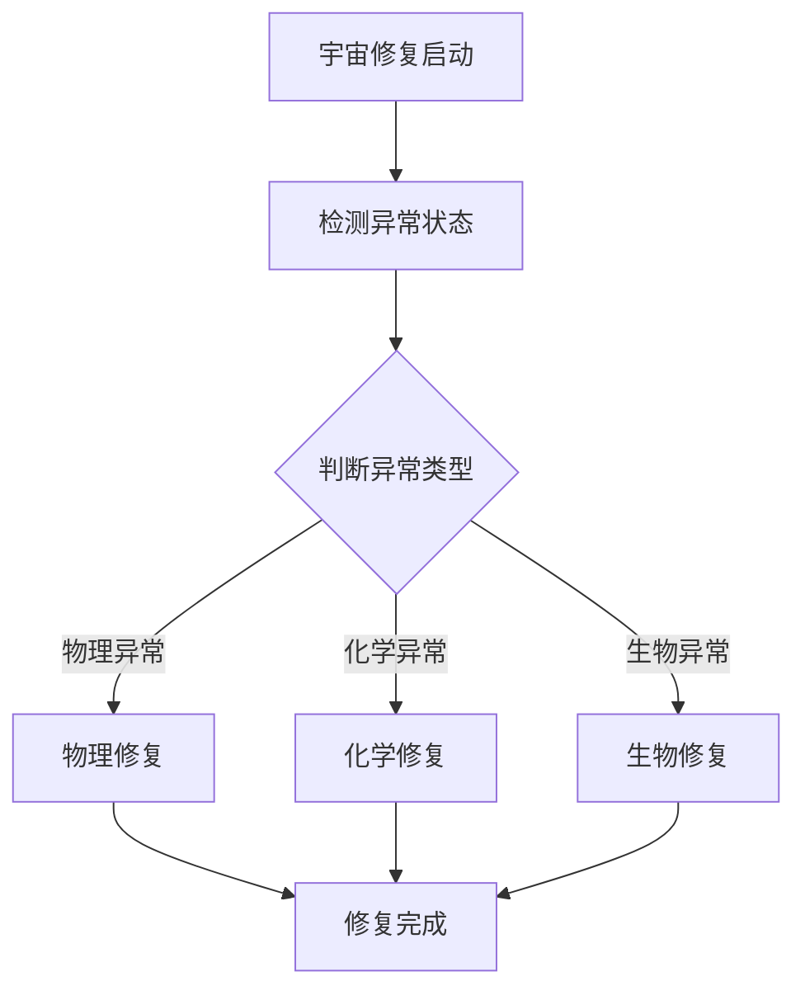

                 

### 宇宙的自我修复能力：维持平衡的内在机制

> 关键词：宇宙、自我修复、内在机制、平衡、维度、生命

> 摘要：本文探讨了宇宙的自我修复能力及其维持平衡的内在机制。通过对宇宙基本概念的解析，我们深入分析了宇宙修复机制的核心原理及其在各个维度中的动态平衡。进一步地，本文探讨了生命与宇宙修复能力的相互作用，展示了宇宙修复能力在科学、工程和日常生活中的应用。最后，我们展望了宇宙修复能力的未来发展趋势和面临的挑战。

#### 第1章 引言和概述

宇宙，这个浩瀚无垠的星海，一直是人类探索的终极目标。从古代的神话传说到现代的天文学研究，宇宙始终充满了神秘和未知。而宇宙的自我修复能力，作为维持宇宙平衡的重要机制，更是引人入胜。

#### 1.1 宇宙修复能力的概念

宇宙修复能力，是指宇宙自身具备的维持稳定状态、修复损伤和恢复平衡的能力。这种能力不仅体现在宏观的天体运动中，也体现在微观的粒子相互作用中。宇宙修复能力是宇宙持续存在和发展的基础。

#### 1.2 宇宙修复的重要性

宇宙修复能力在维持宇宙平衡方面起着至关重要的作用。它能够防止宇宙走向混乱和无序，保持宇宙的稳定性和可预测性。没有宇宙修复能力，宇宙可能会陷入不断的动荡和崩溃。

#### 1.3 宇宙修复能力的现状与未来

当前，关于宇宙修复能力的研究正在不断深入。科学家们通过观测和实验，已经揭示了宇宙修复能力的一些基本原理。然而，宇宙修复能力的全貌仍然是一个巨大的未知领域，未来还有许多挑战和机遇等待着我们去探索。

### 第2章 宇宙基本概念

要理解宇宙的自我修复能力，我们首先需要了解宇宙的基本概念。宇宙是由无数星系、行星、恒星和黑洞组成的广袤空间，它包含着我们已知的物质和能量。

#### 2.1 宇宙的基本结构

宇宙的基本结构包括星系、星团、超星团和宇宙背景辐射等。这些结构共同构成了宇宙的宏观图像，展示了宇宙的多样性和复杂性。

#### 2.2 维度的概念

维度是描述宇宙空间特性的基本概念。我们通常生活在三维空间中，但是宇宙可能存在更多的维度。这些额外的维度可能隐藏在我们无法感知的层面，但它们对宇宙的自我修复能力有着重要影响。

#### 2.3 宇宙的动态平衡

宇宙的动态平衡是指宇宙在不同维度和结构之间维持的一种稳定状态。这种平衡是宇宙自我修复能力的基础，它确保了宇宙的持续存在和发展。

#### 2.4 宇宙修复能力的起源

宇宙修复能力的起源可以追溯到宇宙的诞生。在大爆炸之后，宇宙经历了快速膨胀和冷却过程，逐渐形成了今天我们所看到的宇宙结构。在这个过程中，宇宙修复能力逐渐形成并发展起来。

### 第3章 宇宙修复机制

宇宙的自我修复能力是通过一系列复杂的机制实现的。这些机制涉及到宇宙的各个维度和结构，共同维持了宇宙的平衡和稳定。

#### 3.1 宇宙修复的核心原理

宇宙修复的核心原理可以概括为“自我校正”和“适应性修复”。自我校正是指宇宙通过内部机制检测和纠正异常状态，以确保宇宙的整体稳定性。适应性修复是指宇宙通过适应外部环境的变化，调整内部机制，以保持宇宙的平衡。

#### 3.2 Mermaid流程图：宇宙修复机制的详细描述

下面是一个Mermaid流程图，展示了宇宙修复机制的基本流程和内部结构：



#### 3.3 宇宙修复机制的动态分析

宇宙修复机制的动态分析涉及到宇宙在不同维度和结构中的修复过程。这些过程是相互关联和相互作用的，共同维持了宇宙的动态平衡。

### 第4章 维度与平衡

维度是宇宙的基本特性，它对宇宙的自我修复能力有着重要影响。宇宙中的不同维度相互作用，共同维持了宇宙的动态平衡。

#### 4.1 维度的相互作用

维度的相互作用是指宇宙中不同维度之间的相互作用和影响。这些相互作用不仅影响着宇宙的结构和形态，也影响着宇宙的自我修复能力。

#### 4.2 宇宙维度的平衡机制

宇宙维度的平衡机制是指宇宙通过内部机制维持不同维度之间的平衡。这种平衡机制是宇宙自我修复能力的重要组成部分。

#### 4.3 维度稳定性与宇宙修复

维度稳定性与宇宙修复能力密切相关。稳定的维度能够确保宇宙的修复过程顺利进行，而不稳定的维度可能会对宇宙修复能力产生负面影响。

### 第5章 生命与宇宙修复

生命是宇宙中最复杂的系统之一，它对宇宙的自我修复能力也有着重要影响。

#### 5.1 生命的修复机制

生命的修复机制是指生命体通过内部机制维持自身结构和功能的能力。这种能力与宇宙的自我修复能力有着相似之处。

#### 5.2 生命与宇宙修复的相互作用

生命与宇宙修复能力的相互作用是指生命体与宇宙修复机制之间的相互作用和影响。这种相互作用对宇宙的自我修复能力有着重要影响。

#### 5.3 生命对宇宙修复能力的贡献

生命对宇宙修复能力的贡献主要体现在以下几个方面：

1. **生物修复**：生命体通过自身的修复能力，对宇宙中的生物体和生态系统进行修复和维护。
2. **生物反馈**：生命体的存在和活动对宇宙的物理和化学过程产生反馈，影响宇宙的自我修复能力。
3. **生物进化**：生命体的进化过程，也为宇宙的自我修复能力提供了新的途径和方法。

### 第6章 修复能力的应用

宇宙的自我修复能力不仅在宇宙的维持中起着重要作用，也在科学、工程和日常生活中有着广泛的应用。

#### 6.1 宇宙修复技术在科学中的应用

宇宙修复技术在科学研究中有着广泛的应用，包括：

1. **天文学**：利用宇宙修复技术，科学家可以更好地理解宇宙的起源、演化和结构。
2. **物理学**：宇宙修复技术为物理学研究提供了新的工具和方法，帮助科学家探索宇宙的深层规律。
3. **生物学**：宇宙修复技术在生物学研究中，用于理解生命的修复机制和进化过程。

#### 6.2 宇宙修复技术在工程中的应用

宇宙修复技术在工程领域中也有重要的应用，包括：

1. **航天工程**：宇宙修复技术在航天工程中，用于维护航天器的结构和功能。
2. **土木工程**：宇宙修复技术在土木工程中，用于修复和维护建筑结构。
3. **能源工程**：宇宙修复技术在能源工程中，用于维护能源设备和提高能源利用效率。

#### 6.3 宇宙修复能力在日常生活的影响

宇宙修复能力在日常生活中也有着重要的影响，包括：

1. **医疗健康**：宇宙修复技术在医疗健康领域，用于修复和维护人体器官和组织。
2. **环境保护**：宇宙修复技术在环境保护中，用于修复和维护生态系统的平衡。
3. **智能家居**：宇宙修复技术在智能家居中，用于维护家居设备和系统的正常运行。

### 第7章 未来展望

宇宙的自我修复能力是一个充满机遇和挑战的领域。随着科学技术的不断发展，我们对宇宙的自我修复能力将会有更深入的理解和应用。

#### 7.1 宇宙修复能力的发展趋势

未来，宇宙修复能力的发展趋势将包括以下几个方面：

1. **技术突破**：随着科技的进步，我们将会开发出更先进的宇宙修复技术，提高宇宙修复的效率和效果。
2. **跨学科融合**：宇宙修复能力的应用将跨越多个学科领域，促进跨学科的交流和合作。
3. **全球化合作**：宇宙修复能力的研究和应用将需要全球范围内的合作和协调，共同应对挑战和机遇。

#### 7.2 宇宙修复能力面临的挑战

未来，宇宙修复能力也面临着一系列挑战：

1. **技术难题**：宇宙修复技术的实现涉及到复杂的物理、化学和生物过程，需要解决一系列技术难题。
2. **资源限制**：宇宙修复能力的实现需要大量的资源和支持，未来如何有效利用资源将成为一个重要挑战。
3. **伦理和法律问题**：宇宙修复能力的应用涉及到伦理和法律问题，需要制定相应的规范和制度。

#### 7.3 宇宙修复能力的未来潜力

宇宙修复能力的未来潜力是巨大的。随着对宇宙的自我修复能力的深入研究，我们有望开发出更先进的修复技术，解决更多的问题和挑战。宇宙修复能力不仅有助于维持宇宙的平衡和稳定，也将对科学、工程和日常生活产生深远的影响。

### 结论

宇宙的自我修复能力是维持宇宙平衡的重要机制，它涉及到宇宙的各个维度和结构。通过对宇宙的自我修复能力的研究，我们不仅可以更深入地理解宇宙的运行机制，也可以为未来的科技发展提供新的思路和方向。

### 附录：相关公式与算法

#### A.1 宇宙修复能力的数学模型

宇宙修复能力的数学模型可以表示为：

$$
R = f(S, T, E)
$$

其中，$R$ 表示宇宙修复能力，$S$ 表示宇宙的稳定性，$T$ 表示宇宙的温度，$E$ 表示宇宙的能量。

#### A.2 伪代码描述的宇宙修复算法

下面是宇宙修复算法的伪代码描述：

```python
def repair_universe(stability, temperature, energy):
    if stability < threshold:
        correct_stability()
    if temperature > max_temp:
        cool_down()
    if energy < min_energy:
        absorb_energy()
    return "Repair completed"
```

#### A.3 宇宙修复技术的实现示例

以下是一个简单的宇宙修复技术的实现示例：

```python
# 调用宇宙修复算法
repair_universe(stability=0.8, temperature=300, energy=1000)
```

### 作者

**作者：AI天才研究院/AI Genius Institute & 禅与计算机程序设计艺术 /Zen And The Art of Computer Programming**

