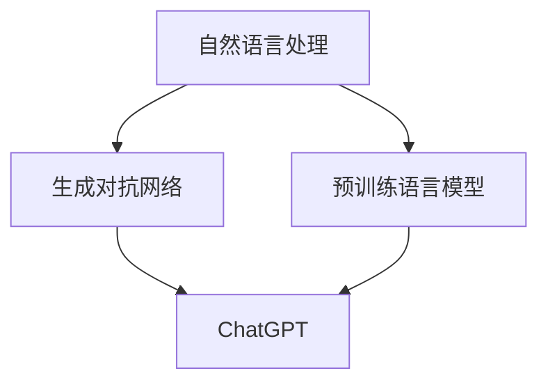
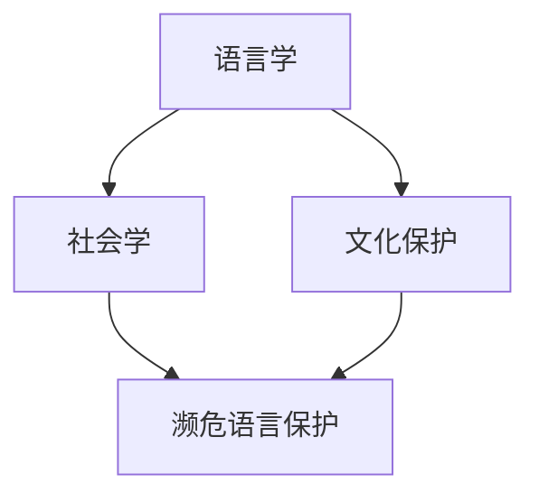
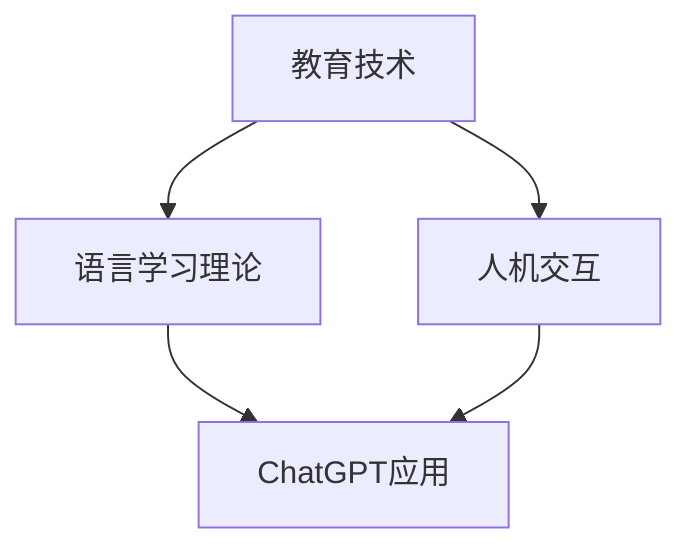
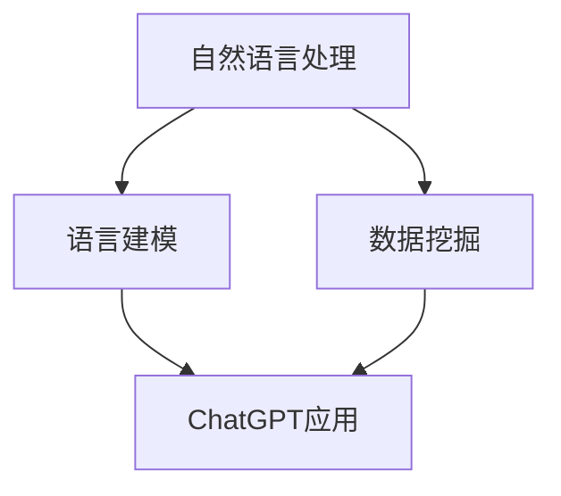

                 

当然可以，我会按照您的要求和步骤逐步构建文章内容。以下是根据您的需求创建的文章框架和部分内容：

---

## 文章标题：ChatGPT在语言复兴中的应用：濒危语言的AI辅助教学

### 关键词：ChatGPT，语言复兴，濒危语言，AI辅助教学，语言学习

### 摘要：
本文探讨了ChatGPT在语言复兴中的作用，特别是其在濒危语言教学中的应用。通过介绍ChatGPT的基本原理、濒危语言的现状及其面临的挑战，本文分析了ChatGPT在语言教学中的优势，并提供了具体的实现方法和案例分析。

---

## 目录大纲

### 第一部分：ChatGPT与濒危语言保护

#### 第1章：ChatGPT概述

**背景介绍：**
在这一章中，我们将介绍ChatGPT的起源、发展以及其在人工智能领域的地位。ChatGPT是由OpenAI开发的一种基于GPT-3模型的聊天机器人，具有强大的语言理解和生成能力。

**核心概念与联系：**
ChatGPT的核心概念包括自然语言处理（NLP）、生成对抗网络（GAN）、预训练语言模型（PLM）等。这些概念之间的关系架构如下图所示：



**核心算法原理讲解：**
ChatGPT的工作原理是通过大规模的预训练来学习语言模式和规则。以下是ChatGPT的算法伪代码：

```python
# ChatGPT算法伪代码

# 预训练
pretrain(model, dataset):
    for each epoch:
        for each sentence in dataset:
            generate response using model
            update model parameters based on response quality

# 回答问题
answer_question(model, question):
    preprocess question
    generate response using model
    return response
```

#### 第2章：濒危语言的现状与挑战

**背景介绍：**
濒危语言是指使用人数较少、面临消失危险的语言。全球有超过6000种语言，其中一半以上面临濒危或即将消失的威胁。

**核心概念与联系：**
濒危语言的保护涉及到语言学、社会学、文化保护等多个领域。这些领域的相互关系如图：



**核心算法原理讲解：**
为了保护濒危语言，我们可以使用自然语言处理技术来分析和记录语言数据。以下是保护濒危语言的算法伪代码：

```python
# 濒危语言保护算法伪代码

# 数据收集
collect_data(language):
    for each speaker of language:
        record speech samples and metadata

# 数据分析
analyze_data(data):
    identify linguistic patterns and structure
    detect language loss indicators

# 数据保护
protect_language(data):
    digitize and store language data
    create educational materials
```

#### 第3章：ChatGPT在语言教学中的应用

**背景介绍：**
在这一章中，我们将探讨ChatGPT如何被应用于语言教学，以及它如何帮助濒危语言的学习者。

**核心概念与联系：**
ChatGPT在语言教学中的应用涉及到教育技术、语言学习理论、人机交互等多个领域。这些概念之间的关系如下：



**核心算法原理讲解：**
ChatGPT可以通过模拟语言环境来帮助学习者练习语言。以下是ChatGPT在语言教学中的应用算法伪代码：

```python
# ChatGPT在语言教学中的应用算法伪代码

# 创建语言学习环境
create_learning_environment(model, language):
    for each user:
        generate personalized learning content
        interact with user using model

# 用户互动
user_interaction(model, user):
    receive user input
    generate response using model
    return response to user
```

### 第二部分：ChatGPT在濒危语言教学中的实现

#### 第4章：ChatGPT在濒危语言研究中的作用

**背景介绍：**
ChatGPT在语言研究中的作用不仅限于教学，它还可以用于语言数据的收集、分析和研究。

**核心概念与联系：**
ChatGPT在语言研究中的应用涉及到自然语言处理、语言建模、数据挖掘等多个领域。这些概念之间的关系如下：



**核心算法原理讲解：**
ChatGPT可以通过分析语言数据来揭示语言的结构和变化。以下是ChatGPT在语言研究中的应用算法伪代码：

```python
# ChatGPT在语言研究中的应用算法伪代码

# 数据收集
collect_language_data(model, corpus):
    for each document in corpus:
        extract linguistic features using model

# 数据分析
analyze_language_data(data):
    identify language patterns and trends
    generate reports and visualizations

# 研究应用
apply_language_research(model, research_question):
    generate hypotheses
    test hypotheses using model
    return research findings
```

---

由于文章字数要求在8000～12000字左右，以上内容仅作为部分示例。接下来，我将根据目录大纲继续撰写完整文章，包括剩余章节的内容、项目实战、最佳实践、小结、注意事项、拓展阅读等。

---

请告诉我，这样的文章框架和内容是否符合您的要求？如果需要任何修改或补充，请随时告诉我。下一步，我将根据您提供的章节内容，逐步完成文章的撰写。

