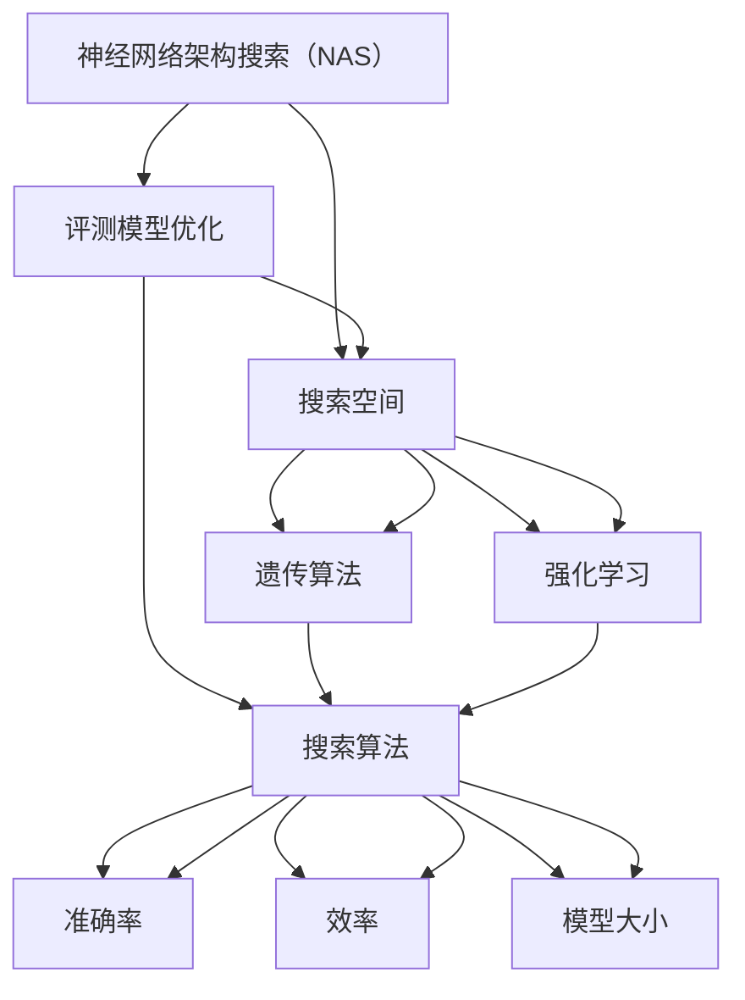

                 

### 1.5 提取核心概念与联系

在引言中，我们介绍了神经网络架构搜索（NAS）的基本概念和背景。接下来，我们需要提取核心概念与联系，并以Mermaid流程图的形式呈现。

**核心概念：**

1. **神经网络架构搜索（NAS）**：一种自动化搜索策略，用于寻找最优的神经网络架构。
2. **搜索空间**：NAS中的搜索对象，包括各种可能的神经网络结构。
3. **搜索算法**：用于在搜索空间中搜索最优架构的方法，如遗传算法、强化学习等。
4. **评测模型优化**：通过调整模型结构、参数等，提高模型在特定任务上的性能。
5. **优化目标**：通常包括准确率、效率、模型大小等指标。

**概念联系：**

- **NAS与搜索空间**：NAS的目标是在搜索空间中找到最优的神经网络架构。
- **搜索算法与搜索空间**：不同的搜索算法适用于不同的搜索空间，它们共同作用，提高搜索效率。
- **NAS与评测模型优化**：NAS可以帮助优化模型的评测性能，而评测模型优化又可以指导NAS的搜索过程。

**Mermaid流程图：**

通过Mermaid流程图，我们可以清晰地展示出各个核心概念之间的联系，为后续章节的内容讲解奠定基础。

### 2.6 编写核心算法原理讲解

在第一章中，我们介绍了神经网络架构搜索（NAS）的基本概念和背景。在本章节中，我们将深入讲解NAS的核心算法原理，包括遗传算法和强化学习在NAS中的应用。

#### 2.6.1 遗传算法（GA）在NAS中的应用

**遗传算法的基本原理**

遗传算法（Genetic Algorithm，GA）是一种基于自然选择和遗传学原理的优化算法。它通过模拟自然进化过程，在搜索空间中寻找最优解。遗传算法的基本流程包括以下步骤：

1. **初始化种群**：随机生成一定数量的初始种群，每个个体表示搜索空间中的一个可能解。
2. **适应度评估**：计算每个个体的适应度，适应度通常与目标函数相关。
3. **选择**：根据适应度对个体进行选择，适应度高的个体有更高的概率被选中。
4. **交叉**：将选中的个体进行交叉操作，生成新的个体。
5. **变异**：对部分个体进行变异操作，增加搜索的多样性。
6. **更新种群**：将交叉和变异后的个体组成新的种群，重复适应度评估和选择步骤。
7. **终止条件**：当满足终止条件（如达到最大迭代次数、适应度满足要求等）时，算法终止。

**遗传算法在NAS中的应用**

在神经网络架构搜索中，遗传算法被用于搜索最优的神经网络结构。具体应用步骤如下：

1. **定义搜索空间**：确定神经网络结构的各个组成部分，如层类型、层数、激活函数等，构成搜索空间。
2. **初始化种群**：根据搜索空间随机生成一定数量的初始种群，每个个体表示一个可能的神经网络结构。
3. **适应度评估**：在特定数据集上训练每个神经网络结构，并评估其性能，如准确率、训练时间等。
4. **选择**：根据适应度对个体进行选择，适应度高的个体有更高的概率被选中。
5. **交叉**：对选中的个体进行交叉操作，生成新的个体。
6. **变异**：对部分个体进行变异操作，增加搜索的多样性。
7. **更新种群**：将交叉和变异后的个体组成新的种群，重复适应度评估和选择步骤。
8. **输出**：当满足终止条件时，输出最优的神经网络结构。

#### 2.6.2 强化学习在NAS中的应用

**强化学习的基本原理**

强化学习（Reinforcement Learning，RL）是一种基于奖励和惩罚的机器