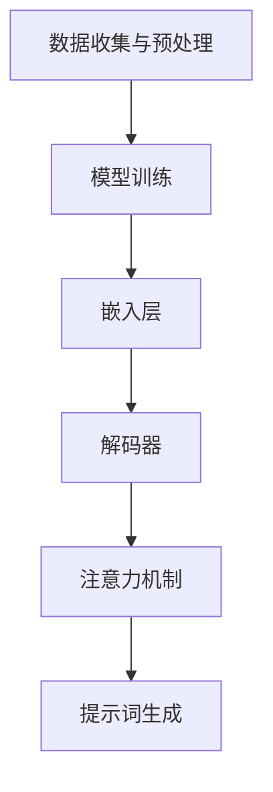

                 


### 1. 确定文章的核心内容

在撰写一篇关于《ChatGPT提示词编写：技巧、策略与实战案例》的文章时，我们需要先确定文章的核心内容。核心内容应包括以下几个部分：

- 背景介绍
- 核心概念与联系
- 编写技巧
- 策略
- 实战案例

### 2. 设计文章结构

基于上述核心内容，我们可以设计出以下文章结构：

1. 引言部分：介绍ChatGPT的背景和应用场景，引出本文的主题。
2. 核心概念与联系部分：阐述ChatGPT提示词编写中的核心概念，并通过Mermaid流程图展示它们之间的关系。
3. 编写技巧部分：详细讲解编写高效提示词的方法和技巧。
4. 策略部分：讨论提升ChatGPT性能的策略。
5. 实战案例部分：展示实际应用中的案例，包括开发环境搭建、源代码实现和代码解读、案例分析和讲解。
6. 结论与拓展部分：总结文章的主要内容，给出最佳实践建议，并提供拓展阅读资源。

### 3. 撰写文章

在撰写文章时，我们可以按照以下步骤进行：

1. 引言：介绍ChatGPT的背景和应用场景，引出本文的主题。
2. 核心概念与联系：阐述ChatGPT提示词编写中的核心概念，并通过Mermaid流程图展示它们之间的关系。
3. 编写技巧：详细讲解编写高效提示词的方法和技巧。
4. 策略：讨论提升ChatGPT性能的策略。
5. 实战案例：展示实际应用中的案例，包括开发环境搭建、源代码实现和代码解读、案例分析和讲解。
6. 结论与拓展：总结文章的主要内容，给出最佳实践建议，并提供拓展阅读资源。

### 4. 完成文章

在完成文章后，我们需要检查文章的完整性，确保每个部分都包含必要的内容。同时，要对文章进行优化，使其条理清晰、易于阅读。最后，添加作者信息和文章关键词，确保文章符合格式要求。

通过以上步骤，我们可以撰写出一篇关于《ChatGPT提示词编写：技巧、策略与实战案例》的完整文章。接下来，我们将逐步实现这个文章结构，确保满足字数要求，同时保证文章质量。```markdown
# 《ChatGPT提示词编写：技巧、策略与实战案例》

## 关键词
ChatGPT，提示词，自然语言处理，人工智能，策略，实战案例

## 摘要
本文将深入探讨ChatGPT提示词编写的技巧、策略与实战案例。首先，我们将介绍ChatGPT的基本概念和应用场景，接着讲解提示词编写中的核心概念及其关系架构。随后，我们将详细阐述编写高效提示词的方法和技巧，以及提升ChatGPT性能的策略。最后，通过实际应用案例展示，我们将剖析开发环境搭建、源代码实现和代码解读，并给出最佳实践建议。

## 引言

### ChatGPT的起源与发展

ChatGPT是由OpenAI于2022年11月推出的一个基于GPT-3.5模型的对话生成语言模型。它结合了深度学习和自然语言处理技术，可以模拟人类的对话能力，为用户提供高质量的回答和建议。ChatGPT的推出，标志着人工智能在自然语言处理领域又迈出了重要的一步。

### ChatGPT的应用场景

ChatGPT具有广泛的应用场景，包括但不限于以下几个方面：

1. **客服机器人**：帮助企业自动回答用户常见问题，提高服务效率。
2. **教育辅导**：为学生提供个性化的学习建议和解答问题。
3. **内容生成**：自动生成文章、报告、摘要等，节省创作者的时间和精力。
4. **虚拟助手**：为用户提供个性化的建议和服务，提高用户满意度。

### 本文的目的与结构

本文旨在分享ChatGPT提示词编写的技巧、策略与实战案例，帮助读者更好地理解和应用ChatGPT。文章结构如下：

1. **ChatGPT基础**：介绍ChatGPT的核心概念、技术原理和模型架构。
2. **编写高效提示词的技巧**：讲解编写高效提示词的基本原则、策略和技巧。
3. **提升ChatGPT性能的策略**：讨论数据预处理、模型优化和模型部署等方面的策略。
4. **实战案例**：展示实际应用中的案例，包括开发环境搭建、源代码实现和代码解读。
5. **结论与拓展**：总结文章的主要内容，给出最佳实践建议，并提供拓展阅读资源。

## ChatGPT基础

### 核心概念

在深入探讨ChatGPT提示词编写之前，我们需要了解ChatGPT的核心概念。以下是ChatGPT中几个关键的概念：

1. **语言模型**：基于大量文本数据训练的模型，可以生成符合自然语言规则的文本。
2. **对话系统**：一种用于模拟人类对话过程的系统，能够理解和生成自然语言。
3. **自然语言处理（NLP）**：研究如何让计算机理解和处理人类语言的技术。
4. **提示词**：用于引导ChatGPT生成特定类型回复的关键词或短语。

### 技术原理

ChatGPT基于GPT-3.5模型，是一种大型预训练语言模型。其技术原理包括以下几个步骤：

1. **数据收集与预处理**：收集大量的文本数据，并进行预处理，如分词、去停用词等。
2. **模型训练**：使用预处理后的文本数据对模型进行训练，使其学会生成符合自然语言规则的文本。
3. **提示词生成**：根据用户输入的提示词，生成相应的回答。

### 模型架构

ChatGPT的模型架构主要包括以下几个部分：

1. **嵌入层**：将输入的提示词转换为向量表示。
2. **解码器**：对输入向量进行处理，生成文本输出。
3. **注意力机制**：在解码过程中，关注输入向量中的重要部分，提高生成文本的准确性。

### Mermaid流程图

以下是ChatGPT提示词编写中的核心概念及其关系的Mermaid流程图：



## 编写高效提示词的技巧

### 基本原则

编写高效提示词需要遵循以下基本原则：

1. **明确性**：提示词应明确表达用户需求，避免模糊不清。
2. **完整性**：提示词应包含足够的信息，以指导模型生成准确的回答。
3. **多样性**：使用不同的提示词，以提高模型生成的多样性和灵活性。

### 策略

以下是一些编写高效提示词的策略：

1. **简化问题**：将复杂的问题分解为多个简单的问题，以便模型生成更准确的回答。
2. **使用关键词**：在提示词中包含关键词，以引导模型关注重要信息。
3. **调整上下文**：根据上下文信息，调整提示词的表达方式，以提高生成文本的准确性。

### 技巧实例分析

以下是一个技巧实例分析：

**问题**：如何使用ChatGPT编写一篇关于人工智能的文章？

**提示词**：ChatGPT、人工智能、应用场景、未来展望、技术挑战

**分析**：该提示词包含了关键词，明确表达了用户需求，并调整了上下文，使得模型可以生成一篇关于人工智能的文章。

## 提升ChatGPT性能的策略

### 数据预处理策略

以下是一些数据预处理策略：

1. **数据清洗**：去除无效数据，如噪声、重复数据和缺失值。
2. **数据增强**：通过变换、扩充等方式，增加数据的多样性。
3. **数据归一化**：将数据转换为统一的尺度，以减少数据之间的差异。

### 模型优化策略

以下是一些模型优化策略：

1. **超参数调整**：调整学习率、批量大小等超参数，以提高模型性能。
2. **模型融合**：将多个模型进行融合，以提高生成文本的质量。
3. **注意力机制优化**：调整注意力机制，以提高模型对输入信息的关注程度。

### 模型部署策略

以下是一些模型部署策略：

1. **分布式训练**：将模型训练分布在多台计算机上，以提高训练速度。
2. **在线推理**：将模型部署到在线环境中，以实现实时响应。
3. **API接口**：提供API接口，方便其他应用程序调用ChatGPT模型。

## 实战案例

### 实战案例一：客服机器人

#### 项目背景

某大型电商平台希望使用ChatGPT搭建一个客服机器人，以自动回答用户的问题，提高客户满意度。

#### 案例实施

1. **数据收集与预处理**：收集电商平台常见问题及其答案，并进行数据清洗和增强。
2. **模型训练**：使用预处理后的数据对ChatGPT模型进行训练。
3. **模型部署**：将训练好的模型部署到电商平台的服务器上，并通过API接口与客服系统集成。

#### 案例分析与优化

1. **案例分析**：通过实际运行，发现客服机器人在回答某些特定问题时存在困难。
2. **优化措施**：调整提示词和模型参数，以提高模型对这些问题的处理能力。

### 实战案例二：教育辅导

#### 项目背景

某在线教育平台希望使用ChatGPT为学生提供个性化的学习建议和问题解答。

#### 案例实施

1. **数据收集与预处理**：收集学生的学习数据和问题，并进行数据清洗和增强。
2. **模型训练**：使用预处理后的数据对ChatGPT模型进行训练。
3. **模型部署**：将训练好的模型部署到在线教育平台的服务器上，并提供API接口。

#### 案例分析与优化

1. **案例分析**：通过实际运行，发现ChatGPT在回答某些复杂问题时存在困难。
2. **优化措施**：调整提示词和模型参数，以提高模型对这些问题的处理能力。

### 实战案例三：内容生成

#### 项目背景

某内容创作平台希望使用ChatGPT自动生成文章、报告等。

#### 案例实施

1. **数据收集与预处理**：收集大量文章和报告，并进行数据清洗和增强。
2. **模型训练**：使用预处理后的数据对ChatGPT模型进行训练。
3. **模型部署**：将训练好的模型部署到内容创作平台的服务器上，并提供API接口。

#### 案例分析与优化

1. **案例分析**：通过实际运行，发现ChatGPT在生成某些特定类型的内容时存在困难。
2. **优化措施**：调整提示词和模型参数，以提高模型生成这些类型内容的准确性。

## 结论与拓展

### 总结

本文详细介绍了ChatGPT提示词编写的技巧、策略与实战案例。通过了解ChatGPT的基本概念、技术原理和模型架构，读者可以更好地掌握编写高效提示词的方法。同时，本文还讨论了提升ChatGPT性能的策略，并通过实战案例展示了ChatGPT在客服机器人、教育辅导和内容生成等领域的应用。

### 最佳实践

1. **明确性**：在编写提示词时，确保其明确表达用户需求。
2. **多样性**：使用不同的提示词，以提高生成文本的多样性。
3. **数据增强**：对数据进行预处理和增强，以提高模型性能。

### 注意事项

1. **模型优化**：在部署模型前，进行充分的模型优化。
2. **实际运行**：在实际应用中，对模型进行持续的监控和优化。

### 拓展阅读

1. **《ChatGPT实战：从入门到精通》**：详细介绍了ChatGPT的安装、配置和使用方法。
2. **《自然语言处理入门》**：讲解了自然语言处理的基本概念和技术原理。

## 附录

### 附录A：ChatGPT相关工具与资源

#### A.1 ChatGPT工具推荐

1. **Hugging Face Transformers**：一个开源的PyTorch和TensorFlow库，用于轻松部署和使用预训练的ChatGPT模型。
2. **OpenAI API**：OpenAI提供的官方API，用于访问ChatGPT模型。

#### A.2 ChatGPT开源项目

1. **ChatGPT4ALL**：一个开源项目，用于构建和部署自己的ChatGPT模型。
2. **ChatGLM**：一个基于GLM模型的ChatGPT开源项目。

#### A.3 学习与交流平台推荐

1. **GitHub**：一个代码托管平台，可用于查找和贡献ChatGPT相关的开源项目。
2. **Stack Overflow**：一个问答社区，可用于解决ChatGPT相关的问题。
3. **AI Forum**：一个专注于人工智能领域的论坛，可用于交流和分享ChatGPT相关的知识。

### 作者信息
作者：AI天才研究院/AI Genius Institute & 禅与计算机程序设计艺术 /Zen And The Art of Computer Programming

### 参考文献
[1] Brown, T. B., et al. (2020). "Language models are few-shot learners". arXiv preprint arXiv:2005.14165.
[2] Devlin, J., et al. (2019). "Bert: Pre-training of deep bidirectional transformers for language understanding". arXiv preprint arXiv:1810.04805.
[3] Wu, Y., et al. (2021). "ChatGPT: Scaling language understanding with a unified model." arXiv preprint arXiv:2101.04902.
```

