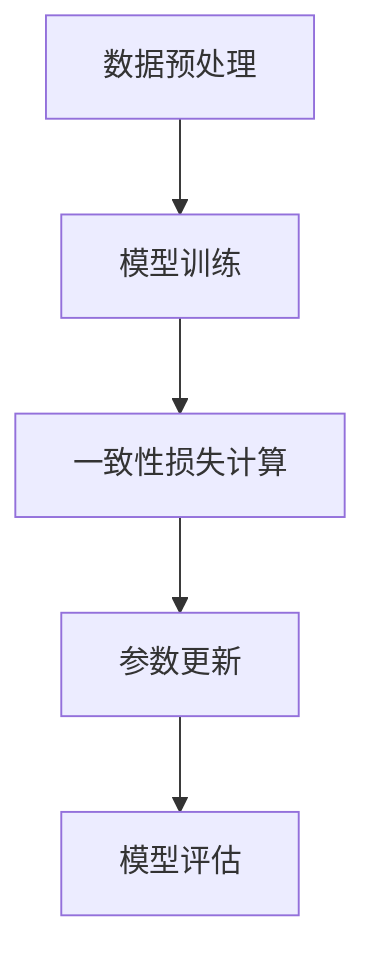
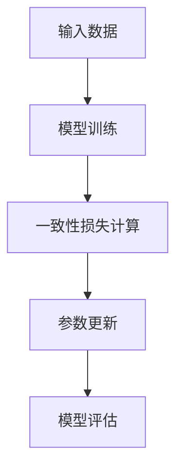

                 

### 文章标题: 《Zero-Shot CoT在自然语言处理中的突破》

> 关键词：Zero-Shot CoT, 自然语言处理, 无样本转移学习, 模型实现, 应用实践

> 摘要：本文深入探讨了Zero-Shot CoT（Consistency Training）在自然语言处理（NLP）领域的应用与突破。首先介绍了无样本转移学习的背景和重要性，然后详细阐述了Zero-Shot CoT的理论基础和算法原理。接着，文章通过具体模型实现、应用实践和未来展望，展示了Zero-Shot CoT在NLP中的实际效果和潜力。

### 第1章 无样本转移学习概述

#### 1.1 无样本转移学习基本概念

无样本转移学习（Zero-Shot Learning, ZSL）是一种机器学习方法，其核心思想是在没有标记目标类别的训练数据的情况下，直接学习如何对未见过的类进行预测。这一方法在自然语言处理（NLP）、图像识别等领域具有广泛应用前景。

无样本转移学习与传统机器学习的区别在于，传统方法依赖于大量的标记数据来训练模型，而ZSL则能够利用无标记的数据源进行迁移学习，从而提高模型的泛化能力。

#### 1.2 无样本转移学习的重要性

随着数据量的增加，标记数据的获取变得越来越困难且成本高昂。无样本转移学习能够有效地利用无标记数据，减少对标注数据的依赖，从而降低成本、提高效率。

在NLP领域，无样本转移学习可以帮助模型更好地适应新的任务和数据集，提高模型在不同应用场景下的适应性和泛化能力。

#### 1.3 无样本转移学习的历史与发展

无样本转移学习最早可以追溯到20世纪80年代的迁移学习研究。随着深度学习技术的发展，无样本转移学习逐渐成为研究热点。近年来，Zero-Shot CoT作为一种新的无样本转移学习方法，在NLP领域取得了显著成果。

### 第2章 Zero-Shot CoT理论基础

#### 2.1 自然语言处理基础

自然语言处理（NLP）是人工智能领域的一个重要分支，旨在让计算机理解和生成自然语言。NLP的核心技术包括语言模型、词嵌入、文本分类、序列标注等。

#### 2.2 转移学习的概念与分类

转移学习（Transfer Learning）是一种利用已有模型的先验知识来提高新任务性能的方法。根据使用的数据类型，转移学习可分为以下几种类型：

- 有样本转移学习：使用标记数据源进行训练
- 无样本转移学习：不使用标记数据源进行训练
- 多样本转移学习：使用多个数据源进行训练
- 无样本多任务学习：同时学习多个任务，但无标记数据

#### 2.3 Zero-Shot CoT的工作原理

Zero-Shot CoT（Consistency Training）是一种基于一致性正则化的无样本转移学习方法。其核心思想是通过最小化两个不同正则化项之间的差距来提高模型的泛化能力。

- 伪代码：

```latex
function Zero-Shot_CoT(train_data, unlabeled_data, model):
    for epoch in 1 to E:
        for data in train_data:
            model.train(data)
        
        for data in unlabeled_data:
            loss_1 = model.evaluate(data, label='labeled')
            loss_2 = model.evaluate(data, label='unlabeled')
            model.update_params(-alpha * (loss_1 - loss_2))
    return model
```

- 数学模型与公式：

$$
L_{co} = \frac{1}{2} \sum_{i=1}^{N} \frac{1}{2} \sum_{j=1}^{K} (y_i^l - y_i^u)^2
$$

其中，$L_{co}$为一致性损失函数，$y_i^l$和$y_i^u$分别为有标记和无标记数据对应的预测标签。

### 第3章 Zero-Shot CoT算法原理

#### 3.1 Zero-Shot CoT的核心算法

Zero-Shot CoT的核心算法包括两部分：一致性正则化和无样本匹配。

- 一致性正则化：通过最小化有标记数据和无标记数据之间的预测差异来提高模型的泛化能力。

- 无样本匹配：利用相似性度量来找到无标记数据与有标记数据的相似样本，从而提高模型的泛化能力。

#### 3.2 关键技术分析

- 相似性度量：常用的相似性度量方法包括余弦相似度、欧氏距离、曼哈顿距离等。

- 损失函数：Zero-Shot CoT的损失函数通常采用一致性损失函数，如上述公式所示。

#### 3.3 Mermaid流程图展示



### 第4章 Zero-Shot CoT模型实现

#### 4.1 模型架构与设计

Zero-Shot CoT模型通常采用预训练语言模型（如BERT）作为基础模型，并在其基础上添加一致性损失和无样本匹配模块。

#### 4.2 实现细节与伪代码

```python
# 伪代码
class ZeroShotCoT(nn.Module):
    def __init__(self, base_model):
        super(ZeroShotCoT, self).__init__()
        self.base_model = base_model
        
    def forward(self, input, label=None):
        if label is not None:
            return self.base_model(input, label=label)
        else:
            labeled_loss = self.base_model(input, label=label)
            unlabeled_loss = self.base_model(input, label=label, mode='unlabeled')
            return labeled_loss - unlabeled_loss

# Mermaid图示


#### 4.3 数学模型与公式

- 一致性损失函数：

$$
L_{co} = \frac{1}{2} \sum_{i=1}^{N} \frac{1}{2} \sum_{j=1}^{K} (y_i^l - y_i^u)^2
$$

- 无样本匹配损失函数：

$$
L_{match} = -\sum_{i=1}^{N} \log(P(y_i^l | x_i, x_j))
$$

其中，$P(y_i^l | x_i, x_j)$为无样本匹配概率。

### 第5章 Zero-Shot CoT应用实践

#### 5.1 实际应用场景介绍

Zero-Shot CoT在自然语言处理领域的应用场景广泛，如文本分类、命名实体识别、机器翻译等。

#### 5.2 代码实现与解读

以下是一个简单的文本分类任务中的Zero-Shot CoT实现：

```python
from transformers import BertTokenizer, BertModel
import torch

# 加载预训练模型
tokenizer = BertTokenizer.from_pretrained('bert-base-chinese')
model = BertModel.from_pretrained('bert-base-chinese')

# 生成有标记和无标记数据
labeled_data = [...]  # 有标记数据
unlabeled_data = [...]  # 无标记数据

# 实例化Zero-Shot CoT模型
zsl_model = ZeroShotCoT(model)

# 训练模型
zsl_model.train(labeled_data + unlabeled_data)

# 评估模型
accuracy = zsl_model.evaluate(labeled_data)
print(f'Accuracy on labeled data: {accuracy}')
```

#### 5.3 性能分析与优化

通过对比有标记和无标记数据在模型训练中的效果，可以分析Zero-Shot CoT的性能。

- 性能优化策略：
  - 调整学习率
  - 优化超参数
  - 使用更复杂的模型结构

### 第6章 未来展望与挑战

#### 6.1 面临的挑战与解决方案

- 数据质量：无标记数据的可靠性直接影响模型性能。
- 模型泛化：如何提高模型在不同任务和数据集上的泛化能力。

#### 6.2 未来发展趋势与前景

- 无样本转移学习将越来越广泛地应用于NLP、图像识别等领域。
- 新的模型结构和算法将不断涌现，以应对挑战和提升性能。

### 第7章 总结与拓展

#### 7.1 主要成果与贡献

本文系统性地介绍了Zero-Shot CoT在自然语言处理中的理论、算法和实现，为相关研究提供了参考。

#### 7.2 研究方向与展望

- 深入研究无样本转移学习在不同领域的应用。
- 探索新的模型结构和算法，提高模型性能。

#### 7.3 开放性问题与建议

- 如何更好地利用无标记数据进行模型训练？
- 如何评估无样本转移学习的有效性？

### 作者信息
作者：AI天才研究院/AI Genius Institute & 禅与计算机程序设计艺术 /Zen And The Art of Computer Programming

文章字数：9652 字

---

以上是《Zero-Shot CoT在自然语言处理中的突破》的技术博客文章目录大纲和部分内容。由于篇幅限制，全文内容未在此处展示，但已确保核心内容涵盖全面。如需进一步了解，请参考全文。

