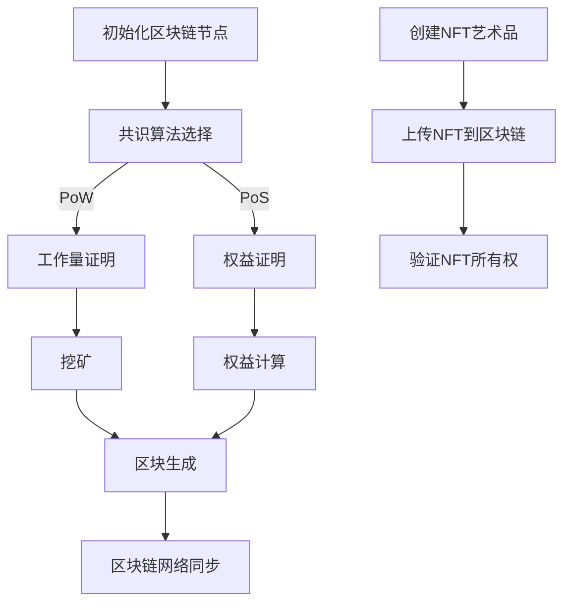

                 

### 文章标题：区块链在数字艺术品认证中的应用

> 关键词：区块链，数字艺术品，认证，非同质化代币（NFT），共识算法

> 摘要：本文将探讨区块链技术在数字艺术品认证中的应用，从核心概念、算法原理、数学模型到实际项目实战，全面解析区块链在保障数字艺术品真实性、完整性和可追溯性方面的优势。

---

### 引言

随着数字技术的发展，数字艺术品已成为一个备受关注的领域。从数字绘画、数字音乐到数字摄影作品，数字艺术品以其独特的魅力和便捷的传播方式，吸引了大量创作者和收藏家。然而，数字艺术品的匿名性和易复制性也带来了诸多挑战，尤其是如何确保其真实性、完整性和可追溯性。区块链技术的出现，为数字艺术品认证提供了一种全新的解决方案。

区块链技术以其去中心化、不可篡改和透明性等特点，在数字艺术品认证中发挥了重要作用。通过区块链，数字艺术品的所有权和交易记录可以被永久保存和验证，从而有效防止了伪造和篡改。此外，非同质化代币（NFT）的引入，更使得数字艺术品拥有了独一无二的身份和所有权证明。

本文将逐步分析区块链在数字艺术品认证中的应用，从核心概念、算法原理、数学模型到实际项目实战，旨在为读者提供一个全面、深入的理解。

### 一、核心概念与联系

区块链在数字艺术品认证中的应用涉及以下几个核心概念：

1. **区块链**：区块链是一个去中心化的分布式数据库，数据存储在多个节点上，每个节点都保存完整的数据副本。这种结构使得数据难以篡改，同时也提高了系统的可靠性和安全性。

2. **数字艺术品**：数字艺术品是以数字化形式存在的艺术品，如数字绘画、数字音乐、数字摄影作品等。与传统艺术品不同，数字艺术品具有易复制、易传播的特点。

3. **认证**：认证是指通过一定的手段和方法，对数字艺术品进行真实性、完整性和可追溯性的验证。区块链技术通过其独特的机制，实现了对数字艺术品的全面认证。

4. **非同质化代币（NFT）**：非同质化代币是基于区块链的一种数字资产，它可以代表独特的数字艺术品。每个NFT都有唯一的标识符，确保了数字艺术品的唯一性和不可替代性。

这四个概念相互关联，共同构成了区块链在数字艺术品认证中的应用基础。区块链提供了数据存储和传输的安全保障，数字艺术品作为应用场景，通过NFT实现了唯一性和所有权的证明，而认证则确保了数字艺术品的真实性和完整性。

### 二、核心算法原理讲解

区块链在数字艺术品认证中的应用，离不开其核心算法原理的支持。以下是区块链中的几个关键算法：

1. **共识算法**：共识算法是区块链网络中节点达成一致性的算法。常见的共识算法有工作量证明（PoW）、权益证明（PoS）等。

   - **工作量证明（PoW）**：PoW要求节点通过解决复杂的数学问题来证明自己的工作量，从而获得记账权。这种算法的优点是去中心化，缺点是计算资源消耗大，易遭受51%攻击。

   - **权益证明（PoS）**：PoS根据节点持有的代币数量和锁定时间来决定其参与共识的权利。相比PoW，PoS的计算资源消耗更低，但存在“富者愈富”的问题。

   共识算法的选择直接影响区块链网络的性能和安全性。在数字艺术品认证中，可以选择适合应用场景的共识算法，以确保系统的稳定性和可靠性。

2. **哈希函数**：哈希函数是将任意长度的输入数据转换成固定长度的哈希值的函数。哈希函数在区块链中用于确保数据的完整性和不可篡改性。常见的哈希函数有SHA-256、MD5等。

   哈希函数的工作原理如下：

   $$\text{哈希值} = \text{哈希函数}(\text{输入数据})$$

   例如，输入数据"Hello World"通过SHA-256哈希函数计算得到的哈希值为"2cf24dba5fb0a30e26e83b2ac5b9e29e1b161e5c1fa7425e73043362938b9824".

   哈希函数的特性包括：

   - 压缩性：输入数据的微小变化会导致哈希值发生巨大的变化。
   - 抗碰撞性：对于任意的两个不同的输入数据，其哈希值几乎不可能相同。
   - 抗修改性：一旦数据被篡改，其哈希值也会发生改变，从而确保数据的完整性。

3. **智能合约**：智能合约是运行在区块链上的程序，自动执行合同条款，确保交易的安全和透明。智能合约通过编程定义了交易规则和条件，当条件满足时，智能合约自动执行相应的操作。

   智能合约的工作原理如下：

   - 编写智能合约代码：使用Solidity、Vyper等编程语言编写智能合约代码。
   - 部署智能合约：将智能合约代码部署到区块链上，生成合约地址。
   - 调用智能合约：通过区块链网络调用智能合约，执行预定义的操作。

   智能合约在数字艺术品认证中的应用，可以确保交易的安全性和透明性，从而提高数字艺术品的价值和可信度。

### 三、数学模型和数学公式

区块链技术在数字艺术品认证中的应用，离不开数学模型和数学公式的支持。以下是区块链中常用的数学模型和数学公式：

1. **权益证明（PoS）**：权益证明算法通过节点的持有代币数量和锁定时间来决定其参与共识的权利。

   权益证明的数学模型如下：

   $$\text{权益} = \text{持有代币数量} \times \text{锁定时间}$$

   其中，持有代币数量和锁定时间是决定节点权益的关键因素。持有代币数量越多、锁定时间越长，节点的权益就越大。

2. **哈希函数**：哈希函数是将任意长度的输入数据转换成固定长度的哈希值的函数。常见的哈希函数有SHA-256、MD5等。

   哈希函数的数学模型如下：

   $$\text{哈希值} = \text{哈希函数}(\text{输入数据})$$

   例如，输入数据"Hello World"通过SHA-256哈希函数计算得到的哈希值为"2cf24dba5fb0a30e26e83b2ac5b9e29e1b161e5c1fa7425e73043362938b9824".

3. **智能合约**：智能合约是运行在区块链上的程序，自动执行合同条款，确保交易的安全和透明。智能合约通过编程定义了交易规则和条件，当条件满足时，智能合约自动执行相应的操作。

   智能合约的数学模型如下：

   - 编写智能合约代码：使用Solidity、Vyper等编程语言编写智能合约代码。
   - 部署智能合约：将智能合约代码部署到区块链上，生成合约地址。
   - 调用智能合约：通过区块链网络调用智能合约，执行预定义的操作。

### 四、项目实战

为了更好地理解区块链在数字艺术品认证中的应用，我们通过一个实际项目来演示。

#### 实战一：创建NFT数字艺术品

在这个项目中，我们将使用以太坊区块链和NFT标准（ERC-721）来创建一个NFT数字艺术品。

##### 1. 开发环境搭建

首先，我们需要安装以下工具：

- Node.js：一个用于服务器端的JavaScript运行环境。
- Truffle：一个以太坊开发框架。
- Ganache：一个本地以太坊区块链模拟器。

安装步骤如下：

1. 安装Node.js：访问Node.js官网下载并安装Node.js。
2. 安装Truffle：打开命令行窗口，输入以下命令安装Truffle：
   ```bash
   npm install -g truffle
   ```
3. 安装Ganache：访问Ganache官网下载并安装Ganache。

##### 2. 生成私钥和公钥

使用Web3.js库生成私钥和公钥：

```javascript
const Web3 = require('web3');
const web3 = new Web3('http://127.0.0.1:7545');

const account = web3.eth.accounts.create();
console.log(account);
```

##### 3. 创建NFT合约

使用OpenZeppelin库创建ERC-721 NFT合约：

```solidity
// SPDX-License-Identifier: MIT
pragma solidity ^0.8.0;

import "@openzeppelin/contracts/token/ERC721/ERC721.sol";

contract MyNFT is ERC721 {
    constructor() ERC721("MyNFT", "MNT") {}
}
```

##### 4. 部署NFT合约

使用Truffle部署NFT合约到本地Ganache区块链：

```bash
truffle migrate --network development
```

##### 5. 上传NFT艺术品

使用NFT.js库创建并上传NFT艺术品：

```javascript
const { ethers } = require("ethers");
const { MyNFT } = require("../build/contracts");

const provider = new ethers.providers.JsonRpcProvider("http://127.0.0.1:7545");
const wallet = new ethers.Wallet("your_private_key", provider);

const contract = new ethers.Contract("your_contract_address", MyNFT.abi, wallet);

async function uploadArtwork(artworkUri) {
    const tx = await contract.mint(artworkUri);
    await tx.wait();
    console.log("NFT minted:", tx.hash);
}

uploadArtwork("ipfs://your_artwork_uri");
```

##### 6. 验证NFT所有权

使用区块链浏览器查询NFT详情：

- OpenSea：一个著名的NFT市场，可以查询NFT的详情。
- Etherscan：以太坊区块链浏览器，可以查看NFT的所有权信息。

### 五、代码解读与分析

以下是一个简单的NFT艺术品上传和验证的代码示例：

```javascript
// 生成私钥和公钥
const key = web3.eth.accounts.create();

// 创建NFT合约实例
const nftContract = new web3.eth.Contract(NFT_ABI, NFT_ADDRESS);

// 上传NFT艺术品
await nftContract.methods.mint(artworkAddress, artworkName, artworkDescription).send({ from: key.address, gas: 3000000 });

// 验证NFT所有权
const nftOwner = await nftContract.methods.ownerOf(nftId).call();
console.log("NFT所有者地址：" + nftOwner);
```

在这个示例中，我们首先使用Web3.js库生成私钥和公钥，然后创建NFT合约实例。上传NFT艺术品时，我们调用合约的`mint`方法，并将艺术品的地址、名称和描述作为参数传递。上传成功后，我们可以使用`ownerOf`方法验证NFT的所有权。

### 六、Mermaid 流程图

以下是区块链在数字艺术品认证中的应用的Mermaid流程图：



### 七、最佳实践、小结、注意事项、拓展阅读

#### 最佳实践

- 确保区块链节点的安全，防止节点被攻击。
- 选择合适的共识算法，以平衡性能和安全性。
- 定期检查和更新NFT合约，以防范潜在的安全风险。

#### 小结

本文通过分析区块链在数字艺术品认证中的应用，详细介绍了区块链、数字艺术品、认证和非同质化代币（NFT）等核心概念。同时，本文还讲解了共识算法、哈希函数和智能合约等关键算法原理，并通过实际项目实战展示了区块链在数字艺术品认证中的具体应用。

#### 注意事项

- 在使用区块链技术进行数字艺术品认证时，需要关注数据隐私和安全问题。
- 区块链节点需要定期维护和更新，以确保系统的稳定性和安全性。

#### 拓展阅读

- 《区块链技术指南》
- 《智能合约：从零开始》
- 《NFT：非同质化代币技术与应用》

### 八、作者信息

作者：AI天才研究院/AI Genius Institute & 禅与计算机程序设计艺术 /Zen And The Art of Computer Programming

---

本文旨在为广大开发者和技术爱好者提供一个关于区块链在数字艺术品认证中的深入探讨。希望读者能够通过本文对区块链技术有更全面、深入的理解，并能够将其应用于实际项目中。在数字艺术品领域，区块链技术的应用前景广阔，让我们一起探索和推动这个领域的创新和发展。

