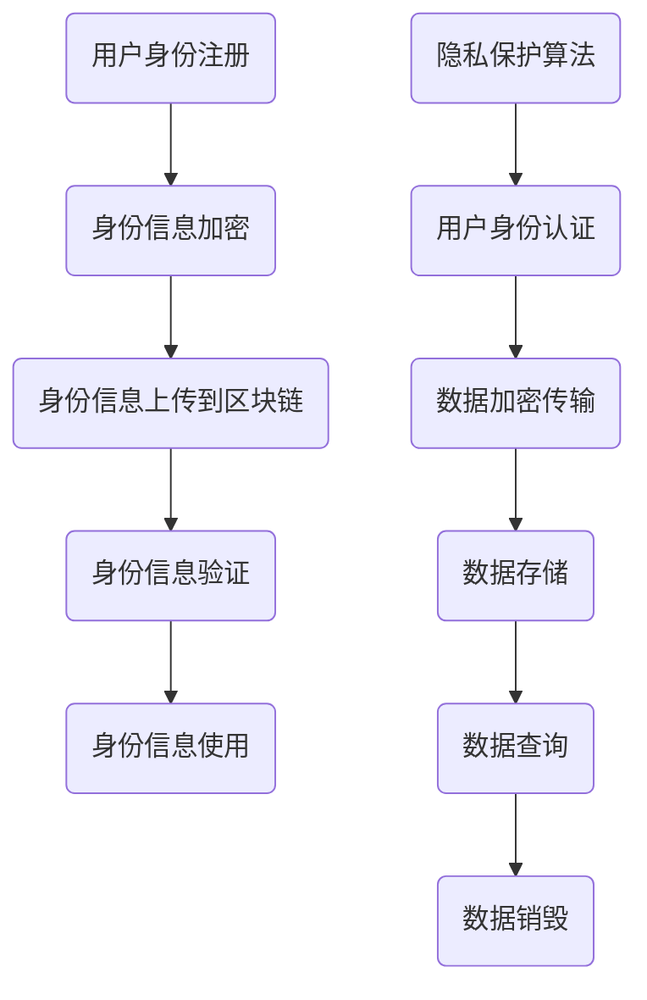

                 

### 文章标题

# 区块链在数字身份管理中的隐私保护应用

> 关键词：区块链，数字身份管理，隐私保护，加密算法，零知识证明

> 摘要：本文旨在探讨区块链技术在数字身份管理中的应用，特别是在隐私保护方面的挑战和解决方案。通过详细解析区块链的基础概念、核心算法、数学模型以及实际项目案例，文章将为读者展示如何利用区块链实现高效的隐私保护，并探讨未来数字身份管理的趋势。

### 引言

在数字化时代，个人和企业的数据隐私保护问题日益突出。传统的中心化身份管理系统在数据存储和传输过程中面临着诸多挑战，如数据泄露、信息篡改和单点故障等。为了解决这些问题，区块链技术以其去中心化、不可篡改和透明性等特性，逐渐成为数字身份管理领域的热门话题。本文将围绕区块链在数字身份管理中的隐私保护应用，逐步分析其背后的核心概念、算法原理以及实际项目案例，帮助读者深入理解这一前沿技术。

### 背景介绍

#### 区块链技术

区块链是一种分布式账本技术，其核心特点包括去中心化、不可篡改和透明性。区块链通过一系列加密算法和共识机制，将数据分散存储在不同的节点上，从而实现信息的透明、安全和高效管理。在数字身份管理中，区块链技术被广泛应用于身份验证、数据存储和隐私保护等方面。

#### 数字身份管理

数字身份管理是指通过技术手段对个人或企业的数字身份进行标识、认证、管理和保护的过程。随着互联网的普及和在线活动的增加，数字身份管理变得越来越重要。传统的数字身份管理方式依赖于中心化的认证机构，这种模式在保障用户隐私方面存在一定的风险。

#### 隐私保护需求

在数字身份管理中，隐私保护是一个关键需求。用户希望通过安全的技术手段保护自己的个人信息，防止数据泄露、滥用和篡改。然而，传统的中心化系统在数据处理过程中往往缺乏有效的隐私保护机制，容易导致隐私泄露问题。

### 核心概念与联系

#### 区块链与数字身份管理

区块链技术为数字身份管理提供了安全、透明和去中心化的基础设施。通过区块链，可以实现身份信息的分布式存储和验证，从而提高隐私保护水平。同时，区块链的不可篡改特性确保了身份信息的一致性和可信度。

#### 隐私保护技术

隐私保护技术在数字身份管理中发挥着重要作用。这些技术包括加密算法、零知识证明、同态加密等，它们可以在数据传输和存储过程中提供隐私保护，防止敏感信息被泄露。

#### Mermaid流程图展示区块链在数字身份管理中的应用架构



### 核心算法原理讲解

#### 区块链的关键算法

1. **哈希算法**：哈希算法是将任意长度的数据转换为固定长度的字符串的算法。在区块链中，哈希算法用于生成数据块的哈希值，确保数据的完整性和不可篡改性。
   
   ```python
   def hash_data(data):
       # 使用SHA-256算法生成哈希值
       return hashlib.sha256(data.encode('utf-8')).hexdigest()
   ```

2. **共识算法**：共识算法是区块链网络中的节点通过何种方式达成共识的机制。常见的共识算法包括工作量证明（PoW）、权益证明（PoS）等。共识算法确保了区块链网络的稳定性和安全性。

   ```python
   def proof_of_work(target_difficulty):
       # 工作量证明算法示例
       while True:
           nonce = random.randint(0, 2**32)
           if hash_block_header(nonce) < target_difficulty:
               return nonce
   ```

3. **智能合约**：智能合约是区块链网络中的自动执行合约，它基于预定的条件自动执行合约条款。智能合约可以用于实现复杂的业务逻辑和身份验证流程。

   ```solidity
   contract IdentityManagement {
       mapping(address => bytes32) public identities;

       function registerIdentity(bytes32 identity) public {
           identities[msg.sender] = identity;
       }
   }
   ```

#### 隐私保护算法

1. **同态加密**：同态加密是一种允许在加密状态下进行计算和操作的加密算法。同态加密可以在不泄露明文内容的情况下对数据进行计算，从而实现隐私保护。

   ```python
   def homomorphic_encrypt(message, public_key):
       # 使用同态加密算法加密消息
       cipher_text = encrypt(message, public_key)
       return cipher_text
   ```

2. **零知识证明**：零知识证明是一种允许证明某个陈述为真的加密协议，而不泄露任何有关该陈述的具体信息的算法。零知识证明可以用于实现隐私保护的身份验证。

   ```python
   def zero_knowledge_proof(prover, public_params, challenge):
       # 使用零知识证明协议证明身份
       proof = prover.generate_proof(public_params, challenge)
       return proof
   ```

#### 数学模型和公式

1. **椭圆曲线加密**：椭圆曲线加密是一种基于椭圆曲线离散对数问题的加密算法。椭圆曲线加密可以用于实现高效的数据加密和身份验证。

   ```latex
   E: y^2 = x^3 + ax + b \pmod{p}
   ```

2. **秘密共享**：秘密共享是一种将秘密划分为多个部分，只有一定数量的部分组合在一起才能恢复原始秘密的加密协议。秘密共享可以用于实现隐私保护的权限管理。

   ```latex
   S = {s_1, s_2, ..., s_n} \pmod{m}
   ```

### 项目实战

#### 实际案例介绍

本部分将介绍一个使用区块链技术保护数字身份隐私的实际项目案例。该项目旨在实现一个去中心化的身份验证系统，用户可以通过区块链网络注册和管理自己的数字身份，确保隐私和安全。

#### 开发环境搭建

为了搭建该项目，需要以下开发环境和工具：

1. **Node.js**：用于实现区块链节点和智能合约的运行环境。
2. **Truffle**：用于智能合约开发、部署和测试的工具。
3. **Web3.js**：用于与以太坊区块链进行交互的JavaScript库。

#### 源代码实现和代码解读

以下是一个简单的智能合约示例，用于实现数字身份的注册和验证：

```solidity
pragma solidity ^0.8.0;

contract IdentityManagement {
    mapping(address => bytes32) public identities;

    function registerIdentity(bytes32 identity) public {
        identities[msg.sender] = identity;
    }

    function verifyIdentity(address user) public view returns (bool) {
        bytes32 identity = identities[user];
        return keccak256(abi.encodePacked(identity)) == identity;
    }
}
```

该智能合约实现了身份注册和验证的功能。用户可以通过`registerIdentity`函数注册自己的身份，并通过`verifyIdentity`函数验证其他用户的身份。

#### 代码解读与分析

1. **身份注册**：用户通过调用`registerIdentity`函数，将身份信息存储在区块链上。函数接受一个`bytes32`类型的参数，表示用户的身份。
   
2. **身份验证**：其他用户可以通过调用`verifyIdentity`函数，验证指定用户的身份。函数使用Keccak-256哈希算法，将身份信息与存储在区块链上的信息进行比较，以确定身份是否合法。

#### 实际案例分析和详细讲解剖析

以下是一个实际案例，展示如何使用区块链技术保护数字身份隐私：

1. **用户注册**：用户通过浏览器访问数字身份验证系统，填写个人信息并注册。系统后台将用户信息加密后上传到区块链。
   
2. **身份验证**：当用户需要验证身份时，系统将生成一个随机数，并将其发送给区块链。区块链上的智能合约将随机数与用户身份信息进行加密计算，生成一个证明，并返回给系统。

3. **隐私保护**：在整个过程中，用户身份信息始终保持加密状态，只有经过授权的节点才能解密和验证。这确保了用户的隐私安全。

#### 项目小结

通过实际项目案例，我们可以看到区块链技术如何有效地保护数字身份隐私。项目实现了身份注册、验证和隐私保护的功能，为数字身份管理提供了一种可行的解决方案。未来，随着区块链技术的不断发展，数字身份管理将变得更加高效和可靠。

### 最佳实践 tips

1. **选择合适的区块链平台**：在选择区块链平台时，需要考虑平台的安全性、可扩展性和社区支持等因素。
2. **优化隐私保护算法**：隐私保护算法是实现数字身份隐私保护的关键。在实际项目中，可以根据具体需求优化算法，提高隐私保护水平。
3. **定期审计和更新智能合约**：智能合约的安全性对数字身份管理至关重要。因此，需要定期对智能合约进行审计和更新，以修复潜在的安全漏洞。

### 小结与注意事项

本文从区块链在数字身份管理中的应用出发，详细介绍了隐私保护的核心概念、算法原理、数学模型以及实际项目案例。通过一步步分析推理，我们深入理解了区块链在隐私保护方面的优势和应用前景。未来，随着区块链技术的不断发展，数字身份管理将在隐私保护方面发挥越来越重要的作用。

### 拓展阅读

1. 《区块链技术指南》
2. 《数字身份管理：挑战与机遇》
3. 《同态加密与隐私保护》

### 附录

#### 相关工具和资源

1. **区块链开发工具**：Truffle、Ganache、Node.js
2. **隐私保护算法实现资源**：PyCrypto、PyECC、Zcash

#### 练习题

1. 请解释区块链技术的基本概念。
2. 请简述数字身份管理的重要性。
3. 请描述同态加密和零知识证明的原理和应用。
4. 请分析一个实际区块链项目，并指出其隐私保护的优势和不足。

作者：AI天才研究院/AI Genius Institute & 禅与计算机程序设计艺术 /Zen And The Art of Computer Programming

