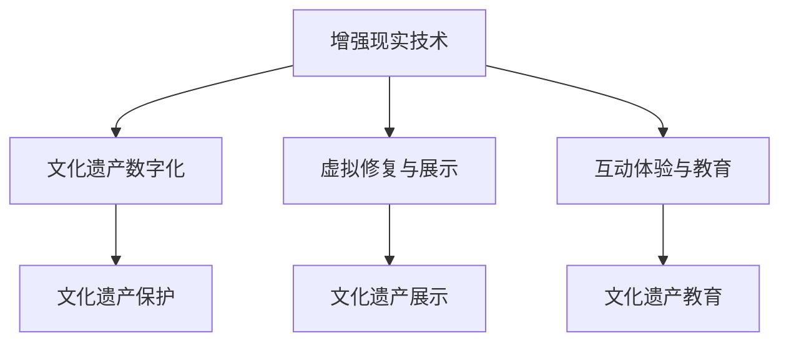

                 

：

首先，让我们从背景介绍开始。在当今时代，随着科技的不断进步，增强现实（Augmented Reality，简称AR）技术逐渐成为热门话题。这种技术通过将虚拟信息与现实世界相结合，为用户提供了一种全新的交互体验。在文化遗产保护领域，增强现实技术展现出巨大的应用潜力。

### 1. 背景介绍

文化遗产是人类历史和文化的见证，具有不可替代的价值。然而，许多文化遗产正面临着诸如自然老化、人为破坏和环境变化等威胁。传统的保护手段往往无法满足现代需求，而增强现实技术提供了一种全新的解决方案。

### 2. 核心概念与联系

为了更好地理解增强现实在文化遗产保护中的应用，我们需要首先明确几个核心概念：

- **增强现实技术**：通过计算机生成的虚拟信息与现实世界进行叠加，使用户能够在现实环境中感知和交互虚拟信息。
- **文化遗产数字化**：将文化遗产以数字形式进行记录、保存和展示，以便于保护和传承。
- **虚拟修复与展示**：利用增强现实技术对受损的文化遗产进行虚拟修复，并创造虚拟展示环境，提高游客的参与感和体验感。
- **互动体验与教育**：通过增强现实技术为用户提供互动体验，促进文化遗产的教育传播。

以下是这些核心概念之间的联系架构（使用Mermaid流程图）：



### 3. 核心算法原理讲解

增强现实技术在文化遗产保护中的应用，离不开一系列核心算法的支持。以下我们将详细讲解几个关键算法的原理：

#### 3.1 SLAM技术

同时定位与地图构建（Simultaneous Localization and Mapping，简称SLAM）是增强现实技术中的核心技术之一。它允许设备在未知环境中同时进行位置估计和地图构建。

```python
# 伪代码：SLAM技术基础算法
def SLAM():
    # 初始化环境
    init_map()
    init_camera()
    
    while not end_of_data:
        # 获取当前图像
        image = get_current_image()
        
        # 使用特征提取算法提取关键点
        keypoints = feature_extraction(image)
        
        # 使用地图构建算法更新地图
        map = map_builder(map, keypoints)
        
        # 使用相机标定算法更新相机参数
        camera = camera_calibration(camera, keypoints)
        
        # 输出结果
        output_result(map, camera)
```

#### 3.2 3D建模与渲染

3D建模与渲染是增强现实技术中不可或缺的环节。通过3D建模，我们可以将文化遗产以数字形式进行重建，并通过渲染技术使其在虚拟环境中栩栩如生。

```python
# 伪代码：3D建模与渲染算法
def 3D建模与渲染(model):
    # 重建文化遗产
    reconstructed_model = reconstruction(model)
    
    # 渲染虚拟环境
    rendered_environment = render(reconstructed_model)
    
    # 输出渲染结果
    output_rendered_environment(rendered_environment)
```

#### 3.3 数据处理与融合

数据处理与融合是增强现实技术的关键步骤。通过对图像、声音、传感器数据等多种信息进行综合处理，我们可以更好地理解文化遗产的实际情况，并提供更加丰富的交互体验。

```python
# 伪代码：数据处理与融合算法
def 数据处理与融合(data):
    # 图像处理
    processed_image = image_processing(data['image'])
    
    # 声音处理
    processed_sound = sound_processing(data['sound'])
    
    # 传感器数据处理
    processed_sensors = sensor_data_processing(data['sensors'])
    
    # 数据融合
    fused_data = data_fusion(processed_image, processed_sound, processed_sensors)
    
    # 输出融合结果
    output_fused_data(fused_data)
```

### 4. 数学模型和数学公式讲解

增强现实技术在文化遗产保护中的应用，涉及到一系列数学模型和公式的计算。以下我们将介绍几个关键数学模型和公式：

#### 4.1 相机标定

相机标定是SLAM技术中的重要步骤。通过标定，我们可以获取相机的内部和外部参数，从而准确计算图像和现实世界之间的对应关系。

$$
P = K \cdot [R|t]
$$

其中，$P$ 是图像坐标，$K$ 是相机内参矩阵，$R$ 是旋转矩阵，$t$ 是平移向量。

#### 4.2 3D重建

3D重建是文化遗产数字化保护的关键环节。通过点云数据的处理和三维空间建模，我们可以将文化遗产以数字形式进行重建。

$$
X = T \cdot X'
$$

其中，$X$ 是重建后的三维点云，$T$ 是变换矩阵，$X'$ 是原始点云。

#### 4.3 数据融合

数据融合是将多种传感器数据综合处理的过程。通过贝叶斯滤波等算法，我们可以得到更准确的状态估计。

$$
p(x|z) \propto p(z|x) \cdot p(x)
$$

其中，$p(x|z)$ 是给定观测数据 $z$ 的状态概率，$p(z|x)$ 是观测模型，$p(x)$ 是状态先验概率。

### 5. 项目实战

为了更好地展示增强现实在文化遗产保护中的应用，我们将以一个实际项目为例进行讲解。

#### 5.1 项目简介

本项目旨在利用增强现实技术对一座古建筑进行数字化保护。项目包括以下步骤：

1. **数据采集**：通过无人机航拍和地面扫描设备获取古建筑的三维点云数据。
2. **数据处理**：对采集到的数据进行预处理，包括去除噪声、填补缺失点等。
3. **三维重建**：利用预处理后的数据，通过3D建模软件进行三维重建。
4. **增强现实展示**：利用增强现实技术，将三维重建的古建筑展示在现实环境中。

#### 5.2 开发环境搭建

为了实现上述项目，我们需要搭建一个完整的开发环境。以下是开发环境的搭建步骤：

1. **硬件设备**：选择合适的无人机和地面扫描设备，确保数据采集的质量。
2. **软件工具**：安装三维建模软件（如Blender）、增强现实开发框架（如ARCore、ARKit）等。
3. **编程语言**：使用Python等编程语言进行数据处理和增强现实展示。

#### 5.3 源代码解读与分析

以下是对项目源代码的解读与分析：

```python
# 解读：无人机航拍数据采集
def collect_data(无人机):
    while not 无人机.data_available():
        无人机.take_off()
        无人机.move_to_target(目标位置)
        无人机.take_photo()
        无人机.move_to_next_point()
    无人机.land()

# 解读：三维重建
def reconstruction(data):
    # 预处理数据
    processed_data = preprocess_data(data)
    
    # 重建三维模型
    model = 3D建模软件.reconstruct(processed_data)
    
    # 渲染模型
    rendered_model = 3D建模软件.render(model)
    
    return rendered_model

# 解读：增强现实展示
def show_AR(model, camera):
    # 加载增强现实框架
    ar_framework = AR框架.load()
    
    # 设置相机参数
    ar_framework.set_camera(camera)
    
    # 显示三维模型
    ar_framework.show_model(model)
```

#### 5.4 实际案例分析和详细讲解剖析

以下是一个实际案例分析和详细讲解：

**案例：故宫古建筑的增强现实展示**

1. **数据采集**：利用无人机和地面扫描设备，对故宫古建筑进行数据采集，获取三维点云数据。
2. **数据处理**：对采集到的数据进行预处理，包括去除噪声、填补缺失点等，以提高数据处理的质量。
3. **三维重建**：利用预处理后的数据，通过3D建模软件进行三维重建，重建出故宫古建筑的三维模型。
4. **增强现实展示**：利用增强现实技术，将三维重建的故宫古建筑展示在游客的现实环境中，提供更加沉浸式的游览体验。

#### 5.5 项目小结

本项目通过增强现实技术在文化遗产保护中的应用，实现了古建筑的数字化保护和展示。实践证明，增强现实技术为文化遗产保护提供了新的手段，有助于提高公众对文化遗产的认识和兴趣。

### 6. 最佳实践 tips、小结、注意事项、拓展阅读等内容

- **最佳实践 tips**：在进行增强现实文化遗产保护项目时，需要注意以下几点：
  - 确保数据采集的质量，选择合适的设备和技术。
  - 在数据处理过程中，注意去除噪声和填补缺失点，以提高数据处理的质量。
  - 充分利用增强现实技术，为用户提供丰富的交互体验。

- **小结**：增强现实技术在文化遗产保护中的应用，为文化遗产的数字化保护和展示提供了新的思路和手段。通过本项目的实践，我们看到了增强现实技术的巨大潜力。

- **注意事项**：在进行增强现实文化遗产保护项目时，需要关注以下几点：
  - 保护好原始数据，确保数据的完整性和准确性。
  - 充分考虑文化遗产的特殊性质，合理设计虚拟修复和展示方案。

- **拓展阅读**：为了更好地了解增强现实技术在文化遗产保护中的应用，读者可以参考以下文献：
  - 《增强现实技术与应用》
  - 《文化遗产数字化保护理论与实践》

---

以上就是关于《增强现实在文化遗产保护中的应用》的技术博客文章。文章从背景介绍、核心概念与联系、核心算法原理讲解、数学模型和数学公式讲解、项目实战以及最佳实践 tips 等方面进行了详细阐述。希望通过这篇文章，让读者对增强现实技术在文化遗产保护中的应用有更深入的了解。作者：AI天才研究院/AI Genius Institute & 禅与计算机程序设计艺术 /Zen And The Art of Computer Programming

