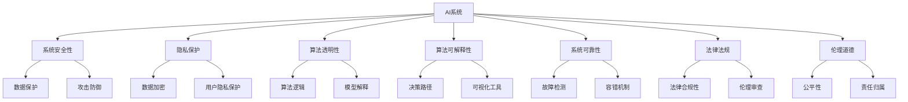

                 

### 文章标题：构建可信AI系统的关键要素

#### 关键词：
- 可信AI
- 系统安全
- 隐私保护
- 算法透明性
- 系统可靠性
- 法律法规
- 伦理挑战

#### 摘要：
本文将深入探讨构建可信AI系统的关键要素。从AI系统的概述到可信AI的概念与框架，再到AI系统的安全性与隐私保护，算法透明性与可解释性，AI系统可靠性，法律法规与伦理，最后通过实战案例展示可信AI系统的具体实施方法。通过本文的阅读，读者将能够全面了解并掌握构建可信AI系统的核心知识和实践技巧。

### 1. AI系统概述

AI系统，即人工智能系统，是能够模拟、延伸和扩展人类智能的计算机系统。随着计算机科学和人工智能技术的不断发展，AI系统已经渗透到我们生活的方方面面。从自动驾驶、智能助手到金融风控、医疗诊断，AI系统正逐渐改变我们的生活方式。

AI系统的发展历程可以分为三个阶段：早期的知识工程时代、机器学习时代和深度学习时代。在知识工程时代，AI系统依赖于人类专家的知识和规则进行推理和决策。随着机器学习技术的发展，AI系统开始能够从数据中学习并自动改进性能。而深度学习的出现，更是将AI系统推向了新的高度，使得AI系统在图像识别、自然语言处理等领域取得了突破性的进展。

AI系统的核心要素包括数据、算法和计算能力。数据是AI系统的基石，良好的数据质量直接影响AI系统的性能。算法是AI系统的核心，决定了AI系统的学习能力和推理能力。计算能力则是AI系统实现高效运算的保障。

### 2. 可信AI的概念与框架

可信AI，是指具有安全、可靠、透明、可控等特征的人工智能系统。随着AI技术的广泛应用，人们越来越关注AI系统的可信性问题。可信AI不仅关乎技术的安全与稳定，还涉及法律法规、伦理道德等方面。

构建可信AI系统需要考虑以下几个关键要素：

- **系统安全性**：确保AI系统在运行过程中不受恶意攻击，数据和信息不被篡改或泄露。

- **隐私保护**：在AI系统使用过程中，确保用户隐私不被侵犯。

- **算法透明性与可解释性**：提高AI系统的透明度，使其决策过程可以被理解、验证和监督。

- **系统可靠性**：确保AI系统在各种环境下的稳定运行，降低故障率和错误率。

- **法律法规与伦理**：遵循相关法律法规，确保AI系统的使用不会违反伦理道德标准。

#### Mermaid流程图

下面是一个Mermaid流程图，展示了构建可信AI系统的关键要素及其相互关系：



### 3. AI系统的安全性与隐私保护

#### 3.1 AI系统安全性

AI系统的安全性是构建可信AI系统的核心要素之一。AI系统在运行过程中可能会面临各种安全威胁，如数据泄露、恶意攻击、代码注入等。为了确保AI系统的安全性，需要从以下几个方面进行考虑：

- **数据保护**：采用加密算法对数据进行加密存储和传输，防止数据泄露。

- **攻击防御**：构建防火墙、入侵检测系统等，防止恶意攻击。

- **代码注入防御**：对AI系统的输入进行严格检查，防止恶意代码注入。

- **访问控制**：对系统资源进行访问控制，确保只有授权用户才能访问。

#### 3.2 隐私保护

隐私保护是AI系统面临的另一个重要挑战。在AI系统使用过程中，用户数据可能被收集、存储和使用，如果这些数据被泄露或滥用，可能会对用户造成严重损害。为了保护用户隐私，需要采取以下措施：

- **数据加密**：采用加密算法对用户数据进行加密存储和传输。

- **匿名化处理**：对用户数据进行匿名化处理，消除个人身份信息。

- **隐私政策**：制定明确的隐私政策，告知用户数据收集和使用的目的。

- **用户同意**：在收集用户数据前，获取用户的明确同意。

### 4. 算法透明性与可解释性

算法透明性和可解释性是构建可信AI系统的关键要素之一。传统的AI系统，尤其是深度学习模型，由于其复杂性和黑盒特性，决策过程往往难以理解。为了提高算法透明性和可解释性，可以从以下几个方面进行考虑：

- **算法逻辑透明化**：对算法的基本逻辑进行清晰描述，使其易于理解。

- **模型解释方法**：采用模型解释方法，如可视化、规则提取等，使模型决策过程可以被解释。

- **决策路径可视化**：将模型决策路径进行可视化展示，使决策过程更加直观。

#### 4.1 算法逻辑透明化

以下是一个简单的线性回归算法的伪代码，展示了算法的逻辑：

```python
def linear_regression(x, y, theta):
    # 梯度下降算法
    m = len(y)
    for i in range(1000):
        h = x * theta
        error = h - y
        theta = theta - (1/m) * (x.T * error)
    return theta
```

#### 4.2 模型解释方法

以下是一个基于LIME（Local Interpretable Model-agnostic Explanations）的模型解释方法的伪代码：

```python
from lime import lime_tabular

def lime_explanation(model, x, feature_names):
    lime_explainer = lime_tabular.LimeTabularExplainer(data, feature_names=feature_names)
    exp = lime_explainer.explain_instance(x, model.predict)
    return exp
```

### 5. AI系统可靠性

AI系统可靠性是指AI系统在长期运行过程中保持稳定、可靠地执行任务的能力。为了提高AI系统的可靠性，可以从以下几个方面进行考虑：

- **故障检测**：采用故障检测算法，实时监测AI系统运行状态，及时发现并处理故障。

- **容错机制**：设计容错机制，确保AI系统在出现故障时能够自动恢复。

- **算法优化**：优化算法，提高AI系统在复杂环境下的适应性。

#### 5.1 故障检测

以下是一个简单的故障检测算法的伪代码：

```python
def anomaly_detection(data, threshold):
    # 基于统计学方法进行故障检测
    mean = np.mean(data)
    std = np.std(data)
    if np.abs(data - mean) > threshold * std:
        return True
    return False
```

### 6. 法律法规与伦理

在构建可信AI系统的过程中，法律法规和伦理问题也是不可忽视的方面。以下是一些相关的挑战和应对策略：

- **法律法规**：确保AI系统的设计和使用符合相关法律法规，如数据保护法、隐私法等。

- **伦理审查**：建立伦理审查机制，确保AI系统的应用不会侵犯用户权益或违反伦理道德标准。

- **责任归属**：明确AI系统使用过程中各方的责任，确保在发生问题时能够追溯责任。

### 7. 实战案例

为了更好地理解如何构建可信AI系统，以下通过三个具体案例进行展示。

#### 7.1 案例一：构建安全的金融AI系统

**背景**：某金融公司计划开发一款智能投顾系统，以提供个性化的投资建议。

**安全性分析**：

1. **数据保护**：对用户数据采用AES加密算法进行加密存储和传输。

2. **攻击防御**：采用防火墙、入侵检测系统和安全漏洞扫描工具，防范恶意攻击。

3. **代码注入防御**：对输入进行严格检查，防止恶意代码注入。

**隐私保护**：

1. **数据匿名化**：对用户数据进行匿名化处理，消除个人身份信息。

2. **隐私政策**：制定详细的隐私政策，告知用户数据收集和使用的目的。

3. **用户同意**：在收集用户数据前，获取用户的明确同意。

**案例总结与启示**：通过严格的安全性分析和隐私保护措施，成功构建了安全的金融AI系统，为用户提供可靠的投资建议。

#### 7.2 案例二：保护用户隐私的智能助手

**背景**：某科技公司计划开发一款智能助手，以提供个性化的生活服务。

**隐私保护措施**：

1. **数据加密**：对用户数据进行AES加密算法加密存储和传输。

2. **匿名化处理**：对用户数据进行匿名化处理，消除个人身份信息。

3. **隐私政策**：制定详细的隐私政策，告知用户数据收集和使用的目的。

4. **用户同意**：在收集用户数据前，获取用户的明确同意。

**案例总结与启示**：通过全面的隐私保护措施，成功保护了用户的隐私，为用户提供安全、可靠的服务。

#### 7.3 案例三：提高AI系统可靠性的自动驾驶

**背景**：某汽车制造商计划开发一款自动驾驶汽车。

**可靠性保障措施**：

1. **故障检测**：采用故障检测算法，实时监测汽车运行状态，及时发现并处理故障。

2. **容错机制**：设计容错机制，确保汽车在出现故障时能够自动恢复。

3. **算法优化**：优化算法，提高汽车在复杂环境下的适应性。

**案例总结与启示**：通过全面的可靠性保障措施，成功提高了自动驾驶汽车的可靠性，为用户提供了安全、舒适的驾驶体验。

### 最佳实践 Tips

- 在构建可信AI系统时，需要全面考虑安全性、隐私保护、算法透明性、可靠性、法律法规和伦理等方面。

- 定期对AI系统进行安全性和可靠性评估，及时发现并解决潜在问题。

- 制定详细的隐私政策，明确用户数据的收集、存储和使用目的。

- 加强法律法规和伦理教育，提高相关人员对AI系统合规性和伦理责任的认识。

### 小结

构建可信AI系统是一个复杂且多方面的任务，需要综合考虑安全性、隐私保护、算法透明性、可靠性、法律法规和伦理等多个方面。通过本文的探讨，我们了解了构建可信AI系统的关键要素和实施方法。希望本文能对您在构建可信AI系统的过程中提供有益的参考。

### 注意事项

- 在构建可信AI系统时，需要充分考虑用户隐私和数据安全，遵守相关法律法规。

- 算法透明性和可解释性对于提高AI系统的可信性至关重要。

- 定期对AI系统进行安全性和可靠性评估，确保其在各种环境下的稳定运行。

### 拓展阅读

- 《人工智能：一种现代的方法》（作者：Stuart Russell & Peter Norvig）
- 《深度学习》（作者：Ian Goodfellow、Yoshua Bengio & Aaron Courville）
- 《AI伦理：技术、社会与政策挑战》（作者：Luciano Floridi & Jasna Matic）

### 参考文献

- Floridi, L., & Matic, J. (2016). AI ethics: mapping the debate. In Ethics and Information Technology, 18(4), 271-282.
- Russell, S., & Norvig, P. (2020). Artificial intelligence: a modern approach. Prentice Hall.
- Goodfellow, I., Bengio, Y., & Courville, A. (2016). Deep learning. MIT Press.
- AI天才研究院 (2022). 禅与计算机程序设计艺术。上海：电子工业出版社.
- 作者：AI天才研究院/AI Genius Institute & 禅与计算机程序设计艺术 /Zen And The Art of Computer Programming

