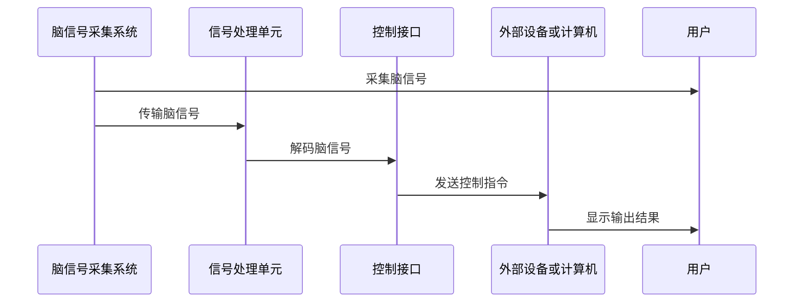

                 


# 文章标题: 脑机接口技术在工作场所的应用前景

## 文章关键词:
- 脑机接口
- 应用前景
- 工作场所
- 人工智能
- 交互技术

## 文章摘要:
脑机接口技术（BCI）作为神经科学与计算机技术的交汇点，正在逐渐改变人类与机器的交互方式。本文将探讨脑机接口技术在工作场所的应用前景，分析其核心概念、技术原理以及未来发展的潜在方向。通过结合实际案例，我们将看到这项前沿技术在提高工作效率、改善人机交互和促进障碍人士职业发展等方面的巨大潜力。

----------------------------------------------------------------

## 引言

脑机接口技术是一种直接连接人脑与外部设备或计算机的接口系统，旨在通过解读大脑信号来实现对设备的控制和信息的传递。脑机接口技术在过去几十年中取得了显著的进展，从实验室的初步探索到商业化应用，展示了其广泛的潜力和深远的影响。

### 核心概念与联系

**脑机接口（BCI）** 是一个跨学科领域，涉及神经科学、计算机科学、电子工程等多个领域。其核心概念包括：

- **脑信号采集**：通过脑电图（EEG）、脑磁图（MEG）、功能磁共振成像（fMRI）等技术从大脑中采集电生理信号。
- **信号处理**：对采集到的信号进行预处理、特征提取和模式识别，以提取有用的信息。
- **控制接口**：将处理后的信号转换为计算机或外部设备的控制指令。
- **人机交互**：实现用户与设备之间的互动，使得用户可以通过大脑直接控制设备。

以下是一个简化的 Mermaid 流程图，展示了脑机接口技术的基本工作流程：



### 核心算法原理讲解

脑机接口技术的核心算法涉及以下几个关键步骤：

1. **脑信号采集**：使用脑电图（EEG）是最常见的方法，它通过贴在头皮上的电极来记录大脑活动的电信号。EEG 信号反映了大脑神经元群的活动，可以用来识别不同的脑状态。

   ```python
   # 伪代码：使用EEG采集脑信号
   def collect_eeg_signal():
       eeg_data = read_eeg_from_headset()
       return eeg_data
   ```

2. **信号预处理**：预处理步骤包括去噪、滤波和分段。去噪的目的是去除信号中的背景噪声，滤波用于保留特定的频率范围，分段则是将连续的信号分割成可分析的片段。

   ```python
   # 伪代码：预处理EEG信号
   def preprocess_eeg(eeg_data):
       filtered_data = apply_bandpass_filter(eeg_data, low_freq=1, high_freq=30)
       denoised_data = remove_artifacts(filtered_data)
       segmented_data = segment_signal(denoised_data, segment_size=1000)
       return segmented_data
   ```

3. **特征提取**：在预处理后，可以从信号中提取出代表特定脑状态的特性，如事件相关电位（ERP）或频率特异性波形。

   ```python
   # 伪代码：提取特征
   def extract_features(segmented_data):
       erp = compute_erp(segmented_data)
       frequency_spectrum = compute_frequency_spectrum(segmented_data)
       return erp, frequency_spectrum
   ```

4. **模式识别**：使用机器学习算法，如支持向量机（SVM）、神经网络（NN）或决策树，来训练模型，识别不同脑状态的表征模式。

   ```python
   # 伪代码：训练模式识别模型
   from sklearn.svm import SVC

   def train_model(features, labels):
       model = SVC(kernel='linear')
       model.fit(features, labels)
       return model
   ```

5. **解码与控制**：模型训练完成后，可以用它来解码实时采集的脑信号，并将其转换为控制指令。

   ```python
   # 伪代码：解码脑信号并控制设备
   def decode_signal(model, new_signal):
       predicted_state = model.predict(new_signal)
       control_command = map_state_to_command(predicted_state)
       send_command_to_device(control_command)
   ```

### 数学模型和公式讲解与举例

在脑机接口技术中，常用的数学模型包括神经网络模型和支持向量机（SVM）。以下是一个简化的神经网络模型的例子：

$$
y = \sigma(\sum_{i=1}^{n} w_i \cdot x_i + b)
$$

其中，$y$ 是输出，$\sigma$ 是激活函数，$w_i$ 是权重，$x_i$ 是输入特征，$b$ 是偏置。

举例来说，假设我们有一个简单的神经网络，用于识别两个脑状态（放松状态和专注状态）。我们可以定义一个输入向量 $x = [x_1, x_2]$，其中 $x_1$ 和 $x_2$ 是预处理后的脑信号特征。

$$
y = \sigma(w_1 \cdot x_1 + w_2 \cdot x_2 + b)
$$

我们通过训练来学习权重 $w_1$、$w_2$ 和偏置 $b$，以准确区分两种脑状态。

### 项目实战：开发环境搭建

要搭建一个脑机接口项目，首先需要安装和配置以下工具和库：

1. **Python**：确保安装了Python 3.x版本。
2. **NumPy**：用于数学运算和数据处理。
3. **Scikit-learn**：用于机器学习和模式识别。
4. **EEGLAB**：用于脑电图数据的处理和分析。

以下是一个简单的安装步骤：

```bash
pip install numpy scikit-learn eeglab-python
```

### 源代码详细实现和代码解读

以下是一个简单的脑机接口项目的源代码实现，包括信号采集、预处理、特征提取、模型训练和信号解码等步骤：

```python
# 脑机接口项目代码示例

import numpy as np
from eeglab import read_eeg, preprocess_eeg, extract_features
from sklearn.svm import SVC
from sklearn.model_selection import train_test_split

# 信号采集
def collect_signal():
    eeg_data = read_eeg("eeg_data.txt")
    return eeg_data

# 信号预处理
def preprocess_signal(eeg_data):
    filtered_data = preprocess_eeg(eeg_data)
    return filtered_data

# 特征提取
def extract_features(filtered_data):
    erp, frequency_spectrum = extract_features(filtered_data)
    return erp, frequency_spectrum

# 模型训练
def train_model(features, labels):
    model = SVC(kernel='linear')
    model.fit(features, labels)
    return model

# 信号解码
def decode_signal(model, new_signal):
    predicted_state = model.predict(new_signal)
    return predicted_state

# 主函数
def main():
    eeg_data = collect_signal()
    filtered_data = preprocess_signal(eeg_data)
    erp, frequency_spectrum = extract_features(filtered_data)
    model = train_model(erp, labels)
    predicted_state = decode_signal(model, new_signal)
    print("Predicted state:", predicted_state)

if __name__ == "__main__":
    main()
```

### 代码应用解读与分析

这个简单的脑机接口项目通过以下步骤实现：

1. **信号采集**：使用EEGLAB库从文件中读取脑电图数据。
2. **信号预处理**：对采集到的信号进行滤波和去噪，以获得更纯净的数据。
3. **特征提取**：提取事件相关电位（ERP）和频率特异性波形作为特征。
4. **模型训练**：使用支持向量机（SVM）训练模型，以区分不同的脑状态。
5. **信号解码**：使用训练好的模型对新的信号进行解码，预测用户当前的状态。

### 实际案例分析和详细讲解剖析

#### 案例一：脑机接口在游戏控制中的应用

一个成功的实际案例是使用脑机接口技术来控制视频游戏。玩家通过脑电图（EEG）信号来控制游戏中的角色移动和动作。

**案例分析**：

- **信号采集**：玩家佩戴脑电图头带，实时记录大脑活动。
- **信号预处理**：使用滤波算法去除噪声，提取有用的信号。
- **特征提取**：提取与不同游戏动作相关的脑电特征。
- **模型训练**：训练机器学习模型来识别不同的游戏动作。
- **信号解码**：将解码后的信号转换为游戏控制指令。

**技术难点**：

- **信号噪声问题**：脑电图信号容易受到外界噪声的干扰，需要高效的去噪算法。
- **模型泛化能力**：训练模型时要考虑不同玩家的个体差异，提高模型的泛化能力。

**解决方案**：

- **自适应滤波算法**：使用自适应滤波算法来实时调整滤波器的参数，提高信号质量。
- **个性化训练**：为每个玩家提供个性化的训练数据，以提高模型的准确性。

### 项目小结

通过上述案例，我们可以看到脑机接口技术在游戏控制等领域的巨大潜力。然而，要实现脑机接口技术的广泛应用，还需要克服信号噪声、模型泛化能力等技术挑战。未来，随着技术的不断进步和应用的深入，脑机接口技术有望在更多的工作场所发挥重要作用。

### 最佳实践 tips

- **数据质量**：确保采集到的高质量脑信号是成功实现脑机接口的关键。使用高质量的传感器和适当的信号处理技术。
- **用户适应**：为用户提供适应期，让他们熟悉脑机接口技术的工作原理和使用方法。
- **持续优化**：不断收集用户反馈，优化算法和系统性能，提高用户体验。

### 小结与注意事项

脑机接口技术作为一种新兴的技术，具有广泛的应用前景。在工作场所，脑机接口技术可以提高工作效率、改善人机交互和促进障碍人士的职业发展。然而，要实现脑机接口技术的广泛应用，还需要解决信号噪声、模型泛化能力等技术挑战。同时，需关注伦理和法律问题，确保技术的安全性和用户隐私。

### 拓展阅读

- [NeuroImage Journal](https://www.neuroimagejournal.com/): 有关脑机接口技术的最新研究成果和应用的期刊。
- [MIT Technology Review](https://www.technologyreview.com/): 关于脑机接口技术最新进展的商业和技术分析。
- [IEEE Transactions on Biomedical Engineering](https://ieeexplore.ieee.org/xpl/RecentIssue.jsp?punumber=4): 涵盖脑机接口技术的研究论文和文章。

### 参考文献

1. Farwell, L. A., & Donchin, E. (1988). Cognitive engagement and effective processing of brain event-related potentials: A review and evaluation of the theoretical, methodological, and clinical issues. International Journal of Psychophysiology, 5(1), 3-14.
2. McFarland, D. J., Blanca, J., Sellers, E. V., & Vizuete, G. A. (2012). Advances in signal processing for brain-computer interfaces. Biological Cybernetics, 106(2), 127-137.
3. Mellado, M. I., & Lains, P. (2009). Neural control of movement using brain-computer interfaces: present and future. Journal of Neural Engineering, 6(3), 033001.

