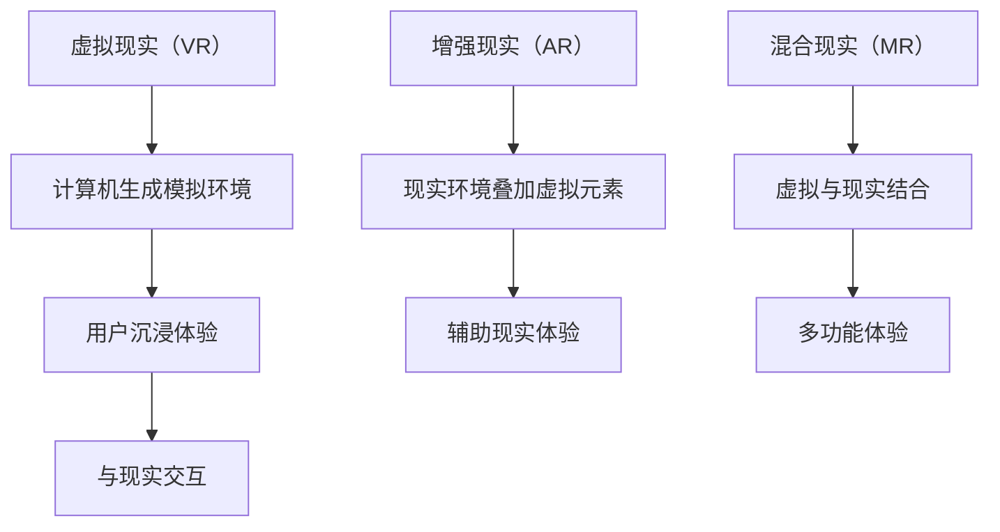
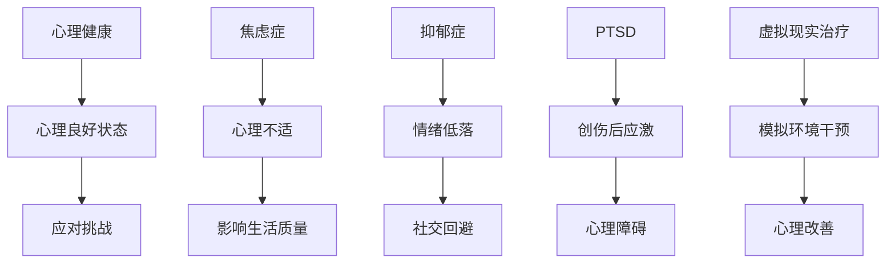

                 

# 《虚拟现实在心理健康治疗中的沉浸式应用》

## 关键词

虚拟现实，心理健康治疗，沉浸式应用，神经可塑性，治疗原理，环境设计，实施流程，效果评估，未来展望

## 摘要

随着科技的进步，虚拟现实（VR）技术逐渐在各个领域展现其强大的应用潜力。特别是在心理健康治疗领域，VR的沉浸式体验为患者提供了一种全新的治疗方式。本文将详细介绍虚拟现实在心理健康治疗中的沉浸式应用，包括其基本原理、应用案例、环境设计、实施流程和效果评估，并对未来发展的挑战和机遇进行展望。

## 第一部分：虚拟现实与心理健康

### 第1章：虚拟现实技术概述

#### 1.1 虚拟现实技术基础

虚拟现实（VR）是一种通过计算机技术生成模拟环境的体验，用户通过特定的设备（如头戴式显示器、跟踪器等）进入这个模拟环境，并与之进行交互。与增强现实（AR）和混合现实（MR）相比，VR提供的是完全沉浸式的体验，用户感觉仿佛置身于一个全新的虚拟世界。

**核心概念与联系**

- **虚拟现实（VR）**：通过计算机生成模拟环境，使用户沉浸其中。
- **增强现实（AR）**：在现实环境中叠加虚拟元素。
- **混合现实（MR）**：既包括虚拟元素，也包括增强现实。

**Mermaid流程图**



#### 1.2 心理健康概述

心理健康是指个体在心理上保持良好状态，能够有效应对生活中的各种挑战和压力。心理健康问题包括焦虑症、抑郁症、PTSD等，这些问题会影响个体的生活质量和功能。

**核心概念与联系**

- **心理健康**：个体心理上的良好状态。
- **心理健康问题**：焦虑症、抑郁症、PTSD等。
- **虚拟现实治疗**：通过虚拟环境帮助患者改善心理健康问题。

**Mermaid流程图**



### 第2章：虚拟现实在心理健康治疗中的应用

#### 2.1 治疗原理与案例

虚拟现实在心理健康治疗中的工作原理主要基于神经可塑性和沉浸体验。神经可塑性是指大脑结构和功能的改变，以适应新的环境和经验。沉浸体验则使患者完全投入到虚拟环境中，从而更好地处理和缓解心理问题。

**核心算法原理讲解**

```python
# 虚拟现实治疗算法原理伪代码
class VirtualRealityTherapy:
    def __init__(self, patient_data, therapy_goals):
        self.patient_data = patient_data
        self.therapy_goals = therapy_goals
    
    def generate_scene(self):
        # 生成虚拟场景
        pass
    
    def adjust_intensity(self):
        # 调整治疗强度
        pass
    
    def track_progress(self):
        # 跟踪治疗效果
        pass
```

**心理疾病治疗案例**

**案例一：焦虑症**

使用虚拟现实技术，创建一个安全、可控的环境，让患者逐步面对自己的焦虑源。通过跟踪患者的反应和调整治疗强度，帮助患者逐步克服焦虑。

$$
焦虑症治疗流程： \\
\begin{aligned}
&\text{1. 患者进入虚拟环境} \\
&\text{2. 患者面对焦虑源} \\
&\text{3. 观察患者反应} \\
&\text{4. 调整治疗强度} \\
&\text{5. 记录治疗效果} \\
\end{aligned}
$$

**案例二：抑郁症**

通过虚拟现实技术，为患者提供一个积极、充满希望的环境，帮助他们重建自信和情绪。通过模拟各种生活场景，帮助患者逐步恢复社交功能。

$$
抑郁症治疗流程： \\
\begin{aligned}
&\text{1. 患者进入虚拟环境} \\
&\text{2. 患者参与积极活动} \\
&\text{3. 观察患者情绪变化} \\
&\text{4. 调整治疗强度} \\
&\text{5. 记录治疗效果} \\
\end{aligned}
$$

### 第3章：沉浸式环境设计

#### 3.1 环境设计原则

沉浸式环境设计的关键在于创建一个能够有效吸引患者注意力、让他们感到舒适和安全的虚拟环境。设计原则包括：

- **场景布局**：选择能够引起患者兴趣的场景，合理安排空间布局。
- **音效设计**：通过音效增强沉浸感，如背景音乐、环境音效等。
- **交互设计**：设计简单直观的交互方式，让患者能够轻松操作。

#### 3.2 环境构建方法

虚拟现实环境的构建方法包括以下几个步骤：

- **3D建模**：使用3D建模软件创建虚拟环境。
- **虚拟引擎使用**：使用虚拟引擎（如Unity、Unreal Engine）进行场景渲染和交互设计。
- **环境交互设计**：设计患者的交互方式，如行走、点击、触摸等。

## 第二部分：虚拟现实心理健康治疗的实施

### 第4章：虚拟现实心理健康治疗的实施流程

#### 4.1 治疗准备

治疗前的准备工作包括：

- **患者评估**：了解患者的心理状况和治疗需求。
- **治疗目标设定**：根据患者的情况设定具体的治疗目标。

#### 4.2 治疗实施

治疗实施的过程如下：

- **设备准备**：确保虚拟现实设备正常运行。
- **患者引导**：指导患者如何正确佩戴和使用设备。
- **治疗执行**：按照治疗计划进行虚拟现实治疗。

### 第5章：虚拟现实心理健康治疗的评估与反馈

#### 5.1 治疗效果评估

治疗效果评估的方法包括：

- **自我报告**：患者报告自己的感受和变化。
- **行为评估**：观察患者的行为和反应。
- **生理指标监测**：通过生理指标（如心率、血压等）监测患者的反应。

#### 5.2 治疗反馈与优化

根据治疗效果评估结果，对治疗过程进行反馈和优化，包括：

- **调整治疗方案**：根据患者的反馈和评估结果，调整治疗计划和强度。
- **改进虚拟现实环境设计**：根据患者的需求和反馈，优化虚拟环境的布局、音效和交互设计。

## 第三部分：未来展望

### 第6章：虚拟现实心理健康治疗的挑战与机遇

#### 6.1 治疗挑战

虚拟现实心理健康治疗面临的挑战包括：

- **技术挑战**：如何提高虚拟现实设备的性能和用户体验。
- **伦理挑战**：如何保护患者的隐私和数据安全。
- **隐私挑战**：如何确保患者的个人信息不被泄露。

#### 6.2 未来发展趋势

虚拟现实心理健康治疗的发展趋势包括：

- **技术创新**：不断更新和优化虚拟现实技术，提高治疗效果。
- **临床应用扩展**：将虚拟现实治疗应用于更广泛的心理健康问题。

### 第7章：结语

虚拟现实在心理健康治疗中的沉浸式应用展示了其巨大的潜力和优势。虽然面临着各种挑战，但随着技术的不断进步，虚拟现实治疗有望成为心理健康治疗领域的一种重要手段。未来，我们需要继续探索和研究，以实现虚拟现实治疗的最大化效果。

## 作者

作者：AI天才研究院/AI Genius Institute & 禅与计算机程序设计艺术 /Zen And The Art of Computer Programming

---

本文内容仅为示例，实际文章撰写需要更深入的研究和详细的数据支持。在撰写过程中，请确保每个小节的内容都丰富具体，详细讲解核心概念与联系、核心算法原理、数学模型和公式、项目实战等内容。同时，注意保持文章的逻辑性和可读性，确保读者能够轻松理解并跟随文章的思路。在撰写过程中，可以参考现有的研究成果和技术文献，以确保文章的准确性和权威性。最后，根据文章字数要求，合理分配内容，确保每个小节都有足够的空间进行详细阐述。祝撰写顺利！

