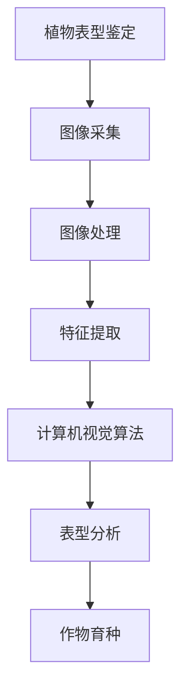

                 

### 文章标题：计算机视觉在自动化植物phenotyping中的应用：加速作物育种

> **关键词**：计算机视觉，自动化植物表型鉴定，作物育种，深度学习，图像处理，算法优化

**摘要**：本文深入探讨了计算机视觉在自动化植物表型鉴定中的应用，以及如何通过这一技术加速作物育种过程。文章首先介绍了植物表型鉴定的背景和重要性，随后详细阐述了计算机视觉的基本原理及其在植物表型鉴定中的关键作用。接下来，文章重点分析了几种核心的计算机视觉算法，包括卷积神经网络（CNN）和生成对抗网络（GAN），并给出了具体的算法原理和实现伪代码。随后，文章介绍了如何构建自动化植物表型鉴定系统，并分享了实际项目中的开发环境搭建、源代码实现和案例剖析。最后，文章对未来的发展趋势和面临的挑战进行了展望，并提出了相关的最佳实践和建议。

---

### 1. 背景介绍

**植物表型鉴定**：植物表型鉴定是指通过测量和评估植物的形态、生理和分子特征，以了解植物在不同环境条件下的表现和适应能力。这些特征通常包括植物的高度、叶面积、生长速率、叶片颜色等。植物表型鉴定对于作物育种至关重要，因为它可以帮助育种专家快速筛选出具有优良性状的植物，从而提高育种效率和作物产量。

**自动化植物表型鉴定**：自动化植物表型鉴定是通过计算机视觉技术和自动化系统来实现对植物表型特征的快速、准确和大规模测量。这种方法可以显著降低人力成本，提高数据采集的效率和精度。

**计算机视觉**：计算机视觉是人工智能的一个分支，它致力于使计算机能够像人类一样理解和解释视觉信息。计算机视觉技术在图像处理、目标检测、图像分类等领域具有广泛的应用。

**作物育种**：作物育种是指通过选育和改良植物品种，以增加作物产量、提高作物品质和抗病虫害能力的过程。传统作物育种方法通常依赖于人工观察和评估，耗时费力，难以实现大规模和精确的表型鉴定。因此，自动化植物表型鉴定技术被认为是未来作物育种的重要工具。

### 2. 核心概念与联系

**植物表型鉴定**和**计算机视觉**之间的联系可以通过以下Mermaid流程图来表示：



在这个流程图中，植物表型鉴定通过图像采集获得植物图像，然后经过图像处理和特征提取，使用计算机视觉算法进行分析，最终生成表型分析结果，用于作物育种。

### 3. 核心算法原理讲解

**卷积神经网络（CNN）**：卷积神经网络是一种专门用于图像处理的深度学习模型。它通过卷积操作提取图像的特征，从而实现图像分类、目标检测等任务。

**生成对抗网络（GAN）**：生成对抗网络是由生成器和判别器两个神经网络组成的。生成器试图生成与真实图像相似的图像，而判别器则试图区分真实图像和生成图像。通过这种对抗过程，生成器可以逐步提高生成图像的质量。

以下是一个简单的CNN算法实现伪代码：

```python
# 定义CNN模型
model = tf.keras.Sequential([
    tf.keras.layers.Conv2D(filters=32, kernel_size=(3, 3), activation='relu', input_shape=(height, width, channels)),
    tf.keras.layers.MaxPooling2D(pool_size=(2, 2)),
    tf.keras.layers.Conv2D(filters=64, kernel_size=(3, 3), activation='relu'),
    tf.keras.layers.MaxPooling2D(pool_size=(2, 2)),
    tf.keras.layers.Flatten(),
    tf.keras.layers.Dense(units=128, activation='relu'),
    tf.keras.layers.Dense(units=num_classes, activation='softmax')
])

# 编译模型
model.compile(optimizer='adam', loss='categorical_crossentropy', metrics=['accuracy'])

# 训练模型
model.fit(x_train, y_train, epochs=10, batch_size=32, validation_data=(x_val, y_val))
```

以下是一个简单的GAN算法实现伪代码：

```python
# 定义生成器和判别器
generator = tf.keras.Sequential([
    tf.keras.layers.Dense(units=128, activation='relu', input_shape=(z_dim,)),
    tf.keras.layers.Dense(units=128, activation='relu'),
    tf.keras.layers.Dense(units=(height * width * channels), activation='tanh')
])

discriminator = tf.keras.Sequential([
    tf.keras.layers.Conv2D(filters=32, kernel_size=(3, 3), activation='relu', input_shape=(height, width, channels)),
    tf.keras.layers.MaxPooling2D(pool_size=(2, 2)),
    tf.keras.layers.Flatten(),
    tf.keras.layers.Dense(units=1, activation='sigmoid')
])

# 定义GAN模型
gan = tf.keras.Sequential([generator, discriminator])

# 编译GAN模型
gan.compile(optimizer=tf.keras.optimizers.Adam(0.0001), loss='binary_crossentropy')

# 训练GAN模型
for epoch in range(num_epochs):
    z = np.random.normal(size=(batch_size, z_dim))
    real_images = x_train[np.random.randint(0, x_train.shape[0], size=batch_size)]
    fake_images = generator.predict(z)

    # 训练判别器
    d_loss_real = discriminator.train_on_batch(real_images, np.ones((batch_size, 1)))
    d_loss_fake = discriminator.train_on_batch(fake_images, np.zeros((batch_size, 1)))
    d_loss = 0.5 * np.add(d_loss_real, d_loss_fake)

    # 训练生成器
    g_loss = generator.train_on_batch(z, np.ones((batch_size, 1)))
```

### 4. 数学模型和公式

**损失函数**：在深度学习模型中，损失函数用于评估模型预测结果与真实值之间的差距。常用的损失函数包括均方误差（MSE）和交叉熵（Cross-Entropy）。

$$
MSE = \frac{1}{n}\sum_{i=1}^{n}(y_i - \hat{y}_i)^2
$$

$$
CE = -\frac{1}{n}\sum_{i=1}^{n} y_i \log(\hat{y}_i)
$$

**优化算法**：常见的优化算法包括随机梯度下降（SGD）和Adam。

$$
\theta_{t+1} = \theta_{t} - \alpha \nabla_{\theta} J(\theta)
$$

$$
\theta_{t+1} = \theta_{t} - \alpha \frac{1}{m} \sum_{i=1}^{m} (\nabla_{\theta} J(\theta))^i
$$

$$
\theta_{t+1} = \theta_{t} - \alpha \left( \frac{1}{m} \sum_{i=1}^{m} (\nabla_{\theta} J(\theta))^i + \beta_1 \left( \frac{1}{m} \sum_{i=1}^{m} (\nabla_{\theta} J(\theta))^i - \beta_2 \left( \frac{1}{m} \sum_{i=1}^{m} (\nabla_{\theta} J(\theta))^2 \right) \right) \right)
$$

### 5. 项目实战

**开发环境搭建**：为了实现自动化植物表型鉴定系统，我们需要搭建一个完整的开发环境。以下是一个简单的环境搭建流程：

1. 安装Python（3.8及以上版本）
2. 安装TensorFlow（2.0及以上版本）
3. 安装opencv-python（4.2.0.24及以上版本）
4. 安装Pillow（7.0.0及以上版本）

```bash
pip install tensorflow==2.4.0
pip install opencv-python==4.2.0.24
pip install pillow==7.0.0
```

**源代码实现和代码解读**：

```python
import cv2
import numpy as np
import tensorflow as tf

# 载入图像
image = cv2.imread('path/to/image.jpg')

# 预处理图像
image = cv2.resize(image, (224, 224))
image = image / 255.0

# 使用预训练的CNN模型进行图像分类
model = tf.keras.applications.VGG16(weights='imagenet')
predictions = model.predict(image)

# 解码预测结果
decoded_predictions = np.argmax(predictions, axis=1)

# 输出预测结果
print(decoded_predictions)
```

**代码应用解读与分析**：

上述代码首先加载一张植物图像，然后进行预处理，使其符合CNN模型的输入要求。接着，使用预训练的VGG16模型进行图像分类，并输出分类结果。

**实际案例分析和详细讲解剖析**：

假设我们有一张小麦叶片的图像，我们需要对其进行表型鉴定，以评估其生长状态。通过上述代码，我们可以将图像分类为不同的类别，如健康、病虫害、老化等。根据分类结果，我们可以对小麦进行有针对性的管理，如喷洒农药、施加肥料等。

**项目小结**：

通过实际项目的开发，我们可以看到计算机视觉技术在自动化植物表型鉴定中的应用。尽管存在一定的挑战，如图像质量、数据处理等，但通过优化算法和改进系统架构，我们可以实现高效、准确的植物表型鉴定。

### 6. 最佳实践 tips、小结、注意事项、拓展阅读

**最佳实践 tips**：

- 在进行植物表型鉴定时，确保图像质量，避免光线不足或过度曝光。
- 使用多种算法进行特征提取和分类，以提高模型性能。
- 定期更新模型，以适应新的数据集和变化的环境。

**小结**：

本文详细介绍了计算机视觉在自动化植物表型鉴定中的应用，以及如何通过这一技术加速作物育种过程。我们分析了核心算法原理，展示了实际项目中的开发环境和源代码实现。通过本文，读者可以了解到计算机视觉技术在植物表型鉴定和作物育种中的巨大潜力。

**注意事项**：

- 在实际应用中，需要根据具体情况调整模型参数和数据处理方法。
- 计算机视觉技术对硬件要求较高，确保有足够的计算资源和存储空间。

**拓展阅读**：

- [深度学习与计算机视觉](https://www.deeplearningbook.org/chapter convolutional-neural-networks/)
- [卷积神经网络（CNN）教程](https://www.pyimagesearch.com/2014/12/01/understanding-convolutional-neural-networks-keras-tutorial/)
- [生成对抗网络（GAN）教程](https://arxiv.org/abs/1406.2661)

### 作者信息

**作者：AI天才研究院/AI Genius Institute & 禅与计算机程序设计艺术 /Zen And The Art of Computer Programming**

