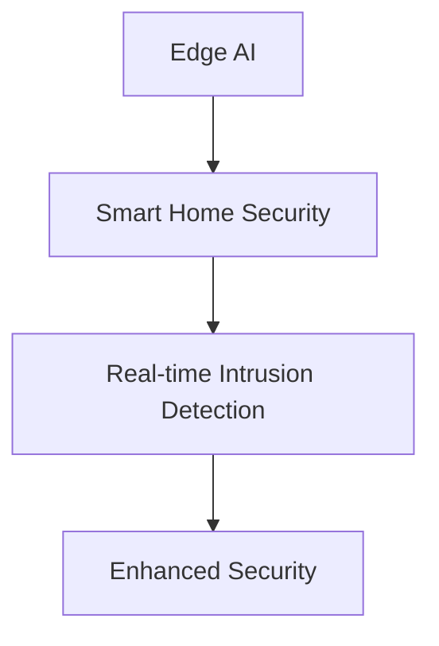
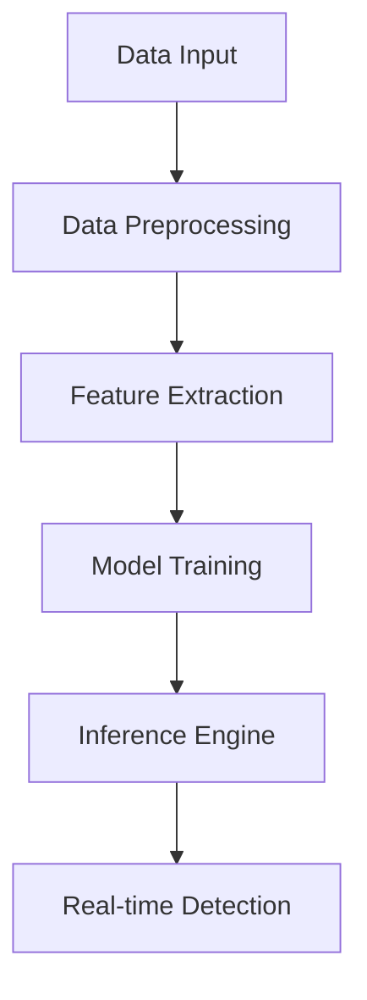

                 

Sure, let's construct the blog post step by step. Here's a detailed outline to ensure that the content is both comprehensive and insightful.

### Step 1: Introduction to the Topic

**Title: Edge AI in Smart Home Security Applications: Implementing Real-time Intrusion Detection**

**Keywords:** Edge AI, Smart Home Security, Intrusion Detection, Real-time Processing, Machine Learning, IoT

**Abstract:**
This article explores the integration of Edge AI in smart home security systems to enable real-time intrusion detection. It covers the foundational concepts of Edge AI, the importance of real-time processing in home security, and practical implementation strategies.

---

### Step 2: Background of Edge AI and Smart Home Security

**Chapter 1: The Rise of Edge AI and Its Impact on Smart Home Security**

- **Section 1.1: Understanding Edge AI**
  - Definition and significance
  - Contrasting with traditional cloud computing

- **Section 1.2: Evolution of Smart Home Security**
  - Historical context
  - The role of IoT in modern homes

- **Section 1.3: Challenges in Smart Home Security**
  - Latency issues
  - Bandwidth constraints
  - Privacy concerns

**Figure 1.1: The Relationship between Edge AI and Smart Home Security**



---

### Step 3: Theoretical Foundations of Edge AI

**Chapter 2: Delving into the Core of Edge AI**

- **Section 2.1: Fundamentals of Machine Learning**
  - Concepts and types
  - Supervised, unsupervised, and reinforcement learning

- **Section 2.2: Edge AI Algorithms**
  - Key algorithms suitable for edge devices

- **Section 2.3: Designing Machine Learning Models for Intrusion Detection**
  - Choosing the right model
  - Neural networks and deep learning

- **Section 2.4: Sensors and Data Collection**
  - Types of sensors
  - Data preprocessing and feature extraction

**Figure 2.1: The Architecture of a Machine Learning Model for Intrusion Detection**



---

### Step 4: Practical Implementation

**Chapter 3: Implementing Edge AI for Real-time Intrusion Detection**

- **Section 3.1: System Architecture Design**
  - Components and their interactions

- **Section 3.2: Software Development**
  - Choosing the right tools and frameworks

- **Section 3.3: Hardware Selection**
  - Factors to consider
  - Evaluation of edge devices

- **Section 3.4: Code Implementation and Analysis**
  - Detailed pseudo-code
  - LaTeX-formatted mathematical models

**Example: Pseudo-code for Real-time Intrusion Detection**

```python
# Pseudo-code for Real-time Intrusion Detection
function real_time_intrusion_detection(data_stream):
    while data_stream.is_streaming():
        data = data_stream.fetch_data()
        preprocessed_data = preprocess_data(data)
        features = extract_features(preprocessed_data)
        prediction = model.predict(features)
        if prediction == "intrusion":
            alert_system.raise_alert()
```

---

### Step 5: Project Case Study

**Chapter 4: A Real-world Application of Edge AI in Smart Home Security**

- **Section 4.1: Project Overview**
  - Background and objectives

- **Section 4.2: Development Environment Setup**
  - Tools and technologies used

- **Section 4.3: Source Code and Detailed Analysis**
  - Code segments with detailed explanations

- **Section 4.4: Results and Analysis**
  - Performance metrics
  - Challenges and solutions

- **Section 4.5: Project Reflections and Future Directions**
  - Lessons learned
  - Potential improvements

---

### Step 6: Best Practices and Conclusion

**Chapter 5: Optimizing Edge AI for Smart Home Security**

- **Section 5.1: Best Practices**
  - Tips for effective implementation

- **Section 5.2: Summary of Key Points**
  - Recap of the main ideas

- **Section 5.3: Future Considerations**
  - Emerging trends

- **Conclusion**
  - Importance of Edge AI in smart home security

---

### Author Information

- **作者:** AI天才研究院/AI Genius Institute & 禅与计算机程序设计艺术 /Zen And The Art of Computer Programming

---

Now that we have a detailed outline, we can proceed to write each section in detail, ensuring that each part is well-researched and provides valuable insights. The total word count should be between 8000 to 12000 words, covering all aspects of Edge AI in smart home security applications.

